# 用分级方法对大联盟击球手进行分组

> 原文：<https://medium.com/analytics-vidhya/grouping-major-league-hitters-with-hierarchical-methods-e7dc35b7f665?source=collection_archive---------28----------------------->

此分析的目的是通过将许多相同的程序应用于最近的 MLB 命中数据，同时利用层次聚类，来构建第一篇聚类文章。这应该给你一个关于层次聚类如何工作的非常坚实的概述，并且将提供一个与 k-means 的比较点。

**数据**

与我的上一篇文章类似，我通过 Baseball Savant 搜集了这些数据，这是一个非常全面的数据中心，收集了许多有趣的棒球统计数据。由于我的重点是击中数据，我的方法略有改变。

由于最近的反馈，我将年度过滤器更改为仅 2019 赛季的球员。此外，我还最小化了板块外观过滤器，允许所有至少有 100 PAs 的玩家有资格进行此分析。为聚类分析选择的初始变量如下。

数据中的几个关键点:

*   如果你不熟悉这些指标，棒球专家有一个很棒的变量字典，你可以在这里找到
*   上面的一些变量，比如 xba、xslg 和 xobp，可能看起来很熟悉。但是，每个中的“x”代表估计值(相对于实际结果)。Statcast 通过其庞大的数据库计算这些指标，从而更好地描述玩家应该如何生产，而不是他实际如何生产

**数据处理**

如果您不熟悉集群，并且没有读过我以前的文章，那么要使集群有效，需要满足三个条件。

1.  *数据需要是同一类型，最好是数字*
2.  *数据集*中不能有 NA(或空值)
3.  *数据需要缩放*

为了获得第一个参数，每个玩家的名和姓需要被删除(由于他们的变量类型)，并将在分析结束时被添加回去。

当分析第 2 点时，数据中出现了两个 NA 值，专门处理冲刺速度。

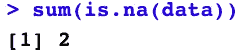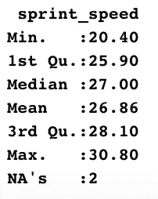

有几种方法可以处理这些数据，每种方法都有自己的优缺点。

首先，我可以简单地删除包含 NA 的观察值。但是，该玩家不会包含在分析中，从而降低了聚类的质量。

其次，我可以用数据集内变量的聚合平均值替换 NA 值，如果变量的方差很大，这可能会成为一个问题。

最后，我可以利用 R Studio 的“mice”或“caret”包，它们通过分析 NA 值周围的所有变量和值来工作，预测值*将会是*的值。

由于冲刺速度的低方差和保持分析简单的目标，我将简单地用所有变量的平均冲刺速度替换 NA 值。

最后，我缩放了更新的数据集，满足了集群的最后一个要求。下面是经过处理的数据集的一个片段。

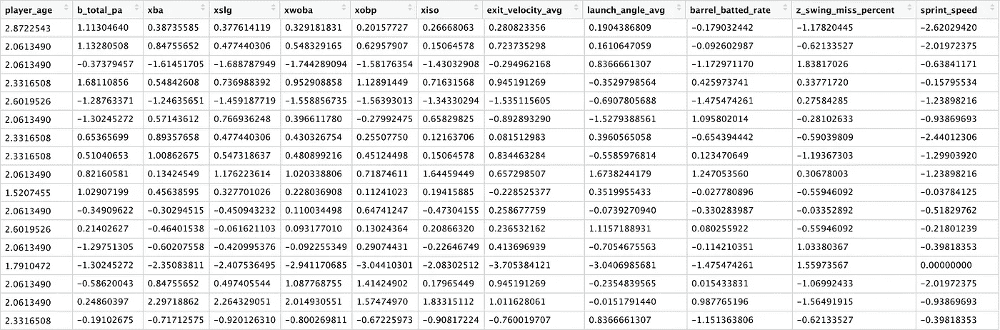

**分级距离测量**

在我的上一篇文章中，由于 k-means 聚类的有效性和简单性，我使用了它。然而，层次聚类是另一种广泛使用的方法，在对变量进行分组时非常有效。

这两种聚类技术的一个关键区别是，层次聚类需要一个定义的“距离度量”，而 k-means 使用一个默认的距离度量。距离度量是聚类分析的核心，因为它负责确定每个观察值之间的距离，最终确定观察值的相似性。人们可以使用多种距离度量来进行聚类，每一种都可以在这里阅读。

对于这个分析，我将利用欧几里得距离，因为它对数字数据有效。

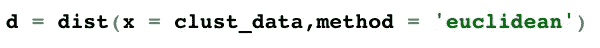

**层次聚类**

有多种层次聚类方法可供使用，每种方法都有不同的用途。我会落实病房。强调数据中各点之间差异的 D2 方法。初始聚类树形图如下。

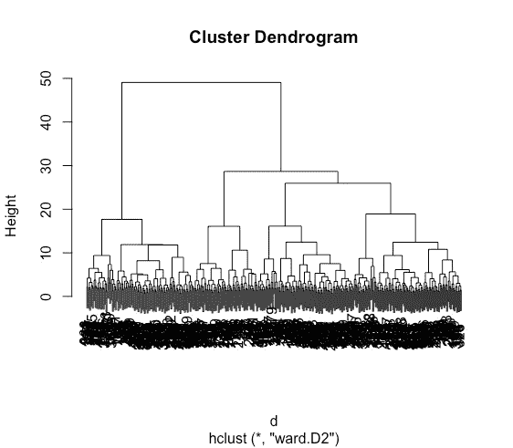

这可能看起来很拥挤。为了识别聚类，需要查看图的顶部分支。下面的图表将提供一个由沃德确定的集群更清晰的画面。D2，集群用红色突出显示。

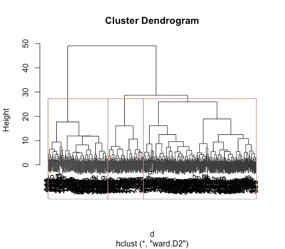

下图包含相同的数据，但视觉效果不同。

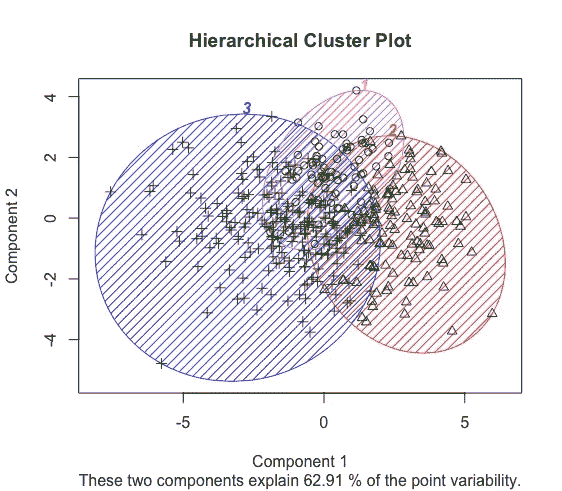

所以，我们有它。另一个 3 集群解决方案，尽管使用了分层集群。

**结果**

现在，看结果。下面是每个集群的平均值汇总。

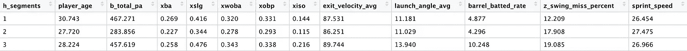

由于每个集群的大小，我将发布由 xwoba 排序的前 40 个左右的个体。如果你想看剩下的结果，给我发信息，我会给你的！

*集群 1:*

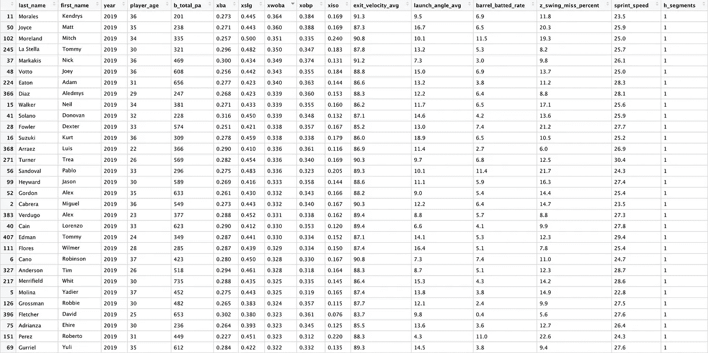

*集群 2:*

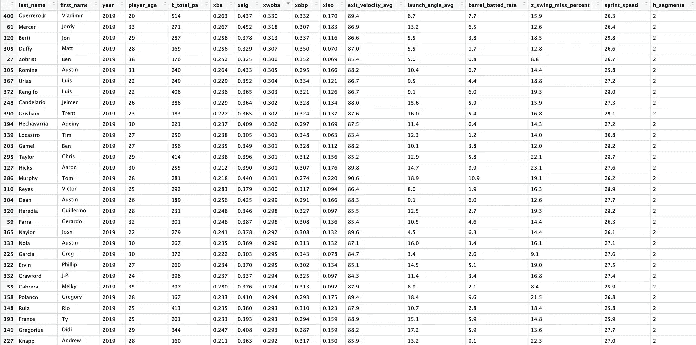

*集群 3:*

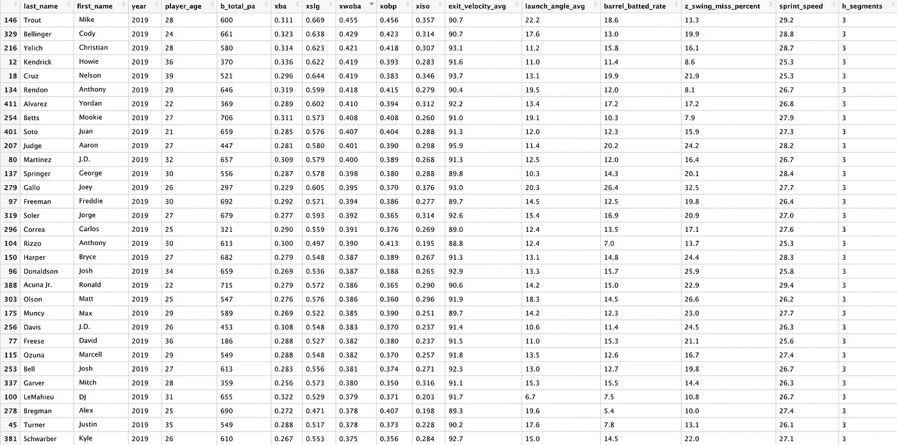

**结论:**

所以，看来沃德。D2 很好地聚集了比赛中的顶尖击球手。从摘要中可以看出，第 3 类远远优于第 1 类和第 2 类，这在查看该类中的具体名称时得到了验证(Trout、Belli、Yelich 等)

想法？

-jms