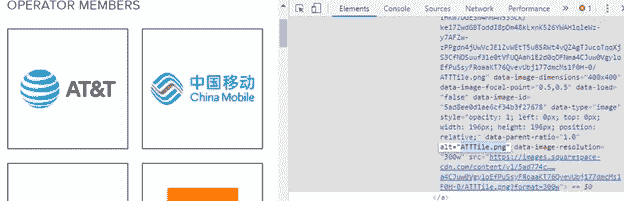
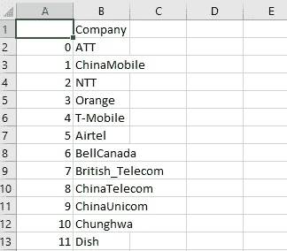
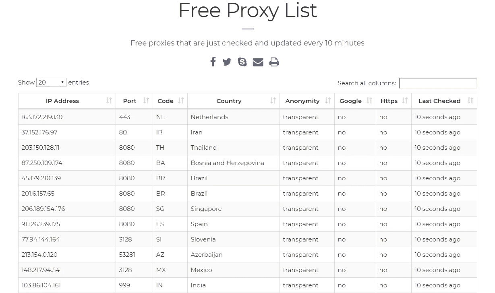
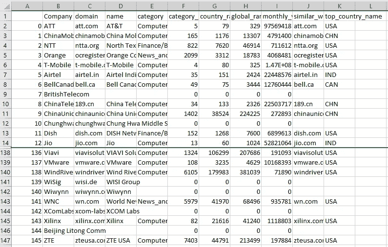

# 商业智能成长黑客指南

> 原文：<https://medium.com/analytics-vidhya/growth-hacker-guide-to-business-intelligence-2eb9f77c559c?source=collection_archive---------15----------------------->


Zosia Korcz 在 [Unsplash](https://unsplash.com/s/photos/growth?utm_source=unsplash&utm_medium=referral&utm_content=creditCopyText) 上拍摄的照片

继续增长黑客主题，我们将讨论如何大规模收集商业情报的几种非常强大的方法和工具。规模意味着您将能够在几分钟内执行，这是一项需要一个分析师团队才能完成的任务。

博客包含 3 个部分。您可以独立阅读每一部分，因此可以随意跳过:

1.  如何识别行业参与者
2.  如何获取公司的商业信息
3.  如何为 100 家甚至 1000 家公司扩展和自动化流程

> 虽然代码示例是用 Python 编写的，但重点是方法论、数据源、数据处理及其分析。
> 
> 您将能够识别行业参与者，收集他们的业务特征，如公司 URL、国家、业务活动的地理位置，估计他们的规模以及在主要地理位置和全球行业中的相对位置。

有许多已付的 BI 通行费。但是，即使是付费工具也不总是能提供必要的洞察力。它们通常不适用于中小型公司。对于大公司来说，它们不能提供所需的粒度。例如，没有工具告诉你在一个大的组织中应该瞄准哪个业务部门。

范例是通用的，可以用其他编程语言实现。**我们将重点介绍的工具是免费的，甚至不需要注册！**

我们将使用一些非常强大的增长黑客技术:

1.  如何使用正则表达式清理数据——一种清理文本数据的有效方法
2.  如何访问不同在线资源的 API——API(应用编程接口)是请求信息的必备工具。大多数在线数据服务都依赖这种方法进行数据交换。使用 Python 很容易实现
3.  如何扩展上述方法，以便能够获得有关数百家公司的信息，而不会被服务提供商阻止或拒绝

程序会更高级一点。我会解释概念，举例子，强调一些关键点。如果您需要完整的代码或更详细的解释，请随时联系我们。

> 如果您对编程感到不舒服，我将介绍的工具可以手动使用。它们对于商业情报和竞争分析仍然非常有用。

最后，但并非最不重要。你将得到的数据不会 100%准确或完整，因此它不应该作为决策过程的唯一来源。

# 第 1 部分:如何识别行业参与者


[产品学院](https://unsplash.com/@productschool?utm_source=unsplash&utm_medium=referral&utm_content=creditCopyText)在 [Unsplash](https://unsplash.com/s/photos/conference?utm_source=unsplash&utm_medium=referral&utm_content=creditCopyText) 上的照片

在[之前的博客](/analytics-vidhya/introduction-to-growth-hacking-how-to-expand-your-contacts-database-virtually-infinitely-9845b03234e2) ( [增长黑客入门:如何无限扩展你的联系人数据库](/analytics-vidhya/introduction-to-growth-hacking-how-to-expand-your-contacts-database-virtually-infinitely-9845b03234e2))中，我介绍了发现新联系人的技巧。几分钟之内，您就可以将 1000 个新名字添加到您的营销数据库中。

你仍然可以使用[上一篇博客](/analytics-vidhya/introduction-to-growth-hacking-how-to-expand-your-contacts-database-virtually-infinitely-9845b03234e2)中的公司名称。我们将看到行业参与者的其他来源。

## 谁是行业参与者？

我们如何识别特定行业的公司？我建议使用以下资源作为起点

*   行业组织成员
*   公司主要行业活动的发言人(来自之前的[博客](/analytics-vidhya/introduction-to-growth-hacking-how-to-expand-your-contacts-database-virtually-infinitely-9845b03234e2)
*   活动赞助商
*   业内其他公司的合作伙伴

让我们把手弄脏吧。

## 如何获得公司的名称

以 Open RAN 联盟为例，成员目录位于此:[https://www.o-ran.org/membership](https://www.o-ran.org/membership)。它是组织之一

这不是直截了当的，实际上没有名字，只有公司的标志。我将使用我在另一篇博客中展示的技术:[增长黑客入门:如何无限扩展你的联系人数据库](/analytics-vidhya/introduction-to-growth-hacking-how-to-expand-your-contacts-database-virtually-infinitely-9845b03234e2)以提取公司名称。



检查成员部分

如您所见，公司名称实际上是 *img* 元素下的 *alt* 属性的名称。

下面是提取所有这些属性的代码(我们重用了[以前的博客](/analytics-vidhya/introduction-to-growth-hacking-how-to-expand-your-contacts-database-virtually-infinitely-9845b03234e2)中的一些代码):

```
url = r'https://www.o-ran.org/membership'
data = read_url(url)
soap = BeautifulSoup(data, "html.parser")
images = soap.find_all('img', {'class': 'thumb-image'})
company_names = [image['alt'] for image in images]
```

*   图像将包含代表公司徽标的所有相关图像的 *img* 对象
*   *图像['alt']* 将从中检索' alt '属性

但是，在查看了 company_names 列表后，需要进行一些清理:

```
['ATTTile.png','ChinaMobileTile.png','NTTTile.png','OrangeTile.png','T-MobileTile.png','AirtelLogoTile.png','BellCanadaTile.png','British_Telecom-400x400.png','ChinaTelecomLogoTile.png','ChinaUnicomTile.png','Chunghwa_400x400.png',…
```

## 使用正则表达式清理文本数据

我们将使用正则表达式技术来清理数据:

```
**def** clean_company_name(company_name):
    p = re.compile(r'(Tile.png|LogoTile.png|[-_]400x400.png|[_-]new|-400x400 (1).png|.png)', re.VERBOSE + re.I)
    company_name = p.sub('', company_name)
    p = re.compile(r'([_])', re.VERBOSE + re.I)
    return p.sub(' ', company_name)
```

正则表达式*r '(tile . png | logo tile . png |[-_]400 x400 . png |[_-]new |-400 x400(1)。png|。png* 会清理所有可能的后缀，返回一个干净的公司名称。

*   括号中的表达式 *()* 是我们想要查找和替换的文本表达式
*   不同字符串之间的 *|* 表示或。换句话说，匹配这个表达式
*   *回复。I* 标志表示忽略表达式的大小写

让我们应用这个函数来清理我们的列表，并使用 Pandas 将其导出到 *CSV* :

```
company_names = [clean_company_name(company_name) for company_name in company_names]
pd.DataFrame(company_names, columns=['Company']).to_csv('oran_members.csv')
```

现在我们有了一份清晰的公司名单。



干净的公司名称

> 所以这是我们的起点。几分钟和几行代码给了我们 145 家公司。

将这些名字与[上一篇博客](/analytics-vidhya/introduction-to-growth-hacking-how-to-expand-your-contacts-database-virtually-infinitely-9845b03234e2)中的公司结合起来，人们可以很好地了解行业参与者的概况。看演讲者的公司，主要行业活动赞助商，主要行业组织的成员(公司)可以指出哪些公司更有影响力，你需要与哪些公司合作。

尽管在合并所有这些列表时可能会有一些问题，但是我们会在下一篇博客中处理它。

现在，让我们用一些业务信息填充这个表。

# 第二部分:如何获取公司的商业信息

商业智能数据有付费来源。这些工具包括 [LinkedIn](https://www.linkedin.com/) 、 [Zoom.info](https://www.zoominfo.com/) 、 [Clearbit](https://clearbit.com/) 等。然而，为服务付费并不总是能给你提供有见地的信息。事实上，基本的 LinkedIn API 非常精简，访问更多数据需要批准，这可能需要几周时间，甚至被拒绝。所以，如果你处于启动引导模式，或者想要一些快速的结果，它可能并不总是适合你。

> 要明确的是，我并不是说不要使用其他工具，而是介绍其他可能非常有帮助并且成本有效的方法

## API 简介

API 代表应用程序编程接口。API 将在这里讨论，基于用户/Python 脚本向数据服务的服务器发送请求并且服务器回复的原理。就像互联网浏览器的工作方式一样。您键入一个 URL，服务器会用网页进行响应。

有两种类型的请求 GET 和 POST，请求信息的类型编码在 URL 本身或/和请求的 HTTP 头中。

大多数 API 需要某种类型的注册才能获得密钥。本文中的 API 既不需要注册，也不需要密钥来访问数据。

让我们看看它是如何工作的。

## 如何获得一个公司的网址

[**Clerabit**](https://clearbit.com/) 有一个免费的 API 可以通过公司名称查找公司域名。这个 API 不需要注册。

```
DOMAIN_ENDPOINT_NOKEY = 'https://autocomplete.clearbit.com/v1/companies/suggest?query={}'
```

*   API 的 URL 称为“端点”。
*   它通常包含一个参数列表，在这种情况下，应该包含公司名称的是“查询”

此外，它应该使用 GET 方法发送，这样您甚至可以在浏览器中键入它。将{}替换为 ATT，将得到以下响应:

```
[{"name":"AT\u0026T","domain":"att.com","logo":"https://logo.clearbit.com/att.com"},{"name":"Attentive","domain":"attentivemobile.com","logo":"https://logo.clearbit.com/attentivemobile.com"},{"name":"Attack of the Fanboy","domain":"attackofthefanboy.com","logo":"https://logo.clearbit.com/attackofthefanboy.com"},{"name":"AT\u0026T Performing Arts Center","domain":"attpac.org","logo":"https://logo.clearbit.com/attpac.org"},{"name":"Attendance on Demand","domain":"attendanceondemand.com","logo":"https://logo.clearbit.com/attendanceondemand.com"}]
```

我们可以看到，第一个字典包含了公司的名称，它的域名，甚至是一个链接到它的标志。实际上，用 Python 实现它所需要的就是发送 get 请求(我们已经完成了)并解析回复。

大多数 API 的返回格式都是 JSON 格式。当然，有一个库来处理它。*进口 json*

```
**def** get_domain_name(company_name):
    endpoint = DOMAIN_ENDPOINT_NOKEY.format(company_name)
    result = requests.get(url=endpoint, data={}, headers=HEADERS, proxies=proxy)
    result = json.loads(result.text)
    d = {
        'name' : result[0]['name'],
        'domain' : result[0]['domain'],
    }
    return pd.Series(d)
```

*   当我们讨论自动化和可伸缩性时，将会讨论头和代理
*   在使用 *json.loads* 之前，我们需要使用*导入 json* 。 *loads* 是一个采用 JSON 格式的字符串并返回 python 对象的方法

> 顺便说一下， [**Clearbit**](https://clearbit.com/) 不是很贵，你可以购买完整的 API。

顺便提一下，Clearbit API 更适合美国公司。即使在搜索国际公司时，它也可能返回美国的域名。

## 如何获取公司的商业信息

我们将使用来自类似网站的免费 API。这个 API 也不需要注册。

> 如果你认为用 Python 实现 API 访问超出了你的舒适区，[**similar web**](https://www.similarweb.com/)**仍然是一个很好的商业智能工具。它提供了一个非常用户友好的互联网流量数据分析。这对了解公司的定位、业务活动和竞争格局有着极其深刻的见解。**

```
TOTAL_TRAFFIC_ENDPOINT_NOKEY = 'https://data.similarweb.com/api/v1/data?domain={}'
```

**这个 API 端点需要公司的域，这在上一节中已经得到了。作为回报，它提供了少量关于流量的信息，流量来自哪里，公司排名，行业等等。**

```
{"SiteName":"att.com","Description":"visit att.com to switch and save on unlimited data plans, internet service, & tv with premium entertainment! america's best network is also the fastest.","TopCountryShares":[{"Value":0.9500846049919677,"Country":840},{"Value":0.01045316020720349,"Country":484},{"Value":0.0038907583335344616,"Country":356},{"Value":0.003625260293148592,"Country":124},{"Value":0.002542974682644363,"Country":630}],"Title":"at&t official site - unlimited data plans, internet service, & tv","Engagments":{"BounceRate":"0.5961736247674132","Month":"01","Year":"2020","PagePerVisit":"4.451902109368646","Visits":"9.756941889301659E7","TimeOnSite":"221.5620802830074"},"EstimatedMonthlyVisits":{"2019-08-01":127864051,"2019-09-01":112905075,"2019-10-01":96790400,"2019-11-01":99639971,"2019-12-01":105287460,"2020-01-01":97569418},"GlobalRank":{"Rank":329},"CountryRank":{"Country":840,"Rank":79},"IsSmall":false,"TrafficSources":{"Social":0.014144215350222455,"Paid Referrals":0.020342651724442284,"Mail":0.10367724601162684,"Referrals":0.05567331021727888,"Search":0.3391175301685869,"Direct":0.46704504652784257},"Category":"Computers_Electronics_and_Technology/Telecommunications","CategoryRank":{"Rank":"5","Category":"Computers_Electronics_and_Technology/Telecommunications"},"LargeScreenshot":"https://site-images.similarcdn.com/image?url=att.com&t=1&h=c7506c43a742090dc4e676d63b2e82a257d212ee387c0b0dc8666db04bc07d66"}
```

**此时，我们将使用响应中的以下字段:**

```
**def** get_site_data(domain):
    endpoint = TOTAL_TRAFFIC_ENDPOINT_NOKEY.format(domain)
    result = requests.get(url=endpoint, data={}, headers=HEADERS, proxies=proxy)
    result = json.loads(result)
    d = {
        'monthly_visits' : int(float(result.get('Engagments', {}).get('Visits', 0))),
        'global_rank' : result.get('GlobalRank', {}).get('Rank', 0),
        'country_rank' : result.get('CountryRank', {}).get('Rank', 0),
        'top_country_name' : get_country_name(result.get('CountryRank', {}).get('Country', 0)),
        'similar_web_site_name' : result.get('SiteName', ''),
        'category' : result.get('Category', ''),
        'category_rank' : result.get('CategoryRank', {}).get('Rank', 0),
    }
    return pd.Series(d)
```

*   ***月访问量* —可以作为公司规模的一个指标**
*   ***global_rank* —与所有其他公司的互联网流量相比，表明公司在全球市场中的地位**
*   ***country_rank* —与所有其他公司的互联网流量相比，表明公司在当地市场的地位**
*   ***top_country_name* —大部分流量来自的国家。该 API 还揭示了其他国家的情况，它可以表明该公司活动的全球业务分布情况**
*   ***similar_web_site_name* —根据 SimilarWeb 的网站名称**
*   ***类别*—similar web 指定的行业类别**
*   ***类别 _ 等级* —公司在上述*类别*中的等级**

**为了获得国家名称，我使用了一个助手函数*get _ country _ name(country _ code)*。**

```
**def** get_country_name(self, country_code):
    try:
        return pycountry.countries.get(numeric = str(country_code)).alpha_3
    except:
        return ''
```

**我用的是 *pycountry* 库，对于国家相关的操作非常有用。在下一篇博客中，我将展示 *pycountry* 的一些其他有用的用例。**

**它提供了许多查找国家名称和代码的方法。我们使用的是 ISO 3166 公约，为此我们使用了 py country . get 方法。*数字*参数指定代表国家代码的字符串。**

## **商业智能数据的其他来源**

1.  **Dun & Bradstreet —提供各种公司信息、分析和行业报告，以及信用评分等。API 在这里[可用。这里有这个 API](https://docs.dnb.com/direct/2.0/en-US/quick-rest-API) [的 Python 实现](https://www.dylanbarlett.com/2013/11/sample-python-code-db-direct-2-0-api/)(我还没有测试过)，但是，你需要获得用户名和密码**
2.  **[Quandl](https://www.quandl.com/) —关于商业智能的讨论，不提 Quandl 就不叫商业智能。大多数数据要么是金融数据，要么是经济数据，主要涵盖大公司。它提供了一个[官方 Python 库](https://www.quandl.com/tools/python)来访问数据。你需要一个账户，并被要求支付大部分数据**
3.  **晨星研究公司(morning star research)——也关注金融信息。我没有直接使用[他们的 API](https://developer.morningstar.com/) 。我使用了 [Globa 股票分类结构](http://advisor.morningstar.com/Enterprise/VTC/MorningstarGlobalEquityClassStructure2019v3.pdf)报告进行细分和垂直市场分析。晨星公司的数据也有量子版,很容易在它的研究笔记本中找到**

# **第 3 部分:如何扩展**

****

**沃尔特·李·奥利瓦雷斯·德拉克鲁斯在 [Unsplash](https://unsplash.com/s/photos/hot-air-balloon?utm_source=unsplash&utm_medium=referral&utm_content=creditCopyText) 上的照片**

**规模是什么意思？目标是每 100 家或 1，000 家公司能够执行这些 API 请求。从实践的角度来看，我们基本上需要注意两件事:**

1.  **实现适当的错误处理**
2.  **确保服务器不会将我们识别为机器人，也不会阻止对 API 的访问或把我们的 IP 列入黑名单**

**错误处理与编程关系更大，读者对它不感兴趣。如果你需要更多的信息，请随意评论或直接联系我们。**

**我将关注 API 访问的健壮性。**

## **使 API 请求看起来像 web 浏览器**

**HTTP 请求中除方法和 URL 之外的附加信息包含在 HTTP 头中。在不同的字段中，它可能包含 cookies 信息、认证数据、浏览器类型和发送请求的应用程序类型**

**因此，为了看起来不像一个机器人，我们可以添加一些标题，使我们看起来像一个普通的浏览器:**

```
HEADERS = {
    "User-Agent": r"Mozilla/5.0 (Windows NT 6.1) AppleWebKit/537.31 (KHTML, like Gecko) Chrome/26.0.1410.64 Safari/537.31",
    "Accept": r"  text/html,application/xhtml+xml,application/xml;q=0.9,image/webp,image/apng,*/*;q=0.8",
    "Accept-Language": r"en-US,en;q=0.8"
}
```

*   ***“用户代理”*头标识浏览器，在这种情况下，它将被标识为 Chrome，更多信息可在[这里](https://developer.mozilla.org/en-US/docs/Web/HTTP/Headers/User-Agent#Chrome_UA_string)找到**
*   ***“Accept”*标题告知客户端能够理解哪些内容类型，同样，这是与 Chrome 浏览器相对应的默认值，更多信息[此处](https://developer.mozilla.org/en-US/docs/Web/HTTP/Content_negotiation/List_of_default_Accept_values)**
*   **“接受语言”定义了客户端能够接受的语言**

**剩下的工作就是将消息头作为参数添加到 *requests.get* 方法中，因此它将作为请求调用的一部分发送。**

**还有一些额外的高级技术来模拟 cookies 和自动化浏览器，但在这里并不是必需的。**

## **进行健壮的 API 调用**

**如果有太多的请求来自一个唯一的 IP 地址，API 服务器可能会阻止 API 请求。为了克服它，我们将实现一个随机的代理选择。**

**通过代理服务器发送请求会使请求看起来像是来自这个代理服务器的 IP，而不是来自真正的请求发送者。**

**所以，使用代理服务器的实现步骤是:**

1.  **如果您还记得上一部分，我们使用的所有 API 都需要 HTPPS 请求。因此，我们需要一个免费的代理服务器列表，支持 HTTPS，并设在有良好的互联网基础设施的国家，以尽量减少延迟，提高可靠性**
2.  **验证此代理服务器的连接性，以确保我们的请求能够通过**
3.  **实现随机选择机制，这样 API 请求将通过随机选择的代理服务器发送**

**有一个我们可以使用的免费代理服务器列表，可以在 https://free-proxy-list.net/的[找到。](https://free-proxy-list.net/)**

****

**200 个免费代理服务器的列表**

**下面是我们要做的事情，以获得可靠的代理服务器列表:**

1.  **使用我们已经熟悉的技术将网站上的表格剪切成数据帧**
2.  **过滤代理服务器以选择支持 HTTPS 的服务器**
3.  **检查连通性**

**该函数将返回符合选择标准并具有互联网连接的服务器列表。该列表将在我们的请求电话中使用。**

```
**def** get_proxies(num_of_proxies):
    PROXIES_URL = 'https://free-proxy-list.net/'
    CONNECTION_CHECK_URL = 'https://httpbin.org/ip'
    HEADERS = {
        "User-Agent": r"Mozilla/5.0 (Windows NT 6.1) AppleWebKit/537.31 (KHTML, like Gecko) Chrome/26.0.1410.64 Safari/537.31",
        "Accept": r"text/html,application/xhtml+xml,application/xml;q=0.9,*/*;q=0.8",
        "Accept-Language": r"en-US,en;q=0.8"
    }

    resp = requests.get(url=PROXIES_URL, headers=HEADERS, timeout=10)
    soap = BeautifulSoup(resp.text, "html.parser")
    proxies_list_entries = soap.find('table', {'id': 'proxylisttable'}).find_all('tr')

    proxy_list = []
    for proxies_list_entry in proxies_list_entries:
        entries = proxies_list_entry.find_all()
        proxy_list.append(
            [entries[0].text.strip(), entries[1].text.strip(), entries[2].text.strip(), entries[4].text.strip(),
             entries[6].text.strip()])

    proxy_list = pd.DataFrame(proxy_list, columns=['ip', 'port', 'country', 'anonimity', 'https'])
    proxy_list_valid = proxy_list[(proxy_list['https'] == 'yes') & ((proxy_list['country'].isin(['US', 'DE', 'SG', 'TH'])))]

    n = 0
    proxy_list = []
    for i, proxy_entry in shuffle(proxy_list_valid).iterrows():
        if n == num_of_proxies:
            break
        proxy = 'https://{}:{}'.format(proxy_entry['ip'], proxy_entry['port'])
        try:
            response = requests.get(CONNECTION_CHECK_URL, proxies={"https": proxy}, timeout=(2, 2))
            print('Adding proxy: {}'.format(proxy))
            proxy_list.append(proxy)
            n += 1
        except:
            print('Skipping proxy: {}'.format(proxy))
    return proxy_list
```

**一些关键点**

*   ***proxy _ list _ valid = proxy _ list[(proxy _ list[' https ']= ' yes ')&((proxy _ list[' country ')。isin(['US '，' DE '，' SG ']))]*—过滤 *proxy_list* 以支持 HTTPS 并来自以下国家:美国、德国、新加坡或泰国**
*   **shuffle —是 sklearn.utils 中的一个方法。为了使用它，您需要在代码中添加以下行:from sklearn.utils import shuffle。它打乱了数据帧的行**

# **摘要**

****

**最终结果数据，不是 100%准确，但仍然很有见地**

**我试图为数据时代的市场研究和商业发展写一个智能过程的指南。**

**有许多收集商业智能信息的工具和技术。Python 和数据科学是一种有效实现某些技术的方法，可以帮助您构建行业及其利益相关者的完整图景。**

**我们介绍的商业智能工具:**

1.  **相似网络**
2.  **清除位**
3.  **D&B**
4.  **Quandl**
5.  **莫宁斯塔**

**这些工具非常有用，即使不使用它们的 API 和编程。**

**为了将该方法扩展到 100 家或 1，000 家公司，需要自动化。为了实现强大的自动化，您需要通过向 HTTP 请求添加标准浏览器头，并利用代理滚动技术从不同的 IP 地址访问服务，来“隐藏”bot 行为。**

# **备忘单**

**我们在本文中使用的 Python 模块:**

1.  **re-正则表达式。我们已经使用了*编译*和 *sub* 方法。这只是皮毛。正则表达式是数据清理和文本处理的重要工具。这里有一张小抄。我最喜欢的是 [Regex101](https://regex101.com/) ，这是一个在线工具，可以测试语法并生成代码**
2.  **json——一个处理 JSON 数据对象的库，这些数据对象通常是对 API 调用的回复**
3.  **py country-一个处理国家名称的库。我们将在讨论如何管理联系人数据库时使用它**
4.  **sklearn —我们刚刚谈到了这个库。正如我们将在未来看到的，当涉及到人工智能和机器学习时，sklearn 是最有用的库之一**