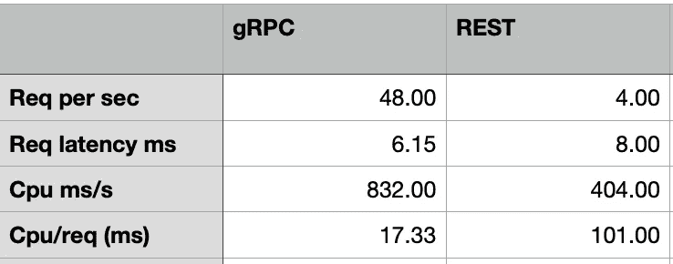
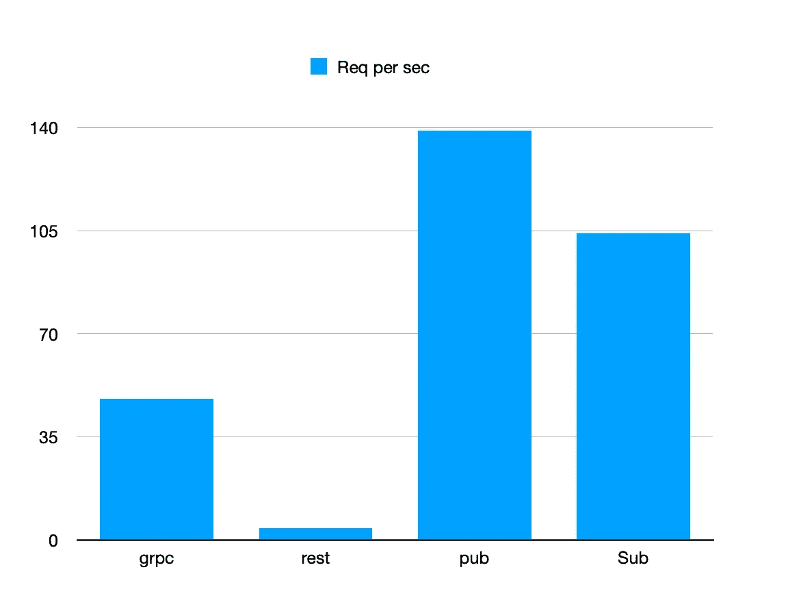

# gRPC 与 REST —性能比较

> 原文：<https://medium.com/analytics-vidhya/grpc-vs-rest-performance-comparison-1fe5fb14a01c?source=collection_archive---------1----------------------->

gRPC 是一个为远程过程调用交换消息的高性能框架。它使用[协议缓冲区](https://developers.google.com/protocol-buffers/docs/overview)来序列化结构化数据。

RESTful API 是一个非常流行 web 服务框架，它允许 Web 开发人员通过 http 调用交换 json 消息。

从易用性的角度来看，REST 肯定比 gRPC 简单，因为 gRPC 需要开发者在协议缓冲区定义消息结构，并用 protoc compiler 编译成 GO 模块。

但是，从性能的角度来看，gRPC 比 REST 快得多。谷歌云运行服务现在可以服务于 HTTP 和 gRPC 请求。在这里，我使用 [Google Cloud run](https://cloud.google.com/run/docs/triggering/grpc) 做了一个简单的性能基准来比较 gRPC 和 REST。

测试程序是用 GO lang 编写的。客户端有 10 个线程，将发送一个包含名称字符串和 10K 个整数的数组的大型消息，每个线程将重复 5000 次发送消息。云运行服务定义为 1 个实例 1 个 CPU，并发数= 10。结果如下所示:

gRPC 的吞吐量是每秒 48 个请求，是 REST API 的 10 倍以上。与 REST (404 毫秒/ 4 = 101 毫秒)相比，它使用更少的 cpu 时间来处理每条消息(每秒 CPU 时间毫秒/请求= 832 / 48 = 17.33 毫秒)。而请求延迟相似，分别为 6 毫秒和 8 毫秒。

获胜者是 gRPC。

然而，当我们在比赛中加入云 pubsub 时，pubsub 很容易赢得比赛，因为它是异步的。我们使用一个 GO 客户端发布类似的消息字符串，然后使用另一个 GO 客户端提取消息。pubsub 主题发布吞吐量为每秒 139 条消息，而请求订阅吞吐量约为每秒 104 条消息。所以最后的赢家是 pubsub。

源代码可以在 [Git](https://github.com/iwasnothing/grpc-rest-compare) 中找到。