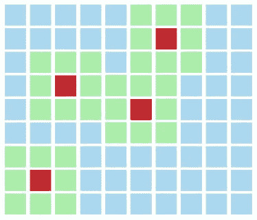
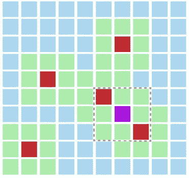
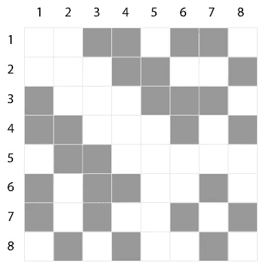
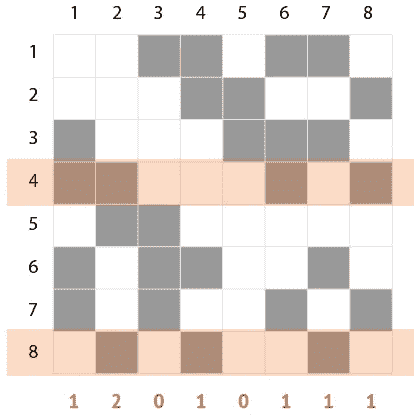
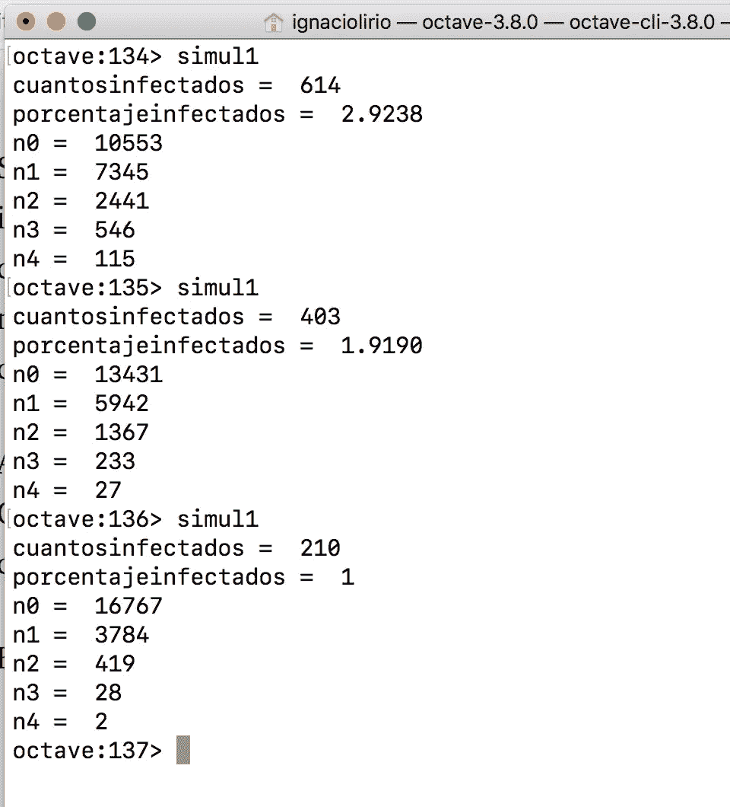
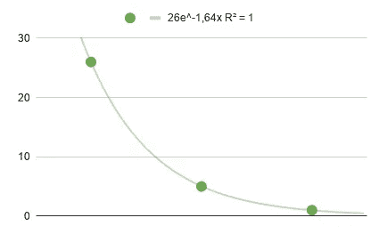
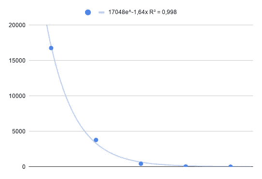
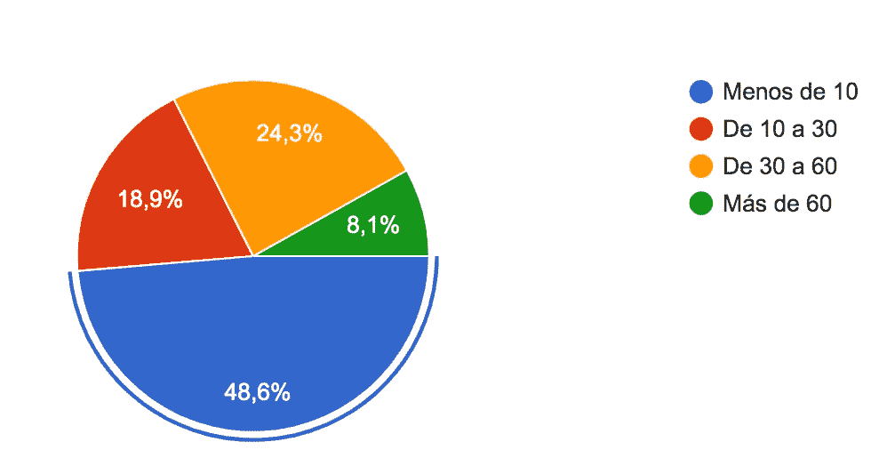

# 使用简单的数据科学猜测新冠肺炎感染人群

> 原文：<https://medium.com/analytics-vidhya/guessing-covid-19-infected-population-using-simple-data-science-fa015002475f?source=collection_archive---------25----------------------->

## 了解感染新冠肺炎病毒/疾病的准确人数并不容易。原因之一是大规模的测试还不容易进行。至少在西班牙(受影响最严重的国家之一)，当局只提供国家或地区一级的数据，而不提供城市或城镇的数据，所以要了解某个特定地方的情况，也就是当地的数据，是很复杂的。在这里，我提出了一个数值方法，根据基本假设和一个简化的网络模拟来估计一个中等城市(21 000 人)的感染人数。

洛哈是西班牙南部的一个城镇，拥有 21000 名居民。自该地区新冠肺炎疫情开始(3 月中旬)以来，任何有相关症状的人都必须去当地医院，如果检测并确认为冠状病毒，则被紧急送往格拉纳达的主要医院。如果没有，或者症状轻微，他们会被送回家，并通过定期电话进行医疗控制。

洛哈(西班牙格拉纳达)主景。资料来源:莱昂纳多·拉扎里尼。

此后，西班牙当局定期发布确诊病例、重症监护病房患者和因新冠肺炎死亡病例的数据。**该数据的分辨率是国家级、区域级**有时是省级，而不是单个城市或城镇。只有当地报纸的任务允许人们获得一些关于城市中流行病程度的数据。截至今天(2020 年 4 月 8 日)，当地确诊病例数量约为 30 例，其中 6 例死亡，约 90 人在家受到控制。

这些数据有多可靠？为了试图得到一个替代的估计，**我开发了一个基于统计学和一些基于网络和数据科学的基本假设的研究**。

## 该方法

该方法包括一系列在线民意调查，询问当地居民他们知道有多少来自其直接环境(一级亲属和熟人)的人受到该疾病的影响。将这些信息与每个邻居的接触网络的平均规模相关联，我可以估计受感染人口的相对规模。为此，基于这些假设开发了一个简单的计算机模型:

每个居民都有一个由 N 个联系人组成的本地网络

如果有人被感染，我们假设他/她的 N 个联系人会知道此事

一些人将属于几个感染者的网络，因此他或她将知道不止一个受影响的病例

从图形上看，我们可以这样描述这种情况:

每个红色细胞代表一个感染者，绿色细胞代表他们的邻居或熟人网络

紫色细胞代表未感染的熟人，属于两个感染者的网络

从这些假设出发，我用测试数据做了一个玩具模型。该模型包括建立一个表示邻居之间双边连接的[邻接矩阵](https://en.wikipedia.org/wiki/Adjacency_matrix)。

下一个图显示了 N=8 的矩阵之一。行和列都代表每一个居民。例如，如果邻居#3 认识邻居#6，他们的匹配方块被涂成黑色。否则，留空。因此，该矩阵是对称的，因为它代表了连接的无向图。

无向图中使用的邻接矩阵示例

然后，例如，如果邻居#4 和#8 被感染(在矩阵中显示为红色行)，对每列中的黑色单元进行计数和求和，得到每个邻居知道的感染人数(在该模型中，对角线中的单元为空，以排除自参考)

在该矩阵中，选择节点#4 和#8 进行感染(红色)。底部的数字代表每个公民的已知病例数量

所以，我用 Octave 编写了一个简单的算法，使用三个输入参数:

**N** =总人口

**pK** =连接度，联系人网络的平均大小，占 N 的百分比

**pC** =感染人数的估计百分比

该算法启动该邻接矩阵的模拟，将被感染的标签分配给与 pC 参数一致的随机行；并返回一个汇总列表:有多少邻居知道一个被感染，两个，三个…或者根本不知道。

八度算法的输出

这个汇总数据的图表被绘制、拟合，并与在公民中进行的在线民意调查的结果进行比较。然后，将指数衰减拟合的系数与几个 pC 参数进行比较。pK 参数是从投票中估计出来的，其中一个问题是 ***“您的网络规模有多大？”。***

最后，在分析 poll 的结果后，我设置了 **N=21000，pK=0.0011** (平均每个人知道人口的 0.1%左右)和 **pC 从 0.4%** (根据官方数据)到 1.5% 0.2 步。

## 结果

根据在线调查，指数衰减系数为 c=-1.64，相关系数 R=1

最佳拟合模拟是用 pC = 0.01(1%受感染的人)实现的，导致指数衰减系数 c=-1.64 和相关性 R=0.99

## 结论

利用这些数据，我们可以得出结论:洛哈镇的感染总人数约为 210 人，比官方记录的两倍多一点(约 90 人)

显然，真正的数据只能来自对大多数居民的测试。本研究的目的是从简单可靠的数据科学方法中归纳出，使用自我管理的调查方法推断出真实的信息。这里的关键点是要有一个好的猜测，人们的接触网络的规模，作为总人口的百分比。在小城镇，这个参数很高(几乎每个人都认识每个人)，而在大城市则相当低。在运行了许多模拟之后，我发现结果对这个参数的相对小的变化非常敏感。

对问题“您的网络规模有多大？”

在这里研究的城市 Loja 的特殊情况下，我发现了人口的一个特殊特征:它主要分为两种类型:一半的居民有一个非常小的网络(> 10)，几乎另一半有一个大的网络(~50)。中等规模的集群很少见。这一特性可能会导致结果的偏差，因为后一群人可能知道相对较多的感染者，因为他们的网络非常庞大。在这项研究中，没有应用权重，只是网络大小的总平均值，因此参数 pK 更多的是平均值而不是中值。

我希望这项研究对你的研究有所帮助。欢迎任何问题和评论。

谢谢大家！