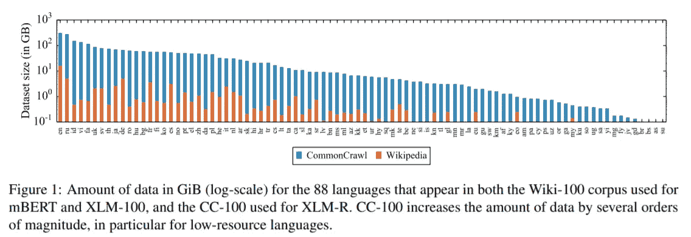
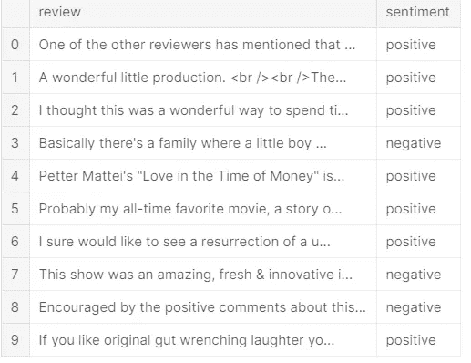
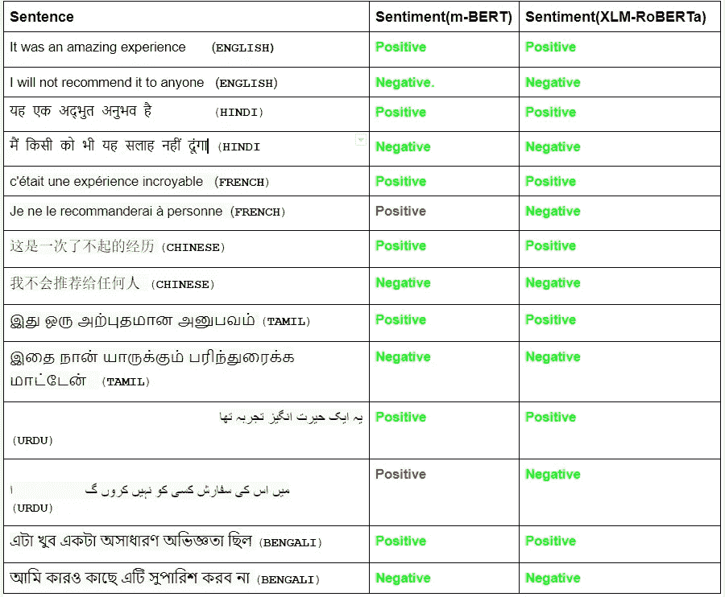
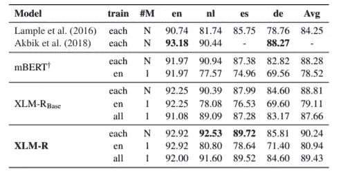
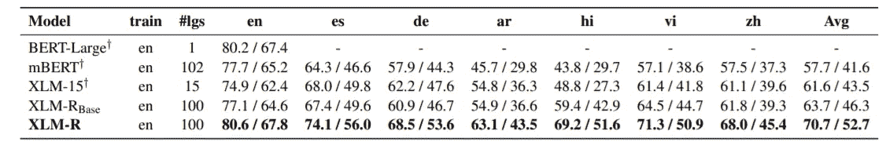
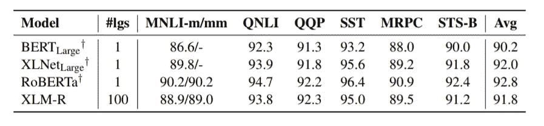

# 用 100 种语言猜度感悟…

> 原文：<https://medium.com/analytics-vidhya/guessing-sentiment-in-100-languages-4574ceed3b67?source=collection_archive---------6----------------------->

## 使用 mBERT 和 XLM-罗伯塔的零射击多语言情感分类。

马克·拉斯姆森在 [Unsplash](https://unsplash.com?utm_source=medium&utm_medium=referral) 上拍摄的照片

如果我们使用非英语语言，使用 NLP 会是一件非常痛苦的事情。其他语言的困难是由于资源和预训练模型的稀缺。随着迁移学习和预训练模型的出现，NLP 生态系统发生了巨大的变化，那么什么是迁移学习呢:

> 迁移学习是一种机器学习方法，其中为一项任务开发的模型被重新用作第二项任务模型的起点。

各种预先训练好的模型，比如:**谷歌的 BERT，XLNET，facebook 的 RoBERTa，Open AI 的 GPT，FastAi 的 ULMFiT** 等等。提供了很好的结果，但这些大多局限于英语。我们也可以从头创建一个语言模型，我们可以检查如何从头构建一个印地语语言模型，在这个[以前的文章](/analytics-vidhya/predicting-the-next-hindi-words-de58541fbbcf?source=friends_link&sk=1663d0980a834c4581fed0ec0dc08b0b)中，但是从头为每种语言创建一个语言模型是非常困难的，对于低资源语言来说更困难。

# 零射击学习:

解决上述问题的方法是零镜头学习，我们需要用一种特定语言的数据来填充我们的模型，它可以在各种其他语言上工作！！

> 我们将在特定语言(此处为*英语*)的任务(此处为*情感分析*)上训练语言模型，我们的模型将能够在任何其他语言上执行该任务，而无需对该语言进行任何显式训练！！！

# 竞争者:

照片由[宣阮](https://unsplash.com/@darthxuan?utm_source=medium&utm_medium=referral)在 [Unsplash](https://unsplash.com?utm_source=medium&utm_medium=referral) 上拍摄

现在让我们来看两个当今最突出的最先进的多语言模型。

1.  **mBERT:** [多语言 BERT](https://github.com/google-research/bert/blob/master/multilingual.md) (mBERT)与 BERT 一同发布，支持 [104 种语言](https://github.com/google-research/bert/blob/master/multilingual.md#list-of-languages)。这种方法非常简单:本质上就是对来自多种语言的文本进行 BERT 训练。特别是，它在维基百科的内容上进行了训练，并拥有跨所有语言的共享词汇。例如，为了解决维基百科内容不平衡的问题，英文维基百科的文章比冰岛语维基百科多 120 倍，小语种被过采样，而大语种被欠采样。
2.  **XLM-罗伯塔**:脸书人工智能团队在 2019 年 11 月发布了[XLM-罗伯塔](https://arxiv.org/pdf/1911.02116.pdf)，作为他们最初 [XLM-100](https://arxiv.org/pdf/1901.07291.pdf) 模型的更新。两者都是基于 transformer 的语言模型，两者都依赖于屏蔽语言模型目标，两者都能够处理来自 100 种不同语言的文本。XLM-罗伯塔对原版的最大更新是训练数据量的显著增加。我们可以从下面的图表中了解到训练数据的增长情况。

对其进行训练的清理过的 **CommonCrawl** 数据占用了高达 **2.5tb** 的存储空间！它比用于训练其前身的 Wiki-100 语料库大几个数量级。“罗伯塔”部分来自于其训练程序与单语罗伯塔模型相同的事实，具体来说，唯一的训练目标是**掩蔽语言模型**。XLM-R 使用自我监督的训练技术来实现跨语言理解的最先进的性能，在这项任务中，模型以一种语言进行训练，然后在没有额外训练数据的情况下与其他语言一起使用。该模型通过纳入更多的训练数据和语言(包括所谓的低资源语言，缺乏大量的标记和未标记数据集)，对以前的多语言方法进行了改进。

# 让我们检查一下数据:

我们将使用 [imdb 电影评论数据集](https://www.kaggle.com/lakshmi25npathi/imdb-dataset-of-50k-movie-reviews)，它由来自电影评论情感的句子组成。任务是预测给定句子的情绪(影评)。我们使用双向(正/负)类分裂，并且仅使用句子级标签。

让我们看一下我们的数据:

数据快照..

# 对峙:

赫尔墨斯·里维拉在 [Unsplash](https://unsplash.com?utm_source=medium&utm_medium=referral) 上拍摄的照片

我们将使用上述 imdb 数据集微调预训练的 m-bert 和 xlm-roberta 模型。我们将使用[拥抱脸的 PyTorch](https://huggingface.co/transformers/index.html) 实现，因为它非常简单直观地实现和微调 m-bert 和 xlm-roberta。这是[笔记本](https://gist.github.com/sayakmisra/b0cd67f406b4e4d5972f339eb20e64a5)，这些是我们广泛遵循的实施步骤:

1.  加载[数据集](https://www.kaggle.com/lakshmi25npathi/imdb-dataset-of-50k-movie-reviews)并解析它。
2.  将句子编码成 XLM-罗伯塔/伯特可以理解的格式。
3.  训练(微调)，它包括这些步骤 **:**

*   打开我们的数据输入和标签
*   将数据加载到 GPU 上进行加速
*   清除上一步中计算的渐变。
*   正向传递(通过网络输入数据)
*   反向传递(反向传播)
*   告诉网络使用 optimizer.step()更新参数
*   跟踪用于监控进度的变量
*   我们将指定**XLM-罗伯塔/伯特福序列分类**作为最后一层，因为它是一个分类任务**。**

4.将微调后的模型保存到我们的本地磁盘或驱动器。

5.下载保存的模型，并在我们的本地机器上做一些语法检查。

这里是包含全部代码的[笔记本](https://gist.github.com/sayakmisra/b0cd67f406b4e4d5972f339eb20e64a5)。

# 结果:

我们将检查两个句子:

1.  这是一次奇妙的经历。(正面情绪)。
2.  我不会推荐给任何人。(负面情绪)。

我们将这些翻译成六种不同的语言(印地语、法语、汉语、泰米尔语、乌尔都语和孟加拉语)，并用我们微调过的模型对它们进行测试，并检查结果。

7 种语言的结果..

正如我们所看到的，两个模型都表现得很好，尽管 mBERT 对像乌尔都语这样的低资源语言进行了几次错误分类。这里我们必须考虑一件事，**我们只使用英语数据对我们的模型进行了微调，并没有将它暴露给任何其他语言数据**。尽管如此，它仍然能够非常成功地检测出所有语言中的情感！

# 有明显的赢家吗？

[澳门图片社](https://unsplash.com/@macauphotoagency?utm_source=medium&utm_medium=referral)在 [Unsplash](https://unsplash.com?utm_source=medium&utm_medium=referral) 上拍摄的照片

从我们执行的几个测试来看，还不太清楚谁是赢家，所以我们需要检查大型多语言数据集的结果，让我们来看看这些结果:

关于 NER 的结果

关于 MLQA 的结果

在考虑了大型多语言和单语语料库的结果后，我们可以说我们确实有一个赢家，那就是**XLM-罗伯塔。**与最先进的单语模型如: **BERT、RoBERTa、XLNet 等相比，它在所有标准单语任务(如 GLUE)中的表现即使不更好，也同样出色。**我们也可以从下表中查看结果。

胶水基准 XLM-R

# 结论:

总结讨论，我们可以有把握地说，XLM-罗伯塔是零射击多语言任务的更好选择，尽管 mBERT 也紧随其后。多语言模型非常强大。最新的发展，XLM-R，处理 100 种语言，仍然保持与单语同行的竞争力。

# 参考资料:

1.  拥抱脸变形金刚[https://huggingface.co/transformers/index.html](https://huggingface.co/transformers/index.html)
2.  Chris mcCormick 的博客文章[http://mccormickml . com/2019/11/11/Bert-research-EP-1-key-concepts-and-sources/](http://mccormickml.com/2019/11/11/bert-research-ep-1-key-concepts-and-sources/)
3.  https://arxiv.org/pdf/1911.02116.pdf XLM-罗伯塔论文
4.  伯特论文[https://arxiv.org/pdf/1906.01502.pdf](https://arxiv.org/pdf/1906.01502.pdf)
5.  [https://pelt arion . com/blog/data-science/a-deep-dive-into-multilingual-NLP-models](https://peltarion.com/blog/data-science/a-deep-dive-into-multilingual-nlp-models)