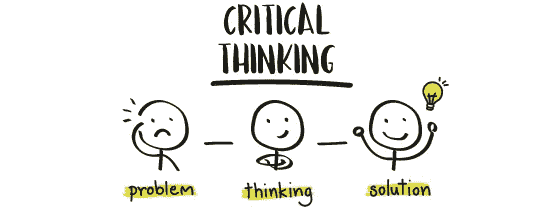

# 猜测

> 原文：<https://medium.com/analytics-vidhya/guesstimates-55967e633b96?source=collection_archive---------5----------------------->

大家好。欢迎阅读这篇关于如何解决猜测和如何在猜测中胜出的文章。我会用一种非常简单的方法来指导你，这样对你用更简单的方法解决任何类型的问题都会很有帮助。

首先，永远记住，你如何着手解决问题比你的数据有多正确更重要。因为 guesstimate 就是分享聪明的猜测，相信我，一旦你开始掌握这个，没有什么能阻止你。

什么是猜测？

> *guest estimate 是 guess 和 estimate 的非正式英文组合词，最早由美国统计学家在 1934 年或 1935 年使用。它被定义为在没有使用充分或完整信息的情况下做出的估计，或者更确切地说，是通过猜测或推测得出的估计。*

除了“在没有使用完全信息的情况下得出一个估计值，这只是猜测”

**我们如何处理一个猜测问题:**

第一步:**正确理解问题**

首先，我们必须对问题有一个完整的了解，才能继续解决问题。除非你明白问题所在，否则你无法前进。例如，钦奈有多少卖茶的人？在这个问题中，他们询问了钦奈地区的茶叶销售商。由此我们必须明白，我们需要找到“卖茶人的数量”

第二步:**提出疑问进行澄清**

经常看着面试官，我们倾向于不去问那些会直接影响我们对问题理解的问题。如果我们问更多的问题，问题总会解决。比如这个问题:食品配送链接到多少订单？在这方面，我们必须问我们集中注意力的日期和地区等等。这有助于我们获得特定的数据，了解他们想要什么。

第三步:**分手**:这个猜测中最本质的部分就是分手。你如何将问题分解到原子层面

*   **寻找我们要分解的数量**:这个数量是所有事物的总和。这可能不总是正确的，因为我们没有数据。但是我们所拥有的是，我们解决问题的才能。
*   **在所有事情中找到前三名**:在每个问题中，我们必须将第一个值分成三个。举例来说，如果食物供应过多，就把它们分成不同的收入类别。这也可能是性别分类。比如谁买避孕套(举例)
*   **将三者细分为子类**:这是问题升温的地方。我们需要把这三样东西分解成许多样东西，这样我们才能得出一个估计值。这也是我们发现影响决策的因素的地方。
*   **得出一个数字**:这是你得出一个特定数字的地方。这可能有一些类别或相应的百分比。由此我们可以通过减去百分比得出数字。那我们就要从上面的大数推导出来了。这就是我们解决这个问题的方法。

**警告**:

*   永远不要认为这是理所当然的
*   这种分析永远不要走得太远。
*   不要说你不知道定义的不想要的关键词。

**例子:**

*   查找钦奈周六的 zomato 递送数量(LatentView)

首先:找出钦奈的人口

下一步:将人们分成三个子类:高收入、中等收入、低收入。

第三:将此与可能影响选择在线交付的因素分开:

*   例如，人们可能会选择家庭烹饪的食物
*   人们可能会直接去餐馆
*   人们可能会去旅行
*   人们可能在办公室工作。

并由此得出选择在线食品配送的百分比。

第四:当你达到这里的百分比时，你可以确保你可以着手选择食品配送行业的参与者。例如，斯威奇和佐马托。这就是你应该得出的选择佐马托而不是斯威奇的概率百分比。记得 zomato 给的优惠多。越多的优惠，越多的客户，所以从这一点来说，达到一个百分点，然后继续前进。

第五步:计算百分比，用总数找出你可能得到的数字。

这就是你处理问题的方式，这就是你在需要猜测的情况下可以做的事情。价值可能不正确，但公司会看到您如何处理问题。这样你可以解决许多问题，并且可以继续猜测。还有一个叫做商业案例研究的东西，我会在接下来的文章中写。如果你有任何疑问，请告诉我。

感谢阅读