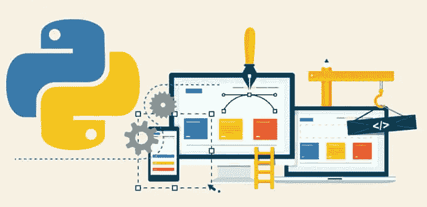
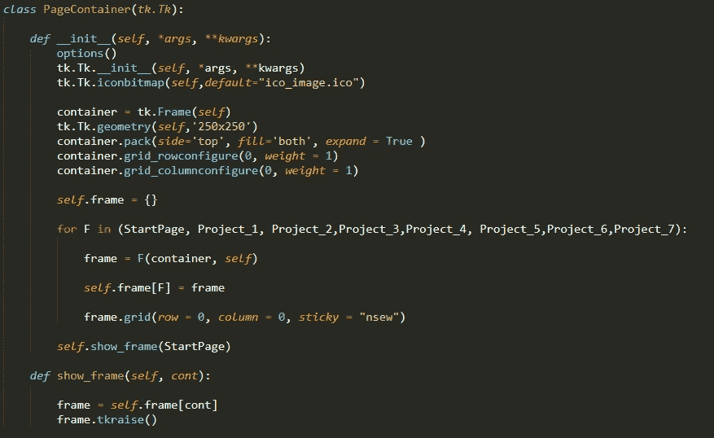
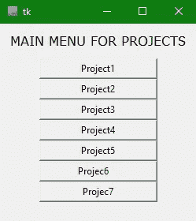
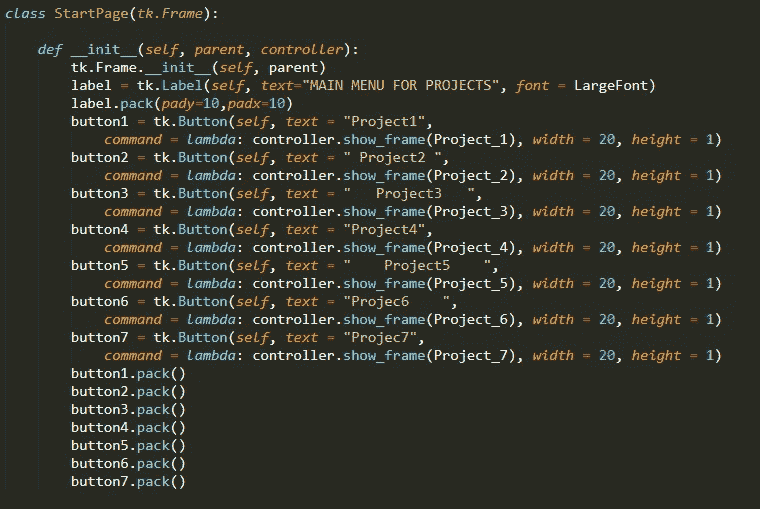
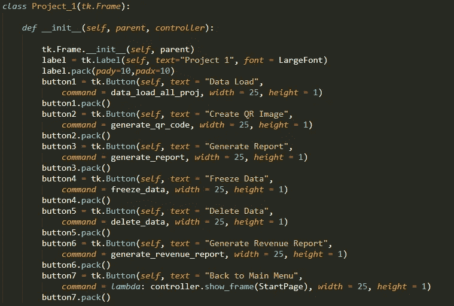
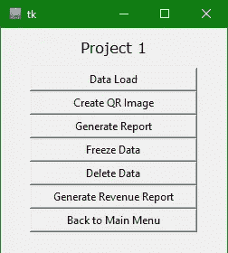
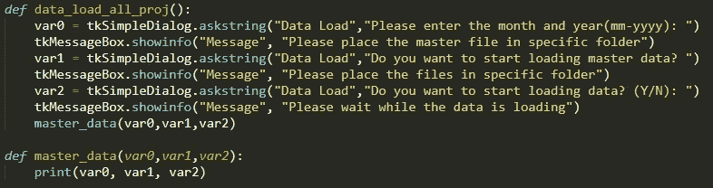
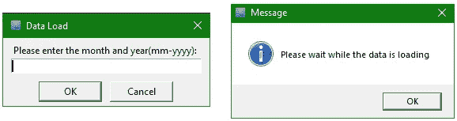

# 具有多个窗口的 python 程序的 GUI

> 原文：<https://medium.com/analytics-vidhya/gui-for-your-python-program-with-multiple-windows-options-78c2ea8d259d?source=collection_archive---------1----------------------->

## 使用 python Tkinter 库为您的 python 程序轻松实现 GUI 框架



**Python GUI 框架**(图片由 [Techore](https://techsore.com/wp-content/uploads/2018/11/Best-Python-GUI-Framework-2019..jpg) ) [Github](https://github.com/sachinbhoi29/GUI_for_python_programs)

无论是为不精通编码的用户开发程序，还是需要用户友好的体验来与软件交互，GUI 对于增强用户的程序体验都是至关重要的。这些图形元素有时会增加声音或视觉效果，如透明度、阴影等。GUI 根据应用程序的需要而不同，因此一个好的 GUI 库在设计 GUI 时应该是高度可定制的。


当我试图为我的应用程序制作一个 GUI 时，我有许多选择/项目。这使得我必须设计一个多页菜单，它可以将所有页面放在一起，并显示适当的页面，而不保留上一页。我发现制作一个单页 GUI 很容易，但是很难找到一个多页菜单的框架。

因此，我创建了这个教程，它可以成为你的 python 应用程序的一个很好的框架。运行在 Python 2 上的 GUI 框架可以很容易地转换到 python 3 上，只需稍作修改。可以根据应用程序的需要定制代码。

本教程将分为以下几个步骤:

*   Tkinter
*   多窗口图形用户界面
*   制作单个可执行文件

# **Tkinter**

我一直在为 python 应用程序寻找一个简单的 GUI，发现 Tkinter 和 PyQt 是广泛使用的 python GUI。然而，Tkinter 很容易在 python 中安装，因为它是 Python 中的一个标准库。使用 Tkinter 的 Python 是创建 GUI 应用程序最快最简单的方法。PyQt 很难安装，尤其是在 python 2 上，因此我更喜欢 Tkinter。这个库的文档可以在[这里](https://wiki.python.org/moin/TkInter)找到。

# **多窗口图形用户界面**

为了在 Tkinter 中设计一个多窗口 GUI，我们首先需要一个容器来保存所有的页面。在 PageContainer 类中，我们可以自定义页面的格式。例如，页面的几何形状、要显示的徽标等。为框架创建了一个空字典，我们可以通过初始化 StartPage 来启动应用程序。tkraise 函数用于在前一页的顶部显示新的一页。



**PageContainer 类用于加载内存中的所有页面并显示选中的页面**Github



**GUI 界面的起始页，显示所有项目页面** [Github](https://github.com/sachinbhoi29/GUI_for_python_programs)

起始页充当所有其他子页面的主页。它包含了调用子页的选项菜单中所有可选择的项目/页面。可以通过改变字体样式和大小、按钮的宽度和高度、页面的标题、x 和 y 方向上元素的填充等来定制页面。这些按钮装在菜单的主机里。



**带有多个子页面按钮的应用程序的父页面** [Github](https://github.com/sachinbhoi29/GUI_for_python_programs)

类似于起始页，子页面具有类似的格式。然而，当在子页面上按下按钮时，它调用的是函数而不是页面。最底部的按钮用于导航到主页。



**应用程序的子页面** [Github](https://github.com/sachinbhoi29/GUI_for_python_programs)



**带有按钮的应用程序的子页面喜欢调用一个函数** [Github](https://github.com/sachinbhoi29/GUI_for_python_programs)

子页面上的每个按钮都可以定制为调用特定的功能。这些按钮也可以用于将用户输入作为参数，并将其作为参数传递给 desire 函数。此外，可以显示消息框来向用户显示警告或指令。



**获取输入并向用户显示消息的示例函数** [Github](https://github.com/sachinbhoi29/GUI_for_python_programs)



**用户在 Tkinter** 中输入对话框和消息弹出 [Github](https://github.com/sachinbhoi29/GUI_for_python_programs)

从上面的例子中可以看出，从用户和弹出消息窗口中获取输入非常简单。最好只接受用户通过按下按钮进行的一次输入。尽管如此，有时你不希望菜单上有太多的按钮(项目 1 菜单)。因此，在上面的例子中，“数据加载”按钮调用 data_load_all_proj 函数，该函数接受用户的多个输入。这些输入可以作为参数传递给函数(master_data)。

# 制作单个可执行文件

```
pip install pyinstallerconda install -c conda-forge pyinstaller 
```

为了进一步方便用户，所有 python 可执行文件都可以很容易地转换成一个可执行文件(。exe)文件在 windows 上运行。这将把你的整个 python 程序转换成一个用户友好的 GUI 应用程序。只需浏览到包含主 python 可执行文件的文件夹，并在主 python 文件上运行以下命令。

```
pyinstaller YourMainPythonFile.py
```

