# 在 Windows 10 中安装 Anaconda 的指南

> 原文：<https://medium.com/analytics-vidhya/guide-to-installing-anaconda-in-windows-10-93880eca89b4?source=collection_archive---------2----------------------->

当我们开始自己研究机器学习和深度学习人工智能时，我们基本上必须安装一堆包。这对于我们大多数人来说，其实有时候很麻烦。为了使它更容易，Anaconda 作为一个包管理器来管理我们的新包的安装和部署。

首先，访问下面的链接:[https://www.anaconda.com/distribution/](https://www.anaconda.com/distribution/)，页面会这样弹出。

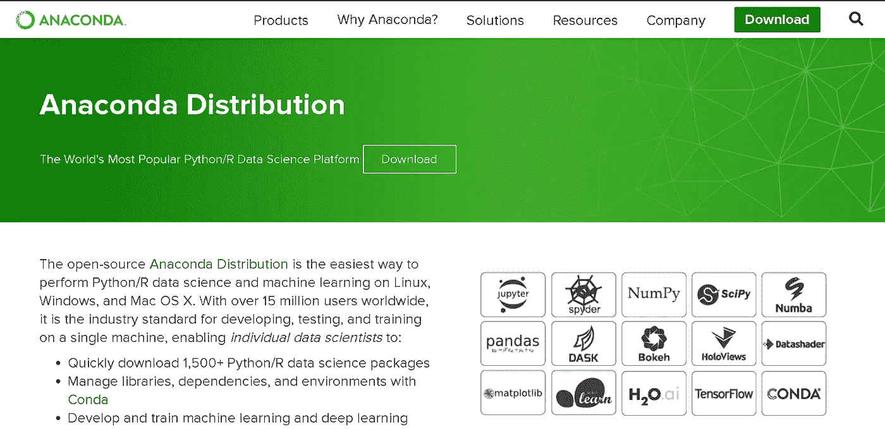

向下滚动页面并选择 windows。


下载 Python 3.7 版本(推荐)，因为 Python 版本 2 将在 2019 年底不再受社区支持。根据您的计算机系统，选择 32 位或 64 位安装程序来下载。exe 文件。

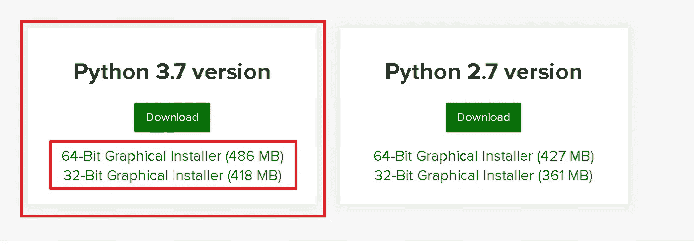

下载文件后，运行文件。文件将会打开，点击**下一步**

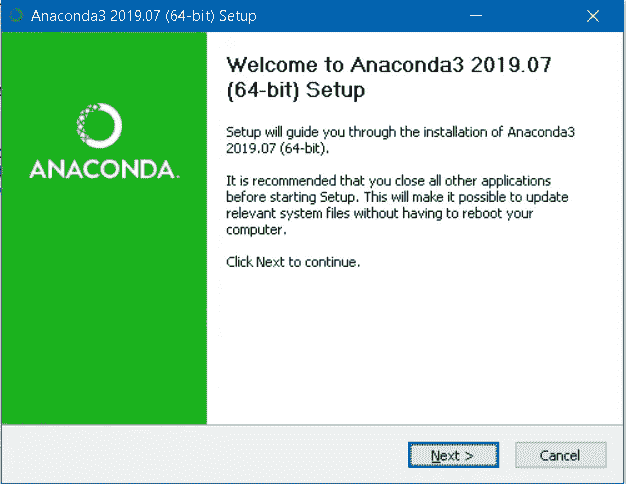

并点击**我同意**获得许可。

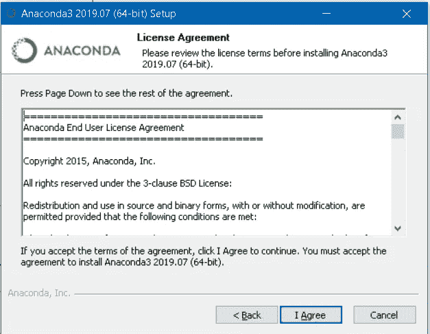

选择**仅我**并点击**下一步**

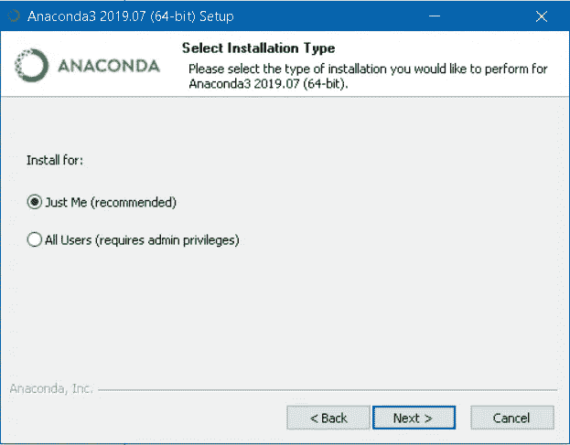

点击**浏览选择安装位置，或**保持原样(默认位置)并继续点击**下一个**。

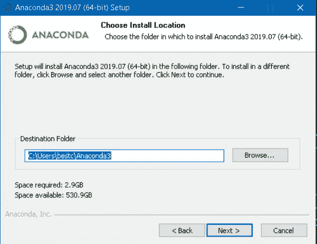

这里强烈推荐选择第二个**注册 Anaconda 为我的默认 Python 3.7** ，点击**安装**

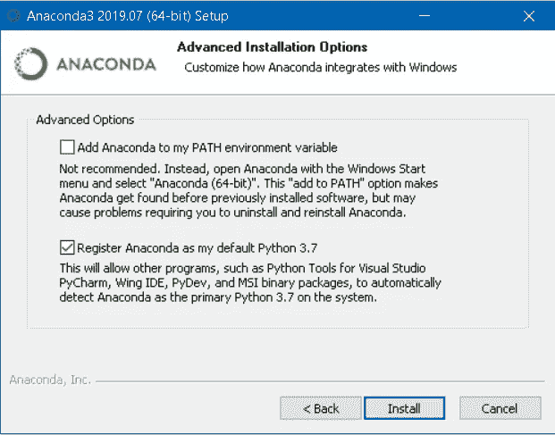

安装完成后，从 Windows 开始菜单栏打开 **Anaconda 提示符**。

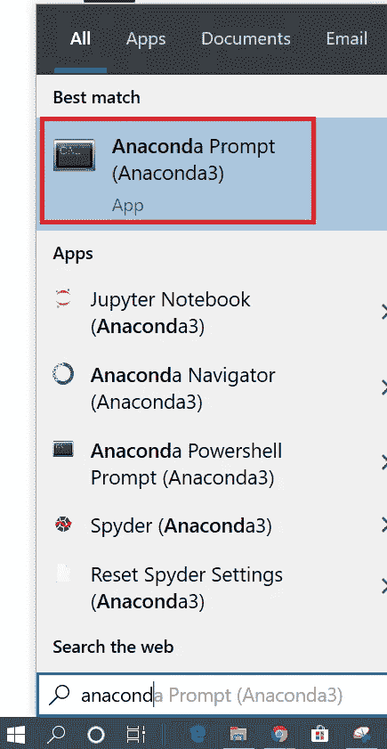

Anaconda 提示符是类似于 Windows 命令提示符(Windows 终端)的 shell，由 Anaconda 发行版提供支持。要检查我们是否成功安装了 Anaconda，请在 shell 中键入 **python** 命令。

```
> python
```

输出将被 Python 版本抛出，符号将从 **>** 变为 **> > >** ，显示为 Python 解释器。

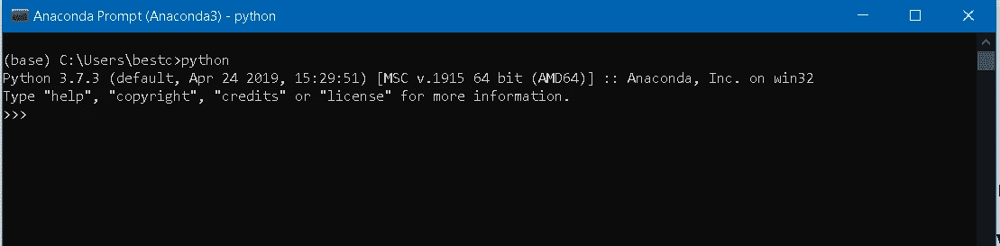

要退出 python 解释器，请输入如下 exit 命令。

```
>>> exit()
```

如果我们想从 Windows 命令提示符下访问 Anaconda 怎么办？如果你想这么做，就跟着这个走。首先，在 Anaconda 提示符下，输入这个命令来检查 Anaconda 的位置。

```
> where conda
```

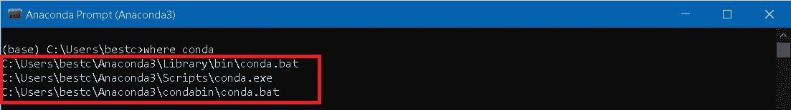

按下 **Windows 键+ R** 打开 Run box。在框中输入 **sysdm.cpl** 并点击**确定。**

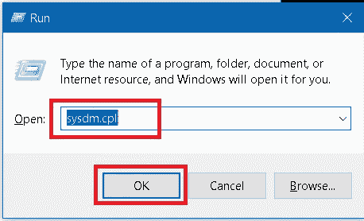

将弹出**系统属性**窗口。然后，转到**高级**选项卡，点击**环境变量。**

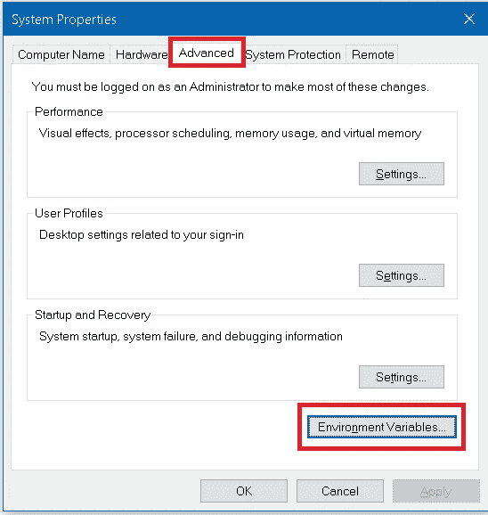

在**环境变量**窗口中，选择**路径**，点击**编辑**编辑路径。

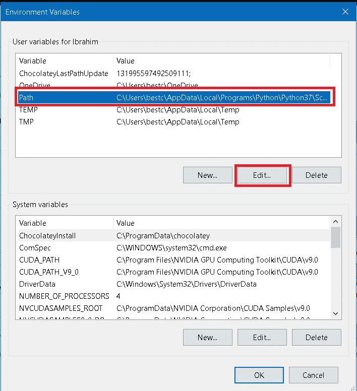

在**编辑环境变量**窗口内，点击**新建**添加路径。

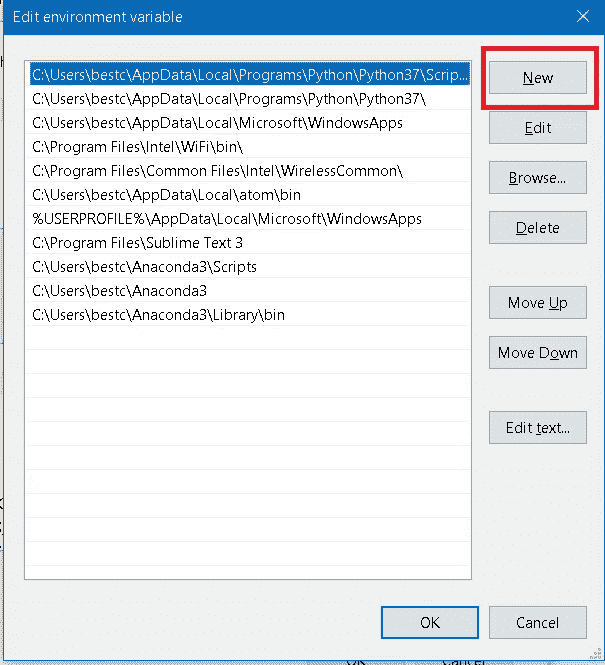

在里面加上这三个位置。在***用户名*处输入您的用户名。这里，我使用的是 Anaconda 最新版本 **Anaconda3** ，如果你倾向于使用旧版本，也要修改版本号。**

```
C:\Users\*UserName*\Anaconda3\ScriptsC:\Users\*UserName*\Anaconda3C:\Users\bestc\*UserName*\Library\bin
```

完成上述所有步骤后，通过键入 **cmd** 并点击 **OK，从运行框打开 Windows 命令提示符。**

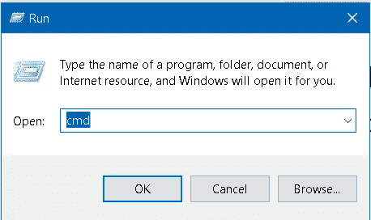

在命令提示符下，输入命令

```
> conda
```

并且会看到几条线出现。这意味着我们可以成功地从我们最喜欢的 Windows 终端执行 Anaconda 命令。

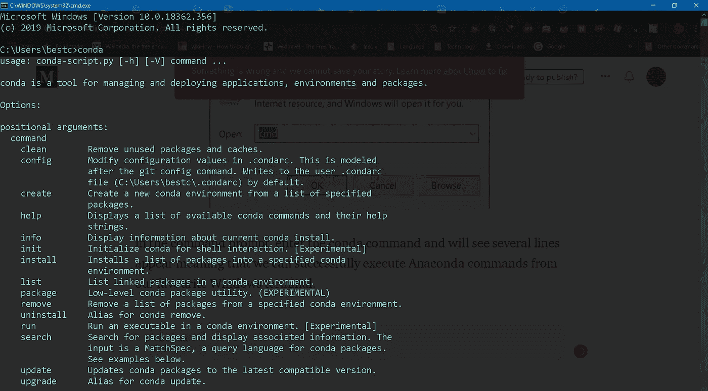

最后，为了检查康达版本。在下面输入该命令。

```
> conda — - version
```

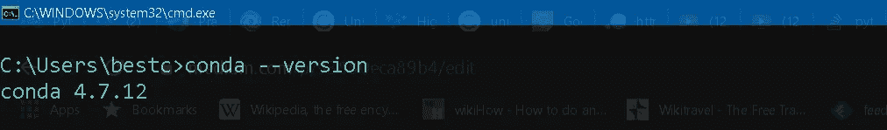

**参考文献:**

[](https://problemsolvingwithpython.com/01-Orientation/01.03-Installing-Anaconda-on-Windows/) [## 在 Windows 上安装 Anaconda

### 对于问题解决者，我推荐安装并使用 Python 的 Anaconda 发行版。本节详细介绍了…

problemsolvingwithpython.com](https://problemsolvingwithpython.com/01-Orientation/01.03-Installing-Anaconda-on-Windows/) [](https://www.anaconda.com/distribution/) [## Anaconda Python/R 发行版-免费下载

### 开源的 Anaconda 发行版是在…上执行 Python/R 数据科学和机器学习的最简单的方法

www.anaconda.com](https://www.anaconda.com/distribution/) [](https://appuals.com/fix-conda-is-not-recognized-as-an-internal-or-external-command-operable-program-or-batch-file/) [## 修复:“conda”不被识别为内部或外部命令、可操作程序或批处理文件…

### 一些用户遇到“conda 不被识别为内部或外部命令、可操作程序或……

appuals.com](https://appuals.com/fix-conda-is-not-recognized-as-an-internal-or-external-command-operable-program-or-batch-file/)