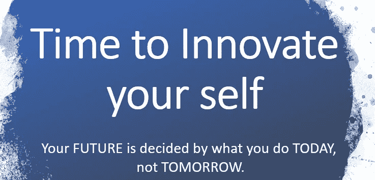

# AI/ML/DL/DS 领域工作转换指南

> 原文：<https://medium.com/analytics-vidhya/guide-to-job-transition-to-ai-ml-dl-ds-field-276e628def85?source=collection_archive---------37----------------------->

伙计们，我将指导你们如何从目前的领域过渡到新的领域。

耶！！！这是人工智能太创新，太有创造力了。每当我们听到人工智能，我们就会想到科幻电影、机器人、自动化。是的，没错，但远不止这些。
**AI** :是一个整体的背景，所有 ML，DL，DS 都来了。
人工组合(由…编程)