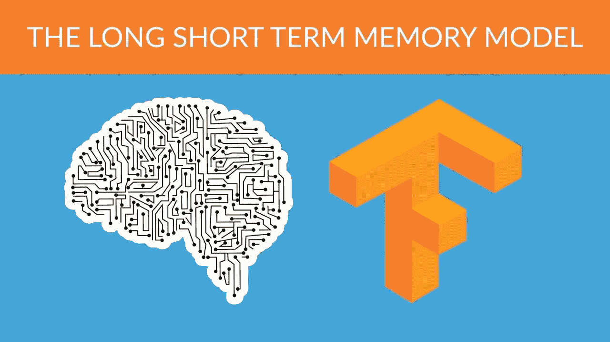
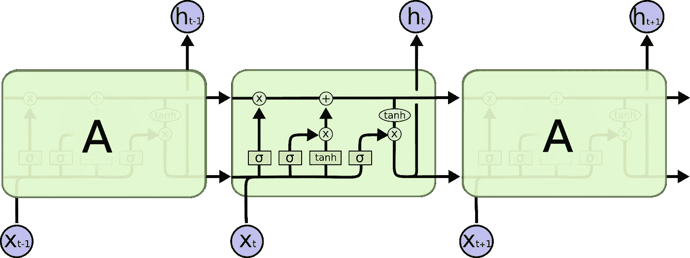
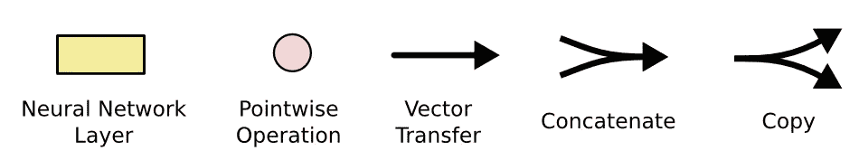
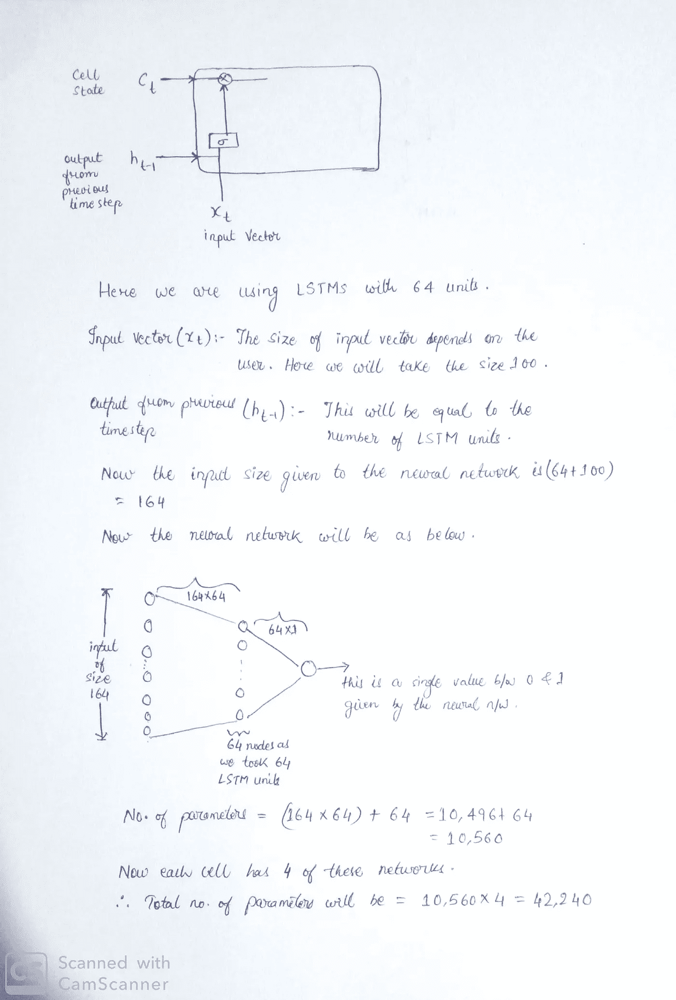

# LSTMs 初学者指南。

> 原文：<https://medium.com/analytics-vidhya/guide-to-lstms-for-beginners-ac9d1fc86176?source=collection_archive---------14----------------------->

在这个博客中，你将了解什么是 LSTM，为什么我们需要它，以及 LSTM 的内部建筑概况。



摘自谷歌

在去 LSTMs 之前，你需要知道什么是 rnn。这将有助于您理解为什么首先需要 LSTMs。

**无线网络概述:**

传统的神经网络不是为处理序列数据而设计的，因此我们需要一种能够在有序列数据的地方工作的架构。这方面的一个例子可以是股票市场中的股票价格、心跳数据或一句话。在每一个例子中，如果你想预测明天的股票价格，或者下一分钟的心跳读数，或者句子的下一个单词，那么我们传统的神经网络就会崩溃。因此我们需要新的架构，于是 rnn 应运而生。

一切都很好，但 RNNs 有一个主要缺点。如果用来预测序列下一部分的序列长度很短，那么它工作得很好，但是对于更长的序列长度，它就失败了。发生这种情况是因为在反向传播期间更新权重时梯度消失。因此，我们需要修改 RNNs，使其在需要时也保留先前的上下文。这导致了 LSTMs 的产生。下面是 RNN 的建筑。


图片取自 Colah 的博客。

rnn 有一个循环，因此它们保留先前的上下文，并使用它们来预测序列中的下一个字/时间步长。RNN 链中的每个细胞都包含一个单一的神经层。

**长短期记忆**

LSTMs 也具有与 RNNs 相似的结构，但是有四个神经网络，并且它们相互作用，这有助于克服长期依赖性并消除 RNNs 的缺点。下图是一个 LSTM 网络。



图片取自 Colah 的博客。

在这篇博客中，我不会解释 LSTMs 是如何工作的，我只会解释它的架构。要了解 LSTM 背后的直觉，请阅读 Colah 的 [**博客**](https://colah.github.io/posts/2015-08-Understanding-LSTMs/) ，因为他解释得很好。以下内容将有助于理解所使用的符号。



图片取自 Colah 的博客。

在上图中，你可以看到我们有一条从一端到另一端的水平线。这是细胞状态。如果你不明白所有这些，那么我建议你先浏览一下 Colah 的 [**博客**](https://colah.github.io/posts/2015-08-Understanding-LSTMs/) 。

好了，现在你知道所有这些层是如何工作的了，让我向你解释一旦你在 Keras 中定义了 LSTM 建筑，它将会是什么样子。现在我将在喀拉斯定义一个 LSTM，并向你解释它的建筑外观。

```
lstm_layer1 = LSTM(64)(input)
```

这将创建一个 LSTM 网络。下图会解释清楚。我将向你展示一个神经网络的架构。所有四个都将具有相同的架构。



这显示了如何计算 LSTM 网络的参数数量。

对于双向 LSTMs，只需将其乘以 2，您将获得在训练模型期间更新的参数数量。

我们从这个网络得到的介于 0 和 1 之间的值乘以细胞状态的每个元素。这决定了我们应该从前面的时间点记住多少。为了更好地了解还有哪些神经网络，请浏览 Colah 的 [**博客**](https://colah.github.io/posts/2015-08-Understanding-LSTMs/) 。

谢谢你。如果你有任何疑问或需要更详细的解释，请随时联系我。

如果你是 ML 和 DL 新手，想知道**校准** **是什么意思******为什么** **我们** **甚至** **都用**这个这个那个去看看这个 [**博客**](/analytics-vidhya/calibration-in-machine-learning-e7972ac93555) 。**

**[](/analytics-vidhya/calibration-in-machine-learning-e7972ac93555) [## 机器学习中的校准

### 在这个博客中，我们将学习什么是校准，为什么以及何时应该使用它。

medium.com](/analytics-vidhya/calibration-in-machine-learning-e7972ac93555)**