# 使用 PyTorch 进行物体探测的指南

> 原文：<https://medium.com/analytics-vidhya/guide-to-object-detection-using-pytorch-3925e29737b9?source=collection_archive---------2----------------------->

#Part1 #day12 of #100daysofcode

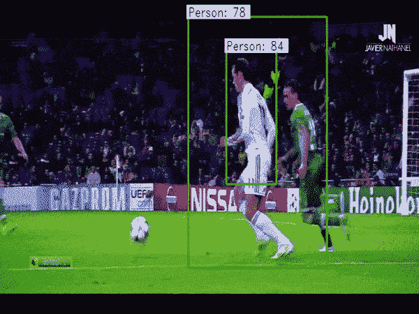

计算机视觉有很多应用。我们可以解决许多问题，并通过使用能够看到和处理它的机器来摆脱大量重复性的工作。在本文中，我们将讨论计算机视觉的一些应用，以及它们如何工作和如何实现。

# **使用视频**

对于实时动作和结果，我们必须处理视频数据。而视频是由帧组成的。我们将这些帧视为单个图像，并对其进行相应的处理。所以处理图像和视频是相似的。在处理一帧之后，我们将它组合起来以获得处理后的视频。我讨论这个是因为我们要处理实时物体检测。为了处理视频或图像数据，我们将使用 [OpenCv](https://opencv.org/) 库。这是一个很棒的库，提供了很好的功能。

我们将讨论图像分类、目标定位和目标检测。这些是计算机视觉的一些应用。这些会让你对这个领域有更深刻的了解。

# **图像分类**

在分类中，任务是判断一个对象是否出现在图像中。例如:-我们想知道图像是狗还是猫。因此，我们训练一个图像分类器，它将预测图像属于哪一类。

# **物体定位**

在定位中，任务是判断物体在图像中的位置。我们希望在对象周围绘制一个边界框。我们的模型不仅可以判断出图像是狗的，还可以预测图像中物体的坐标位置。这一次只处理一种类型的对象。

# **物体检测**

如果我们的图像包含多个对象，并且我们想要检测它们，并且还想要知道它们在图像中的位置，那么该任务被称为对象检测。定位只处理单个对象，但是在对象检测中，我们有多个对象。

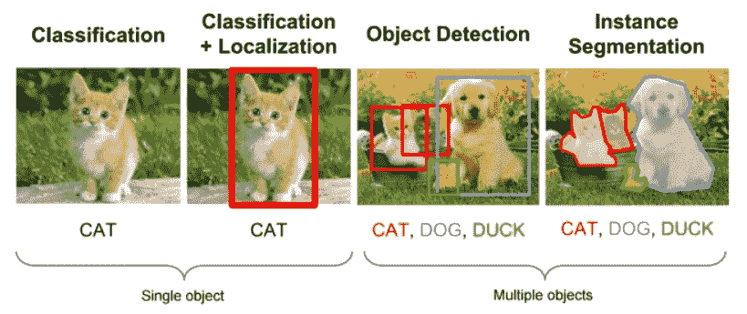

我们一步一步来:

1.  图像分类
2.  本地化
3.  目标检测

我们将在 PyTorch 中实现这些解决方案，并详细讨论它们。在物体检测中，我们将使用迁移学习。有各种各样的架构可以用于迁移学习。我们只需要加载架构并下载权重。迁移学习节省时间和资源，因为我们不需要从头开始训练整个大型架构。

# **各种 CNN 架构:**

1.  LeNet
2.  AlexNet
3.  VGG
4.  雷斯内特
5.  开始

# 用于对象检测的数据集

[**可可**](http://cocodataset.org/#home)

[**帕斯卡 VOC 数据集**](http://host.robots.ox.ac.uk/pascal/VOC/)

[**ImageNet 数据集**](http://www.image-net.org/)

[**打开图像数据集**](https://opensource.google/projects/open-images-dataset)

# **分类:-手写数字。**

我们训练一个模型，将一个给定的图像分为十类，并预测数字。MNIST 数据集是非常著名的 hello world 数据集。这是一个标签清晰的数据集。它和 PyTorch 一起提供，所以我们可以直接调用它。让我们看一下它的实现。

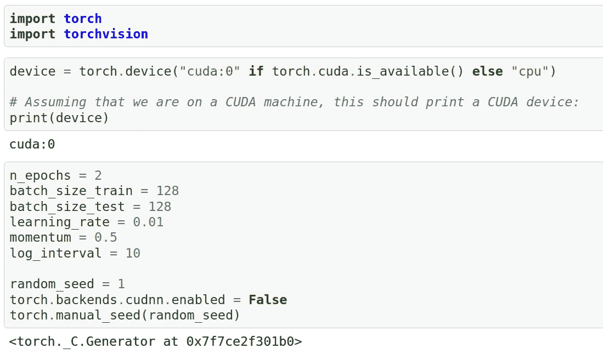

导入 PyTorch 库。它被命名为 PyTorch，但是当我们安装和导入它时，我们只使用 Torch。我们导入的另一个库是 *torchvision* 。它有许多预定义的函数，对于像我们这样的计算机视觉问题非常有用。之后，我们检查 GPU 是否存在。“cuda:0”表示 GPU 存在。接下来，我们定义了一些将在整个代码中使用的参数。

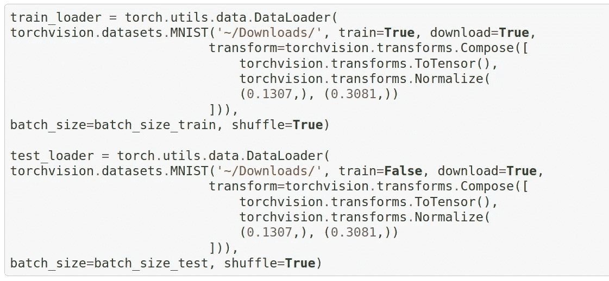

这里我们定义了我们的数据加载器。我们正在使用 *torchvision* 库下载 MNIST 数据集。MNIST 数据集将被下载一次。 *DataLoader* 非常有用，因为它批量返回数据。如果我们的数据集非常大，我们不能一次将所有数据加载到 RAM 中，那么数据加载器将只将所需的批次加载到 RAM 中。我们还定义了“转换”。它包含了我们想要在图像上执行的所有操作，如增强等。

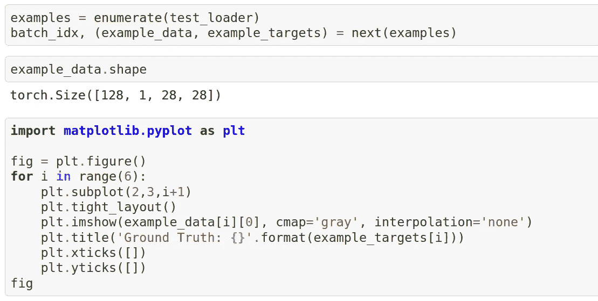

让我们检查一下我们的数据看起来怎么样。这也确认了数据被正确加载。

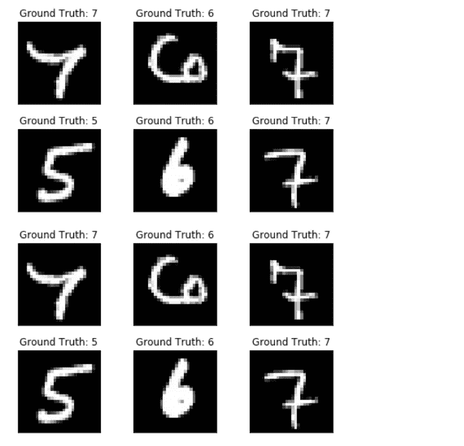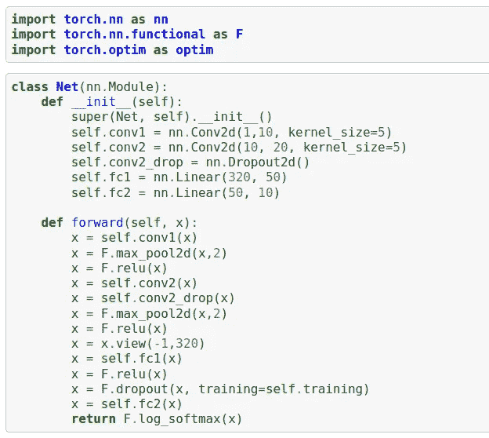

这里我们已经定义了我们的模型。我们实现了一个继承神经网络的类网。模块类。我们需要覆盖 forward()函数。上面的代码是不言自明的。这是一个小网络，但它很适合我们的问题。

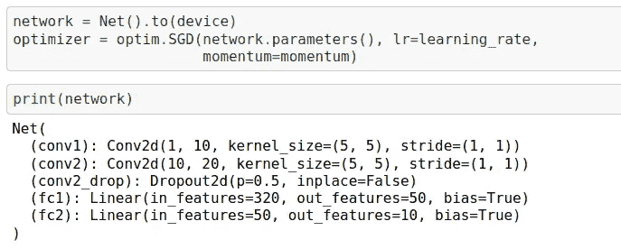

我们创建了一个我们定义的模型类的对象。PyTorch 风格的代码是 pythonic 式的，所以不像 TensorFlow 那样容易理解。我们还设置了优化器。为了看到模型的层和细节，我们简单的打印它。

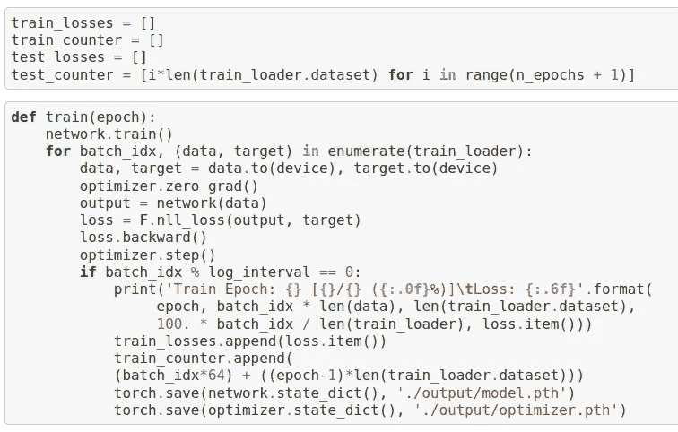

在它上面有一个函数，我们将用它来训练我们的模型。步骤很简单。我们向前通过我们的模型，计算损失，找到梯度和更新权重。在特定的时期之后，我们保存模型以备后用或将来进一步训练。

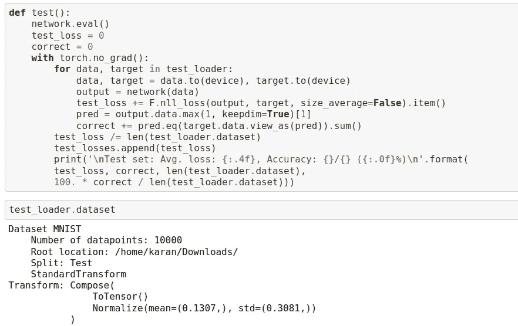

test()函数用于预测输出。在这种情况下，我们只需要向前传球，就能得到我们想要的结果。上面的代码很容易理解。

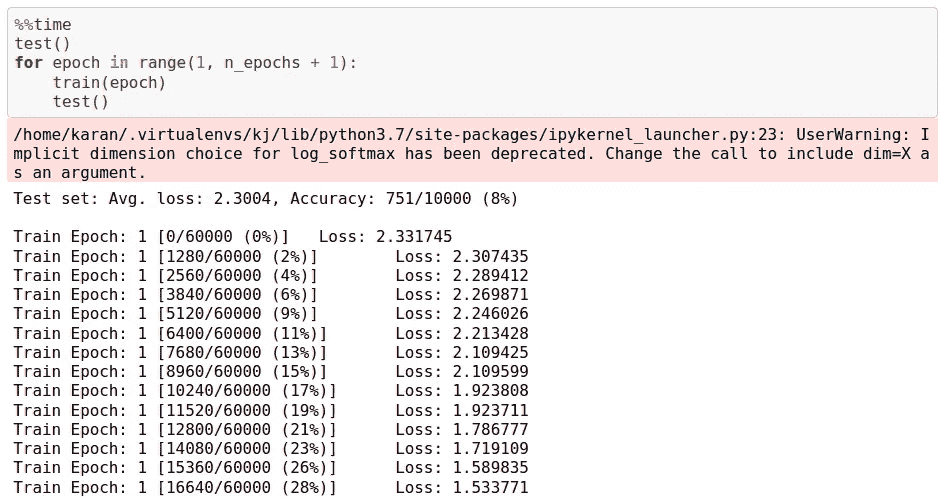

最后，我们只为 2 个时期训练我们的模型。除此之外的训练将会进一步提高成绩。我得到了大约 94%的准确率，但如果你进一步训练，你可以很容易地得到大约 97-98%的准确率。整个代码呈现在 [**这里**](https://github.com/karanjakhar/pytorch-programs/blob/master/digit%20recognition.ipynb) 。你必须亲自尝试，做一些调整和实验来了解更多。

# **一个物体的定位**

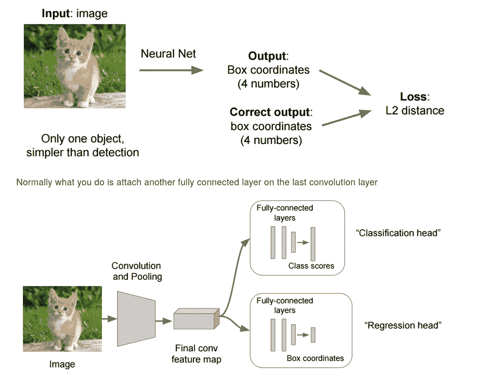

在分类中，我们还必须预测对象是否出现在图像中，但是在定位中，我们必须预测对象出现在图像中的什么位置。现在我们需要输出四个额外的值，它们将是对象周围边界框的坐标。我们还将预测图像中是否包含物体。所以我们总共要输出五个值。我们需要最小化两个损失函数，一个是二元损失，一个是回归损失。我们将在下一篇文章中实现它，并进行更详细的讨论。

# **物体检测**

现在，我们想检测图像中的不同对象，还想知道它们在图像中的位置。这变得有点困难，但我们已经在这个问题上做了一些伟大的工作。就像我们有 YOLO(你只看一次)。YOLO 的概念很简单。将图像分成网格，每个网格输出是否是物体的中心。如果它是对象的中心网格，那么它预测对象的边界框。我们通过使用具有适当步幅的卷积层来实现这一点。我们将在本文的下一部分详细讨论。在这篇文章中，我只想介绍一下 YOLO。在下一部分，我们也将在 PyTorch 中实现它并训练它。下面是 YOLO 的建筑方案。

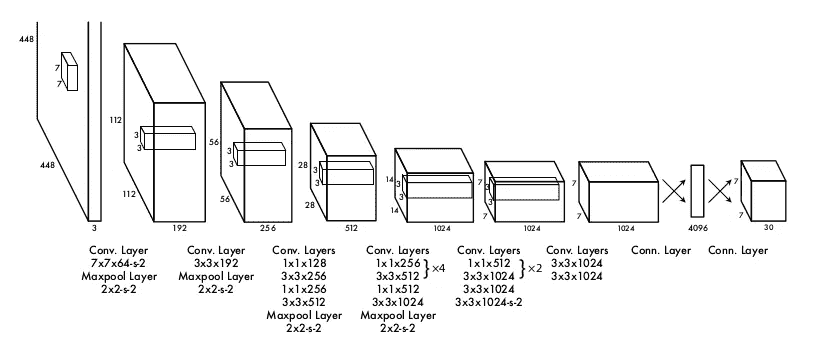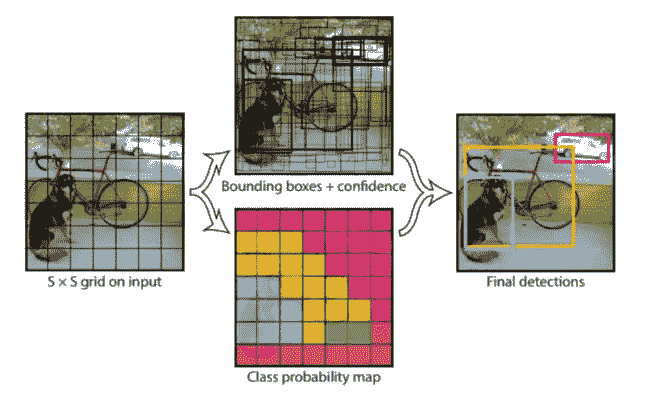

# 结论

我们讨论了图像分类、定位和目标检测。用 PyTorch 库在 python 中实现图像分类。在下一部分，我们将实现定位和物体检测。

# 快乐学习！！！