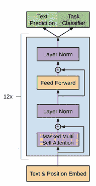
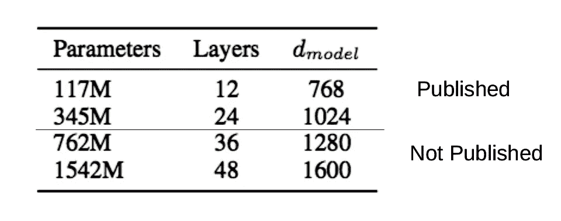
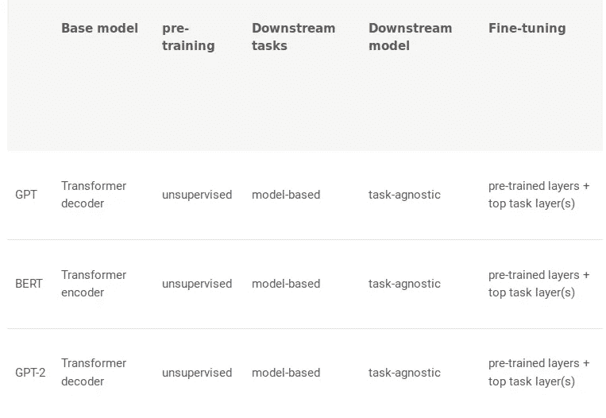

# OpenAI 的 GPT-2 以及如何在 Python 中使用它的指南

> 原文：<https://medium.com/analytics-vidhya/guide-to-openais-gpt-2-and-how-to-use-it-in-python-72d37d7dd64c?source=collection_archive---------1----------------------->

了解如何使用世界上最先进的 NLP 框架构建自己的文本生成器！

> *“世界上最好的经济体与鼓励和积极反馈的文化直接相关。”*

你能猜到是谁说的吗？不是总统或总理。肯定不是像拉古拉姆·拉扬这样的顶尖经济学家。都是出于猜测？

这个报价是机器生成的！没错——一个在 OpenAI 的 GPT-2 框架上训练的[自然语言处理(NLP)](http://courses.analyticsvidhya.com/courses/natural-language-processing-nlp/?utm_source=blog&utm_medium=openai-gpt2-text-generator-python) 模型提出了这个非常真实的引用。现在机器学习的状态完全在另一个层面上，不是吗？

在 NLP 真正的黄金时代，OpenAI 的 GPT-2 重塑了我们处理文本数据的方式。乌尔菲特和谷歌的伯特为自然语言处理爱好者打开了方便之门，而 GPT-2 则打破了这一限制，使自然语言处理任务变得更加容易——主要是文本生成。

我们将在本文中使用 GPT-2 来构建我们自己的文本生成器。

激动吗？那我们就进入文章吧。我们将首先理解 GPT-2 背后的直觉，然后直接进入 Python 来构建我们的文本生成模型。

*如果你是一个狂热的 NLP 追随者，你会喜欢下面关于 NLP 最新发展的指南和教程:*

*   *8 个优秀的预训练模型让你开始自然语言处理(NLP)*
*   *[*变形金刚在 NLP 中是如何工作的？最新最先进车型指南*](https://www.analyticsvidhya.com/blog/2019/06/understanding-transformers-nlp-state-of-the-art-models/?utm_source=blog&utm_medium=openai-gpt2-text-generator-python)*
*   *[*py torch-Transformers 简介:一个不可思议的最新 NLP 库(带 Python 代码)*](https://www.analyticsvidhya.com/blog/2019/07/pytorch-transformers-nlp-python/?utm_source=blog&utm_medium=openai-gpt2-text-generator-python)*
*   *[*Stanford NLP 简介:一个令人难以置信的 53 种语言的一流 NLP 库(带 Python 代码)*](https://www.analyticsvidhya.com/blog/2019/02/stanfordnlp-nlp-library-python/?utm_source=blog&utm_medium=openai-gpt2-text-generator-python)*

# *OpenAI 的 GPT-2 框架有什么新内容？*

*在过去的几年里，自然语言处理(NLP)以惊人的速度发展。机器现在能够理解句子背后的上下文——想想看，这真是一个巨大的成就。*

*由 OpenAI 开发的 GPT-2 是一个预先训练好的语言模型，我们可以用它来完成各种 NLP 任务，例如:*

*   *文本生成*
*   *语言翻译*
*   *建立问答系统，等等。*

*语言建模是现代自然语言处理的重要任务之一。**语言模型是预测文档中下一个单词或字符的概率模型。***

**

*GPT-2 是 GPT 的继承者，是 OpenAI 的原始 NLP 框架。**完整的 GPT-2 模型有 15 亿个参数，几乎是 GPT 参数的 10 倍。正如你可能已经猜到的那样，GPT-2 给出了最先进的结果(当我们进入 Python 时，很快就会看到)。***

*预先训练的模型包含从 Reddit 的出站链接收集的 800 万个网页的数据。让我们花一分钟来了解 GPT-2 是如何工作的。*

# *建筑*

*GPT-2 的架构是基于非常著名的变形金刚概念，这是由谷歌在他们的论文“注意力是你所需要的一切”中提出的。转换器提供了一种基于编码器-解码器的机制来检测输入-输出依赖性。*

*在每一步，当生成下一个输出时，模型都将以前生成的符号作为附加输入。*

**

*GPT-2 除了有更多的参数和变形层之外，只有少量的架构修改:*

*   *该模型使用更大的上下文和词汇规模*
*   *在最后的自我关注块之后，添加了附加的归一化层*
*   *类似于“构建块”类型的残差单元，层归一化被移动到每个子块的输入。它在权重层之前应用了批规范化，这不同于原始类型“瓶颈”*

> **“GPT-2 在各种特定领域的语言建模任务上取得了一流的成绩。我们的模型没有针对这些任务的任何特定数据进行训练，只是作为最终测试对其进行评估；这就是所谓的“零射击”设置。在特定领域数据集(如维基百科、新闻、书籍)上进行评估时，GPT-2 的表现优于在这些数据集上训练的模型。”—开放 AI 团队。**

*具有不同参数的四个模型被训练以适应不同的场景:*

**

*GPT-2 有能力基于小的输入句子生成一整篇文章。这与早期的 NLP 模型形成了鲜明的对比，早期的 NLP 模型只能生成下一个单词，或者找到句子中缺少的单词。本质上，我们在一个全新的联盟中交易。*

*以下是 GPT-2 如何与其他类似的 NLP 模型相抗衡的:*

**

# *如何为新 GPT 协议设置环境*

*我们将使用一个有 3.45 亿个参数的中型模型。可以从官方 [OpenAI GitHub 资源库](https://github.com/openai/gpt-2)下载预训练好的模型。*

*首先，我们需要通过键入下面的语句来克隆存储库(为了更快的计算，我建议使用 Colab 笔记本而不是您的本地机器):*

*请注意，我们需要更改我们的目录。为此，我们将使用**操作系统**的 **chdir()** :*

*接下来，选择我们想要使用的模型。在这种情况下，我们将使用一个具有 3.45 亿个参数的中型模型。*

*这个模型需要有 GPU 支持的 TensorFlow 才能运行得更快。因此，让我们继续在笔记本中安装 TensorFlow:*

*在进入建模部分之前，我们希望满足一些基本要求。在克隆的文件夹中，您会发现一个文件— **requirements.txt** 。它包含以下四个库，这四个库是该模型工作所必需的:*

*仅使用一行代码安装所有这些库:*

*就是这样——我们已经适应了我们的环境。在我们进入文本生成器之前的最后一步——下载 medum 大小的预训练模型！同样，我们只用一行代码就可以做到:*

*根据您的互联网带宽，可能需要一些时间。完成后，我们需要用下面的代码进行编码:*

# *用 Python 实现 GPT-2 来构建我们自己的文本生成器*

*你准备好了吗？因为这是你期待已久的时刻。是时候使用 GPT-2 在 Python 中构建我们自己的高级文本生成器了！我们开始吧。*

*首先，使用 chdir()进入 src 文件夹，就像我们之前做的那样:*

*然后，导入所需的库:*

**注意:* ***型号*** *，* ***样本*** *和* ***编码器*** *是存在于主 GPT-2 文件夹的****src****子文件夹中的 Python 文件:**

*让我们一个一个地来理解我们刚刚看到的参数:*

*   ***型号名称:**表示我们正在使用的型号。在我们的例子中，我们使用的是具有 3.45 亿个参数或权重的 GPT-2 模型*
*   ***种子:**随机数生成器的整数种子，修复种子以重现结果*
*   ***nsamples:** 这表示在我们的输出中生成的样本文本的数量*
*   ***batch_size:** 这只影响速度/内存。这也必须划分 n 个样本*

**注意:要生成一个以上的样本，您需要更改 nsamples 和 batch_size 的值，并且还必须保持它们相等。**

*   ***length:** 表示生成的文本中记号的个数。如果长度为 0，那么记号的数量由模型超参数决定*
*   ***温度:**这控制着玻尔兹曼分布的随机性。较低的温度导致较少的随机完井。随着温度接近零度，模型将变得确定和重复。更高的温度导致更多的随机完井*
*   ***top_k:** 该参数控制多样性。如果 top_k 的值设置为 1，这意味着每一步只考虑 1 个字(令牌)。如果 top_k 设置为 40，这意味着每步考虑 40 个单词。0(默认值)是一个特殊设置，表示没有限制。 *top_k = 40 通常是一个好值**
*   ***models_dir:** 表示包含模型子文件夹的父文件夹的路径(包含< model_name >文件夹)*

*现在，见证最先进的语言模型所产生的结果的时候到了。让我们运行这个函数并生成一些文本(做好震惊的准备):*

*现在将要求您输入一个字符串。这是我的想法:*

> **我去一个休息室庆祝我的生日和**

*这是我的 GPT-2 文本生成器得出的结果:*

> *我打电话给唐娜，告诉她我刚刚收养了她。她认为我的披露是一种捐赠，但我不确定唐娜是否符合标准。唐娜是一个真正甜美、有才华的女人，她把自己的生活当成了一个爱情故事。我知道她感谢我，因为我在照片上看到了她，她理解我的愤怒。这绝对不是礼物。我很感激我让她关心孩子，她在我身上看到了一些东西。我也没有太多的选择，只能让她知道她的新订婚，虽然这并不意味着我不关心，我非常感谢她为这个国家所做的一切。当我看到它的时候，我说:“你为什么没有变得像贝蒂或琳达一样？”“这是我们国家的孩子，我不能轻易做出这个决定。”“但不要告诉我你太心急了。”唐娜哭着拥抱了我。她从不挤奶，否则我会为她感到难过，但有时他们会立刻意识到这对她有多重要。她公开道歉，并在社会面前提出了明显的判断错误，这是令人震惊的，没有批准我的出生证明的请求。唐娜非常情绪化。我忘了她是个童子军。她实际上什么也没做，她基本上是自己的代理主人。2017 年 8 月 11 日中午 12:11 匿名说…*

*难以置信！第一次看到这个结果我就无语了。令人难以置信的细节和令人印象深刻的语法——几乎不可能说它完全是由机器生成的。印象深刻，对吧？*

*继续操作输入字符串，并在下面的评论部分分享你的结果。*

# *关于 GPT 新协议潜在滥用的说明*

*GPT-2 因其可能被恶意使用而成为新闻。你可以想象这个 NLP 框架有多强大。它可以很容易地被用来产生假新闻，或者坦率地说，任何虚假文本，而人类无法意识到这种差异。*

*考虑到这些事情，OpenAI 没有发布完整的模型。相反，他们发布了一个小得多的模型。原始模型是在 40 GB 的互联网数据上训练的，有 15 亿个参数。OpenAI 发布的两个样本模型分别有 1.17 亿和 3.45 亿个参数。*

# *结束注释*

*在本文中，我们使用了具有 3 . 45 亿个参数的中型模型。如果这些较小的模型能够产生如此令人印象深刻的结果，想象一下 15 亿个参数的完整模型会产生什么。既害怕又兴奋。*

*NLP 的下一步是什么？我觉得我们不用等太久就能知道了。*

*与此同时，尝试这个 GPT 新协议框架，并让我知道你的经验如下。除此之外，我还鼓励您仅出于研究和获取知识的目的使用该模型。继续学习！*

**原载于 2019 年 7 月 29 日*[*【https://www.analyticsvidhya.com】*](https://www.analyticsvidhya.com/blog/2019/07/openai-gpt2-text-generator-python/)*。**