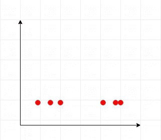

# 主成分分析指南

> 原文：<https://medium.com/analytics-vidhya/guide-to-principal-component-analysis-ab04a8a9c305?source=collection_archive---------1----------------------->

主成分分析是一个时髦词，它总是出现在各种用途的数据分析的许多阶段。但是这个主成分分析背后真正的原因是什么呢？它有什么用途？我们一个一个来看。

首先，让我们了解一下在被称为 PCA 的屏幕后面做了什么。***我在文章*的底部附上了一个 Jupyter 笔记本，里面有例子。**

## 步骤 1:去相关数据点

图一

*   这张图的维数是多少？(图一)

是的，你是正确的，这是一个 2D 图表。

图二

*   你认为这个图表怎么样？

是的，这是一个 1D 图，因为对于每个 x，y 值都是相同的。

让我们来看一个棘手的问题——如果你能猜出这个问题，你就成功地通过了 PCA 的第一步。

(图 3)这个图的维度可能是什么？

如果你说 2D，不，那是错误的。是 1D——什么？但是怎么做呢？

图 6(旋转轴/数据)

是的，如果我们将轴旋转一点，数据点将会像我们之前的例子一样对齐(图 2)。这是通过以下子步骤完成:

*   旋转数据样本以与轴对齐
*   移动数据样本，使其平均值为 0(将轴的中心移动到数据的中心)
*   它会将**主轴**放在数据变化较大的方向，将第二轴放在变化较小的方向。
*   在这个步骤中不会有信息丢失，但是特征之间的相关性将会丢失。

图 5，电脑数据营

## **第二步:降维**

PCA 的主要用途之一是降维。假设您的数据集中有许多要素。但不幸的是，我们只能，

*   使用 matplotlib 可视化多达 3D 数据
*   存储更多关联更少的数据会消耗大量存储空间
*   计算信息量较少的数据是没有用的
*   此外，它们可能会给预测任务带来问题，即使预测变得毫无意义

所以我们需要 ***减少数据的噪声，过滤掉对我们的任务有意义的特征****。这就是 PCA 派上用场的地方。*

1.  *当我们在数据集上应用 PCA 时，首先它将去相关并旋转数据集以找到主方向。*
2.  *然后它将测量特征的线性相关性，值在-1 和 1 之间。如果值为 0，则不相关。*
3.  *PCA 将主成分与旋转轴对齐*

## *步骤 3:内在维度*

*内在维度是近似数据集所需的要素数量。这是降维背后的关键思想。如果我们需要降低维度，我们应该知道哪些特征我们应该选择，哪些应该忽略。*

*通常，Sklearn 中的 PCA 会自动找到本征维数本身。它将考虑具有显著差异的 PCA 特征。我们还可以明确指定要考虑的组件数量。*

*   *丢弃低方差 PCA 特征*
*   *假设高方差特征是信息性的*

*希望您已经对 PCA 屏幕后面发生的事情有了一些基本的了解。请浏览本 [Jupyter 笔记本](https://github.com/Mathanraj-Sharma/Python/blob/master/PCA-Example/pca.ipynb)中的示例，以获得清晰的图片。如果你有什么要讨论的，请随时联系我。*

*[https://github . com/mathan Raj-Sharma/Python/blob/master/PCA-Example/PCA . ipynb](https://github.com/Mathanraj-Sharma/Python/blob/master/PCA-Example/pca.ipynb)*

*有时候 python 笔记本在 GitHub 中加载不正常。在这种情况下，下载笔记本并使用本地 Jupyter 环境打开它。*