# Kaggle NFL 大数据碗指南

> 原文：<https://medium.com/analytics-vidhya/guide-to-the-kaggle-nfl-big-data-bowl-eb20819566c?source=collection_archive---------6----------------------->

## 作者:丹·李希特、皮尔斯·弗里克和阿尔德里克·范德海德

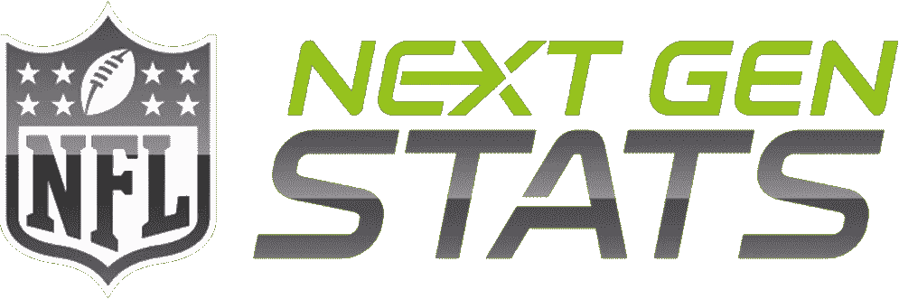

即使它接近第一个完整世纪的尾声，NFL 每年仍有数以亿计的观众。这包括每年聚集约 1 亿观众的超级碗。伴随着对足球的狂热，对足球的分析也变得狂热起来。从 2015 年开始，所有玩家都开始在 pad 中嵌入芯片。有了这些芯片，每场比赛中的每一个动作都会被追踪。这包括球场上每个球员的速度和位置。

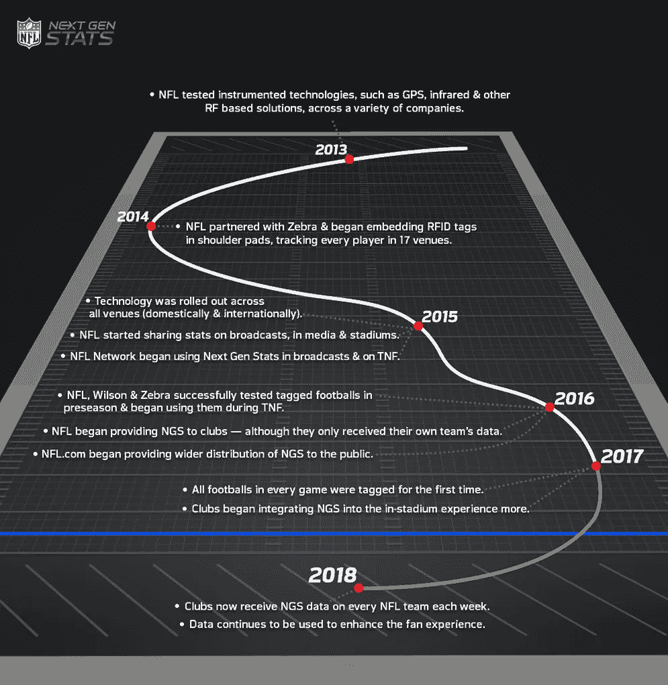

NFL 下一代统计数据的起源可以追溯到 2013 年。

随着越来越多的信息不断被收集和发布，人们渴望更多。从球迷观看，到教练准备，每年都有更多的统计数据公布。这是 Kaggle 竞赛背后的前提— [NFL 大数据碗](https://www.kaggle.com/c/nfl-big-data-bowl-2020)。通过使用 NFL 下一代统计数据和神经网络，我们将尝试预测每场比赛的成功程度。获胜的模型可能会被团队用来尝试并获得优势，并被 NFL 网络用于赛前/赛后表演。

# 概观

> a.我们的方法
> 
> b.足球
> 
> c.关于数据
> 
> d.特征预处理
> 
> e.特征工程
> 
> f.神经网络
> 
> g.经验

# 我们的方法

> “在这场比赛中，你将开发一个模型来预测一个团队在指定的冲刺比赛中会获得多少码。您将获得游戏、比赛和球员级别的数据，包括 NFL 下一代统计数据中提供的球员位置和速度。最棒的是，您可以在客厅里看到您的模型的表现，因为排行榜将随着当前赛季的比赛数据每周更新一次。”

我们很晚才参加比赛。因此，许多进展已经完成，并在 Kaggle 社区中共享。社区慷慨分享的高级笔记本对于缺乏数据科学经验的人来说并不容易理解。我们计划通过解释社区决策背后的动机来揭开大数据碗的复杂性。然后，我们还将展示我们如何借鉴他们的工作，以及我们在哪些方面不同意机构群体的决策。

# 足球

在我们看数据之前，我们应该对这项运动有更多的了解。足球是一个相对简单的概念(尽管有相当多的小规则)。两个队只是轮流试着将球带过场地进入端区，或者试着阻止另一个队这样做。

持球的球队在进攻，而试图阻止他们的球队在防守。进攻可以采取的两种战术是跑位和传球。跑垒就是当进攻方的一名球员拿到球，他试图在防守方拦截他之前向前跑尽可能多的距离。传球是指进攻方试图将球从一名队员传给另一名队员，在被拦截前再次试图获得码数。

这两个队之间的战斗可以被看作是一场棋赛。他们在每场比赛前花费数小时，试图弄清楚另一个队要做什么，以及如何击败他们。出于这个原因，顶级 NFL 教练每年的收入超过 1000 万美元。任何他们能找到的小优势，他们都会利用。

也就是说，在过去的几年里，分析的使用在这项运动中迅速发展。正因为如此，对更多信息和预测的需求空前高涨。这就是为什么这场比赛(预测一场跑位将获得多少码)最终会产生一个非常有用的预测工具，供教练在叫牌时使用。

下面是足球术语解释的链接，如倒地、阵型和球员位置。

[](https://www.ducksters.com/sports/football/football_down.php) [## 足球:什么是向下？

### 孩子们了解足球的内幕。它是什么，它是如何工作的？如何获得第一次击倒？

www.ducksters.com](https://www.ducksters.com/sports/football/football_down.php) [](https://www.ducksters.com/sports/football/offensive_formations.php) [## 足球:进攻阵型

### 孩子们学习足球中使用的进攻阵型，如散弹枪，职业组合，单后卫，I 型阵型，以及…

www.ducksters.com](https://www.ducksters.com/sports/football/offensive_formations.php) [](https://www.ducksters.com/sports/footballplayerpositions.php) [## 足球:进攻和防守的球员位置。

### 足球规则球员位置足球策略足球术语背对背足球运动员倾向于…

www.ducksters.com](https://www.ducksters.com/sports/footballplayerpositions.php) 

# 关于数据

这个 Kaggle 数据集来自 NFL 2017-2018 赛季的 Next Gen 统计数据。每个数据点对应于本赛季比赛中特定跑位的特定球员。因此，对于每场比赛，有 22 个数据点对应于场上的 11 名进攻球员和 11 名防守球员。为了识别数据点代表哪个游戏、游戏和玩家，有列 GameId、PlayId 和 NflId，它们分别是每个游戏、游戏和玩家的唯一数字标识符。另外,“赛季”一栏表示比赛在哪一年举行；所有数据点均来自 2017 年和 2018 年

其他列用于标识因玩家而异的因素，如玩家身高、玩家体重、玩家生日、玩家姓名、团队和位置。其中的最后三个是球员母校大学的字符串表示，无论他们是为主队还是为客场队效力，以及他们通常在球场上扮演的角色。PlayerWeight 是一个整数，而 PlayerHeight 是以英尺和英寸为单位的球员身高的字符串表示。PlayerBirthDate 存储为 Datetime 对象。此外，DisplayName 和 JerseyNumber 以字符串形式引用球员的名和姓，以整数形式引用他们的球衣号码。

诸如 X、Y、S、A、Dis、Dir 和 Orientation 之类的列指的是因玩家而异以及因游戏而异的特征。这些特征的所有值都是在将足球交给跑卫时给出的。x 和 Y 分别对应选手沿场地长轴的位置和选手沿场地短轴的位置，如下图所示。s 代表玩家的速度，单位是码每秒，A 代表玩家的加速度，单位是码每秒平方。Dis 测量的是给定球员在抢球(比赛开始)和将球传给跑锋之间所走过的距离。Dir 以度来度量玩家运动的角度，Orientation 以度来度量他们身体的角度。这最后两个值的不同之处在于，由于横向移动，玩家面对的方向可能不同于他们移动的方向。本段中提到的所有特性都存储为浮点型。

某些列属于特定于游戏的值。其中包括码线、距离和字段位置。这些测量争球线的场地位置，争球线和第一个向下标记之间的距离，以及先前的码线测量是指主场还是客场。场地位置是至关重要的，因为场地界线标志从 0(任一端区)上升到场地中央的 50。因此，除了 50 码线以外，每个码线都有两条。例如，如果新英格兰爱国者队(NE)进攻堪萨斯城酋长队(KC)，并且他们在新英格兰 30 码线上，他们距离他们试图得分的端区 70 码。然而，如果他们在堪萨斯城 30 码线上，他们距离得分只有 30 码。类似地，进攻方向衡量进攻方相对于场地是向左还是向右移动，如下图所示。YardLine 和 Distance 是整数，FieldPosition 和 PlayDirection 是字符串。

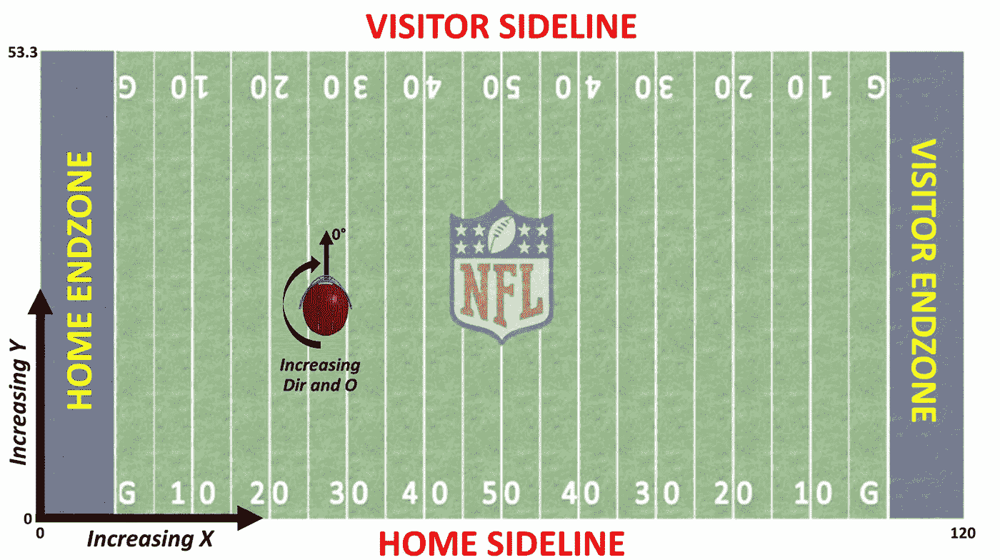

与 Kaggle 数据集特征相关的足球场示意图

接下来，我们有随时间变化的列，如 GameClock、TimeSnap 和 TimeHandoff。这些测量的是这一节剩下的时间——15 分钟或更少——以及比赛开始时间和交接时间。所有这些都存储为 datetime 对象。其他特定于游戏的度量包括:Quarter、Down、PossessionTeam、HomeScoreBeforePlay、VisitorScoreBeforePlay、NflIdRusher、OffenseFormation、OffensePersonnel、DefensePersonnel 和 DefendersInTheBox。其中的前两个代表当前游戏所处的区域和当前游戏的下一区，两者都是从 1 到 4 的整数。下一个特性是进攻球队缩写的字符串表示。接下来的两个以整数的形式测量当前游戏开始时主队和客场队的得分。NflIdRusher 是当前在给定游戏中是 Rusher 的玩家的 NflId。进攻阵型描述了场上进攻球员的阵型，而进攻人员和防守人员描述了两队不同位置的球员数量。所有这三个都存储为字符串。最后，防守队员框是一个整数，表示在争球线附近列队的防守队员的数量，跨越进攻线的宽度。

最后一组变量都描述了其他游戏特定的条件，如天气和体育场条件。对于这些条件，我们有风向(指南针方向)、风速(mph)、湿度(100 分制)、温度(华氏温度)、体育场类型(室内或室外)、位置(比赛城市)、体育场(比赛进行的地方)、星期(赛季的第 1 周到第 17 周)和草皮(人造草皮或天然草皮)。此外，GameWeather 是一个用诸如多云、下雨、晴朗、晴朗等术语描述天气状况的字段。和 VisitorTeamAbbr 代表主队和客场队的缩写。风速、湿度、温度和星期是整数值，而其余的是字符串。

最后，也是最重要的，是整数字段码。这个区域测量每一个数据点所对应的比赛中冲者获得的码数。这就是我们试图用我们的模型预测的。

# 竞赛评估方法

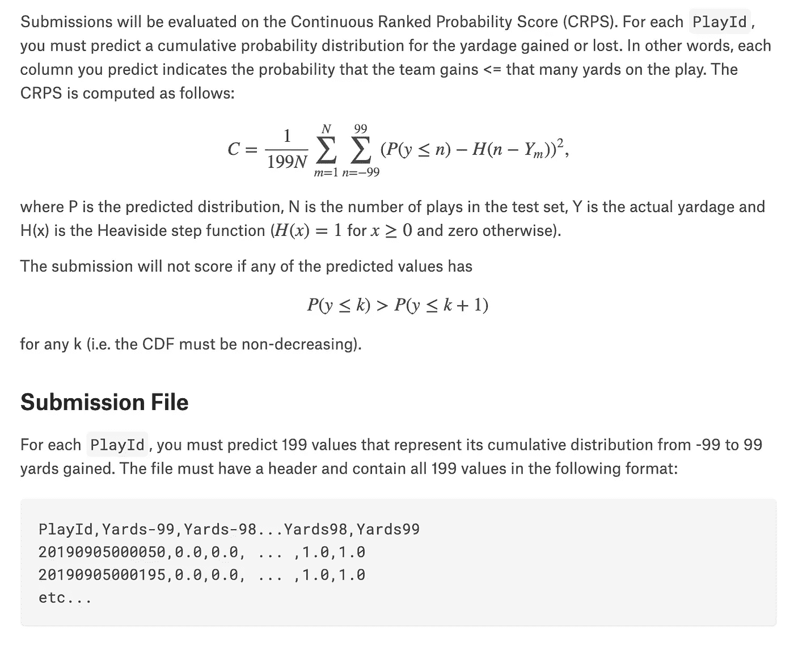

要了解比赛，我们需要了解比赛是如何评分的。大数据碗使用连续排名的概率得分(CRPS)对提交的内容进行评分。CRPS 通常用于测试概率预测模型的准确性。

你可能会问，什么是概率预测模型？概率预测模型为每一个可能的结果分配一个概率。因此，对于大数据碗，我们必须为每一个可能的 rush play 构建一个概率，这意味着 rusher 通过获得 99 码而失去 99 码的概率。不过还有一点需要注意，Bowl 要求我们创建一个**累积概率分布**。累积分布中的值告诉您具有较低值的数据的百分比。因此，对于大数据碗，2 码的值是获得 2 码或更少的概率，而不是仅仅获得 2 码。因此，不要被 Yards99 的值 1 所迷惑。这并不意味着有几乎 100%的机会获得 99 码的冲刺。这意味着有 100%的机会，奔跑者得到 99 或更少的码，这是有道理的，因为这些都是可能的结果。

现在回到 CRPS，它将完全分布与观察值进行比较。在我们的例子中，这是我们在一次匆忙尝试中码数的概率分布，观察到的是实际达到的码数。

CRPS 分数越接近零意味着预测越准确。

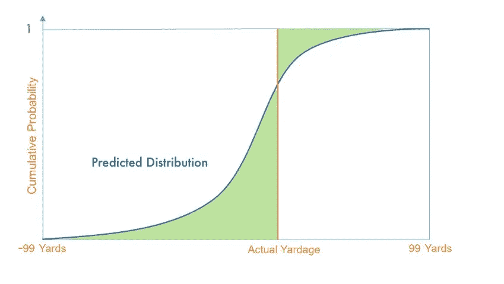

累积密度函数

# 特征预处理

特征预处理是设置数据以创建最佳神经网络的过程。我们的预处理技术来自 Kaggle 用户 bestpredict 和 Bruno Gorresen Mello。

[](https://www.kaggle.com/bestpredict/location-eda-8eb410/notebook) [## 位置 EDA 8eb410

### 下载数千个项目的开放数据集+在一个平台上共享项目。探索热门话题，如政府…

www.kaggle.com](https://www.kaggle.com/bestpredict/location-eda-8eb410/notebook) [](https://www.kaggle.com/bgmello/neural-networks-feature-engineering-for-the-win) [## 神经网络+面向胜利的特征工程

### 下载数千个项目的开放数据集+在一个平台上共享项目。探索热门话题，如政府…

www.kaggle.com](https://www.kaggle.com/bgmello/neural-networks-feature-engineering-for-the-win) 

尽管数据被整齐地组织成 CSV 格式的单个表格，但仍需要进行大量的清理。许多数字特征，如时钟上的时间、抓拍时间(比赛开始时)、交接时间(球从四分卫手中交给跑卫时)、风速和球员身高，都存储为字符串或 datetime 对象。然而，这些特性只有在表示为整数和浮点数时才能为我们所用，所以我们对它们进行了适当的修改。

我们还获得了玩家的生日作为日期对象。这对我们没有用，所以我们从出生日期和移交时间值计算玩家年龄，并删除玩家出生日期，增加玩家年龄。

此外，我们从 GameWeather 特性中沿着 3 到-3 的间隔绘制了以下天气条件:

室内体育场，晴天、晴天、阴天、雨天和下雪天。

许多天气状况条目包含类似“多云”和“聚会”的错别字，而不是“多云”和“部分”这些必须被纠正，这样我们才能有一个完整的编码。包含“部分”一词的任何描述的映射都乘以 0.5，以说明天气条件的温和性质。通过这种映射，我们可以为我们的神经网络获得一个简洁而强大的天气条件编码。

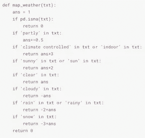

bestpredict 的天气制图功能

类似地，我们把对草皮不必要的宽泛描述简化为两类:人造草皮和天然草皮。不同类型的人造草坪之间没有明显的区别，相同的情感用“天然草”、“天然草”、“草”等来表示。此外，某些团队有不止一个列出的缩写。例如，休斯顿德克萨斯人被缩写为“HOU”和“HST”，而巴尔的摩乌鸦被缩写为“BAL”和“BLT”许多 Kaggle 用户都用类似的字典方法纠正了这一点，比如顶级笔记本作家 CPMP。查找所有这些不同的特征值需要与查找全天候错别字相同的技术—打印出给定列的不同值并进行适当的调整。

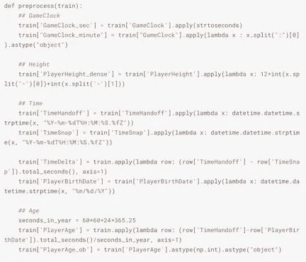

bestpredict 的预处理函数片段

由于显而易见的原因，这些预处理技术被 Kaggle 社区广泛采用。在处理数据之前，有必要修复输入错误和不正确的数据类型。

另一个重要的特征是识别给定比赛中的进攻和防守人员。处于特定进攻和防守位置的球员数量对跑位战术的成功有直接影响。防守可能会雇用更多的防守线员和/或线卫来试图阻止跑动，而进攻可能会派出更多的后卫来试图为奔跑者提供更好的保护以获得更多的码数。我们改编了 Kaggle 用户 bestpredict 的进攻和防守人员的编码作为字典，但建议从他们进攻编码的关键字中删除 DB、DL 和 LB，并从他们防守编码的关键字中删除 OL。这仅仅是因为 OL 严格来说是进攻位置，而 DB、DL 和 LB 是防守位置。因此，他们在对方的人员分布图中没有位置。这样做将我们的平均 CRPS 分数提高了 0.000001，因此结果的提高几乎可以忽略不计，但是值得注意映射缺陷。

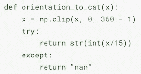

取向分类

orientation 变量描述了球员在球场上 360 度以外的方向。我们决定将方向缩小为 24 组，每组代表 15 度，从 0 开始，使用函数 orientation_to_cat。类别的数量当然可以改变。更少的类别意味着将更大范围的取向的影响组合在一起。这样做，我们可能会失去方向特异性的重要性。另一方面，更多的分组或根本没有分组可能会过于宽泛，并导致我们陷入“维数灾难”——当为这些类别中的代表性数据点提供太多类别时，数据往往会过度拟合。通过我们自己的一些测试，以及从 Kaggle 社区中其他人的错误和成功中学习，我们在 24 岁时安顿下来。

# 特征工程

特征工程是从已提供的特征中创造新特征的过程。同样，我们增加的功能很大程度上借鉴了 Kaggle 社区的高性能笔记本。

这些用户创建了高效而强大的功能来提高他们的神经网络的性能，同时尽可能保持他们的训练数据表简洁。

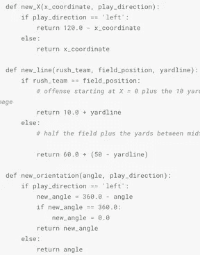

bestpredict 中用于校正方向的一些函数

要设计的最重要的特征是磁场方向的锚定。每个高性能的提交都是这样做的，这是为竞赛创建有效的神经网络的重要部分。主队和客队每季度推动前场转换的方向。然而，这种转换在方向取向或磁场位置中没有考虑。为了说明这一点，我们的函数 new_X、new_line、new_orientation、back_direction、update_yardline 和 update_orientation 锚定左右和方向方位，因此它们总是表示相同的值，而不管游戏的四分之一。

我们创建的许多功能都是为了尽可能简化输入数据，同时保留其原始值。例如，知道快照时间和切换时间远不如知道它们之间的区别重要。可以想象，从四分卫到跑锋的较慢切换可能会给防守方更多的时间在跑锋越过争球线之前追踪他。然而，进攻也偶尔会进行“平局”比赛，当球被抢断时，四分卫后退并假装传球，然后给跑锋一个延迟的传球，以进行一场仓促的比赛来抓住防守。因此，我们计算了一个名为 TimeDelta 的新特性，并删除了 TimeHandoff 和 TimeSnap 特性。

类似地，我们得到了每个球员的 NflId。这是用来确定他们的位置。我们也给了 rushers 的 NflId。根据这些信息，我们创建了一个名为 IsRusher 的新布尔特性，并从表中删除了特性 NflId 和 NflIdRusher。这使我们能够简化我们的表格，同时跟踪必要的信息——是否有问题的球员在技术上是一个位置头衔的 rusher。

此外，我们添加了两个特性，称为 diffscobeforeplay 和 diffScoreBeforePlay _ binary _ ob。前者是 HomeScoreBeforePlay 和 VisitorScoreBeforePlay 之间差异的度量，后者是一个二进制值，代表主队是赢(1)还是输(0)。当结合其他特征考虑时，这些特征再次对尝试跑位的可能性产生强烈影响。例如，如果一个队在比赛快结束时大比分获胜，他们可能会带球跑动，以消除传球时拦截的可能性。由于这种打法的高度可预测性，因此这些打法通常会被停止，对跑锋来说没有什么好处(尽管这对于进攻球队来说不一定有多大关系，因为如果他们在比赛快结束时以大比分获胜，他们很可能会赢)。

此外，我们采用了从混战中后退，向后向下场和向后移动向下场的特征。back_oriented_down_field 和 back_moving_down_field 是布尔特征，分别指示奔跑者当前是否面向和朝向期望的终点区域。特征 back_from_scrimmage 测量争球线和奔跑者当前位置之间的差异。

其他功能包括最小距离、最大距离、平均距离、标准距离、最小距离、最大距离、平均距离和标准距离。这些函数使用 numpy 最小值、最大值、平均值和标准偏差聚合函数。前四个测量任何进攻球员到奔袭者的距离的最小、最大、平均和标准偏差，后四个测量任何防守球员和奔袭者之间的相同距离。

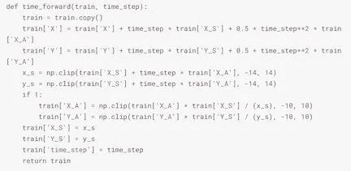

功能，以推进拉什尔的预测运动从 CPMP

另一位表现出色的公共 Kaggle 用户 CPMP 发现，在预测的未来时间步长 0.0、0.3 和 0.6 秒时重新计算某些距离要素非常有用。他们通过使用 rusher 的速度和加速度来收集位置估计值来实现这一点，使用位置作为时间的函数:*x*=*x*0+*v*0*t*+*at*2 其中 *x* 是位置， *x* 0 是初始位置， *v* 0 是初始速度， *t* 是时间，以及【T18 将这种方法与上面提到的距离特征等附加特征相结合会很有意思。CPMP 还为场上的所有 22 名球员创建了一个距离矩阵，作为衡量上述八个距离函数的替代方法。他用这个作为他神经网络的输入。

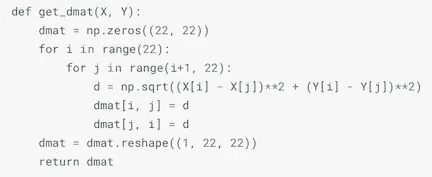

来自 CPMP 的距离矩阵吸气函数

[](https://www.kaggle.com/cpmpml/graph-transfomer) [## 图形转换器

### 下载数千个项目的开放数据集+在一个平台上共享项目。探索热门话题，如政府…

www.kaggle.com](https://www.kaggle.com/cpmpml/graph-transfomer) 

最后，dir_sin 和 dir_cos 跟踪 rusher 的方向正弦和余弦。这些测量的是冲击机轨迹和坐标轴之间的角度分量。这些特性很好地补充了方向和方位特性。

# 神经网络体系结构

下面我们将分解我们对改进竞赛中表现最好的公共笔记本的神经网络之一的想法。

[](https://www.kaggle.com/gdpsgdps/location-eda-8eb410) [## 位置 EDA 8eb410

### 下载数千个项目的开放数据集+在一个平台上共享项目。探索热门话题，如政府…

www.kaggle.com](https://www.kaggle.com/gdpsgdps/location-eda-8eb410) 

## 隐藏层-具有 Relu 激活功能的批量标准化、缺失和密集层

```
x = Dense(1024,
          input_dim=X.shape[1], 
          activation='relu',     kernel_regularizer=regularizers.l2(0.01),     activity_regularizer=regularizers.l1(0.01))(inp)
    x = Dropout(0.5)(x)
    x = BatchNormalization()(x)
    x = Dense(512, activation='relu')(x)
    x = Dropout(0.5)(x)
    x = BatchNormalization()(x)
    x = Dense(256, activation='relu')(x)
    x = Dropout(0.5)(x)
    x = BatchNormalization()(x)
```

用外行人的话来说，激活函数决定基于加权和计算的值是否足以让“神经元”放电。根据您试图预测的内容，可以使用各种函数。您可以使用阶跃函数进行二元分类。例如，高于某个阈值为 1，低于阈值为 0。sigmoid 函数也可以很好地用作分类器。但是，我们不是在分类。我们预测累积分布从-99 到 99 码增加。

所以对于隐藏层，我们赞同笔记本选择使用 ReLUs 作为激活功能。ReLU 在数学上定义为 *y = max(0，x)。*所有负值为零，正值为线性。ReLUs 训练和运行起来很便宜，因为数学并不复杂。此外，ReLU 很少被激活，因为所有的负输入都是零。

批次归一化层通过应用使平均激活接近 0 且激活标准偏差接近 1 的变换来归一化每个批次的前一层的激活。

训练时，在每次更新期间，dropout 层会随机将一部分输入单位设置为零。它通常用于防止过度拟合。压差层值通常在 0.2-0.8 之间。

为了改善这一点，我们试图增加更多的层和增加维度。

## 输出图层-具有 Softmax 激活功能的密集图层

```
out = Dense(199, activation='softmax')(x) 
#199 because we need values for -99yards to 99yards
model = Model(inp,out)
```

正如我们前面讨论的，目标是提交一个累积概率分布。因此，Softmax 是这种竞争的最佳输出层激活函数，因为 Softmax 函数产生的输出值范围在 0 和 1 之间，概率之和等于 1。sigmoid 激活函数不会工作得很好，因为 Sigmoid 用于二元分类，并且我们正在处理多类问题。

## 【计算机】优化程序

```
adam = optimizers.Adam(learning_rate=0.001,
                        beta_1=0.9, 
                        beta_2=0.999, 
                        amsgrad=False)
```

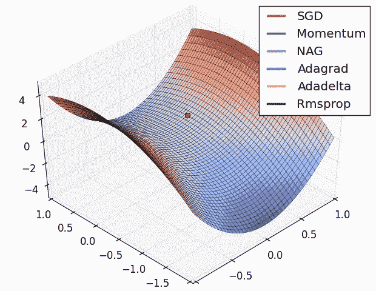

图片来自 Anish Singh Walia

优化算法帮助网络更新和计算使损失最小化的最佳可学习参数(权重和偏差)。最常见的优化算法是梯度下降。然而，梯度下降的许多新变种已经出现。正如你在上面的 GIF 中看到的，随机梯度下降和其他变体在鞍点处停滞不前，这意味着它不会找到更好的可学习参数来最小化损失函数。与此同时，自适应算法迅速继续下降。Adam 是一种自适应算法，就像 GIF 中的算法一样。Adam 代表自适应矩估计。Adam 是竞赛的最佳优化器，因为它收敛速度非常快，学习速度高效。Adam 是公认的最佳优化器，因为它优于其他自适应技术。Adam 没有学习率消失或参数更新中的高方差导致损失函数性能差的问题。

## 损失函数

```
model.compile(optimizer=adam, 
              loss='categorical_crossentropy', 
              metrics=[])
```

由于单标签分类，分类交叉熵最适合这种竞争。这时每个数据点只能属于一个结果。一个跑步者不可能一次跑多码，他永远只能跑一码。真实的类被表示为一个独热编码向量，模型的输出越接近该向量，损失就越低。

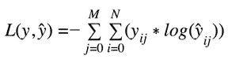

其中ŷ是预测值。

## 培养

```
es = EarlyStopping(monitor='CRPS_score_val', 
                       mode='min',
                       restore_best_weights=True, 
                       verbose=1, 
                       patience=10)mc = ModelCheckpoint('best_model.h5',
                      monitor='CRPS_score_val',
                      mode='min',
                      save_best_only=True, 
                      verbose=1, 
                      save_weights_only=True)

bsz = 1024
steps = x_tr.shape[0]/bszmodel.fit(x_tr, 
          y_tr,
          callbacks=[CRPSCallback(validation = (x_val,y_val)),es,mc], 
          epochs=100, 
          batch_size=bsz,
          verbose=1)
```

提前停止用于减少培训时间。该函数将在 10 个时期后停止训练，验证分数没有提高。

*   批次大小控制在模型的内部参数更新之前要处理的训练样本的数量。
*   时期是通过训练数据集的完整次数。

时期数除以批量大小就是模型的更新次数。为了找到最佳的更新次数，这些值是值得更改的。

## K-fold 交叉验证+集成学习

```
from sklearn.model_selection import train_test_split, KFold
import timelosses = []
models = []
crps_csv = []s_time = time.time()for k in range(2): #make bigger than 2 to make larger ensemble
    kfold = KFold(5, random_state = 42 + k, shuffle = True)
    for k_fold, (tr_inds, val_inds) in enumerate(kfold.split(yards)):
        print("-----------")
        print("-----------")
        tr_x,tr_y = X[tr_inds],y[tr_inds]
        val_x,val_y = X[val_inds],y[val_inds]
        model,crps = get_model(tr_x,tr_y,val_x,val_y)
        models.append(model)
        print("the %d fold crps is %f"%((k_fold+1),crps))
        crps_csv.append(crps)def predict(x_te): 
    model_num = len(models)
    for k,m in enumerate(models):
        if k==0:
            y_pred = m.predict(x_te,batch_size=1024) 
        else:
            y_pred+=m.predict(x_te,batch_size=1024)

    y_pred = y_pred / model_num

    return y_pred
```

k 折叠交叉验证将我们的数据分成 k 个不同的子集(或折叠)。k-1 个子集用于训练我们的数据，最后一个子集(或最后一个折叠)用作测试数据。然后对每个褶皱取每个模型的平均值，以最终确定我们的模型。之后，我们用测试集来测试它。改变折叠数可以优化模型的过度拟合或欠拟合。

由于训练时的差异，神经网络可能具有很高的方差。在集成学习中，使用多个模型来减少方差。这些模型都有不同的初始权重。实际预测是不同模型的所有预测的平均值。理论上，这可能会导致更多的过度拟合，但正如我们前面提到的，这可以通过 k 倍交叉验证来避免。增加集合中网络的数量可能会使模型更加精确。

## **尝试改进神经网络**

基于我们对性能最佳的神经网络架构的分析，我们决定尝试添加另一个隐藏层，并增加密集层的维度。我们选择提高优化器的学习率，尝试看看这是否能帮助 Adam 不陷入局部最小值。我们选择减少批量大小来增加模型的更新次数。最后，我们选择增加集合的大小，使得输出将是更大量模型的平均预测概率。

遗憾的是，我们所做的更改只是增加了笔记本的 CRPS。该模型花费了非常长的时间来训练和测试。

如果我们有更多的时间，而不是一次改变所有这些值，并希望 CRPS 分数会增加。更好的做法是一次只改变一个方面，并记录 CRPS 分数的变化。例如，测试最佳层数，如果我们有时间，我们会得到模型的 CRPS，只有一个额外的层，没有增加其他变化。然后试着用比原来少的一个来运行它。根据 CRPS 分数的变化，你会知道是增加还是减少层数。然后，对神经网络架构的每个其他方面重复该过程。

# 经验

这是我们第一次做 Kaggle 比赛。我们知道这些比赛有多艰难。由于我们加入得晚，情况尤其如此。与一些非常聪明的人竞争，无疑表明了我们还有多少东西要学。话虽如此，我们也了解到社区是多么的有帮助。这包括发布带有大量注释的代码，或者回答其他用户的问题。对于不太有经验的程序员来说，人们提供和谈论的代码仍然可能非常吓人。这是我们制作这个指南的部分动机，并充分了解代码中发生了什么。现在，对竞赛感兴趣但对神经网络知之甚少的人可以了解顶级编码员做了什么。总的来说，金钱的竞争是很难竞争的，但是你仍然可以在整个过程中学到很多。

我们的投稿:[https://github . com/daniellicht 13/anndl _ final/blob/master/NFL _ big _ data _ bowl . ipynb](https://github.com/daniellicht13/anndl_final/blob/master/nfl_big_data_bowl.ipynb)