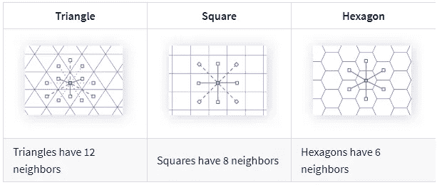
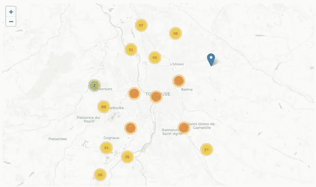

# H3:由优步技术公司开发的六边形层次地理空间索引系统

> 原文：<https://medium.com/analytics-vidhya/h3-a-hexagonal-hierarchical-geospatial-indexing-system-developed-by-uber-technologies-eee3c5583875?source=collection_archive---------10----------------------->

# 什么是 h3 地理空间索引系统？

**H3** 地理空间索引系统是一个多精度的六边形球体切片，使用分级线性索引进行索引。 **H3 核心库**提供经纬度坐标与 **H3** 地理空间索引之间的转换功能。具体来说，主要的库入口点函数(在 h3api.h 中定义)提供了以下功能:

给定一个纬度/经度点，在特定分辨率下找到包含 **H3** 单元格的索引。

给定一个 **H3** 索引，找到纬度/经度单元中心。

给定一个 **H3** 索引，确定经纬度坐标中的单元格边界等等。

***H3 有哪些用例？***

它有助于在经度和纬度的帮助下分析数据，或者基本上，我们可以坐标点，如城市中汽车的位置，可以通过分桶位置和各种选项将区域划分为桶或簇来完成，如使用表面网格划分区域或基于人类知识绘制区域。

**一些基于人类知识的绘图区域的绘制:**

对于不同的数据点，每次都很难计算数据的质心。

分区的边缘并不确切。

如果我们对系统的理解发生变化，手动定义的分区可能需要更新。

手动定义大量分区可能非常昂贵和耗时。

**使用 H3 的优势**

H3 为具有平滑梯度的数据点提供了规则的网格，并且能够测量数据点的单元之间的差异。网格系统有助于定义正确的单元形状。只有三种多边形是规则平铺的:三角形、正方形和六边形。其中，三角形和正方形有不同距离的邻居。三角形有三种不同的距离，正方形有两种不同的距离。对于六边形，所有的邻居都是等距的。这个特性允许更简单的运动分析。



**H3 提供的不同网格系统**

*“H3 地理空间索引系统是一个多精度的六边形球体切片，使用分级线性索引进行索引。”*

**一些常用的 H3 Python API**

***。h3.edge_length
。H3 . hex _ area
H3 . geo _ to _ H3
H3 . H3 _ to _ geo _ boundary
H3 . H3 _ get _ resolution
H3 . k _ ring _ distance
H3 . H3 _ distance
H3 . poly fill
H3 . compact
H3 . hex _ ring***

# 可视化分桶位置的 H3 空间索引

**步骤 1** :准备位置
的 geojson 数据**步骤 2** :将 GeoJSON 文件读入 dataframe，删除几何为空的行。
**第三步**:从几何坐标中提取纬度和经度作为单独的列。
**步骤 4** :将数据可视化在原始数据的地图上。

## 准备数据

## 密码

```
def read_geojson_points(filepath):
     with open(filepath) as f:
        stops_geodata = json.load(f)df = pd.DataFrame(json_normalize(stops_geodata[‘features’]))
 n_rows_orig = df.shape[0]
     df.dropna(subset=[“geometry.coordinates”], inplace = True, axis = 0)
 n_rows_clean = df.shape[0]
     print(“Cleaning null geometries, eliminated “, n_rows_orig — n_rows_clean,
“ rows out of the original “,n_rows_orig, “ rows”)
     df[‘longitude’] = df[“geometry.coordinates”].apply(lambda x: x[0])
     df[‘latitude’] = df[“geometry.coordinates”].apply(lambda x: x[1])
     return df
```

## 地图可视化

在地图上快速可视化原始数据
**代码**

```
m = Map(location= [43.600378, 1.445478], zoom_start=11, tiles=”cartodbpositron”,attr= ‘© <a href=”http://www.openstreetmap.org/copyright">OpenStreetMap</a> contributors © <a href=”http://cartodb.com/attributions#basemaps">CartoDB</a>’)
mc = MarkerCluster()
for i,row in df_raw.iterrows():
     mk = Marker(location=[row[“latitude”],row[“longitude”]])
     mk.add_to(mc)
mc.add_to(m)
m.save(‘source/2_markers_busstops.html’)
m
```

## 地图视图



## 欲了解更多信息，请访问

[https://github . com/Uber/H3/blob/master/docs/overview/main page . MD](https://github.com/uber/h3/blob/master/docs/overview/mainpage.md)