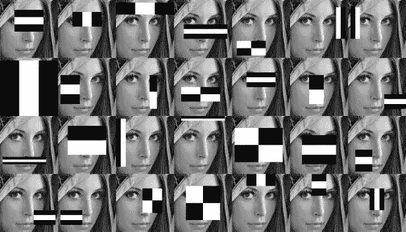
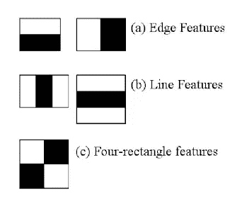
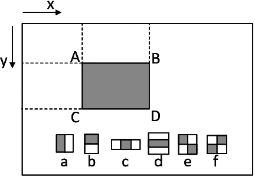
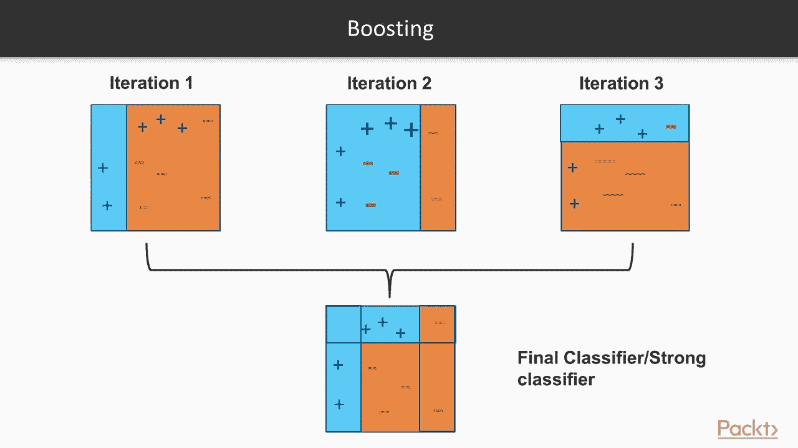
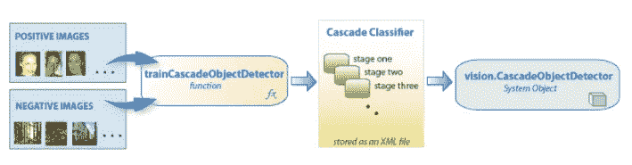
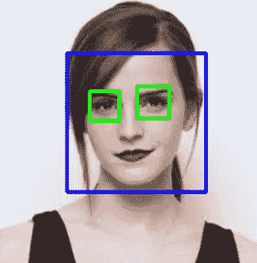
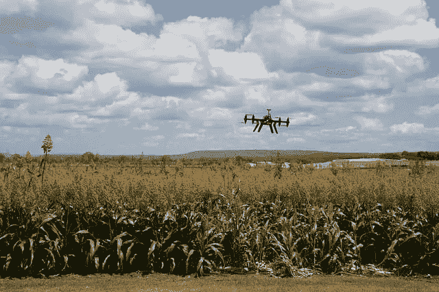

# 哈尔喀特解释道

> 原文：<https://medium.com/analytics-vidhya/haar-cascades-explained-38210e57970d?source=collection_archive---------0----------------------->



训练哈尔分类器的一般表示。([图像来源](https://nl.pinterest.com/pin/39969515412911329/)

你随处可见面部识别**，从你家前廊的安全摄像头到你 iPhone X 上的传感器。但是，考虑到输入的大量特征和人类之间惊人的相似性，面部识别究竟是如何对面部进行分类的呢？**

****

**iPhone X 上的面部识别。([图片来源](https://support.apple.com/en-us/HT208109))**

**输入第一个实时人脸检测器中使用的 **Haar 分类器、**分类器。Haar 分类器或 Haar 级联分类器是一种机器学习对象检测程序，可以识别图像和视频中的对象。**

**关于 Haar 分类器的详细描述可以在 Paul Viola 和 Michael Jones 的论文“使用简单特征的增强级联进行快速对象检测”中看到，链接在[这里](https://www.cs.cmu.edu/~efros/courses/LBMV07/Papers/viola-cvpr-01.pdf)。请注意，这篇文章涉及了一些数学知识，并假设了机器学习术语的知识。如果你想要一个概括的，高层次的概述，请确保继续阅读！**

# **制作哈尔级联分类器**

***注意:这个讨论将假设关于机器学习的增强算法和弱对强学习者的基本知识。点击* [*此处*](https://mccormickml.com/2013/12/13/adaboost-tutorial/#:~:text=AdaBoost%20is%20a%20popular%20boosting,female%20based%20on%20their%20height.) *快速获取 Adaboost 教程。***

**该算法可以分为四个阶段来解释:**

*   **计算哈尔特征**
*   **创建整体图像**
*   **使用 Adaboost**
*   **实现级联分类器**

**重要的是要记住，这种算法需要大量人脸的**正图像**和非人脸的**负图像**来训练分类器，类似于其他机器学习模型。**

## **计算哈尔特征**

**第一步是收集 Haar 特征。 **Haar 特征**本质上是在检测窗口中特定位置的相邻矩形区域上执行的计算。该计算包括对每个区域中的像素强度求和，并计算和之间的差。下面是一些 Haar 特性的例子。**

****

**哈尔特征的类型。([图像来源](http://www.willberger.org/cascade-haar-explained/))**

**对于大图像，这些特征可能难以确定。这就是**积分图像**发挥作用的地方，因为使用积分图像减少了操作次数。**

## **创建整体图像**

**不用深入研究背后的数学知识(如果你对此感兴趣，可以看看这篇论文)，积分图像本质上加速了这些 Haar 特征的计算。它不是对每个像素进行计算，而是创建子矩形，并为每个子矩形创建数组引用。这些然后被用于计算哈尔特征。**

****

**整体图像如何工作的插图。([图片来源](https://www.researchgate.net/figure/Illustration-of-the-integral-image-and-Haar-like-rectangle-features-a-f_fig2_235616690)**

**重要的是要注意，当进行对象检测时，几乎所有的 Haar 特征都与**无关**，因为唯一重要的特征是对象的特征。然而，我们如何从成千上万的 Haar 特征中确定代表一个对象的最佳特征呢？这就是 Adaboost 发挥作用的地方。**

## **Adaboost 训练**

**Adaboost 本质上选择最佳特征并训练分类器使用它们。它使用**【弱分类器】**的组合来创建一个**【强分类器】**，算法可以使用它来检测对象。**

**弱学习器是通过在输入图像上移动一个窗口，并为图像的每个子部分计算 Haar 特征来创建的。将该差异与将非对象与对象分开的学习阈值进行比较。因为这些是“弱分类器”，所以需要大量的 Haar 特征以获得准确性来形成强分类器。**

****

**升压算法的表示。([图像源](https://www.youtube.com/watch?v=BoGNyWW9-mE))**

**最后一步使用**级联分类器**将这些弱学习器组合成一个强学习器。**

## **实现级联分类器**

****

**级联分类器流程图。([图像来源](http://www.willberger.org/cascade-haar-explained/))**

**级联分类器由一系列阶段组成，其中每个阶段都是弱学习器的集合。使用 boosting 来训练弱学习者，这允许从所有弱学习者的平均预测中得到高度准确的分类器。**

**基于该预测，分类器决定指示找到了对象(肯定的)或者继续移动到下一个区域(否定的)。载物台被设计为尽可能快地剔除阴性样品，因为大多数窗口不包含任何感兴趣的东西。**

**最大化**低假阴性率**是很重要的，因为将一个物体归类为非物体会严重损害你的物体检测算法。下面的视频显示了哈尔瀑布的行动。红色方框表示来自弱学习者的“积极因素”。**

**哈尔级联是目前用于物体检测的许多算法之一。关于 Haar cascades 需要注意的一点是，**降低假阴性率**非常重要，所以在训练你的模型时，一定要相应地调整超参数。**

# **哈尔级联代码**

**使用 OpenCV 的 CascadeClassifier 函数，在代码中实现这一点非常容易。**

```
import numpy as np
import cv2f_cascade = cv2.CascadeClassifier("face.xml")
e_cascade = cv2.CascadeClassifier("eye.xml")image = cv2.imread("actor.jpg")
gray = cv2.cvtColor(img, cv2.COLOR_BGR2GRAY)faces = f_cascade.detectMultiScale(gray, 1.3, 5)
for (x,y,w,h) in faces:
    img = cv2.rectangle(img,(x,y),(x+w,y+h),(255,0,0),2)
    roi_gray = gray[y:y+h, x:x+w]
    roi_color = img[y:y+h, x:x+w]
    eyes = e_cascade.detectMultiScale(roi_gray)
    for (ex,ey,ew,eh) in eyes:
        cv2.rectangle(roi_color,(ex,ey),(ex+ew,ey+eh),(0,255,0),2)cv2.imshow('img',image)
cv2.waitKey(0)
cv2.destroyAllWindows()
```

****

**以上代码的输出。**

**正如你在这里看到的，这个模型在检测眼睛和人脸方面的准确性令人惊讶。更令人难以置信的是，给定足够的训练图像，哈尔分类器可以用来识别任何物体**。****

****使用 OpenCV 的 detectMultiScale 函数的另一种方法可以在 GeeksForGeeks 的文章[这里](https://www.geeksforgeeks.org/python-haar-cascades-for-object-detection/)中看到。对于实时流式人脸检测，请查看这篇文章[中的 Java、C++和 Python 代码。](https://docs.opencv.org/3.4/db/d28/tutorial_cascade_classifier.html)****

# ****哈尔级联的应用****

********

****自动驾驶汽车中使用的计算机视觉的表示。([图像源](https://www.smartcitiesworld.net/opinions/opinions/driving-autonomous-vehicles-forward-with-intelligent-infrastructure))****

****这项技术在各种不同的领域都有巨大的应用。下面列出了一些最重要的应用:****

*   ******面部识别**:类似于 iPhone X 如何使用面部识别，其他电子设备和安全协议可以使用 Haar cascades 来确定用户的有效性，以进行安全登录。****
*   ******机器人学:**机器人机器可以“看到”它们的周围环境，通过物体识别来执行任务。例如，这可以用于自动化制造任务。****
*   ******自动驾驶汽车:**自动驾驶汽车需要了解周围的环境，哈尔级联可以帮助识别物体，如行人、交通灯和人行道，以做出更明智的决策，提高安全性。****
*   ******图像搜索和对象识别:**扩展面部识别，可以通过使用计算机视觉算法来搜索任何种类的对象，例如 Haar cascades。****
*   ******农业:**哈尔分类器可以用来判断有害的虫子是否飞到植物上，减少害虫造成的食物短缺。****
*   ******工业用途:**哈尔分类器可以用来让机器拾取和识别某些物体，将许多以前只能由人类完成的任务自动化。****

********

****计算机视觉在农业中的应用。([图片来源](https://www.dqindia.com/aiml-technologies-increasing-agricultural-productivity-profitability/)****

****如上所示，Haar cascades 和相关的计算机视觉技术无疑将在经济和 ML 世界中产生巨大的影响。由于哈尔叶栅的多功能性，它们几乎可以应用于任何地方的**。******

# ******TL；速度三角形定位法(dead reckoning)******

*   ******哈尔级联是机器学习对象检测算法。******
*   ******他们使用 Haar 特征来确定某个点成为物体一部分的可能性。******
*   ******推进算法用于从“弱”学习者的组合中产生强预测。******
*   ******级联分类器用于对输入图像的不同子部分运行提升算法。******
*   ******确保针对哈尔级联的假阴性进行优化。******
*   ******使用 OpenCV 自己实现一个 Haar 级联模型。******

# ******进一步阅读******

*   ******文章:[深度学习哈尔级联讲解](http://www.willberger.org/cascade-haar-explained/)******
*   ******论文:[使用简单特征的增强级联进行快速对象检测](https://www.cs.cmu.edu/~efros/courses/LBMV07/Papers/viola-cvpr-01.pdf)******
*   ******文章:[类哈尔特征](https://en.wikipedia.org/wiki/Haar-like_feature)******
*   ******文章:[用 OpenCV 哈尔级联进行人脸识别](/dataseries/face-recognition-with-opencv-haar-cascade-a289b6ff042a)******
*   ******文章:[哈尔分类器和 CNN 的区别](https://towardsdatascience.com/whats-the-difference-between-haar-feature-classifiers-and-convolutional-neural-networks-ce6828343aeb)******
*   ******文章:[计算机视觉与 Haar 级联分类器](https://towardsdatascience.com/computer-vision-detecting-objects-using-haar-cascade-classifier-4585472829a9)******

*******如果你想谈论更多关于哈尔喀斯或其他任何事情，安排一次会议:* [*日历上*](https://calendly.com/adityamittal307) *！关于我目前正在做的项目的信息，可以考虑订阅我的* [*简讯*](https://preview.mailerlite.com/z5v0a0) *！下面是* [*订阅*](https://forms.gle/pLWuNuBuJQokMk3N8) *的链接。如果你有兴趣连线，关注我关于*[*Linkedin*](https://www.linkedin.com/in/adityamittal-/)*，*[*Github*](https://github.com/adityamittal13)*，以及*[*Medium*](/@adityamittal307)*。*******