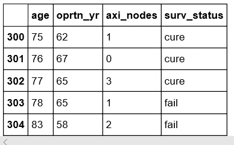
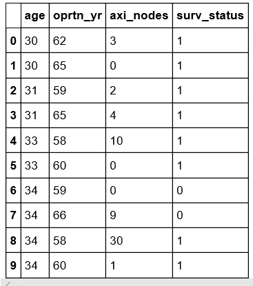

# 哈伯曼的生存数据集——在 Heroku 上部署机器学习模型

> 原文：<https://medium.com/analytics-vidhya/habermans-survival-data-set-deploy-machine-learning-model-on-heroku-2276cbd02a14?source=collection_archive---------22----------------------->


今天我们将学习如何创建一个机器学习模型，如何使用 flask 框架创建一个简单的 web 应用程序，以及如何将其部署在 Heroku 云平台上。

## **数据描述:**

该数据集包含 1958 年至 1970 年间在芝加哥大学比林斯医院进行的一项关于乳腺癌手术患者存活率的研究。

## 属性信息:

我们的数据包含 4 个变量:

1.  **年龄:**患者的年龄(数值)
2.  **运行年份**:(数字)
3.  **腋淋巴结数目:**(数值)
4.  **生存状态**:分类标签，1 表示患者存活 5 年以上，2 表示患者在 5 年内死亡。

**数据集链接(kaggle)** :

[](https://www.kaggle.com/gilsousa/habermans-survival-data-set#haberman.csv) [## 哈伯曼生存数据集

### 接受乳腺癌手术患者的存活率

www.kaggle.com](https://www.kaggle.com/gilsousa/habermans-survival-data-set#haberman.csv) 

因此，我们试图根据患者的年龄、治疗年份和阳性淋巴结数量来预测患者是否能存活 5 年。

1.  **加载数据集:**

```
*#import all necessary  modules.* **import** **numpy** **as** **np** 
**import** **pandas** **as** **pd** 
**import** **matplotlib.pyplot** **as** **plt** 
**import** **seaborn** **as** **sns***#load haberman.csv into a pandas Data Frame.*  
**df =  pd.read_csv('haberman.csv')***#replacing the 1 and 2 values with strings cure and fail by using loc in-build function.* **df.loc[df.surv_status == 1 , 'surv_status'] = 'cure' df.loc[df.surv_status == 2 , 'surv_status' ] = 'fail'****df.tail()**
```



数据帧

# **单因素分析:**

## 概率密度函数:

1.  PDF 是一种在一维空间中可视化数据点的技术。概率密度图简单地表示概率密度函数(Y 轴)与变量数据点(X 轴)的**密度图。**
2.  基于类别标签的特征单变量分布。

```
*#perform pdf plot on 'age' feature.* **sns.set_style('whitegrid') 
sns.FacetGrid(df, hue='surv_status', size=6)\    
      .map(sns.distplot, 'age')\    
      .add_legend()
plt.title('1-D (distribution plot) of age feature', size=16) plt.xlabel('age', size=14) 
plt.ylabel('density',size=14) plt.show()**
```


*pdf 格式的“年龄”专题图*

**CDF(Commulative Distribution Function):**[](https://render.githubusercontent.com/view/ipynb?commit=0e82a2a2ce38e13961a36154bb6fd9189fec0ed3&enc_url=68747470733a2f2f7261772e67697468756275736572636f6e74656e742e636f6d2f4e61676573687065726d616e642f4465706c6f795f68616265726d616e646174615f6d6f64656c5f6865726f6b752f306538326132613263653338653133393631613336313534626236666439313839666563306564332f48616265726d616e253230446174617365742e6970796e62&nwo=Nageshpermand%2FDeploy_habermandata_model_heroku&path=Haberman+Dataset.ipynb&repository_id=229793764&repository_type=Repository#2.-CDF-(Commulative-Distrubution-Function):)

```
**cure_df = df.loc[df.surv_status == 'cure'] fail_df = df.loc[df.surv_status == 'fail']****counts, bin_edges = np.histogram(cure_df['axi_nodes'], bins=10,density= True)** **print('counts:',counts)****pdf = counts/sum(counts)****cdf = np.cumsum(pdf)
plt.plot(bin_edges[1:],pdf, label='PDF of (axi_nodes of survived patients' ) 
plt.plot(bin_edges[1:],cdf, label='CDF of(axi_nodes of survived patients')***#plot the cdf of fail_df dataframe's axi_nodes Feature.* counts, bin_edges = np.histogram(fail_df['axi_nodes'], bins = 10, density= **True**)  
**print('counts:', counts) 
print('bin_edges:',bin_edges)  
pdf = counts/sum(counts) 
print("pdf:",pdf)  
cdf = np.cumsum(pdf) 
print('cdf',cdf)  
plt.plot(bin_edges[1:],pdf, label='PDF of(axi_nodes of died patients)') 
plt.plot(bin_edges[1:],cdf,  label='CDF of (axi_nodes of died patients)')** **plt.xlabel('axi_nodes',size=13) 
plt.title('PDF and CDF of axi_nodes feature',size=16) plt.ylabel('percentage of patients',size=12) 
plt.legend(loc='centre left', bbox_to_anchor=[0.5, 0.5]) 
plt.show()**
```

****

**CDF 图**

# **带胡须的箱线图:**

**它主要用于通过显示可视化图来了解分位数值。**

```
**sns.boxplot(data=df, x='surv_status', y='age') 
plt.title('box plot for feature age',size=14) 
plt.show()**
```

****

**箱形图**

# ****双变量分析:****

# **二维散点图:`1.`**

**`select any two features and then classify them by using scatter plot.`**

```
**sns.set_style('whitegrid') 
sns.FacetGrid(df, hue='surv_status', size=6)\   
      .map(plt.scatter, 'age', 'axi_nodes')\     
      .add_legend() 
plt.title('2-D scatter plot between age and axi_nodes',size=14) plt.show()**
```

****

**二维散点图**

```
*#Converting words to integer values* 
**def map_int(word):     
     map_dict = {'cure':1, 'fail':0}     
     return map_dict[word]
df['surv_status'] = df['surv_status'].apply(lambda x : map_int(x))
print(df.head(10))****y = df['surv_status'] 
x = df.drop(['surv_status'],axis = 1)**
```

****

**最终数据帧**

**在执行所有探索性数据分析和预处理之后，我们现在可以应用机器学习模型。**

****逻辑回归:****

**这里**逻辑回归**用于分类任务。**

```
**from** **sklearn.linear_model** **import** LogisticRegression 
**import** **pickle** **clf =  LogisticRegression(penalty='l2', class_weight='balanced')  
clf.fit(x,y)** ***# Saving model in to disk*****pickle.dump(clf, open('model.pkl','wb'))**
```

**pickle 做的是 **Python** 中的任何对象都可以被 pickle，这样就可以保存在磁盘上，pickle 是一种转换 **python** 对象(list，dict 等)的方式。)转换成字符流。**

# **使用 python Flask 框架构建一个简单的交互式 web 应用程序:**

**Flask 是用 Python 写的**微 web 框架**。它被归类为微框架，因为它不需要特殊的工具或库。**

****这是我们项目结构的样子:**在 Heroku 云平台上部署模型之前，让我们先简单看一下下面的项目文件结构。**

****

1.  ****Haberman Dataset.ipynb :** 这是 ipython 笔记本文件，我们在其中做了 EDA 分析，我们已经应用了机器学习模型，然后将其存储到 pickle 文件(model.pkl)中。**
2.  ****app.py:** 这是一个后端文件。我们将在这个文件中编写 Flask 和 python 逻辑的所有后端代码。我们将运行这个文件来启动服务器来托管我们的应用程序。**

****

**app.py 代码**

**3.**模板:**这个文件夹包含 HTML 文件，所有的重定向和路由都将通过这个文件夹发生，这里我们制作了一个 *Flask()* 类的实例。我们将使用这个实例将所有传入的请求映射到其他 HTML 文件。如果传入的 URL 中有一个*主页*，应用程序将呈现默认**模板**文件夹中的文件*index.html*。**

**[](https://github.com/Nageshpermand/Deploy_habermandata_model_heroku/blob/master/templates/index.html) [## nageshpermand/Deploy _ habermandata _ model _ heroku

### 在 GitHub 上创建一个帐户，为 Nageshpermand/Deploy _ habermandata _ model _ heroku 开发做贡献。

github.com](https://github.com/Nageshpermand/Deploy_habermandata_model_heroku/blob/master/templates/index.html) 

4. **Procfile** :包含简单的单行文本" **web: gunicorn app:app"** 用于预加载更多信息。工作超时。默认情况下，如果在过去 30 秒内没有完成任何工作，Gunicorn 会优雅地重新启动一个工作线程

5. **requirements.txt:** 包含了所需的 python 库和版本。

```
Flask==1.1.1                                 
gunicorn==19.9.0                                 
itsdangerous==1.1.0                                 
Jinja2==2.10.1                                 
MarkupSafe==1.1.1                                 
Werkzeug==0.15.5                                 
numpy>=1.9.2                                 
scipy>=0.15.1                                 
scikit-learn>=0.18                                 
matplotlib>=1.4.3                                 
pandas>=0.19
```

在准备好部署所有文件之前，我们必须将它们存储在 Git hub 中。

**在 Heroku 的部署:**

1.  打开 Heroku(云应用平台)并创建一个帐户，使用您的凭据登录，然后选择下面给定的选项“仪表板”。


然后选择“新建”和“创建新应用程序”。


现在给出应用程序的名称，然后点击“创建应用程序”


现在选择“GitHub 连接到 git hub”


之后，给出你在 Git Hub 仓库中提到的仓库名称，这样之后，它将连接所有的文件夹。


之后，将需要一些时间从 git 加载所有文件，过一会儿再次打开 Dashboard，现在您可以打开应用程序，您可以在您的本地主机上运行它。

这里是 Git hub 的完整代码:

[](https://github.com/Nageshpermand/Deploy_habermandata_model_heroku) [## nageshpermand/Deploy _ habermandata _ model _ heroku

### 在 GitHub 上创建一个帐户，为 Nageshpermand/Deploy _ habermandata _ model _ heroku 开发做贡献。

github.com](https://github.com/Nageshpermand/Deploy_habermandata_model_heroku)**