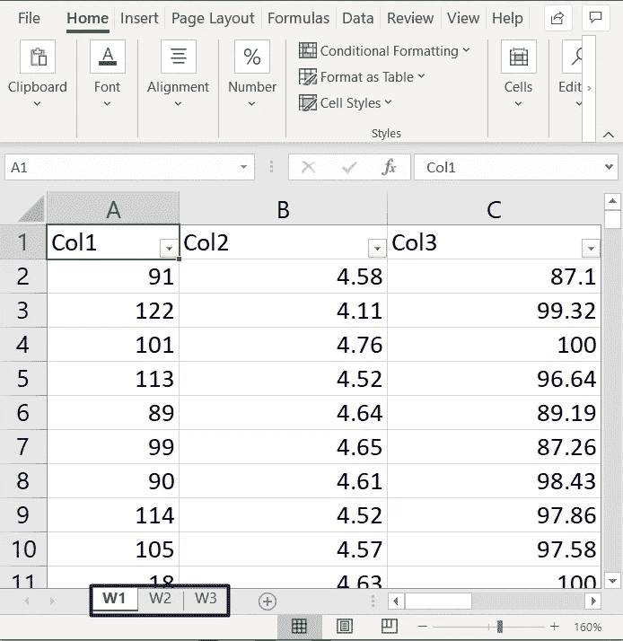
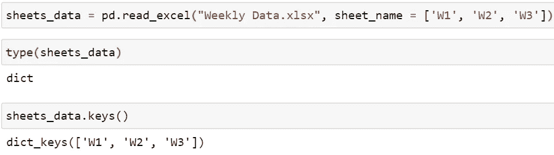
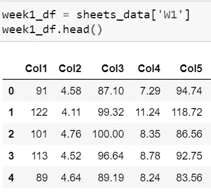
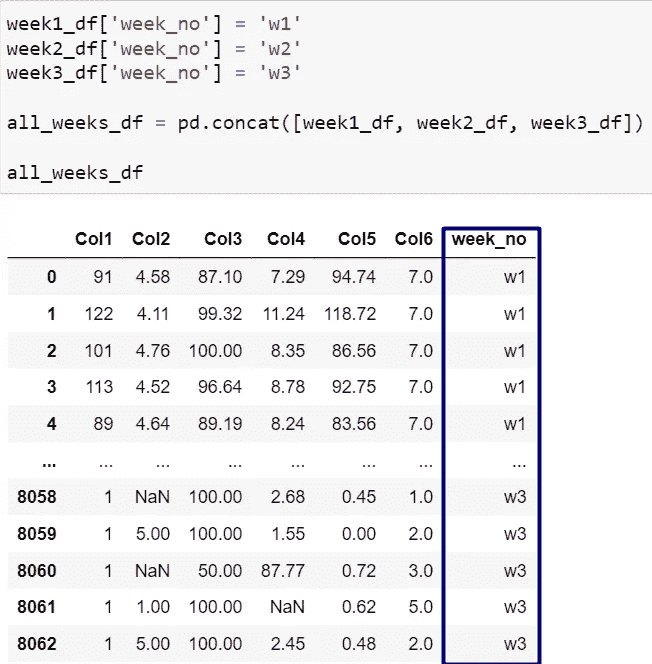
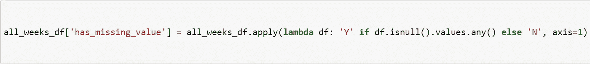
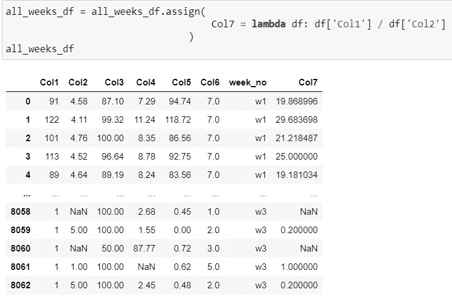
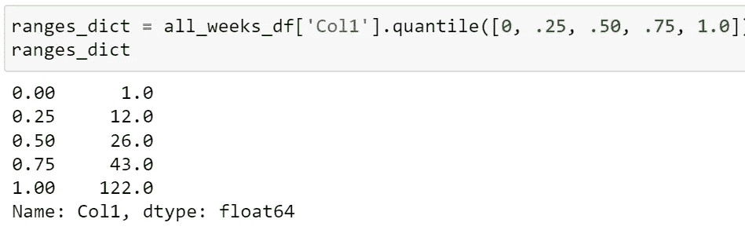
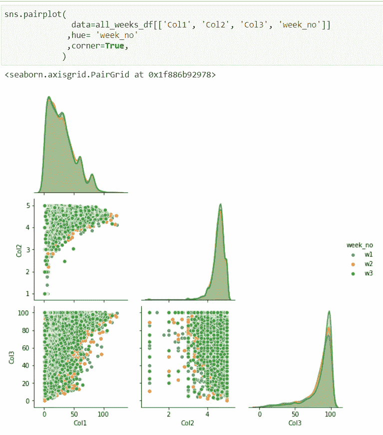
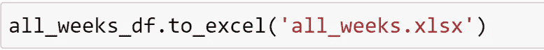

# 我在有趣的分析案例研究中使用的技巧和诀窍。

> 原文：<https://medium.com/analytics-vidhya/hacks-tips-and-tricks-i-used-during-interesting-analytics-case-study-abbf46a1bca7?source=collection_archive---------25----------------------->

紧张的截止日期和压力可以让美好的事情发生。

这只是一个指数据分析的图像🤭

最后几天，我必须交付性能分析任务，只有两天的时间我必须工作。

因此，我将与您分享在此任务中使用的一些逻辑、概念、功能和工具。我们开始吧🤩。

首先，**中接收到数据。xlsx'** 是 **Excel** 文件格式之一。
文件中带有几个**标签**。

工作表标签

因此，我们需要将每个选项卡保存到 dataframe 中。

*   使用[**PD . read _ excel()**](https://pandas.pydata.org/pandas-docs/stable/reference/api/pandas.read_excel.html)**pandas 函数，将工作表保存到 python [ditc(](https://docs.python.org/3/tutorial/datastructures.html#dictionaries) )中**

****

**代码片段**

**每个键的值将是工作表数据。**

****

**将 excel 表格数据拆分成数据框架**

**然后，我需要将数据整合到一个数据帧中，并在每一行上标注数据来自哪一周。**

*   **首先在每个名为 **week_no** 的数据帧中添加新列**
*   **使用 [**pd.concat**](https://pandas.pydata.org/pandas-docs/stable/reference/api/pandas.concat.html) ()，我们合并了数据。**

****

**数据整合**

**我还需要一个标志来表明该行是否包含任何 **NaN** (缺失)值。
这里我用 [**敷(**](https://pandas.pydata.org/pandas-docs/stable/reference/api/pandas.DataFrame.apply.html) **)** 用**。is null()values . any()****

****

**应用以检查每行中是否有任何缺失值**

**对于特征工程，我们需要创建派生列。
使用 [**【赋值】(**](https://pandas.pydata.org/pandas-docs/stable/reference/api/pandas.DataFrame.assign.html)**)**简直太容易了。**

****

**为派生列赋值**

**需要一个步骤来划分数值列的范围，所以每个范围应该包含相同的行数(**均匀分布**)**

**这里我用了 [**。分位数(**](https://pandas.pydata.org/pandas-docs/stable/reference/api/pandas.DataFrame.quantile.html) **)** 用于此任务。**

****

**分位数示例**

**这里的范围是 **[1.0:12.0]，]12.0–26]，]26.0:43]和]43.0:122.0]。****

**还需要绘制图表来检查每一列与其他列的关系和分布。
对于这个任务[**seaborn . pair plot()**](https://seaborn.pydata.org/generated/seaborn.pairplot.html)**还是不错的。****

********

****Seaborn 配对图****

****您可能需要将最终数据保存到 Excel 文件中。
你可以通过使用 [**。to_excel**](https://pandas.pydata.org/pandas-docs/stable/reference/api/pandas.DataFrame.to_excel.html) **()。******

********

****将数据框保存到 excel 中****

****这是在这个任务中使用的一些逻辑和技术。****

****我希望对你有用，如果有任何我可以提供的澄清或建议，请在下面的回复中留下。****

****对于以前的文章，你可以查看我的媒体简介[这里](/@mohamedmaherelhawary)。你也可以查看我的 LinkedIn。****

****谢谢你，****