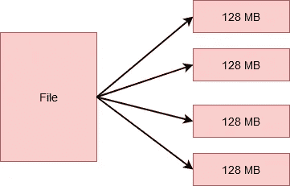
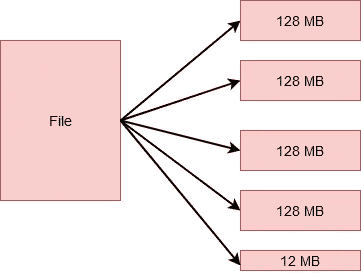
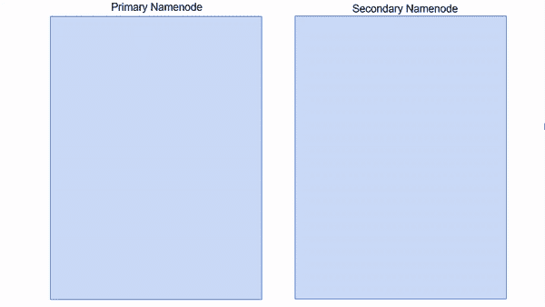
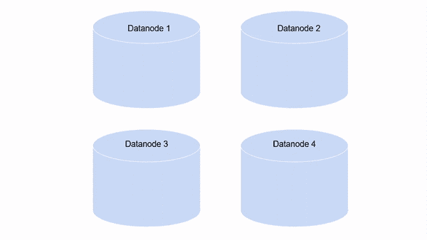
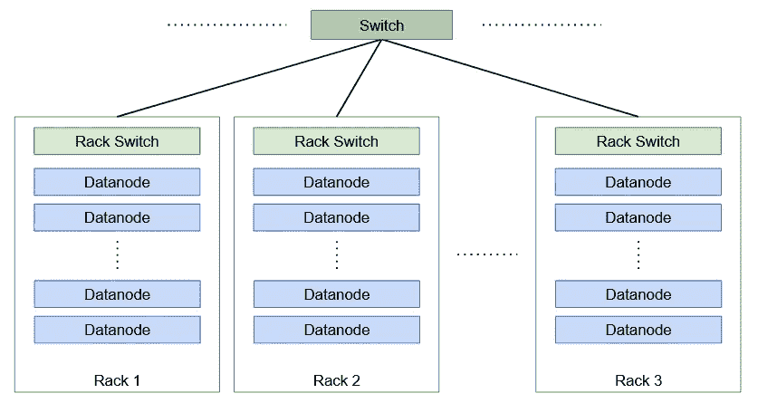
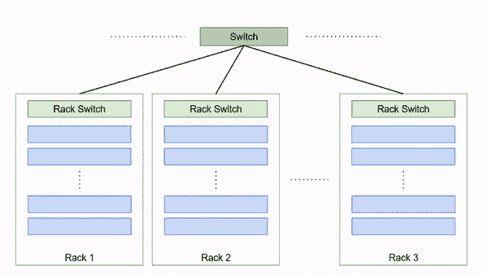

# Hadoop 分布式文件系统(HDFS)架构——每位数据工程师的 HDFS 指南

> 原文：<https://medium.com/analytics-vidhya/hadoop-distributed-file-system-hdfs-architecture-a-guide-to-hdfs-for-every-data-engineer-e8e3ee6f8be?source=collection_archive---------7----------------------->

在当代，处理海量数据是家常便饭。从你的下一条 WhatsApp 消息到你的下一条 Tweet，当你与技术互动时，你在每一步都在创造数据。现在把这个数字乘以互联网上的 45 亿人——这个数字简直令人难以置信！

但是有没有想过如何处理这样的数据？是否存储在单台机器上？机器故障怎么办？你会失去你可爱的凌晨 3 点推特吗？

答案是否定的。我很确定你已经在考虑 Hadoop 了。Hadoop 是一个令人惊叹的框架。有了 Hadoop，您可以利用 Hadoop 分布式文件系统(HDFS)的惊人功能，这是 Hadoop 的存储组件。它可能是 Hadoop 最重要的组件，需要详细的解释。

因此，在本文中，我们将了解什么是 Hadoop 分布式文件系统(HDFS)及其各种组件。此外，我们还将看到是什么让 HDFS 脱颖而出——是什么让它如此特别。让我们来了解一下！

# 目录

1.  什么是 Hadoop 分布式文件系统(HDFS)？

2.HDFS 由哪些部分组成？

*   HDFS 的街区？
*   HDFS 的 Namenode
*   HDFS 的数据节点
*   HDFS 的辅助节点

3.复制管理

*   块的复制
*   Hadoop 中的机架是什么？
*   机架感知

# 什么是 Hadoop 分布式文件系统(HDFS)？

在一台机器上维护大量数据是很困难的。因此，有必要将数据分解成更小的块，并将其存储在多台机器上。

跨机器网络管理存储的文件系统称为分布式文件系统。

Hadoop 分布式文件系统(HDFS)是 Hadoop 的存储组件。存储在 Hadoop 上的所有数据都以分布式方式存储在一个机器集群中。但是它有几个属性来定义它的存在。

*   **巨大的容量** —作为一个分布式文件系统，它能够毫无故障地存储数 Pb 的数据。
*   **数据访问** —基于“最有效的数据处理模式是一次写入，多次读取”的理念。
*   **高性价比**——HDFS 运行在一个商用硬件集群上。这些都是便宜的机器，可以从任何供应商那里买到。

# Hadoop 分布式文件系统(HDFS)有哪些组件？

从广义上讲，HDFS 有两个主要组成部分，即数据块和存储这些数据块的节点。但是事情并不像看上去那样简单。那么，让我们一个一个地来看这个，以便更好地理解。

# HDFS 街区

HDFS 把一个文件分解成更小的单元。每个单元都存储在集群中的不同机器上。然而，这对于在 HDFS 上工作的用户是透明的。对他们来说，这就像把所有的数据存储在一台机器上。

这些较小的单位是 HDFS 的**区块**。默认情况下，每个块的大小为 128MB，您可以根据需要轻松更改。因此，如果您有一个大小为 512MB 的文件，它将被分成 4 个块，每个块存储 128MB。

然而，如果您有一个大小为 524MB 的文件，那么它将被分成 5 个块。其中 4 个将各存储 128MB，总计 512MB。第五个将存储剩余的 12MB。没错！这最后一个块不会占用磁盘上全部 128MB 的空间。

但是，你一定想知道，为什么在一个街区里有这么多钱？为什么不是每个 10KB 的多个块呢？我们通常在 Hadoop 中处理的数据量通常在 peta 字节或更高的数量级。

因此，如果我们创建小尺寸的块，我们最终会得到大量的块。这意味着我们将不得不处理关于块位置的同样大的元数据，这将产生大量的开销。我们真的不想那样！

将数据存储在块中而不是保存整个文件有几个好处。

*   文件本身太大，无法单独存储在任何一个磁盘上。因此，谨慎的做法是将它分布在集群上的不同机器上。
*   它还可以适当地分配工作负载，并通过利用并行性来防止单台机器的阻塞。

现在，您一定想知道，集群中的机器怎么办？他们如何存储数据块，元数据存储在哪里？让我们找出答案。

# HDFS 的 Namenode

HDFS 以主-工架构运行，这意味着群集中有一个主节点和几个工作节点。主节点是**命名节点**。

**Namenode** 是运行在集群中一个独立节点上的主节点。

*   管理文件系统命名空间，它是文件系统树或文件和目录的层次结构。
*   存储所有文件的信息，如文件所有者、文件权限等。
*   它还知道文件中所有块的位置及其大小。

所有这些信息都以两个文件的形式持久地保存在本地磁盘上: **Fsimage** 和 **Edit Log** 。

*   **Fsimage** 存储文件系统中文件和目录的信息。对于文件，它存储复制级别、修改和访问时间、访问权限、组成文件的块及其大小。对于目录，它存储修改时间和权限。
*   **另一方面，编辑日志**跟踪客户端执行的所有写操作。这将定期更新到内存中的元数据，以满足读取请求。

每当客户端想要向 HDFS 写信息或从 HDFS 读取信息时，它就与 **Namenode** 连接。Namenode 将块的位置返回给客户端，然后执行操作。

是的，没错，Namenode 不存储块。为此，我们有单独的节点。

# HDFS 的数据节点

**数据节点**是工作节点。它们是廉价的商用硬件，可以轻松添加到集群中。

**Datanodes** 负责存储、检索、复制、删除等。当 Namenode 询问时。

它们定期向 Namenode 发送心跳信号，以便它知道它们的健康状况。这样，DataNode 还会发送一个存储在它上面的块的列表，以便 Namenode 可以在其内存中维护块到 DataNode 的映射。

但是在集群中除了这两种类型的节点之外，还有另一个节点叫做次 Namenode。让我们看看那是什么。

# HDFS 的次要名称节点

假设我们需要重启 **Namenode** ，这在失败的情况下会发生。这意味着我们必须将 Fsimage 从磁盘复制到内存中。此外，我们还必须将编辑日志的最新副本复制到 Fsimage，以跟踪所有事务。但是，如果我们在很长时间后重新启动节点，那么编辑日志的大小可能会增加。这意味着应用编辑日志中的事务将花费大量时间。在此期间，文件系统将处于离线状态。因此，为了解决这个问题，我们引入了**辅助 Namenode** 。

**辅助 Namenode** 是集群中的另一个节点，其主要任务是定期将编辑日志与 Fsimage 合并，并生成主节点的内存文件系统元数据的检查点。这也被称为**检查点**。

但是检查点操作过程在计算上非常昂贵，并且需要大量内存，这就是为什么辅助 namenode 在集群上的一个单独的节点上运行的原因。

然而，尽管它的名字，次要 Namenode 不作为一个 Namenode。它仅仅是为了检查点和保存最新 Fsimage 的副本。

# HDFS 的复制管理

现在，HDFS 的最佳功能之一是数据块复制，这使得它非常可靠。但是，它如何复制这些块，又将它们存储在哪里呢？现在让我们来回答这些问题。

# 块的复制

HDFS 是 Hadoop 的一个可靠存储组件。这是因为文件系统中存储的每个数据块都在集群中的不同数据节点上复制。这使得 HDFS 容错。

HDFS 的默认复制因子是 3。这意味着每个数据块将有两个以上的副本，每个副本存储在集群中不同的 DataNodes 上。然而，这个数字是可配置的。

但是您一定想知道这是否意味着我们占用了太多的存储空间。例如，如果我们有 5 个 128MB 的数据块，则总计为 5*128*3 = 1920 MB。没错。但是这些节点是商用硬件。我们可以轻松扩展集群，以添加更多这样的机器。买机器的成本远低于丢失数据的成本！

现在，您一定想知道，Namenode 如何决定将副本存储在哪个 Datanode 上？在回答这个问题之前，我们需要了解一下 Hadoop 中的机架是什么。

# Hadoop 中的机架是什么？

一个**机架**是存储在同一物理位置的一组机器(在 Hadoop 中为 30-40 台)。Hadoop 集群中有多个机架，所有机架都通过交换机连接。

# 机架感知

副本存储是可靠性和读/写带宽之间的折衷。为了提高可靠性，我们需要在不同的机架和数据节点上存储数据块副本，以提高容错能力。而当副本存储在同一节点上时，写带宽最低。因此，Hadoop 有一个默认策略来处理这个难题，也称为**机架感知**算法。

例如，如果数据块的复制因子为 3，则第一个复制副本存储在客户端写入的同一 Datanode 上。第二个副本存储在不同的 Datanode 上，但在随机选择的不同机架上。而第三个副本存储在与第二个副本相同的机架上，但是存储在不同的 Datanode 上，也是随机选择的。但是，如果复制因子更高，则后续副本将存储在集群中的随机数据节点上。

# 尾注

我希望到现在为止，您已经对什么是 Hadoop 分布式文件系统(HDFS)、它的重要组件是什么以及它如何存储数据有了深入的了解。然而，关于 Hadoop 分布式文件系统(HDFS ),我们还需要介绍一些概念，但那是另一篇文章的内容了。

目前，我建议您阅读以下文章，以便更好地了解 Hadoop 和这个大数据世界！

最后但同样重要的是，我推荐阅读汤姆·怀特的 [Hadoop:权威指南](https://www.oreilly.com/library/view/hadoop-the-definitive/9780596521974/)。这篇文章很受它的启发！

您也可以在我们的移动应用程序上阅读这篇文章

相关文章

*原载于 2020 年 10 月 28 日 https://www.analyticsvidhya.com**[*。*](https://www.analyticsvidhya.com/blog/2020/10/hadoop-distributed-file-system-hdfs-architecture-a-guide-to-hdfs-for-every-data-engineer/)*