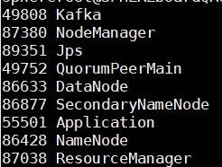
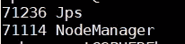
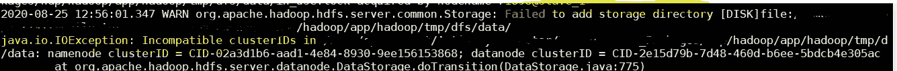
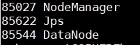
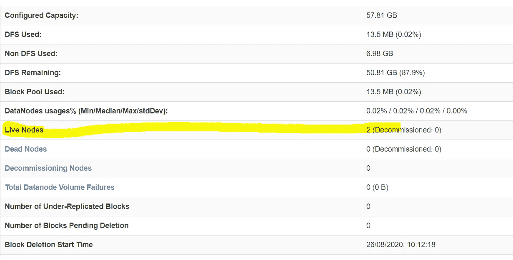

# Hadoop Namenode 覆盖问题

> 原文：<https://medium.com/analytics-vidhya/hadoop-namenode-override-issue-268efc3e727a?source=collection_archive---------22----------------------->

最近，我致力于在两个节点上设置 hadoop 集群。我开发了一个 bash 脚本来在主机和从机上自动安装 hadoop。该脚本将执行所有必需的步骤，并将配置所有文件(core-site.xml、hdfs-site.xml、mapred-site.xml、yarn-site.xml 等..，)适当。

我运行了安装脚本，一切正常。具有两个 datanodes 的 Hadoop 集群已经部署完毕。

第二天，由于我的错误，我把一切都搞砸了。我所做的是，在 Namenode 机器上再次运行相同的安装程序脚本，这反过来覆盖了主节点上的所有配置设置和一切。甚至 namenode 也被格式化了。幸运的是，我在那个集群中没有任何数据，所以没有问题。

在它被覆盖后，我尝试使用以下命令在所有节点上再次启动所有 hadoop 服务:

```
$HOME/hadoop/sbin/start-all.sh
```

已使用以下命令验证它是否启动了 namenode 中的所有服务:

```
jps
```



运行服务的 namenode

当我签入 datanode 时，datanode 服务没有启动，而是只有 nodemanager 服务在运行:



运行服务的 datanode

我再次尝试从 namenode 停止和启动所有 hadoop 服务，但结果是一样的。Datanode 服务未在从属节点中启动。即使集群显示它只有一个 datanode。

我不知道该怎么做，因为我第一次面对这个问题。然后我试图检查从节点中的日志文件，它显示了一个错误，比如两台机器中不兼容的集群 ID。

它显示了这样一个错误:



数据节点中的日志文件

这意味着，当我第一次启动 hadoop 集群时，有一个为该集群生成的 ID，它填充在 namenode 和 datanode 中。但是当我在 namenode 上重新安装时，clusterid 在 namenode 上得到更新，但在 datanode 上没有更新，这反过来导致了这个不兼容的集群 ID 问题。

我所做的是，从 namenode 手动复制 clusterID 值并更新相同的值，然后在 datanode 中启动 hadoop 服务。

```
$HOME/hadoop/sbin/hadoop-daemon.sh start datanode
```



现在，它工作正常，群集显示有两个节点:



因此，如果您面临 namenode 无法检测 datanode 这样的问题。首先检查两台机器上的 clusterID 是否相同。如果没有，请更新并尝试再次启动 datanode。

大团圆结局！…….