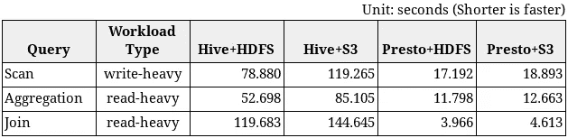

# 本地 S3 与 HDFS 的 Hadoop 性能指标评测结果比较

> 原文：<https://medium.com/analytics-vidhya/hadoop-performance-benchmark-results-comparing-on-premise-s3-vs-hdfs-cf7a9ea3baa3?source=collection_archive---------0----------------------->

# 介绍

Hadoop 部署面临的一个挑战是与计算需求同步扩展存储，因为存储和计算位于相同的硬件节点上。一种更加灵活且经济高效的解决方案是，通过将存储节点与计算节点分开，独立于计算来扩展存储。使用 S3 存储软件(在本例中为 [Cloudian HyperStore](https://cloudian.com) 软件)实施存储层，并使用 S3 连接器代替 HDFS，我们可以实现存储层和计算层的分离。但是在网络中使用 S3 而不是 HDFS 会对性能产生什么影响呢？

由 Tatsuya Kawano([@ Tatsuya 6502](https://twitter.com/tatsuya6502))完成的这项工作旨在通过检查查询类型和存储类型的不同组合的性能来回答这个问题:

1.  蜂巢+HDFS
2.  蜂巢+S3 (Cloudian HyperStore)
3.  普雷斯托+HDFS
4.  普雷斯托+S3(云端超级商店)

我们使用了 [HiBench 的](https://github.com/intel-hadoop/HiBench) SQL (Hive-QL)工作负载，记录约 1100 万条(约 1.8GB)，以及 [TPC-H](http://www.tpc.org/tpch/) 基准测试，记录约 8.66 亿条(约 100GB)。

CD H5([cloud era Distribution Hadoop v 5 . 14 . 4](https://www.cloudera.com/products/open-source/apache-hadoop/key-cdh-components.html))用于 Hadoop 和 HDFS 实现。

对于 S3 存储，我们使用了 [Cloudian HyperStore v7.1](https://cloudian.com) ，它在一个可以部署在 Linux 上的软件包中实现了[亚马逊 S3 API](https://aws.amazon.com/s3/) 。

根据基准测试结果的汇总，从最好到最差的相对性能是

1.  转眼间+HDFS ( *最佳*)
2.  普雷斯托+S3
3.  蜂巢+HDFS
4.  蜂巢+S3 ( *最差*)

两种 Presto 配置都大大优于两种蜂巢配置(大约 10 倍)。普雷斯托+S3 组合显示出与最佳普雷斯托+HDFS 组合非常相似的性能结果。

# 基础设施设置

我们在 Amazon EC2 上创建了单独的 CDH5 和 HyperStore 7.1 集群。我们将它们部署在同一个亚马逊 VPC 子网中。

## CDH5 集群(6 + 1 节点)


*   CDH 5.14.4 在中央 7 号。Hadoop 2.6.0+cdh5.14.4 和 Hive 1.1.0+cdh5.14.4
*   6 个工作节点和 1 个协调节点
*   每个 t 3.2x 大型 EC2 实例具有 8 个 vCPUs、32GB RAM 和 5 千兆位/秒的网络性能。
*   每个节点使用一个 150GB 的 EBS 卷作为根文件系统。卷类型调配了 iops SSD (io1 ),具有 500 IOPs/秒的中等性能。所有数据(操作系统和 Hadoop)都存储在该卷中。
*   每个节点上的 HAProxy 作为 HyperStore S3 服务器的负载平衡器

我们还在同一个 CDH5 集群上部署了 [Presto 0.212](https://prestodb.io/) (最新版本)。


## **HyperStore 集群(6 个节点)**


*   CentOS 7 上的 Cloudian HyperStore 7.1
*   6 个节点
*   每个 t 3.2x 大型 EC2 实例具有 8 个 vCPUs、32GB RAM 和 5 千兆位/秒的网络性能。
*   每个节点使用一个 150GB 的 EBS 卷作为根文件系统。卷类型调配了 iops SSD (io1 ),具有 500 IOPs/秒的中等性能。所有数据(操作系统和超级存储)都存储在该卷中。

## HDFS 构型

我们使用 Cloudera Manager 通过以下服务创建了 CDH5 集群:Hadoop YARN with MapReduce 2、HDFS、Hive、Spark 和 ZooKeeper。

我们没有更改 HDFS 设置的默认值，即 3 个副本和 128MB 的数据块大小

## 蜂巢配置

我们更改了以下配置单元设置以提高配置单元+S3 的性能。

```
hive.warehouse.subdir.inherit.perms = false
hive.metastore.pre.event.listeners = (empty)
hive.mv.files.thread = 45
hive.exec.dynamic.partition.mode = nonstrict
```

## S3A 文件系统配置

我们使用 Cloudera Manager 添加了 S3A 文件系统。为了获得更好的性能，我们禁用了 SSL (HTTPS)连接。

```
fs.s3a.connection.ssl.enabled = false
```

我们还调整了以下 S3A 设置，以提高 Hive+S3 的性能。

启用 S3A 快速上传功能:

```
fs.s3a.fast.upload = true
fs.s3a.fast.buffer.size = 1048576
fs.s3a.fast.upload.buffer = array
```

减少多部分上传的部分大小以获得更多的并行性。

```
fs.s3a.multipart.size = 10M
fs.s3a.multipart.threshold = 10M
fs.s3a.fast.upload.active.blocks = 8
```

增加连接/线程数量。

```
fs.s3a.threads.max = 50
fs.s3a.max.total.tasks = 30
```

## Presto 配置

我们在 CDH5 节点上手动部署了最新版本的 Presto。我们将节点 0 上的 Presto 服务器配置为协调器，将节点 1 到 6 上的其他 6 个 Presto 服务器配置为工作器。

**内存设置**

Presto 对查询中每个任务可以存储的最大内存量有限制。我们没有启用“溢出到磁盘”特性，该特性将中间任务结果卸载到磁盘，因为这会降低性能。所以在我们的环境中，如果一个查询需要大量的内存，这个查询就会失败。

经过一些实验，我们发现以下内存设置可以处理针对 100GB 数据集的 TPC-H 查询。(我们一次运行一个查询)

etc/配置.属性

```
query.max-memory = 100GB
query.max-memory-per-node = 12GB
query.max-total-memory-per-node = 12GB
```

etc/jvm.config

```
-server
-Xmx18G
-XX:+UseG1GC
```

**蜂箱连接器**

我们将 Hive 连接器配置为启用 S3 访问，这样 Presto 就可以访问存储在 HDFS 和 S3 的 Hive 表。

etc/目录/hive.properties

```
connector.name = hive-hadoop2
hive.metastore.uri = thrift://cdh-node0:9083
hive.non-managed-table-writes-enabled = true
hive.config.resources =
 /etc/hadoop/conf/core-site.xml, /etc/hadoop/conf/hdfs-site.xml
hive.s3.ssl.enabled = false
hive.s3.max-connections = 500
hive.s3.multipart.min-file-size = 20 MB
hive.s3.multipart.min-part-size = 10 MB
```

注意，Presto 不使用 Hadoop S3A 文件系统来访问 S3，因为它有自己的 [S3 连接器](https://prestodb.io/docs/current/connector/hive.html#amazon-s3-configuration)实现。

**TPC-H 连接器**

我们还配置了 TPC-H 连接器，可用于生成 TPC-H 数据集。

etc/目录/tpch.properties

```
connector.name = hive-hadoop2
hive.metastore.uri = thrift://cdh-node0:9083
hive.non-managed-table-writes-enabled = true
hive.config.resources =
 /etc/hadoop/conf/core-site.xml, /etc/hadoop/conf/hdfs-site.xml
hive.s3.ssl.enabled = false
hive.s3.max-connections = 500
hive.s3.multipart.min-file-size = 20 MB
hive.s3.multipart.min-part-size = 10 MB
```

## 超级商店配置

我们没有更改 HyperStore 设置的默认值。我们创建了一个具有擦除编码存储策略的 S3 存储桶(4+2)。我们在那个桶上放了蜂箱桌。

## 羟基构型

我们在每个 CDH5 节点上安装了 HAProxy，以便在 HyperStore 节点上平均分配 S3 请求。我们使用循环负载平衡算法。

# 基本数据流

## 案例一:蜂巢+HDFS


1.  输入和输出配置单元表存储在 HDFS 上。(此时输出表应该是空的)
2.  HiBench 或 TPC-H 查询从节点 0 上的 Hive 客户端提交到同一节点上的 HiveServer2。
3.  Hive 从其 Metastore 中定位表，并为查询安排一系列 MapReduce (M/R)作业。(Hive 将每个作业称为“阶段”)
4.  Hadoop YARN(图中未显示)运行 M/R 作业中的任务。每个任务都有一个嵌入式 HDFS 客户端，并在 HDFS 上读/写数据。中间结果存储在 HDFS 上。
5.  当所有阶段完成后，Hive 将查询结果返回给客户端。

## **案例二:蜂巢+S3**


1.  输入和输出配置单元表存储在 S3 上。(此时输出表应该是空的)
2.  HiBench 或 TPC-H 查询已从节点 0 上的配置单元客户端提交到同一节点上的 HiveServer2。
3.  Hive 从其 Metastore 中定位表，并为查询安排一系列 M/R 作业。
4.  Hadoop YARN 运行 M/R 作业中的任务。每个任务都嵌入了 S3A 文件系统客户端，并在 HyperStore S3 上读取/写入数据。HAProxy 作为一个循环负载平衡器，将 S3 请求转发到不同的 S3 服务器。中间结果存储在默认的分布式文件系统实例中，在我们的例子中是 HDFS。
5.  当所有阶段完成后，Hive 将查询结果返回给客户端。

## 案例 3:普雷斯托+HDFS


1.  输入和输出配置单元表存储在 HDFS 上。(此时输出表应该是空的)
2.  HiBench 或 TPC-H 查询从节点 0 上的 Presto 客户端提交到同一节点上的 Presto 协调器。
3.  Presto 协调器查询配置单元 Metastore 以定位配置单元表。
4.  Presto Coordinator 为查询安排一系列任务。
5.  Presto 工作人员使用其嵌入式 HDFS 客户端执行任务，在 HDFS 上读取/写入数据。中间结果保存在内存中，并在 Presto 工人之间传输。
6.  当所有任务完成后，Presto Coordinator 将查询结果返回给客户机。

## **案例四:急变+S3**


1.  输入和输出配置单元表存储在 S3 上。(此时输出表应该是空的)
2.  HiBench 或 TPC-H 查询从节点 0 上的 Presto 客户机提交到同一节点上的 Presto 协调器。
3.  Presto 协调器查询配置单元 Metastore 以定位配置单元表。
4.  Presto Coordinator 为查询安排一系列任务。
5.  Presto 工作人员使用其嵌入式 S3 客户端执行这些任务，在 HyperStore S3 上读取/写入数据。中间结果保存在内存中，并在 Presto 工人之间传输。
6.  当所有任务完成后，Presto Coordinator 将查询结果返回给客户机。

# 衡量绩效

为了在 Hive 和 Presto 上生成负载，我们使用了以下基准:

*   **希本斯**，【https://github.com/intel-hadoop/HiBench】T2
*   http://www.tpc.org/tpch、[T4](http://www.tpc.org/tpch)

英特尔 HiBench 是一款大数据性能指标评测套件，可帮助评估不同大数据产品的速度。它有三个 Hive 工作负载，是基于 SIGMOD 09 论文“大规模数据分析方法的比较”开发的。

TPC-H 是一种 OLAP(在线分析处理)工作负载，用于测量数据仓库环境中的分析查询性能。Presto 可以运行未经修改的 TPC-H 查询(这是 ANSI SQL 兼容)，它有 TPC-H 连接器，可以生成 TPC-H 数据集。Hive 不能直接运行 TPC-H 查询，但是我们在 GitHub 上找到了几个 TPC-H 的 Hive-QL 实现，我们使用了其中的一个。

HiBench 工作负载提供非常简单的写密集型和读密集型查询。它们将帮助我们了解这两种产品在基本读/写性能方面的差异。

TPC-H 提供复杂的大量读取的查询。这些查询将让我们对真实世界的性能差异有更多的了解。

## HiBench 配置单元工作负载

HiBench 数据集是使用 HiBench 的数据生成器创建的，并以 SequenceFile 格式存储。我们将 hibench.scale.profile 设置为 large，将 hi bench . default . map . parallelism 设置为 48，得到的输入数据量如下:

*   所有两个表总共约有 1100 万条记录
*   所有 48 个存储文件总计约 1.8 GB(每个约 37MB)

我们将 Hive-QL 移植到了 Presto 可以执行的 SQL 中。Presto 通过配置单元连接器访问配置单元表。

我们通过手动执行每个查询来测量性能，并以毫秒为单位记录查询时间。结果如下:

**HiBench 查询时间**



**备注**

不管名称如何，“扫描”查询不仅从输入表中读取所有记录，还将它们复制到输出表中。所以写得很重。

```
insert overwrite table uservisits_copy select * from uservisits;
```

**hi bench 结果汇总:**

*   输入数据大小约 1100 万条记录(约 1.8GB)，以顺序文件格式存储
*   HiBench 适合测量基本读/写性能。
*   对于写繁重的查询，Presto+S3 比 Hive+HDFS 快*4.2 倍。*
*   *对于阅读量大的查询，Presto+S3 比 Hive+HDFS 平均快 15.1 倍。*

## *TPC-H 基准*

*TPC-H 数据集是使用 Presto 的 [TPC-H 连接器](https://prestodb.io/docs/current/connector/tpch.html)创建的，并使用 ZLIB 压缩以 ORC(优化行列)格式存储。ORC 类似于拼花地板，广泛用于蜂巢。我们无法使用 Parquet，因为 Hive 1.1 不支持 Parquet 文件中的“日期”列类型。*

*我们选择 TPC-H 比例因子= 100 来生成 100GB 的数据集。我们得到了以下数量的输入数据，所有 8 个表总共有 8 . 66 亿条记录*

*Presto 能够运行未经修改的 TPC-H 查询。它通过配置单元连接器访问存储 TPC-H 数据集的配置单元表。*

*对于 Hive，我们在 GitHub 上找到了以下 Hive-QL 查询实现。*

1.  *【https://github.com/rxin/TPC-H-Hive】，包含贾云涛 2011 年的作品()*
2.  *[https://github.com/hortonworks/hive-testbench](https://github.com/hortonworks/hive-testbench)，包含霍顿作品近几年的作品。*

*#2 包含比#1 更复杂的查询，但似乎#2 针对的是比 CDH 5 (Hive 1.1)更新的 Hive 版本(1.3+)。在我们的环境中，一些#2 查询在一个较小的 1GB 数据集上返回了不正确的结果，其中许多查询在 100GB 数据集上停滞不前。所以这里我们只给出第一个查询结果:*

***TPC-H 查询时间***

****

***备注***

*   *所有 TPC-H 的查询都是大量读取的。*
*   *我们没有测量 Hive+S3 的性能，因为从 HiBench 结果来看，我们预计它会比所有其他组合慢，我们可能对结果不感兴趣。*
*   *我们没有在 100GB 数据集上运行查询“q19 ”,因为 Hive 和 Presto 在 1GB 数据集上返回了不同的查询结果。*
*   *我们跳过了查询“q22 ”,因为它在 100GB 数据集的 Hive 上失败。*
*   *如前所述，我们将 Presto coordinator/worker 的 query.max-memory-per-node 设置为 12GB，以便在内存中处理查询。大多数查询在每个节点 8GB 内存内完成，但是“q09”和“q21”分别需要每个节点 10GB 和 12GB 内存。*

***TPC-H 结果汇总:***

*   *输入数据大小:约 8.66 亿条记录(约 100GB)，以 ORC 格式存储，ZLIB 压缩*
*   *TPC-H 很适合测量分析查询的真实性能。*
*   *Presto+S3 在 ***上平均比 Hive+HDFS 的*** 快 11.8 倍*

# *为什么 Presto 在基准测试中比 Hive 快*

*   *Presto 是一个内存查询引擎，所以它不会将中间结果写入存储(S3)。Presto 发出的 S3 请求比 Hive 少得多。*
*   *与 Hive M/R 作业不同，Presto 在写入后不执行重命名文件操作。重命名在 S3 存储系统中是非常昂贵的操作，因为它是通过复制和删除文件操作来实现的。*
*   *Hive 必须在阶段之间等待(M/R 作业)。很难持续利用所有的 CPU 和磁盘资源。*

**

*图片来源:[https://blog . treasured data . com/blog/2015/03/20/presto-vs-hive/](https://blog.treasuredata.com/blog/2015/03/20/presto-versus-hive/)*

# *结论*

*根据基准测试结果的汇总，从最好到最差的相对性能是*

1.  *转眼间+HDFS ( *最佳**
2.  *普雷斯托+S3*
3.  *蜂巢+HDFS*
4.  *蜂巢+S3 ( *最差*)*

*两种 Presto 配置都大大优于两种蜂巢配置(大约 10 倍)。普雷斯托+S3 组合显示出与最佳普雷斯托+HDFS 组合非常相似的性能结果，并且明显优于蜂巢+HDFS 组合。这些 Presto+S3 结果证明了在 Hadoop 集群中分离计算层和存储层的可行性。*