# Hadoop:在 Windows 中设置单节点集群

> 原文：<https://medium.com/analytics-vidhya/hadoop-setting-up-a-single-node-cluster-in-windows-4221aab69aa6?source=collection_archive---------1----------------------->

## 通过设置单节点集群，在 Windows 10 中安装并配置 Hadoop 3.1 的伪分布式模式。


作者图片

安装一个虚拟机需要分配大量的内存，否则它会一直挂起。

本文将介绍如何在没有虚拟机的情况下，在 Windows 10 上安装和配置单节点伪分布式 Hadoop 3.1 集群。

# **先决条件**:

**在安装 Hadoop 之前，应该在系统中安装**Java。

在您的系统中安装`java`*1.8 版*。如果已经安装，请跳过这一部分并继续。

如果您的系统中没有安装`java`，则进入此[链接](https://www.oracle.com/technetwork/java/javase/downloads/jdk8-downloads-2133151.html)。

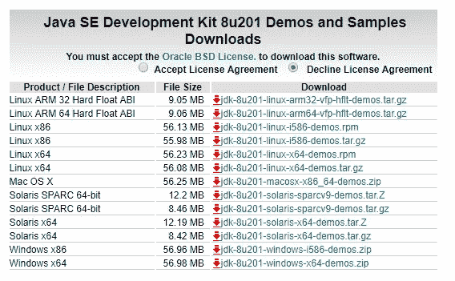

根据您的操作系统接受许可并下载文件。

> 注意:不要另存为`C:\Program Files\Java\jdk1.8.0_261`，而是将 java 文件夹直接另存为本地磁盘目录下的`C:\Java\jdk1.8.0_261`，以避免进一步的错误。

下载`java`后，在命令提示符(`cmd`)下通过这个命令检查你的 java 版本。


# 下载 Hadoop

从这个[链接](https://archive.apache.org/dist/hadoop/common/hadoop-3.1.0/hadoop-3.1.0.tar.gz)下载 hadoop 版。

将其提取到一个文件夹中。

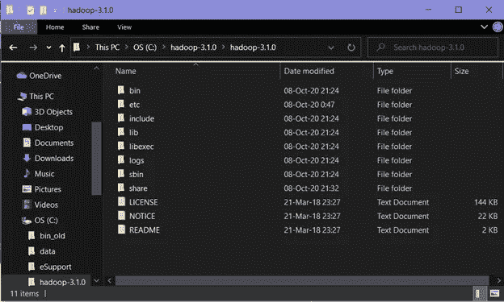

> 注意:`java`文件夹和`hadoop`文件夹应该放在同一个驱动器中。(这里，`C:\` 开车)。这样做是为了避免进一步的错误。

# 设置系统环境变量

要编辑系统环境变量，请打开控制面板，然后转到系统属性中的环境变量。

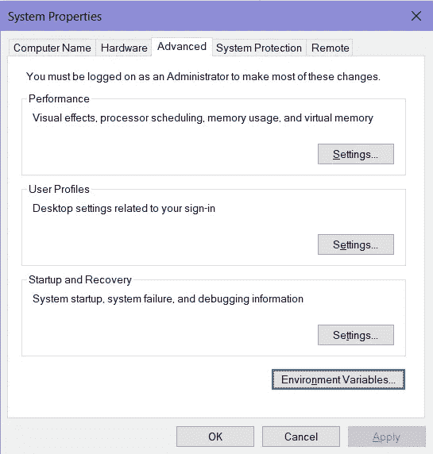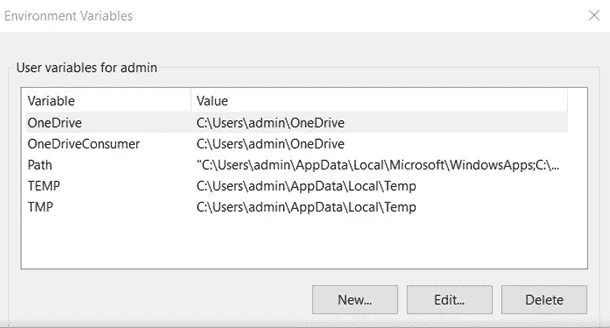

我们需要创建两个新的用户变量:

1.  变量名:`HADOOP_HOME`

变量值:解压`hadoop`的`bin`文件夹的路径。


2.变量名:`JAVA_HOME`

变量值:`Java`目录中`bin`文件夹的路径。

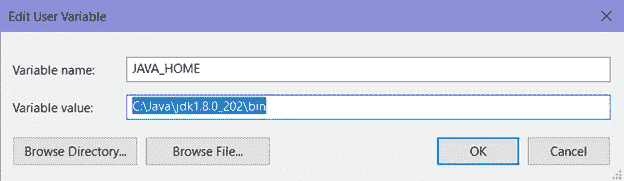

要在系统变量 path 中设置`Hadoop` `bin`目录和`Java` `bin`目录路径，请编辑系统变量 path

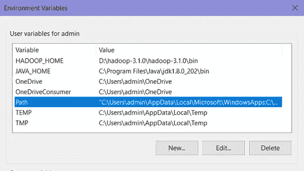

点击`New`，在其中添加`Hadoop`和`Java`的`bin`目录路径。

> 注意:两个`bin`目录应该放在同一个驱动器中。(这里，`C:\` 开车)。这样做是为了避免进一步的错误。

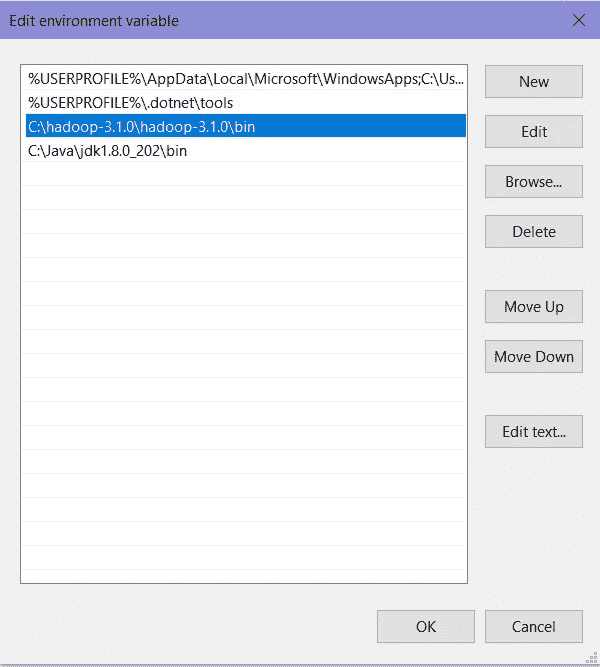

# 配置

现在我们需要编辑位于安装了`hadoop`的`etc`文件夹的`hadoop`目录中的一些文件。(这里，`C:\hadoop-3.1.0\hadoop-3.1.0\etc\hadoop\`)。要编辑的文件已突出显示(黄色)。

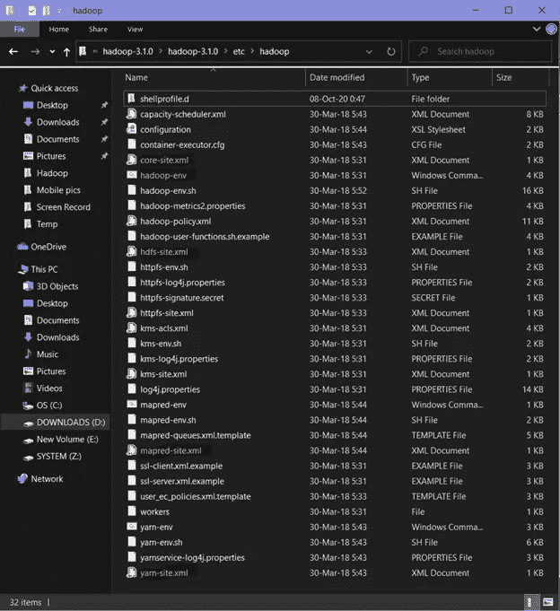

1.  编辑`hadoop`目录中的`core-site.xml`文件。将配置中的这个`xml`属性复制到文件中并保存。

```
<configuration>
   <property>
      <name>fs.defaultFS</name>
      <value>hdfs://localhost:9000</value>
   </property>
</configuration>
```

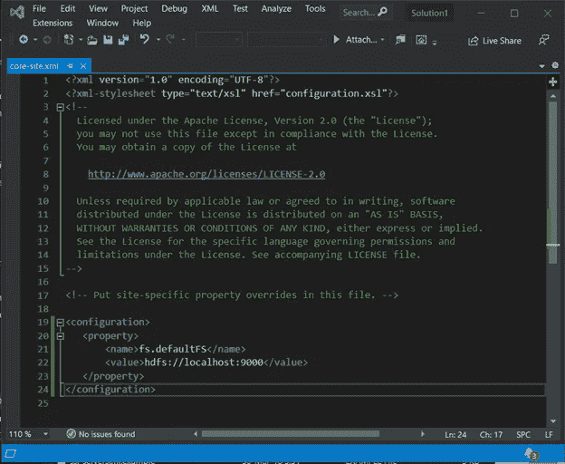

2.编辑`mapred-site.xml`并将该属性复制到配置中并保存。

```
<configuration>
   <property>
      <name>mapreduce.framework.name</name>
      <value>yarn</value>
   </property>
</configuration>
```

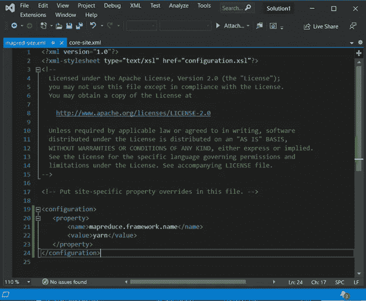

3.在`hadoop`目录下创建一个文件夹`data`

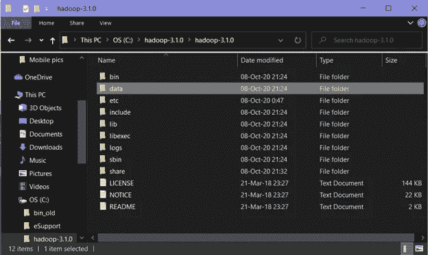

> HDFS 有一个**主从架构**，其中主节点称为`**NameNode**`，从节点称为`**DataNode**`。`NameNode`和它的`DataNodes` 组成一个集群。当`DataNodes`存储实际数据时,`NameNode`像一个指导者一样指导`DataNode`。

[**主从架构**](https://en.wikipedia.org/wiki/Master/slave_(technology)) 用于帮助稳定系统。主设备是真正的数据保管者，而从设备是主设备的复制品。复制是从主机到从机同步数据的过程。

在这个新创建的`data`目录中创建两个名为`datanode`和`namenode`的新的空文件夹。(这里，`C:\hadoop-3.1.0\hadoop-3.1.0\data\namenode`和`C:\hadoop-3.1.0\hadoop-3.1.0\data\datanode`分别是 namenode 和 datanode 文件夹的路径。).

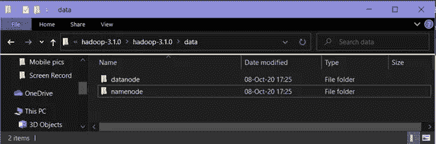

4.编辑文件`hdfs-site.xml`，在配置中添加以下属性并保存。

```
<configuration>
   <property>
      <name>dfs.replication</name>
      <value>1</value>
   </property>
   <property>
      <name>dfs.namenode.name.dir</name>
      <value>C:\hadoop-3.1.0\hadoop-3.1.0\data\namenode</value>
   </property>
   <property>
      <name>dfs.datanode.data.dir</name>
      <value> C:\hadoop-3.1.0\hadoop-3.1.0\data\datanode</value>
   </property>
</configuration>
```

> 注意:`namenode`和`datanode`跨值的路径将是您刚刚按照上述步骤创建的`namenode`和`datanode`文件夹的路径。

(这里分别为`C:\hadoop-3.1.0\hadoop-3.1.0\data\namenode`和`C:\hadoop-3.1.0\hadoop-3.1.0\data\datanode`)。

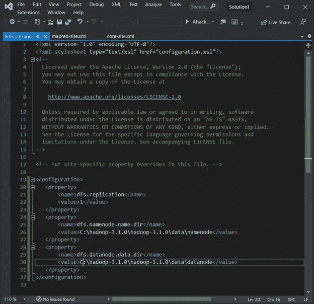

5.编辑文件`yarn-site.xml`，在配置中添加以下属性并保存。

```
<configuration>
   <property>
      <name>yarn.nodemanager.aux-services</name>
      <value>mapreduce_shuffle</value>
   </property>
   <property>    <name>yarn.nodemanager.auxservices.mapreduce.shuffle.class</name><value>org.apache.hadoop.mapred.ShuffleHandler</value>
   </property>
</configuration>
```

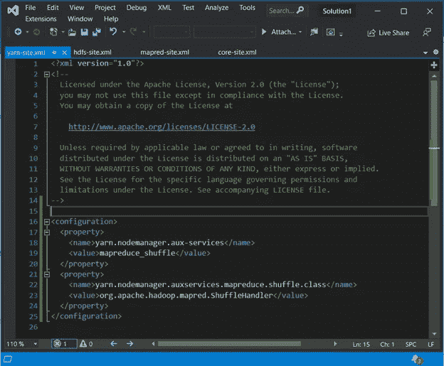

6.编辑`hadoop-env.cmd`。

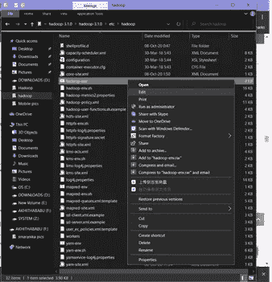

将`%JAVA_HOME%`替换为安装`jdk 1.8`的`java`文件夹的路径。(此处，`C:\Java\jdk1.8.0_202`用黄色突出显示)。那就省省吧。

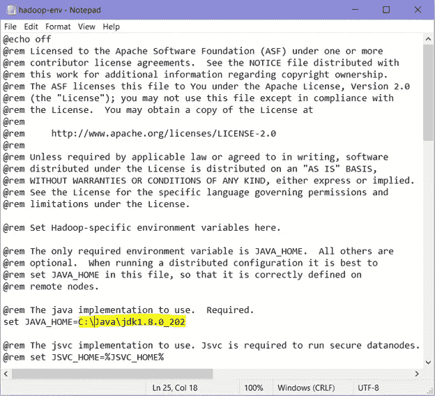

Hadoop 需要特定于 Windows 操作系统的文件，这些文件不包含在 Hadoop 的默认下载中。

要包含这些文件，请用此`GitHub`链接中提供的`bin`文件夹替换`hadoop`目录中的`bin`文件夹。

[https://github.com/s911415/apache-hadoop-3.1.0-winutils](https://github.com/s911415/apache-hadoop-3.1.0-winutils)

下载为`zip`文件。提取出来，复制里面的`bin`文件夹。如果要保存旧的`bin`文件夹，将其重命名为`bin_old`。

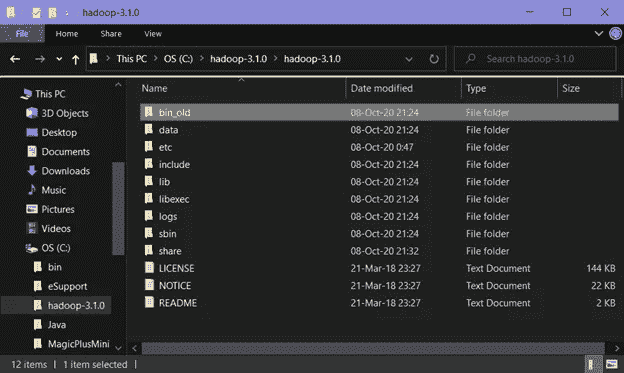

现在将复制的`bin`文件夹粘贴到该目录中。

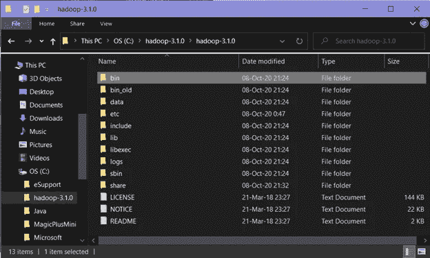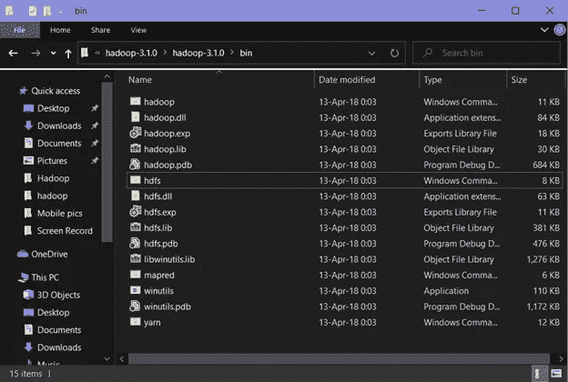

> 注意:新的`bin`文件夹中有 15 个文件。

在`cmd`上运行该命令，检查`hadoop`是否安装成功

```
hadoop version
```

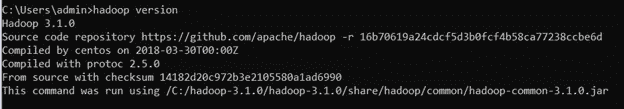

因为它没有抛出任何错误，并且成功地显示了`hadoop`版本，恭喜；Hadoop 成功安装在系统中，并且已经成功安装到一半。如果你的情况不同，你应该错过了一些东西。回去重新检查。否则你无法前进。

# **格式化 NameNode**

一旦`hadoop`安装完毕，`NameNode`就会被格式化。这样做是为了避免删除`HDFS`中的所有数据。运行以下命令-

```
hdfs namenode –format
```


# 最后一件事

将`hadoop-yarn-server-timelineservice-3.1.0`从安装`hadoop`的`share`文件夹的`hadoop`目录下的`hadoop`中的`yarn`目录下的`timelineservice`文件夹复制到安装`hadoop`的`share`文件夹的`hadoop`目录下的`yarn`目录下。

即。，`\hadoop-3.1.0\share\hadoop\yarn\timelineservice`到`\hadoop-3.1.0\share\hadoop\yarn folder`。

(这里，`C:\hadoop-3.1.0\hadoop-3.1.0\share\hadoop\yarn\timelineservice`到`C:\hadoop-3.1.0\hadoop-3.1.0\share\hadoop\yarn folder`。)

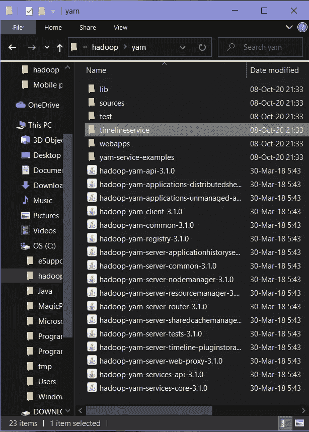

复制`hadoop-yarn-server-timelineservice-3.1.0`

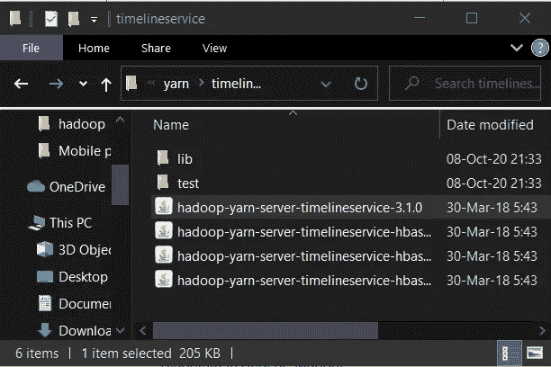

将`hadoop-yarn-server-timelineservice-3.1.0`粘贴到`yarn`文件夹中

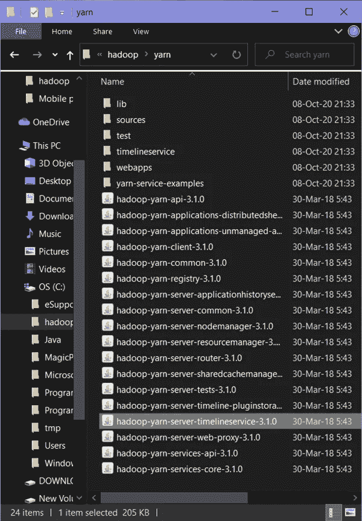

# 开始运行所有的 Apache Hadoop 发行版

现在用这个命令将`cmd`中的目录切换到`hadoop`目录的`sbin`文件夹中，

> 注意:确保您按照您的系统编写路径。(这里，`C:\hadoop-3.1.0\hadoop-3.1.0\sbin`)

```
cd C:\hadoop-3.1.0\hadoop-3.1.0\sbin
```

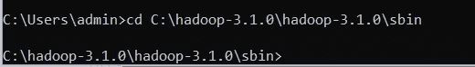

使用该命令启动`namenode`和`datanode`

```
start-dfs.cmd
```

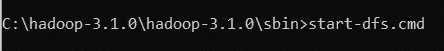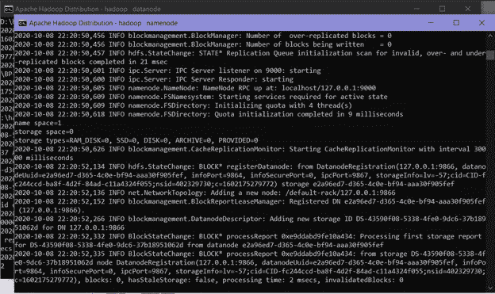

将为`NameNode`和`DataNode`打开另外两个 cmd 窗口

现在通过这个命令启动`yarn`

```
start-yarn.cmd
```

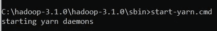

将会打开另外两个窗口，一个用于`yarn resource manager`，另一个用于`yarn node manager`。

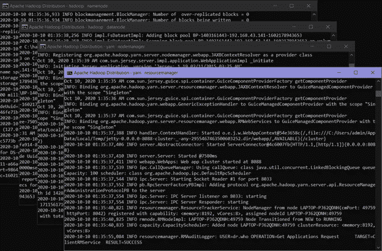

现在一切正常。😇

> 注意:确保所有 4 个 Apache Hadoop 发行版窗口(`hadoop namenode`、`hadoop datanode`、`yarn nodemanager`、`yarn resourcemanager`)都已弹出并正在运行。如果它们没有运行，您将会看到错误或关闭消息。在这种情况下，您需要调试错误。

# 确认

要访问有关资源管理器当前作业、成功和失败作业的信息，请访问浏览器中的链接-[http://localhost:8088/cluster](http://localhost:8088/cluster)


要查看关于`hdfs` ( `namenode`和`datanode`)的详细信息，请在浏览器中访问此链接-[http://localhost:50070/](http://localhost:50070/)

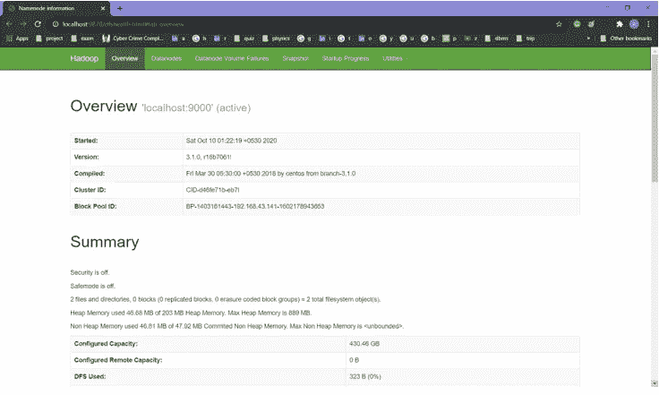

> 注意:如果您使用的是 3 . 0 . 0-Alpha 1 之前的`Hadoop` *版本，则使用端口[http://localhost:50070/](http://localhost:50070/)*

# 结论

术语`***Hadoop***`通常用于基本模块和子模块，也用于*生态系统*，或者可以安装在 Hadoop 之上或与其一起安装的附加软件包的集合，例如`[Apache Pig](https://en.wikipedia.org/wiki/Pig_(programming_tool))`、`[Apache Hive](https://en.wikipedia.org/wiki/Apache_Hive)`、`[Apache HBase](https://en.wikipedia.org/wiki/Apache_HBase)`、`[Apache Phoenix](https://en.wikipedia.org/wiki/Apache_Phoenix)`、`[Apache Spark](https://en.wikipedia.org/wiki/Apache_Spark)`、`[Apache ZooKeeper](https://en.wikipedia.org/wiki/Apache_ZooKeeper)`、`[Cloudera Impala](https://en.wikipedia.org/wiki/Cloudera_Impala)`、`[Apache Flume](https://en.wikipedia.org/wiki/Apache_Flume)`、`[Apache Sqoop](https://en.wikipedia.org/wiki/Apache_Sqoop)`、`[Apache Oozie](https://en.wikipedia.org/wiki/Apache_Oozie)`和`[Apache Storm](https://en.wikipedia.org/wiki/Apache_Storm)`。您也可以在 windows 系统中下载该软件，使用 cmd 执行数据处理操作。

Hadoop `MapReduce`可以用来执行数据处理活动。然而，它也有局限性，正是由于这些局限性，像`Spark`和`Pig`这样的框架出现并流行起来。用不到 10 行的`Pig`代码可以写出 200 行的`MapReduce`代码。

# **参考**

[1].[https://hadoop.apache.org/](https://hadoop.apache.org/)

[2].[https://cwiki . Apache . org/confluence/display/Hadoop 2/Hadoop 2 on windows](https://cwiki.apache.org/confluence/display/HADOOP2/Hadoop2OnWindows)

[3].[https://dimensional . in/know-how-to-install-and-run-Hadoop-on-windows-for-初学者/#:~:text = We % 20 will % 20 be % 20 installing % 20 single，version % 201.8% 20 in % 20 your % 20 system。&text =下载% 20% 20 文件% 20 根据%20to，(C%3A%5CJava%5Cjdk1](https://dimensionless.in/know-how-to-install-and-run-hadoop-on-windows-for-beginners/#:~:text=We%20will%20be%20installing%20single,version%201.8%20in%20your%20system.&text=Download%20the%20file%20according%20to,(C%3A%5CJava%5Cjdk1)