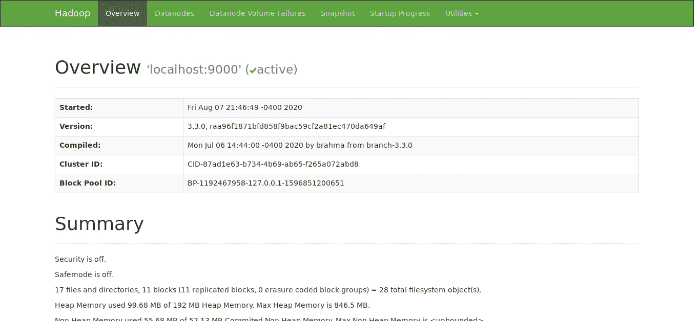

# Docker 上的 Hadoop 单节点集群

> 原文：<https://medium.com/analytics-vidhya/hadoop-single-node-cluster-on-docker-e88c3d09a256?source=collection_archive---------10----------------------->


本教程将展示如何使用 docker 获得一个 Hadoop 单节点集群，我们将从 Docker 映像构建开始运行一个容器，其环境中的 **Hadoop 3.3.0** 配置为单节点集群。

## 创建 Hadoop 映像

```
$ git clone [https://github.com/rancavil/hadoop-single-node-cluster.git](https://github.com/rancavil/hadoop-single-node-cluster.git)
$ cd hadoop-single-node-cluster
$ docker build -t hadoop .
```

## 要运行并创建容器，请执行下一个命令:

要运行并创建容器，请执行以下命令:

```
$ docker run -it — name <container-name> -p 9864:9864 -p 9870:9870 -p 8088:8088 — hostname <your-hostname> hadoop
```

将**的容器名**改为你喜欢的名字，将**的主机名**设置为你的 IP 或机器名。您可以使用本地主机作为您的主机名

当您运行容器时，将执行**docker-entry point . sh**shell 来创建和启动 Hadoop 环境。

您应该会看到以下提示:

```
hduser@localhost:~$
```

您已经准备好开始使用 Hadoop 了。

## 检查我们的 Hadoop 环境

要检查 Hadoop 容器是否正常工作，请访问浏览器中的 URL。

```
[http://localhost:9870](http://localhost:9870)
```

您将在浏览器上看到以下屏幕。



**注意:**HDFS-site . XML 配置具有属性。

```
<property>
      <name>dfs.permissions</name>
      <value>false</value>
</property>
```

所以**不要在**生产环境**中使用**。

**第一个例子**

创建执行 MapReduce 作业所需的 HDFS 目录:

```
hduser@localhost:~$ hdfs dfs **-mkdir** /user
hduser@localhost:~$ hdfs dfs **-mkdir** /user/hduser
```

我们刚刚在分布式文件系统上创建了目录/user/hduser。

将输入文件复制到分布式文件系统中:

我们将在/user/hduser 中创建一个名为 input 的目录。

```
hduser@localhost:~$ hdfs dfs -mkdir input
hduser@localhost:~$ hdfs dfs -put $HADOOP_HOME/etc/hadoop/*.xml input
```

运行提供的一些示例:

```
hduser@localhost:~$ hadoop jar $HADOOP_HOME/share/hadoop/mapreduce/hadoop-mapreduce-examples-3.3.0.jar grep input output ‘dfs[a-z.]+’2020–08–08 01:57:02,411 INFO impl.MetricsConfig: Loaded properties from hadoop-metrics2.properties
 2020–08–08 01:57:04,754 INFO impl.MetricsSystemImpl: Scheduled Metric snapshot period at 10 second(s).
 2020–08–08 01:57:04,754 INFO impl.MetricsSystemImpl: JobTracker metrics system started
 2020–08–08 01:57:08,843 INFO input.FileInputFormat: Total input files to process : 10
 …………..
 ………….
 …………
 File Input Format Counters
 Bytes Read=175
 File Output Format Counters
 Bytes Written=47
```

最后，检查输出文件:检查来自分布式文件系统的输出文件，并检查它们:

```
hduser@localhost:~$ hdfs dfs **-ls** output/
Found 2 items
-rw-r — r — 1 hduser supergroup 0 2020–08–08 01:58 output/_SUCCESS
-rw-r — r — 1 hduser supergroup 47 2020–08–08 01:58 output/part-r-00000
```

在分布式文件系统上使用 **cat** 命令检查结果:

```
hduser@localhost:~$ hdfs dfs **-cat** output/*
1 dfsadmin
1 dfs.replication
1 dfs.permissions
```

**停止并重新启动集装箱**

要停止容器，请执行以下命令，以便感激地关闭。

```
hduser@localhost:~$ stop-dfs.sh
hduser@localhost:~$ stop-yarn.sh
```

之后。

```
hduser@localhost:~$ exit
```

要重新启动容器，并返回到我们的 Hadoop 环境，请执行:

```
$ docker start -i <container-name>
```

尽情享受吧！！！

**更新:**如果你想了解 MapReduce 是如何工作的，你可以去 [MapReduce 与 Python 的例子](/@rancavil/mapreduce-example-with-python-b435a9858718)。