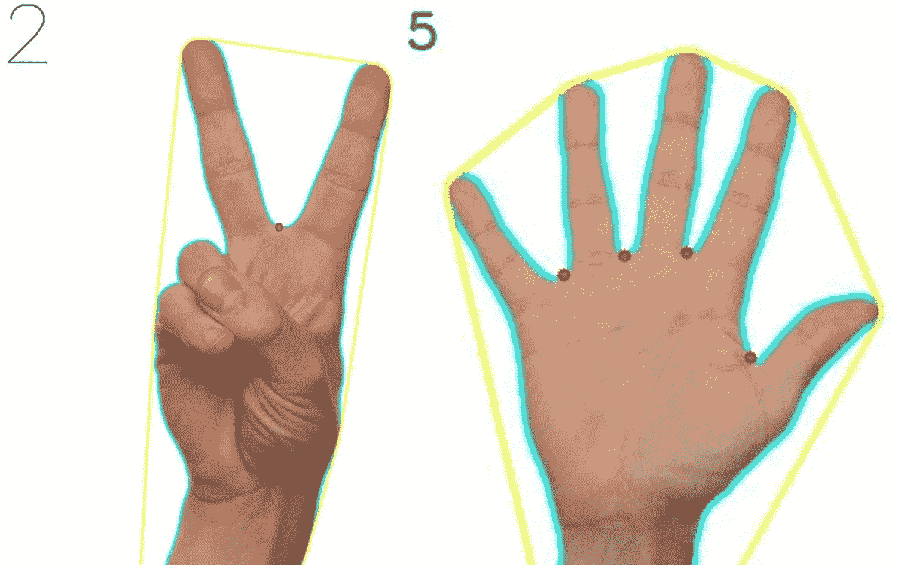

# 使用 OpenCV-Python 实现手部检测和手指计数

> 原文：<https://medium.com/analytics-vidhya/hand-detection-and-finger-counting-using-opencv-python-5b594704eb08?source=collection_archive---------0----------------------->

## 用 OpenCV-Python 结合余弦定理实现手指计数问题的手部检测。

手部检测和手指计数

看到上面的图片，你会非常兴奋地去实现它(像我一样)。所以不要浪费太多时间，让我们跳到代码。

# OpenCV