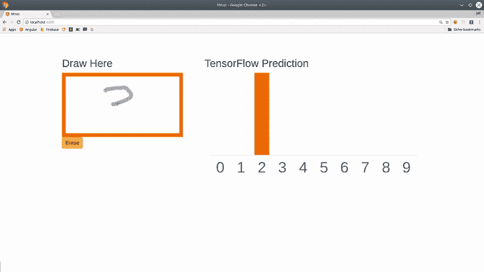

# 使用逻辑回归的手数字识别(Python + sklearn)

> 原文：<https://medium.com/analytics-vidhya/hand-digit-recognition-using-logistic-regression-python-sklearn-364d02ad02db?source=collection_archive---------7----------------------->



人类非常擅长识别手写数字，但你有没有想过人类的大脑是如何高效地识别手写数字的？我们能利用大脑的这种能力让机器识别笔迹吗？是啊！在这个博客中，我们要写一个程序来识别手写，所以让我们开始吧。

*   **创建数据集:**我们将使用 Scikit learn 提供的内置数据集来对手指进行分类。

```
**from** **sklearn** **import** datasets
digits = datasets.load_digits()dir(digits)#OUTPUT OF DIR(DIGITS)['DESCR', 'data', 'images', 'target', 'target_names']
```

*数字*变量包含['描述'，'数据'，'图像'，'目标'，'目标名称']。我们需要用于训练手部数字识别的特征和标签。在这里，我们将使用图像作为特征，目标作为标签。

```
**print** type(digits.images)
**print** type(digits.target)#Output these are the numpy array
<type 'numpy.ndarray'>
<type 'numpy.ndarray'>digits.images.shape#Image shapes
#Out: (1797, 8, 8)
```

*digits.image* 是一个三维数组。第一维索引图像，我们看到总共有 1797 个图像。接下来的两个维度对应于每个图像中像素的 x 和 y 坐标。每个图像有 8×8 = 64 个像素。换句话说，这个阵列可以在 3D 中表示为一堆 8×8 像素的图像。我们来看第一张 8×8 图像的数据。数组中的每个槽对应一个像素，槽中的值是像素中黑色的数量。

```
**print** digits.images[0]#Out:
[[ 0\.  0\.  5\. 13\.  9\.  1\.  0\.  0.]
 [ 0\.  0\. 13\. 15\. 10\. 15\.  5\.  0.]
 [ 0\.  3\. 15\.  2\.  0\. 11\.  8\.  0.]
 [ 0\.  4\. 12\.  0\.  0\.  8\.  8\.  0.]
 [ 0\.  5\.  8\.  0\.  0\.  9\.  8\.  0.]
 [ 0\.  4\. 11\.  0\.  1\. 12\.  7\.  0.]
 [ 0\.  2\. 14\.  5\. 10\. 12\.  0\.  0.]
 [ 0\.  0\.  6\. 13\. 10\.  0\.  0\.  0.]]
```

让我们试着想象一下这个图像:

```
**import** **matplotlib.pyplot** **as** **plt**
plt.imshow(digits.images[0],cmap='binary')
plt.show()
```

现在让我们研究一下目标属性:

```
**print** digits.target.shape
**print** digits.target#Out:
(1797,)
[0 1 2 ... 8 9 8]
```

我们已经准备好了特征和目标，让我们将这些数据交给逻辑回归算法来对手指识别进行分类。

让我们开始制作模型。

## 将数据分为训练集和测试集(数字数据集)

我们制作训练和测试集，以确保在我们训练我们的分类算法之后，它能够很好地推广到新数据。

```
from sklearn.model_selection import train_test_split
x_train, x_test, y_train, y_test = train_test_split(digits.data, digits.target, test_size=0.25, random_state=0)
```

## 为机器学习创建一个模型

`from sklearn.linear_model import LogisticRegression`

## 创建模型的实例

#所有未指定的参数都设置为默认值
`logisticRegr = LogisticRegression()`

根据数据训练模型，存储从数据中学习到的信息

模型正在学习数字(x_train)和标签(y_train)之间的关系

`logisticRegr.fit(x_train, y_train)`

预测新数据(新图像)的标签

使用模型在模型训练过程中学习到的信息

```
# Returns a NumPy Array
# Predict for One Observation (image)
logisticRegr.predict(x_test[0].reshape(1,-1))
```

一次预测多个观察结果(图像)

`logisticRegr.predict(x_test[0:10])`

恭喜你！我们的模型已经可以分析手写数字了。