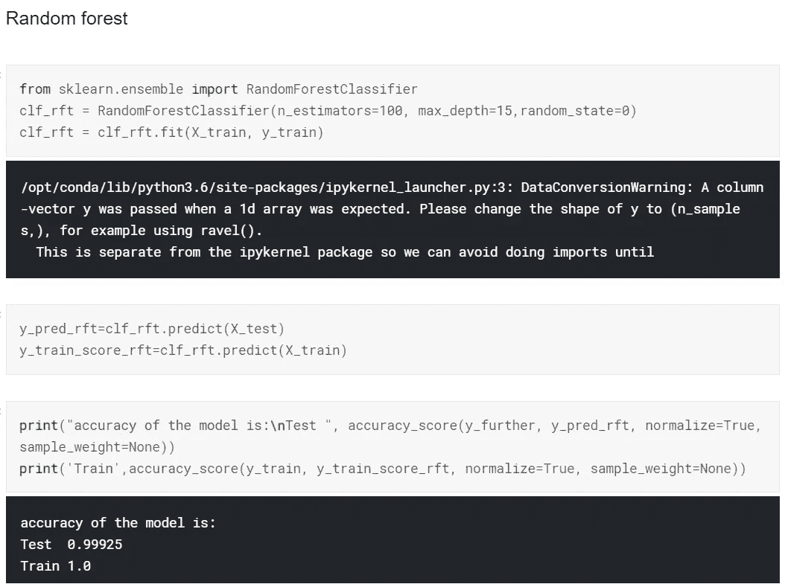

# 使用 Python 进行手势分类

> 原文：<https://medium.com/analytics-vidhya/hand-gesture-recognition-using-python-221623f4c4b4?source=collection_archive---------3----------------------->

# **瞄准**

这个项目的目标是训练一个机器学习算法，能够对不同手势的图像进行分类，例如拳头、手掌、拇指和其他手势。例如，这种分类可用于手势导航。

# **数据集**

手势识别数据库由跳跃运动传感器采集的一组近红外图像组成。该数据库由 10 个不同的对象(5 男 5 女)所做的 10 个不同的手势(如上所示)组成。

Leap Motion 传感器记录的 10 种不同手势(引用如下)

# 导入包

首先，我们必须导入几个 python 包，这是处理图像和数组所需要的。

# 加载数据

有了上面的数据集，我们现在开始准备图像来训练模型。我们必须将所有图像加载到一个名为 **X** 的数组中，并将所有标签加载到另一个名为 **y** 的数组中。数组 **Z** 包含数据集中的图像，而数组 **X** 包含存在于 **Z.** 中的图像的二进制图像

现在我们已经将所有的像素转换成相应的数字，我们所有的图像都在一个多维数组中，所以我们必须展平数组才能继续。Numpy 包用一个叫做 *flatten()的函数帮助我们。*

拉平左边的图像数组，并将标签数组重新整形为 n×1 数组。

# 主成分分析和预处理

**主成分分析** ( [**PCA**](https://en.wikipedia.org › wiki › Principal_component_analysis) )是**用**通过线性组合来解释一组变量的方差-协方差结构。通常**被**用作降维技术。我们使用这种技术，减少了数据中的维数。

在 PCA 之前，我们的尺寸是 20000 * 9600

我们把维数减少到 20，这就导致了，

在 PCA 之后，数据的维数变成 20000 * 20

我们现在[归一化](https://stackoverflow.com/questions/40758562/can-anyone-explain-me-standardscaler)数据，以确保不同的特性具有相似的取值范围，为此我们使用 *StandarScaler()。*

我们使用 sklearn 软件包将数据分成 80–20 的比例

现在我们有了已经标准化的训练和测试数据，我们可以开始训练不同的模型来对手势进行分类。

> 随机梯度下降

这里我们使用“对数”损失函数作为参数

> 决策树分类器

决策树的最大深度在参数中设置为 10。

> 随机森林

在参数中，树的数量被设置为 100，每棵树的深度被设置为 15。

> 逻辑回归

> 朴素贝叶斯

我们使用高斯朴素贝叶斯算法。其他类型包括多项式朴素贝叶斯等。

> 梯度下降分类器

# 结果

随机梯度下降:70.3%

决策树:95%

随机森林:99.925%

逻辑回归分析:72.2%

高斯朴素贝叶斯:65.6%

梯度下降:23.6%

# 结论

基于以上呈现的结果，我们可以得出结论，其中一个分类器能够基于随机森林分类器算法以 99.925%的准确度对手势进行准确分类。

模型的准确性基于我们的数据集中的许多方面以及训练数据中存在的特征。该数据集是在没有任何运动的情况下创建的，即呈现的手势相当清晰，图像清晰且没有背景。此外，有足够数量的样本，使我们的模型稳健。

缺点是，对于不同的问题，我们可能需要更多的数据来更新我们模型的参数，使其朝着更好的方向发展。由于真实世界场景中的混乱和噪音，我们需要更多类似真实世界的噪音数据。

要查看完整的笔记本，请查看我的 Github :D 仓库

# 引用

T.Mantecón，C.R. del Blanco，F. Jaureguizar，N. García，“使用 Leap Motion Controller 提供的红外图像进行手势识别”，Int。糖膏剂智能视觉系统的先进概念，ACIVS 2016，意大利莱切，第 47–57 页，2016 年 10 月 24–27 日。(doi:10.1007/978–3–319–48680–2 _ 5)