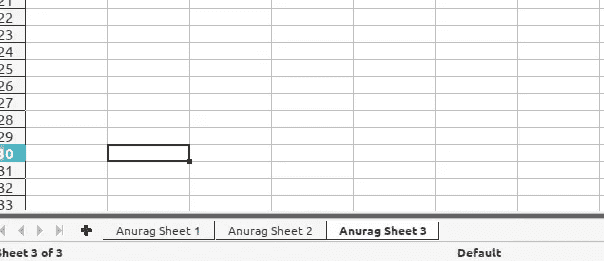
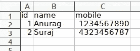

# 使用 Python 处理 Excel 文件(第 1 部分)

> 原文：<https://medium.com/analytics-vidhya/handle-excel-file-using-python-part-1-338e0b59fa26?source=collection_archive---------28----------------------->


在这篇博客中，我们将解释如何使用 Python 来处理 Excel 表格。在这里，我们将介绍如何添加一个新的工作表，删除现有的工作表，向单元格添加数据，从工作表中读取数据。这里我将使用 Python 的 openpyxl 模块，我们也可以使用 Pandas 来处理 Excel 表格，但是这里我们将使用 openpyxl 模块。

使用这个模块，我们可以做很多事情，比如从 Excel 中读取数据，将其转换为 JSON，并使用 Python 将其索引到 Elasticsearch。同样，我们可以从文本文件或 Elasticsearch 中读取数据，并将其写入 Excel 表格。我们还可以在 Excel 表上应用条件格式，使其更有效。我假设 Python 已经安装在您的机器上。所以我们开始用 Python 处理 Excel 吧。

我们需要在编写代码之前安装 openpyxl 模块，为此，我们可以使用以下命令(我使用的是 Ubuntu 19.04):

```
sudo pip3 install openpyxl
```

以上命令将为 Python 安装 openpyxl 模块。得到成功消息后，我们可以开始编写 Python 代码来处理 Excel 表。

**创建一个空白的 Excel 表**
现在我们可以创建一个空白的 Excel 表来验证是否一切都如预期的那样工作。因此，让我们创建一个 python 空白文件“testexcel.py ”,并添加以下代码:

```
# import openpyxl module as this is required to work with Excel
import openpyxl as exl # provide the Excel file name 
filename="testexcel.xlsx"# create the workbook object using the Workbook method of openpyxl
wb=exl.Workbook()# now save workbook by providing the file name 
wb.save(filename)
```

现在保存这个 python 文件，并使用以下命令执行它:

```
python3 testexcel.py
```

执行此命令后，您可以在保存 Python 脚本的同一文件夹中看到“testexcel.xlsx”。我们可以提供 Excel 文件的完整路径，以防我们想将它保存在其他地方。

**获取 Excel 文件详情**

现在，我们将读取 Excel 表格，并尝试获取文件详细信息和表格详细信息等。我在前一个文件中添加了三张纸，这样会使事情更清楚易懂。



我们需要编写以下代码来获取 Excel 表的详细信息:

```
# import openpyxl module as this is required to work with Excel
import openpyxl as exl  

# provide the Excel file name 
filename="testexcel.xlsx"

# Loading the Excel workbook .xlsx file which we have created earlier
workbook = exl.load_workbook(filename)

# Getting the basic properties of the workbook like last modified by, Created date time, etc
prop = workbook.properties
print(prop)

# Getting the sheets in the workbook 
worksheet = workbook.worksheets
print(worksheet)

# Getting the sheet names in a workbook as a list of strings
sheetname = workbook.sheetnames
print(sheetname)

# Getting the active sheet in the workbook
active = workbook.active
print(active)
```

保存文件后，我们可以运行 Python 文件，该文件将给出以下输出:

```
<openpyxl.packaging.core.DocumentProperties object>
Parameters:
creator='openpyxl', title=None, description=None, subject=None, identifier=None, language='en-IN', created=datetime.datetime(2019, 12, 30, 14, 33, 54), modified=datetime.datetime(2019, 12, 30, 14, 47, 50), lastModifiedBy=None, category=None, contentStatus=None, version=None, revision='1', keywords=None, lastPrinted=None
[<Worksheet "Anurag Sheet 1">, <Worksheet "Anurag Sheet 2">, <Worksheet "Anurag Sheet 3">]
['Anurag Sheet 1', 'Anurag Sheet 2', 'Anurag Sheet 3']
<Worksheet "Anurag Sheet 3">
```

这样，我们可以通过读取文件来获取 Excel 文件的详细信息。

**创建一个新的工作表**
现在我们将使用 Python 向 Excel 文件添加一个新的工作表。我们需要为此编写以下代码:

```
# import openpyxl module as this is required to work with Excel
import openpyxl as exl  

# provide the Excel file name 
filename="testexcel.xlsx"

# Loading the Excel workbook .xlsx file which we have created earlier
workbook = exl.load_workbook(filename)

# Creating a new sheet by using create_sheet() method
workbook.create_sheet('Anurag test sheet')

# save the workbook
workbook.save(filename)
```

执行上述代码后，我们可以在 Excel 文件中看到一个新的工作表。

**向 Excel 表格添加数据**
我们可以通过以下方式向表格的任意单元格添加数据:

```
1) Set value for cell by providing the cell address like A1, B3, etc
sheet['A1'] = 1

2) Set value for cell by providing the row and column number
sheet.cell(row=2, column=2).value = 2

3) We can also append the data in tablular form, see the below code:

employeedata=[('id','name','mobile'),
      (1,'Anurag',1234567890),
      (2,'Suraj',4323456787)]

# append above data
for row in employeedata:
    sheet.append(row)
```

现在让我们编写代码，在 Excel 的活动工作表中添加单元格值:

```
# import openpyxl module as this is required to work with Excel
import openpyxl as exl  

# provide the Excel file name 
filename="testexcel.xlsx"

# Loading the Excel workbook .xlsx file which we have created earlier
workbook = exl.load_workbook(filename)

# Take the reference of active sheet
sheet = workbook.active

employeedata=[('id','name','mobile'),
      (1,'Anurag',1234567890),
      (2,'Suraj',4323456787)]

# append above data
for row in employeedata:
    sheet.append(row)

# save the workbook
workbook.save(filename)
```

运行上述代码后，我们可以看到 Excel 文件中的数据。



在这篇博客中，我们介绍了如何查看 Excel 表格的细节，如何将数据写入 Excel 表格，以及如何添加新的表格。在下一篇博客“ [**【使用 Python 处理 Excel 文件(第二部分)**](https://bqstack.com/b/detail/104/Handle-Excel-file-using-Python-%28Part-2%29) ”中，我们将讲述如何从 Excel 表格中读取数据以及如何在 Excel 表格数据上添加样式。

【https://bqstack.com】最初发表于[](https://bqstack.com/b/detail/103)**。**