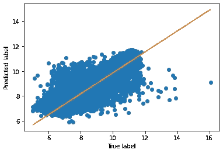

# 处理分类要素中的缺失值

> 原文：<https://medium.com/analytics-vidhya/handle-missing-values-in-categorical-features-b7c5b073dda2?source=collection_archive---------5----------------------->

## 用用例正确处理缺失分类数据的有用指南


在这篇文章中，我们将通过几个相互比较的例子来展示如何处理带有缺失值的分类特征。将使用[汽车分类广告](https://www.kaggle.com/mirosval/personal-cars-classifieds)数据集，通过简单的线性回归模型预测广告价格。

为了显示各种策略和相关的利弊，我们将关注该数据集的一个特定分类特征，即**制造商**，汽车品牌的名称(丰田、起亚、福特、宝马……)。

## 发布步骤:

*   **显示原始数据**:让我们看看我们的数据集是什么样子。
*   **处理分类特征中的缺失值**:我们将通过比较不同的技术来处理缺失值。
*   1 — **删除**整列**制作者**。
*   2 — **用*最常用的值替换***缺失的值。
*   3 — **删除具有空值的**行。
*   4 — **使用分类器算法预测**值(监督或非监督)。
*   **结论！**

## 显示原始数据

让我们开始导入一些库

```
import pandas as pd
import numpy as np

from sklearn.linear_model import LinearRegression
from sklearn.metrics import mean_squared_error, r2_score
from sklearn.model_selection import train_test_split
from scipy import stats
import matplotlib.pyplot as plt
import seaborn as sns

%matplotlib inline
```

首先，让我们看看我们的数据集是什么样子的

```
filename = "cars.csv"

dtypes = {
    "maker": str, # brand name
    "model": str,
    "mileage": float, # km
    "manufacture_year": float,
    "engine_displacement": float,
    "engine_power": float,
    "body_type": str, # almost never present
    "color_slug": str, # also almost never present
    "stk_year": str,
    "transmission": str, # automatic or manual
    "door_count": str,
    "seat_count": str,
    "fuel_type": str, # gasoline or diesel
    "date_created": str, # when the ad was scraped
    "date_last_seen": str, # when the ad was last seen
    "price_eur": float} # list price converted to EUR

df_cleaned = pd.read_csv(filename, dtype=dtypes)
print(f"Raw data has {df_cleaned.shape[0]} rows, and   {df_cleaned.shape[1]} columns")
```

`Raw data has 3552912 rows, and 16 columns`

在清除了所有缺少数据和无用特征的列之后(整个过程显示在我的 [github](https://github.com/daniele-salerno/Handle-missing-values-in-Categorical-Features) 上)，除了 **maker** 、
之外，我们会发现自己处于这种情况:

```
# Missing values
print(df_cleaned.isna().sum())maker                  212897
mileage                     0
manufacture_year            0
engine_displacement         0
engine_power                0
price_eur                   0
fuel_type_diesel            0
fuel_type_gasoline          0
ad_duration                 0
seat_str_large              0
seat_str_medium             0
seat_str_small              0
transmission_auto           0
transmission_man            0
dtype: int64 
```

## 相关矩阵

```
corr = df_cleaned.corr()
plt.subplots(figsize=(15,10))
sns.heatmap(corr, xticklabels=corr.columns,yticklabels=corr.columns, annot=True, )
```


## 处理分类特征中的缺失值

现在我们只需要处理 **maker** 特性，我们将用四种不同的方式来完成。然后我们将为每种预测价格的方法创建一个简单的线性回归模型。

*   **第一个模型**:删除整列**制造者**。
*   **第二模型**:用*最常用值*替换缺失值。
*   **第三种模式**:删除空值行。
*   **第四个模型**:用 RandomForestClassifier 预测缺失值。

```
mse_list = []
r2_score_list = []

def remove_outliers(dataframe):
    '''
    return a dataframe without rows that are outliers in any column
    '''
    return dataframe\
    .loc[:, lambda df: df.std() > 0.04]\
    .loc[lambda df: (np.abs(stats.zscore(df)) < 3).all(axis=1)]

def plot_regression(Y_test, Y_pred):
    '''
    method that plot a linear regression line on a scatter plot
    '''
    x = Y_test
    y = Y_pred

    plt.xlabel("True label")
    plt.ylabel("Predicted label")
    plt.plot(x, y, 'o')

    m, b = np.polyfit(x, y, 1)

    plt.plot(x, m*x + b)

def train_and_score_regression(df):

    df_new = remove_outliers(df) 

    # split the df
    X = df_new.drop("price_eur", axis=1).values
    Y = np.log1p(df_new["price_eur"].values)

    X_train, X_test, Y_train, Y_test = train_test_split(X,Y,
    test_size=0.1, random_state=0)

    # train and test of the model
    ll = LinearRegression()
    ll.fit(X_train, Y_train)
    Y_pred = ll.predict(X_test)

    mse_list.append(mean_squared_error(Y_test, Y_pred))
    r2_score_list.append(r2_score(Y_test, Y_pred))

    # print the metrics
    print("MSE: "+str(mean_squared_error(Y_test, Y_pred)))
    print("R2 score: "+str(r2_score(Y_test, Y_pred)))

    # plot the regression 
    plot_regression(Y_test, Y_pred)
```

## 删除整个栏目*制作者*

我们的第一个基本方法是创建一个没有列**生成器**的模型。当大量丢失的数据有可能使整个特性失效时，这种“无交易”实践是必要的。

在这种情况下，我们可能会有最差的度量分数，但是我们可以用它们来比较其他方法

```
df_no_maker = df_cleaned.copy()

# delete the entire column maker
df_no_maker = df_no_maker.drop("maker", axis="columns")

train_and_score_regression(df_no_maker)# MSE: 0.1384341569294906
# R2 score: 0.8401186412746953
```



这是我们的第一次尝试。我们能改进它吗？

## 用最频繁的数据替换缺失值

当然更有效的方法是用最频繁的数据赋值缺失值:众数。但是请注意，如果丢失的值相当多，这可能会导致不平衡的数据集。

```
df_replace_mode = df_cleaned.copy()

# replace missing values with the mode
replace_with = df_replace_mode["maker"].mode() 
df_replace_mode["maker"].fillna(replace_with,inplace=True)

df_replace_mode = pd.get_dummies(df_replace_mode,columns=["maker"])

train_and_score_regression(df_replace_mode)# MSE: 0.10243504754361979
# R2 score: 0.8703379824571595
```


正如预期的那样，我们在没有丢失任何行的情况下获得了比以前更好的度量分数

## 删除具有空值的行

另一种选择是删除具有空值的行。如果我们的数据集非常小，绝对不推荐，但是如果只有很少的值丢失或者如果我们有一个非常大的数据集，这很容易实现

```
df_del_rows = df_cleaned.copy()

# deleteing row with null maker
df_del_rows = df_del_rows[df_del_rows['maker'].notna()]

df_del_rows = pd.get_dummies(df_del_rows,columns=["maker"])

train_and_score_regression(df_del_rows)# MSE: 0.10465841311348424
# R2 score: 0.8580395349902117
```


这一次，我们得到了比上一次更差的得分指标。当然部分原因是这次我们决定删除一些行，这使我们丢失了信息

## 用 RandomForestClassifier 预测缺失值

最有趣的方法无疑是用分类算法预测缺失值。这将使我们有机会不浪费数据集的很大一部分，从而不浪费大量信息。如果我们的预测足够准确，用这种技术我们应该有最好的评分标准。

因此:

*   我们必须在列 *maker* 赋值的行和空值的行之间分割数据集。
*   第一个数据帧将成为我们创建分类模型的数据帧，以*制造者*作为目标特征。
*   使用由此创建的模型来预测具有空值的数据帧中的缺失值
*   将两个数据帧合并成一个
*   像以前一样训练线性回归模型

让我们将数据集一分为二

```
df_with_maker = df_cleaned[df_cleaned['maker'].notna()]
print("N. rows with maker not null:", df_with_maker.shape[0])

df_no_maker = df_cleaned[df_cleaned['maker'].isna()]
print("N. rows with maker null:", df_no_maker.shape[0])# N. rows with maker not null: 1690186
# N. rows with maker null: 212897
```

在这里，我们创建分类模型，并查看它的指标

```
from sklearn.ensemble import RandomForestClassifier
from sklearn.metrics import log_loss
from sklearn.metrics import accuracy_score

X = df_with_maker.drop("maker", axis=1).values
Y = df_with_maker["maker"].values

X_train, X_test, Y_train, Y_test = train_test_split(X, Y, test_size=0.1, random_state=0)

forest = RandomForestClassifier(n_estimators=45, max_depth=25, random_state=False, 
                                max_features=0.6, min_samples_leaf=3, n_jobs=-1)

forest.fit(X_train, Y_train)

y_pred_train = forest.predict(X_train)
y_pred = forest.predict(X_test)

y_pred_proba = forest.predict_proba(X_test)

accuracy_train = accuracy_score(Y_train, y_pred_train)
accuracy_test = accuracy_score(Y_test, y_pred)

print("ACCURACY: TRAIN=%.4f TEST=%.4f" % (accuracy_train,accuracy_test))
print("LOG LOSS: "+str(log_loss(Y_test, y_pred_proba)))

importances = forest.feature_importances_
indices = list(np.argsort(importances))[::-1]

plt.title("Feature importances")
plt.barh(range(len(indices)), importances[indices], color="g", align="center")
plt.yticks(range(len(indices)), df_with_maker.iloc[:, 1:].columns[indices])
# plt.ylim([-1, len(indices)])
plt.gca().invert_yaxis()# ACCURACY: TRAIN=0.9424 TEST=0.8962
# LOG LOSS: 0.3384233751455516
```


不出所料，模型告诉我们**发动机 _ 排量**和**发动机 _ 功率**是能够定义**制造商**的关键特征

现在我们有了模型，让我们用预测值填充第二个数据框…

```
df_no_maker = df_no_maker.drop('maker', axis=1)
prediction = forest.predict(df_no_maker)

df_no_maker.insert(0, 'maker', prediction)
```

…然后，将两个数据帧合并在一起

```
frames = [df_with_maker, df_no_maker]
df_final = pd.concat(frames)
```

这是我们最后的数据框架

```
df_final.head()
```


现在我们的最终数据集已经准备好了，我们可以重新创建线性回归模型，并检查我们是否改进了它的指标

```
df_final = pd.get_dummies(df_final,columns=["maker"])

train_and_score_regression(df_final)# MSE: 0.08867003817099878
# R2 score: 0.8825117873840629
```


在这里，我们可以看到最好的指标值，这要归功于通过上述数据集合并保存的行

## 结论！

我们的考虑是由指标驱动的。从数据集中删除要素应该是我们最后的手段。如果缺少的数据很少或者数据集非常大，用最频繁的数据替换空数据或者删除行可能是一个方便的解决方案。相反，如果我们有很多缺失值或一个小数据集，预测/聚类可以为我们节省有价值的信息，否则这些信息将会丢失。

```
options_list = [
    "Delete the entire column Maker", 
    "Replace null values with the mode", 
    "Delete rows with null values", 
    "Predict the missing values"
]

df_metrics = pd.DataFrame({
    "": options_list,
    "MSE": mse_list,
    "R2_score": r2_score_list,
})
df_metrics.head()
```


## 感谢阅读！