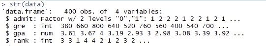

# 处理阶层失衡问题

> 原文：<https://medium.com/analytics-vidhya/handling-class-imbalance-problem-2eb366e21979?source=collection_archive---------19----------------------->

*什么是阶层失衡问题？*

D ata 据说在阶层分布高度*不平衡时，会遭遇**T5**阶层不平衡问题。在这种情况下，属于一个类别的观察值的数量显著低于属于其他类别的观察值的数量。当面对不平衡的数据集时，机器学习算法往往会产生不可接受的预测。*

**在本文中，我们将看到一些关于如何使用 R.* 处理 ***类不平衡问题*** *的技巧**

*让我们根据 GRE 分数、GPA 分数和学校排名等独立变量来获取因变量为大学录取的数据。*

*下面是数据的结构。*

**

*让我们把目标变量的类型转换成一个因子。数据汇总显示了目标变量的不平衡。*

****

***在我们的数据中，大约三分之二的数据属于‘0’类。***

****由此，我们可以说存在着阶级不平衡。****

*因此，当我们在这种数据上开发预测模型时，该模型将由类“0”的贡献主导。当预测未被录取的班级时，模型的准确性将优于被录取的班级。但是，在这种情况下，我们可能会对更准确地预测录取类别感兴趣。所以这叫做 ***阶级不平衡问题*。***

## *数据分区*

*现在，让我们按照 70:30 的比例将数据划分为训练数据和测试数据。*

****

***测试数据有 115 个观察值，列车数据有 285 个观察值***

*下面是目标变量在训练数据中的分布。大约 66%的数据属于未被承认的类别。*

**

## *预测模型*

*让我们在测试数据上使用随机森林算法和相应的混淆矩阵开发一个预测模型。*

**

*这里我们可以看到模型的准确率为 67.83%。该模型正确地将 70 名学生分类为未被录取，将 8 名学生分类为被录取。95%的置信区间表明准确度在 58.47%和 76.23%之间。*

****【无信息率】*** 表示被观察类的最大比例。在这个数据集中，最大的比例((70+15)/115=73.91%)属于“0”类。这意味着，如果我们不建立任何模型，并明确分类每一个未被接受的申请人，它将是正确的 73.9%的时间。此外，模型的整体准确性低于无信息率。因此这个模型不好。
还有，如果我们对预测 1 感兴趣，那么这个模型就不够用了。*

**敏感度是我们能够正确预测 1 类的频率。这里的灵敏度计算为 26.66%。同样， ***特异性*** 是我们能够正确预测 0 类的频率。这里计算的特异性为 83.52%。特异性比敏感性高得多的原因之一是类别 0 具有比类别 1 高得多的观察值。 ***因此这个模型是由 0 级支配的。*** 所以整体精度是 ***误导*** 。**

## **过采样**

**让我们使用 ***过采样*** 来处理不平衡数据集问题。为此，我们将使用**包 ROSE，函数 *ovun.sample*** ，方法为 ***Over*** 如下图。**

****

**我们已经提供了 N 为 376(188 * 2–188 个 0 类观察值)。因此，发生的情况就像类 1 的一些数据点被随机重复，以克服类不平衡问题。**

**现在让我们在过采样数据集上运行随机森林算法。**

****

**我们可以看到，当数据集平衡时，准确率下降到了 57.39%。灵敏度现在提高了(50%)。所以如果我们的兴趣是正确预测类 1，那么这个模型要优于上一个。但是，该模型在准确性方面表现不佳。**

## ****欠采样****

**让我们看看如何使用 ***欠采样*** 来处理类不平衡问题。欠采样。除了 下的 ***方法外，我们的功能与之前相同。*****

****

**我们提供 N 为 194(97*2)。这里，97 个数据点是从类 0 中随机欠采样的。但是一些重要的信息可能因此而丢失。**

**让我们看看使用欠采样数据集的模型的性能。**

****

**由于我们的重点是正确预测类别 1，因此我们关注的是敏感度。我们可以看到进一步提高到了 56.67%。但如果看整体模型，表现很差。**

## **两者(欠采样和过采样)**

**我们将使用与之前相同的函数进行采样，除了我们将使用的方法为*。***

******

***我们提供 N 为 285(列车数据中的观察总数)。数据汇总如上。***

***让我们看看模型的性能。***

******

***该模型的灵敏度再次下降到 50%。***

## ***摘要***

***因此，我们已经看到了类不平衡问题如何影响模型的性能，以及我们可以如何处理它的一些方法。我希望这篇文章对你有用。***