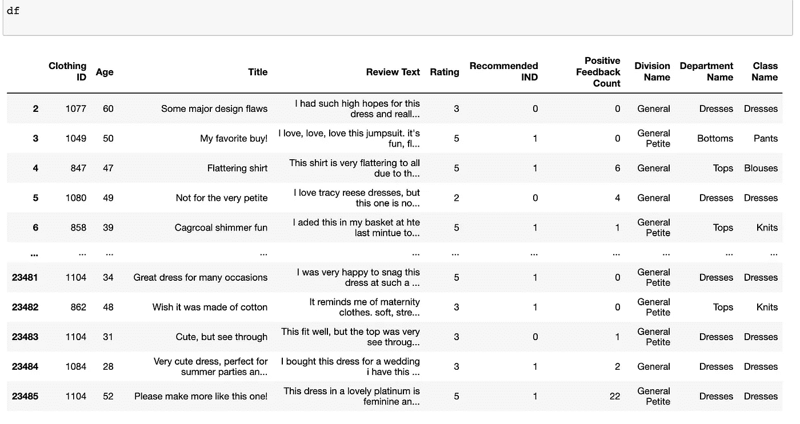
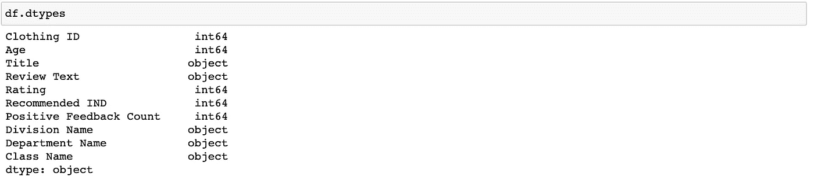

# 为具有不同数据类型的列的数据集实现 ColumnTransformer

> 原文：<https://medium.com/analytics-vidhya/handling-heterogeneous-features-in-a-dataset-using-columntransformer-aa525ebe0486?source=collection_archive---------7----------------------->

在现实世界中，所提供的数据集可能具有由非结构化文本列、分类列和数字列组成的要素列。您可能需要执行要素选择，然后可能会对传递这些不同的数据类型列来训练数据集感兴趣。在本文中，我将讨论相同的场景，在数据集上执行特征选择后，我必须处理分类列、数字列和非结构化文本列。

第一个挑战是如何将不同类型的功能整合在一起。为此，我使用了 ColumnTransformer 类。这是 scikit-learn 0.20 版本中提供的一个类。

让我们看一下代码。

在这里，我使用 Kaggle 数据集作为本文的样本。(下面的方法只是在这个数据集上使用列转换器，并不试图解决这个 Kaggle 问题)。

[](https://www.kaggle.com/nicapotato/womens-ecommerce-clothing-reviews) [## 女性电子商务服装评论

### 23，000 条客户评论和评级

www.kaggle.com](https://www.kaggle.com/nicapotato/womens-ecommerce-clothing-reviews) 

df = PD . read _ csv('/女装电子商务评论. CSV ')


让我们执行通用特征工程步骤。

1.正在移除未命名的列 0。

2.从“类名”、“审阅文本”和“标题”中删除空行。

```
df.drop(df.columns[0], axis=1, inplace=True)
df = df[~df['Class Name'].isnull()]
df = df[~df['Review Text'].isnull()]
df = df[~df['Title'].isnull()]
```

让我们看看 df 现在是什么样子



让我们找出 df 中每一列的数据类型。



显然，df 有不同的数据类型。现在，假设我渴望在模型中使用所有这些特性。因此，在将它们提供给模型之前，需要将特性转换成一个精炼的版本。对于数字特征，我需要使用 standardScaler 来缩放它们；对于分类类型，执行一键编码，并对文本列使用 countvectorizer。我们可以使用 ColumnTransformer 类实现所有这些，并将它们一起输入到模型中。

ColumnTransformer 类最多可以有 6 个参数，但是在本文中，我将只使用其中的两个参数— **transformers** 和 **remainder** 。

先说变形金刚。

“转换器”是指定要应用于数据子集的转换器对象的元组列表。它以下面提到的两种格式之一表示。

多列→(名称、变压器、[列])

单个文本列→(名称、变压器、列)

在哪里

**名称:**类型**类型 *str* 类型**

用于使用 set_params 设置参数，并帮助在网格搜索中进行搜索。

**变压器 *{'drop '，' passthrough'}，或估计器***

估计器必须支持[拟合](https://scikit-learn.org/stable/glossary.html#term-fit)和[变换](https://scikit-learn.org/stable/glossary.html#term-transform)。我将对数值列使用 StandardScaler，对非结构化文本列使用 CountVectorizer，对分类列使用 OneHotEncoder。

**【栏目】**

要对其执行变换的数据框列的列表。

你可以从 sci kit-learn . org:-[https://sci kit-learn . org/stable/modules/generated/sk learn . compose . column transformer . html # sk learn . compose . column transformer](https://scikit-learn.org/stable/modules/generated/sklearn.compose.ColumnTransformer.html#sklearn.compose.ColumnTransformer)

对于我的数据集，我需要在 ColumnTransfomer 函数的 transformers 参数中传递下面提到的转换器。

1.  简单估算器，常量估算到分类列['部门名称'，'部门名称']
2.  “审阅文本”上带有停用词的 CountVectorizer，而“标题”列上只有 CountVectorizer。
3.  用于数字列['服装 ID '，'年龄'，'评分'，'推荐指数'，'正反馈计数']的简单估算器。

```
STOPWORDS = set(stopwords.words('english'))catTransformer = Pipeline(steps=[('cat_imputer', SimpleImputer(strategy='constant', fill_value='missing')),('cat_ohe', OneHotEncoder(handle_unknown='ignore'))])textTransformer_0 = Pipeline(steps=[
    ('text_bow', CountVectorizer(lowercase=True,\
                                 token_pattern=r"(?u)\b\w+\b",\
                                 stop_words=STOPWORDS))])textTransformer_1 = Pipeline(steps=[('text_bow1', CountVectorizer())])numeric_features = ['Clothing ID','Age','Rating','Recommended IND','Positive Feedback Count']numTransformer = Pipeline(steps=[('imputer', SimpleImputer(strategy='median')),('scaler', StandardScaler())])ct = ColumnTransformer(
transformers=[
('cat', catTransformer, ['Division Name','Department Name']),
('num', numTransformer, numeric_features),
('text1', textTransformer_0, 'Review Text'),
('text2', textTransformer_1, 'Title')
])
```

拆分数据集并使上面创建的 ColumnTransformer 适合管道。

```
X = df.drop('Class Name', axis='columns')y=df['Class Name']X_train, X_test, y_train, y_test = train_test_split(X, y, test_size=0.2,random_state = 42)pipeline = Pipeline(steps=[('feature_engineer', ct),('RF', RandomForestClassifier(n_jobs=-1, class_weight='balanced'))])pipeline.fit(X_train, y_train)preds = pipeline.predict(X_test)print('accuracy %s' % accuracy_score(preds, y_test))
print(confusion_matrix(y_test, preds))
print(classification_report(y_test, preds))
```

现在，我已经成功地创建了一个管道，并通过传递定义其转换的异构特性来预测模型的准确性。

现在我们来讨论第二个参数'**余数'**。此参数用于处理数据集中未定义转换的剩余列。该参数将 ****** 'drop '作为其默认值，这意味着如果我没有为该参数指定任何值，则剩余的列将从数据集中删除；其他值为*****‘通过’。使用该参数的每个值也会影响模型的准确性。在这种情况下，我通过使用“传递”值，即情况 1，获得了更好的准确性。

例如，我不希望从数据集中转换任何特定的列，而是希望按原样提供它们。以“评级”栏为例来说明这两个参数值。为了使“Rating”列符合“remainder”参数，我不会对它应用数值转换。

**案例 1**

* with remainder = 'passthrough '。

```
STOPWORDS = set(stopwords.words('english'))catTransformer = Pipeline(steps=[('cat_imputer', SimpleImputer(strategy='constant', fill_value='missing')),('cat_ohe', OneHotEncoder(handle_unknown='ignore'))])textTransformer_0 = Pipeline(steps=[
    ('text_bow', CountVectorizer(lowercase=True,\
                                 token_pattern=r"(?u)\b\w+\b",\
                                 stop_words=STOPWORDS))])textTransformer_1 = Pipeline(steps=[('text_bow1', CountVectorizer())])numeric_features = ['Clothing ID','Age','Recommended IND','Positive Feedback Count']numTransformer = Pipeline(steps=[('imputer', SimpleImputer(strategy='median')),('scaler', StandardScaler())])ct = ColumnTransformer(transformers=[('cat', catTransformer, ['Division Name','Department Name']),('num', numTransformer, numeric_features),('text1', textTransformer_0, 'Review Text'),('text2', textTransformer_1, 'Title')],remainder='passthrough')
```

**案例 2**

* * column transformer 类将考虑不设置“remainder”参数的值，即其默认值“drop ”,因此“Rating”列应从输入数据集中删除。

```
STOPWORDS = set(stopwords.words('english'))catTransformer = Pipeline(steps=[('cat_imputer', SimpleImputer(strategy='constant', fill_value='missing')),('cat_ohe', OneHotEncoder(handle_unknown='ignore'))])textTransformer_0 = Pipeline(steps=[
    ('text_bow', CountVectorizer(lowercase=True,\
                                 token_pattern=r"(?u)\b\w+\b",\
                                 stop_words=STOPWORDS))])textTransformer_1 = Pipeline(steps=[('text_bow1', CountVectorizer())])numeric_features = ['Clothing ID','Age','Recommended IND','Positive Feedback Count']numTransformer = Pipeline(steps=[('imputer', SimpleImputer(strategy='median')),('scaler', StandardScaler())])ct = ColumnTransformer(transformers=[
('cat', catTransformer, ['Division Name','Department Name']),
('num', numTransformer, numeric_features),
('text1', textTransformer_0, 'Review Text'),
('text2', textTransformer_1, 'Title')])
```

**总结**

在本文中，我们学习了如何使用 ColumnTransformer 传递各种异构数据类型列及其特定转换。

演示:

*   处理数字、分类和非结构化文本列
*   具有“通过”和“丢弃”值的剩余参数

我希望你喜欢阅读这篇文章！！