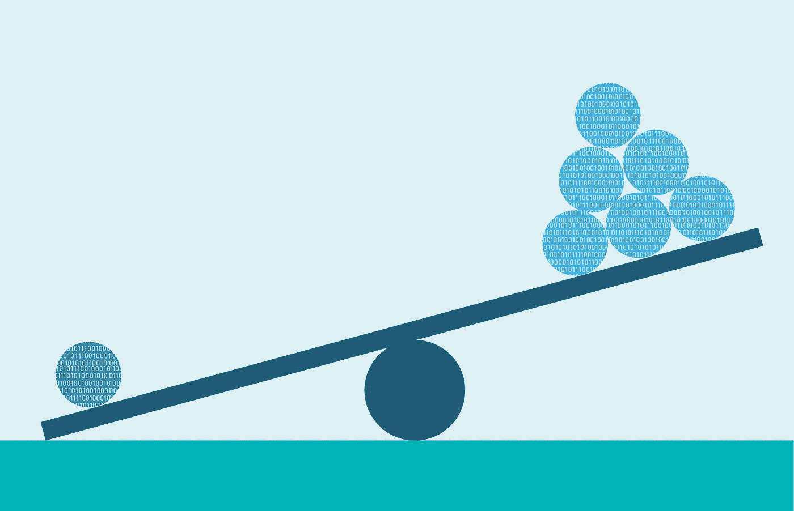
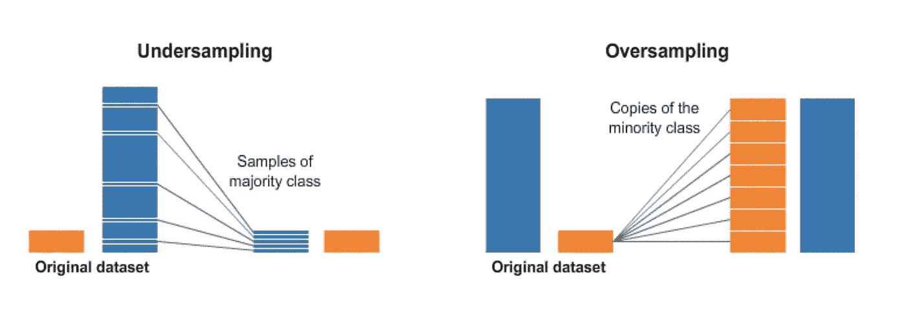
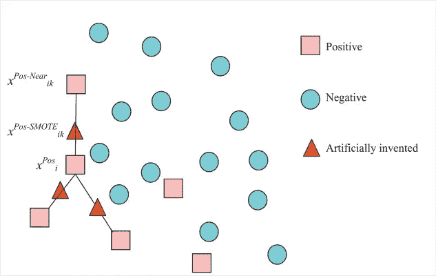
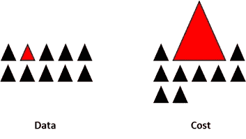

# 处理不平衡的班级！！！

> 原文：<https://medium.com/analytics-vidhya/handling-imbalanced-classes-3057a88e2a19?source=collection_archive---------11----------------------->



现实世界机器学习分类问题的许多问题之一是不平衡数据的问题。
不平衡数据是指当我们的数据中存在的类不成比例时，也就是说，每个类的比例不同，其中一个类主要存在于数据集中，而另一个类次要存在。

# 不平衡数据的问题？


图为[塞巴斯蒂安·赫尔曼](https://unsplash.com/@officestock?utm_source=medium&utm_medium=referral)在 [Unsplash](https://unsplash.com?utm_source=medium&utm_medium=referral)

*   虽然模型训练导致模型偏向少数类，这意味着，我们的模型将很好地学习我们的多数类的特征，而不能捕捉我们的少数类的特征。
*   准确度分数可能会产生误导。

# 处理不平衡数据集的方法！


[活动创建者](https://unsplash.com/@campaign_creators?utm_source=medium&utm_medium=referral)在 [Unsplash](https://unsplash.com?utm_source=medium&utm_medium=referral) 上拍摄的照片

## →收集更多数据。

这种方法经常被忽视，因为它对于大多数用例来说是不可能的。但是，这种方法减少了由于重采样技术而在数据中引入的偏差量。

## →使用不同的绩效指标

性能指标在解释我们的训练模型的优点方面起着重要的作用。应该使用的一些度量标准是:
*精确分数
*召回分数
* f-1 分数
*精确召回曲线
* kappa

> ROC 曲线不应用于不平衡数据，因为这可能会解释错误的结果。如果模型在不平衡数据上表现良好，我们应该使用精确-召回曲线。
> 因为在 [ROC-AUC 曲线](/analytics-vidhya/understanding-the-auc-roc-curve-cdc754d7b58a)中，假阳性率(假阳性/真阴性总数)在真阴性总数巨大时不会急剧下降。而精度(真阳性/(真阳性+假阳性) )对假阳性高度敏感，并且不受大的总真阴性分母的影响。

## →尝试不同的算法

很多时候，尝试不同的算法往往会给我们最好的结果。
特别是在像决策树这样的不平衡数据算法的情况下，RandomForest 往往会给我们最好的结果。

## →重新采样数据

它是处理不平衡数据最常用的技术之一。它随机地对数据进行重采样，以平衡类。
它包括从多数类中移除样本(欠采样)和(或)从少数类中添加更多样本(过采样)。

*   随机重采样为不平衡数据集重新平衡类分布提供了一种简单的技术。
*   随机过采样复制训练数据集中少数类的示例，可能会导致某些模型过度拟合。
*   随机欠采样从多数类中删除样本，并可能导致丢失对模型非常重要的信息。



**过采样:** 在这种技术中，少数类被随机复制，以匹配多数类的数量。

1.这种技术对于那些受偏斜分布影响的机器学习算法是有效的，并且其中给定类的多个重复示例会影响模型的拟合。

2.这可能包括迭代学习系数的算法，如使用随机梯度下降的人工神经网络。它还会影响寻求良好数据分割的模型，如支持向量机和决策树。

```
import imblearn
from imblearn.over_sampling import RandomOverSampleroversample = RandomOverSampler(sampling_strategy='minority')

X_over, y_over = oversample.fit_resample(X, y)
```

> [参考此链接了解更多关于过采样功能的信息。](https://imbalanced-learn.readthedocs.io/en/stable/generated/imblearn.over_sampling.RandomOverSampler.html)

**欠采样:** 在这种技术中，通过从多数类中随机删除数据点，多数类被下采样到少数类的大小。

1.  欠采样的一个限制是来自多数类的样本被删除，这些样本对于拟合稳健的决策边界可能是有用的、重要的或者可能是关键的。
2.  这种方法可能更适合于那些存在类不平衡的数据集，尽管在少数类中有足够数量的例子，这种有用的模型是适合的。

```
import imblearn
from imblearn.over_sampling import RandomUnderSamplerundersample = RandomUnderSampler(sampling_strategy='minority')

X_under, y_under = undersample.fit_resample(X, y)
```

> [参考此链接了解有关欠采样功能的更多信息。](https://imbalanced-learn.readthedocs.io/en/stable/generated/imblearn.under_sampling.RandomUnderSampler.html)

## 生成合成样本:

有系统的算法可以用来生成合成样本。这种算法中最流行的叫做 SMOTE，即合成少数过采样技术。



***SMOTE 是一种过采样方法。*** 它的工作原理是从 minor 类创建合成样本，而不是创建副本。
该算法选择两个或多个相似的实例(使用距离度量),并在与相邻实例的差异范围内，一次一个属性地随机扰动一个实例。

```
from imblearn.over_sampling import SMOTEsm = SMOTE(random_state = 123)
X_train_res,Y_train_res = sm.fit_sample(X,Y.ravel())
```

## 手动分配类别权重:



避免任何外来偏见进入数据的技术之一是手动给类分配权重。

我们将较高的权重分配给少数类，以便我们的模型对这两个类给予同等的重视。

每个分类算法都有一个超参数，即“ **class_weight”。** 默认情况下，当没有值被传递时，分配给每个类的权重是相等的，例如 1。

*   一种常见的技术是在创建算法实例时分配 **class_weight="balanced"** 。

```
Logistic_model = LogisiticRegression(class_weight =
                                    "balanced").fit(x_train,y_train)
```

*   另一种技术是使用诸如 **class_weight={0:2，1:1}** 之类的语法手动将权重分配给不同的类标签。类别 0 的权重为 2，类别 1 的权重为 1。

```
#class_weights = {class_label : weight}class_weights = {0:2, 1:1}
Logistic_model = LogisiticRegression(class_weight =
                                 class_weights).fit(x_train,y_train)
```

> 我们可以使用网格搜索来搜索模型训练的最佳权重值

```
from sklearn.model_selection import GridSearchCVclass_weight = np.linespace(0.05, 1.5, 20)grid_para = {'class_weight' : [{0: x, 1: 1.0-x} for x in 
             class_weight]gridsearch = GridSearchCV(estimator = LogisticRegression(),
                          param_grid = grid_para,
                          scoring = 'f1',
                          cv = 3)gridsearch.fit(x_train, y_train)
print(gridsearch.best_params_)
```

> 找到最佳的权重集后，我们可以通过这个权重来训练我们的模型。

这些是可以用来解决不平衡数据问题的少数技术。
没有一种方法可以说是最好的，我强烈推荐你去试验一下，找出哪种方法最适合。

## 快乐学习！！！！！

喜欢我的文章？请为我鼓掌并分享它，因为这将增强我的信心。此外，我每周日都会发布新文章，所以请保持联系，以了解数据科学和机器学习基础系列的未来文章。

另外，请务必在 LinkedIn[上与我联系。](http://www.linkedin.com/in/abhigyan-singh-b13651121)


[Alex](https://unsplash.com/@alx_andru?utm_source=medium&utm_medium=referral) 在 [Unsplash](https://unsplash.com?utm_source=medium&utm_medium=referral) 上拍摄的照片