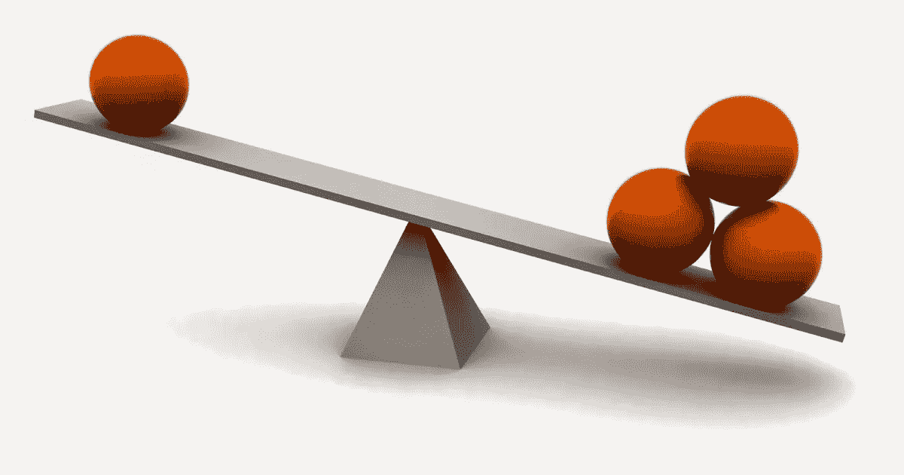
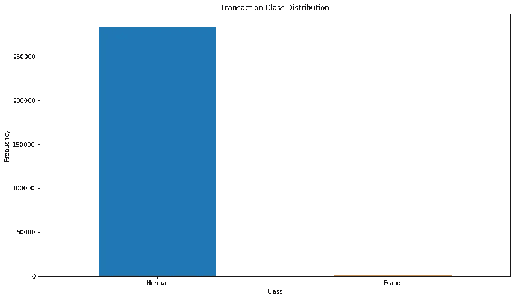

# 处理不平衡数据—实施的直觉

> 原文：<https://medium.com/analytics-vidhya/handling-imbalanced-data-intuition-to-implementation-295ccad749f4?source=collection_archive---------14----------------------->



你有没有发现自己处于这样一种情况，在训练你的机器学习模型时，你获得了 90%以上的准确率，但随后意识到该模型正在用大多数记录预测类中的一切？

## 在那里你实际上闻到了不平衡数据的味道，现在你知道你的模型是一个完全的浪费！

什么是**不平衡数据**？

不平衡意味着不同类别可用的数据点数量不同。例如，假设您有著名的“正常”和“欺诈”信用卡交易数据集，其中“正常”交易的记录数为 284315，而“欺诈”交易的记录数仅为 492。

当你处理这样的问题时，你可能会处理不平衡的数据，如果在用你首选的机器/深度学习算法拟合之前没有正确平衡，这可能会被证明是有偏见和不准确的，从而导致错误的预测，这可能是灾难性的。

这个博客会给你一个非常清晰的直觉和洞察力，告诉你如何处理不平衡的数据，用最好的方法，并对每一种方法进行比较，让你决定最好的方法来将你的数据改造成平衡的，以运行一个完美的模型！

## 在这里，我们将讨论-

1.  处理不平衡数据的欠采样和过采样技术。
2.  NearMiss、SMOTETomek 和 RandomOverSampler 算法来平衡不平衡的数据。
3.  比较步骤 2 中使用的算法，并选择具有适当推理的最佳算法。

## 好吧！所以让我们开始吧！

我们将使用 Kaggle 上著名的信用卡数据集来完成我们的任务。你可以从 [**这里**](https://www.kaggle.com/mlg-ulb/creditcardfraud) **下载数据集。**

让我们先动手做好数据准备工作！查看下面的代码，并在您喜欢的 IDE 中亲自尝试一下！

当您执行此操作时，您将获得自变量(X)和因变量/目标变量(Y)的形状。

你可能会得到这样的输出-

```
(284807, 30)
(284807,)
```

现在我们来做一些探索性的数据分析，搞清楚数据的本质！

生成的可视化如下所示-



有趣。:)

数据非常不平衡，欺诈交易的分布接近 0，而正常交易的分布甚至超过 250000 个边界。所以你看到了不平衡数据类的分布是什么样的！

让我们统计欺诈和正常交易的数量，以获得数字估计，然后我们将尝试不同的方法来平衡我们的数据。

你可能会得到这样的输出-

```
(492, 31) (284315, 31)
```

所以我们只有 492 笔欺诈交易和 284315 笔正常交易。

现在让我们来探索平衡数据的各种技巧！

## 欠采样

这项技术包括从多数类中随机抽取样本，有或没有替换。这是最早用于缓解数据集中不平衡的技术之一。

我们将在这里使用近似缺失欠采样算法，该算法通过基于多数类示例到少数类示例的距离来选择示例来起作用。

看看这里的代码，自己试试吧！

输出将类似于下图所示:

```
((984, 30), (984,))
```

耶！我们的数据现在平衡了！

但是等等。您是否意识到我们丢失了大量数据，或者说，大量有价值的信息？！！！

是的。我们做到了。这就是过采样胜过欠采样技术的地方！

现在让我们看看过采样是如何工作的

## 过采样

过采样包括用一些少数类的多个副本来补充训练数据。过采样可以多次进行(2 倍、3 倍、5 倍、10 倍等。)这是最早提出的方法之一，也被证明是健壮的，并且比欠采样好得多，因为在这里数据没有丢失，而是产生了新的数据！

而且你知道，数据越多，你的模型越健壮！

现在，让我们看看使用 RandomOverSampler 算法的过采样的实际实现。

随机过采样包括从少数类中随机选择样本，并替换，然后将它们添加到训练数据集中。

再次查看代码，并在您自己的空闲时间尝试一下-

输出可能会像下面这样重塑您的数据-

```
((426472, 30), (426472,))
```

您是否注意到了欠采样和过采样的输出差异？！

如果我们使用过采样，就会产生如此大量的数据！很棒，对吧？

不过还是那句话，凡事有利有弊，对吧？

已知随机过采样会增加发生过拟合的可能性，因为它精确复制了少数类示例。

现在，你一定在想，

平衡数据的最佳和首选方法是什么？

好了，让我们向您介绍混合智能算法**smetomek**，它击败了几乎所有修复不平衡数据的方法！

让我们欢迎圣杯！

**smetomek**

SMOTETomek(这是 **imblearn 的一个方法。SMOTETomek，**是一种使用欠采样方法(Tomek)和过采样方法(SMOTE)的混合方法，包括移除 Tomek 链接，这些链接是彼此最接近**的实例对，或者称为最近邻居，但是属于相反的类。**

因此，生成的数据集没有中间类拥挤重叠，因此所有以最小距离放置的最近邻只属于一个类！

**的确很棒！**

现在让我们看看**smetomek 算法**的实际实现！

输出可能会像下面这样对数据进行重采样-

```
((424788, 30), (424788,))
```

现在让我们来看看原始数据和改造后的数据，并进行比较

输出-

```
Original dataset shape Counter({0: 284315, 1: 492})
Resampled dataset shape Counter({0: 283473, 1: 141315})
```

您可以清楚地看到，在原始数据集中，有 284315 条记录属于类 0，只有 492 条属于类 1，而 SMOTETomek 将其重新采样为 283473 条属于类 0 的记录和 141315 条属于类 1 的记录。

**牛逼！**

# **结论**

总之，我们总是同意这样一个事实，即**smetomek**是一个为多数类和少数类示例提供**改进的准确性的方法，而**处理两个**的完整性。**

**不平衡学习是数据工程和知识发现领域中一个非常关键和具有挑战性的问题，其中错误分类的成本可能非常高。**

> 此外，我不会否认所有这些方法都受限于某些标准或条件，在这些标准或条件下，它们表现得更好。或者换句话说，需要为使用每种方法设置某些经验法则或标准，以便该方法在其指定的数据集范围内表现良好。

**所以，永远保持好奇和细心，好好研究你的数据，这样你才能把最好的方法应用到其中！**

> **如果你是数据科学和机器学习的初学者，并对数据科学/ML-AI、向数据科学的职业过渡指导、面试/简历准备有一些具体的疑问，甚至想在你的 D-Day 之前获得模拟面试，请随时在这里** **预约 1:1 电话** [**。我很乐意帮忙！**](https://topmate.io/sukannya)

希望你喜欢这个博客，再次感谢你耐心地坚持到最后！

**快乐的机器学习！:)**

下次见…！