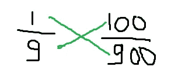

# 处理不平衡数据集

> 原文：<https://medium.com/analytics-vidhya/handling-imbalanced-dataset-522dfcae4a3c?source=collection_archive---------8----------------------->


[来源](https://www.google.com/search?q=imbalanced&sxsrf=ALeKk02krvOkQrfpgAhAN0Z5Ppiw5fqn9w:1607501135495&source=lnms&tbm=isch&sa=X&ved=2ahUKEwi7yaCxuMDtAhWOcn0KHblVBpkQ_AUoAXoECBUQAw&biw=1366&bih=625#imgrc=hwwH_S5W511I-M)

什么是不平衡数据集？

它最常见于医疗部门相关数据集、欺诈数据集等。假设阿波罗医院建立了一个糖尿病体检人群的数据集，该数据集由二进制输出组成，即一个人是否患有糖尿病。

假设在**的 1000 个**记录中**有 100 个人**患有糖尿病，其余的人正常，那么根据输出，我们的数据集被分成两部分。

**糖尿病患者=100，非糖尿病患者=900** 此处，大量数据集倾向于特定类别(负类别)，因此导致形成不平衡的数据集。

在这个博客中，我们将讨论平衡不平衡数据集的各种技术。让我们开始吧……

## 1.欠采样:

在欠采样中，我们减少多数类，使其等于少数类。


图 1

根据之前的图 1，我们有一个不平衡的数据集，在多数类中有 **900 个数据点，在少数**类中有 **100 个数据点。通过进行下采样，我们已经将多数类的数据点减少为等于少数类的数据点。**

**缺点:**

从多数类中减少数据点可能会导致有用信息的丢失，不会给出更好的结果。

为了便于编程理解，我采用了[信用卡欺诈检测数据集](https://www.kaggle.com/mlg-ulb/creditcardfraud?select=creditcard.csv)。

**步骤 1:检查数据集是平衡的还是不平衡的**

```
sns.countplot(df["Class"],orient="V")
plt.show()
--------------------------------------------------------------------
fraud=df[df["Class"]==1]  
normal=df[df["Class"]==0]
print(fraud.shape)  #printing shape of class  1
print(normal.shape) #Printing shape of class 0
```


出局 1


out 2

**第二步:执行操作**

正如我们所见，与第 1 类**相比，第 0 类**中存在大量数据。因此我们可以说数据是不平衡的。现在，我们将使用库 imblearn 来平衡数据集。这个库可能没有预安装到 jupyter 笔记本中，因此您需要首先通过 **pip install imblearn 来安装它。**

我们有**类 1=492(少数类)**和**类 0=284315(多数类)**通过使用欠采样，我们将减少多数类的计数，就像减少少数类的计数一样。

在欠采样之后，我们将得到类 **1=492** 和类**0 = 492 的数值。**

```
x=df.iloc[:,:-1] #creating inependent variable
y=df.iloc[:,-1]  #creating target variable
#code for undersampling
from imblearn.under_sampling import NearMiss
nm=NearMiss()
#Resampling of data of independent variable xand target variable y x_res,y_res=nm.fit_sample(x,y)
print(x_res.shape)
print(y_res.shape)[out]>> (984, 30)
         (984,)
```

绘制计数图以查看数据集是否已经平衡

```
df1=pd.DataFrame(x_res)
df1["Class"]=y_res
sns.countplot(df1["Class"])
```


平衡数据集的输出计数图

## 2.过采样:

在过采样中，我们在少数类中添加越来越多的数据点，并使其数据点等于多数类。这是机器学习中最常用的平衡技术，在平衡数据集时不会丢失信息。我们可以使用各种过采样技术来平衡多数类和少数类。当我们进行上采样时，我们总是会有过拟合的机会。


图 2

**方法 1:类别权重**

假设您有 900 个类别 1 的数据点和 100 个类别 0 的数据集。

**第一步:计算两个类中数据点的比率**

**比率= 100÷ 900 = 1÷ 9 = > 1:9**

多数类的权重将与少数类的每个数据点相乘，少数类的权重将与多数类的每个数据点相乘，这将产生平衡数据集。

**第二步:**



叉乘法

现在我们的少数阶级将等于多数阶级，因此数据现在是平衡的。

**方法 2 :-人工或合成点方法**

通过使用外推技术，我们在少数类中创建了越来越多的合成点，直到它等于多数类中存在的点。

**Python 实现:-**

```
-------------------------------------------------------------------
from imblearn.combine import SMOTETomek
st=SMOTETomek()
x_res,y_res=st.fit_sample(x,y)
print(x_res.shape)
print(y_res.shape)[out]>> (567542, 30)
        (567542,)
--------------------------------------------------------------------
from collections import Counter
print("Shape of y before undersampling",Counter(y))
print("Shape of y after undersampling",Counter(y_res))[out]>> Shape of y before undersampling Counter({0: 284315, 1: 492})
Shape of y after undersampling Counter({0: 283771, 1: 283771})
--------------------------------------------------------------------
```

我们还可以通过另一种方法来实现过采样技术，即:

```
from imblearn.over)sampling import RandomOverSample
rsp=RandomOverSample()
x_rsp,y_rsp=rsp.fit_sample(x,y)
print(x_rsp.shape)
print(y_rsp.shape)[out] >> (568630, 30)
         (568630,)
```

可视化我们是否能够平衡数据集

```
df2=pd.DataFrame(x_rsp)
df2["Class"]=y_rsp
sns.countplot(df2["Class"])
```


平衡数据集的可视化

## 结论:

这都是从我这边来的，如果你觉得这个博客很有趣，坚持住，我会带来更多有趣的东西。请在评论框中提出您的宝贵建议。**不断学习不断探索…………**