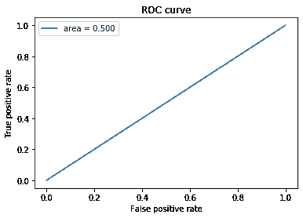

# 图像分类中不平衡数据集的处理

> 原文：<https://medium.com/analytics-vidhya/handling-imbalanced-dataset-in-image-classification-dc6f1e13aeee?source=collection_archive---------4----------------------->


我一直致力于在雷达图像上探测火山的测试任务。图像尺寸为 100x100 像素，单通道。训练数据集非常不平衡(没有火山的图像数量是有火山的图像数量的 5 倍)。

有很多方法可以解决这个问题，如类权重、过采样训练数据集、焦点损失等。

在本文中，我将介绍训练数据集的手动过采样，以解决类不平衡的问题。

让我们首先概述一下数据中类的分布。这里我们看到过采样前每类的样本数:


我们可以看到 1K 的有火山的样本和 6K 左右没有火山的样本。

过采样意味着我们增加小类中的样本数量，以便不同类中的样本数量变得相等或接近，从而变得更加平衡。


让我们在准备训练样本时应用手动过采样。

我在 prepareImages 方法中应用了过采样:

```
def prepareImages(train, shape, data_path, mode): for index, row in train.iterrows(): has_volcano = row['Volcano?']
        ...
        if has_volcano and mode == 'train': x_train[count] = img_to_array( cv2.flip( img, 1 ) ) y_train[count] = int(has_volcano) count += 1 // repeat the same step three more times applying different transformation and incrementing count
```

我们在这里读到“火山？”样本的属性。如果图像包含火山，我们对原始图像进行一些变换，并将修改后的图像与相应的标签一起添加到数据集。在我的例子中，我应用了 3 次翻转(值为 0，1 和-1)和旋转(cv2。顺时针旋转 90 度)。

让我们显示过采样后的类分布


# 过采样的实验评估

## 过采样的结果

当不应用过采样时

```
loss: 0.2359 — acc: 0.9202 — val_loss: 0.4253 — val_acc: 0.8626AUC = 0.500
```



和损失/精度图


当对测试数据集执行预测时，我们得到以下结果:

```
number of images with volcanoes: 0number of images without volcanoes: 2734
```

我们可以看到所有的测试样本都被归类为没有火山。

## 过采样的结果

当我们应用过采样时

```
loss: 0.6885 — acc: 0.5264 — val_loss: 0.6856 — val_acc: 0.5718AUC = 0.504
```


和我们的学习曲线


当对测试数据集执行预测时，我们得到以下结果:

```
number of images with volcanoes: 27number of images without volcanoes: 2707
```

就是这样。