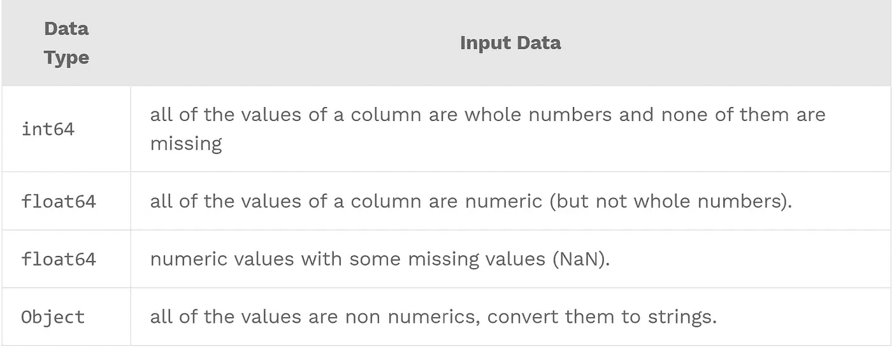

# 用熊猫处理大型 CSV 文件

> 原文：<https://medium.com/analytics-vidhya/handling-large-csv-files-with-pandas-9595f67ad265?source=collection_archive---------3----------------------->

如果你有一个大的 CSV 文件，你想有效地处理熊猫，你有几个选项，将在这篇文章中解释。


处理数据时速度很重要！

> `*Pandas is an in-memory tool*`

您需要能够将您的数据存储在内存中，以便使用 pandas。如果您可以一次处理它的一部分，那么您可以将它读入数据块并处理每个数据块。或者，如果您知道您应该有足够的内存来加载文件，有一些提示可以帮助减少文件大小。

请注意，一般来说，您应该拥有三至十倍于您想要操作的数据帧大小的内存。额外的内存应该给你足够的额外空间来执行许多常见的操作。

# 1.用 Python 检查你系统的内存

让我们从检查我们系统的内存开始。`psutil`将在 Windows、MAC 和 Linux 上运行。`*psutil*` 可以用 pip install 从 Python 的包管理器下载。

如果您在安装时遇到了`psutil`的编译错误，请尝试以下步骤。

```
sudo yum install python3-devel
sudo pip install psutil# now check the version using 
pip freeze | grep psutil
```

现在让我们看看我们系统的当前内存。

```
import psutil
memory = psutil.virtual_memory()
print(f" {'*' * 3} Memory used percentage - {memory.percent} \n {'*' * 4} Free Memory available - { round(memory.free / (1024.0 ** 3))} GB")# Output
*** Memory used percentage - 63.0 
**** Free Memory available - 6 GB
```

# 2.确定 CSV 文件的内存使用情况

我们现在将估计整个文件将占用多少内存。我已经使用了来自`[kaggle.com](https://kaggle.com)`的`tmdb_5000_movies`数据集。

```
import pandas as pddata = pd.read_csv("tmdb_5000_movies.csv")# Lets check the memory usage of the file 
print(f" ** Memory usage of the file - {sum(data.memory_usage()) * 0.000001} MB for {len(data.index)} Rows")>> # Output
** Memory usage of the file - 8.453408 MB for 52833 Rows
```

`data.memory_usage()`方法显示了数据帧的内存使用情况，而`len(data.index)`显示了数据帧的总行数。

我们可以看到，*52833 行使用了大约****MB***的内存。如果我们有一个 ***十亿行*** ，那就要占用大约 ***151+ GB*** 的内存。现在，这是一个坏主意，把所有的东西都放在记忆里，让它挂起来，不要这样做。**

# **3.理解 csv 文件中的数据类型**

**CSV 文件不包含关于数据类型的信息，不像数据库，pandas 试图推断列的类型，并从 NumPy 推断它们。**

****情况如何？****

****

**现在，让我们看看这些数据类型的限制。**

```
**import numpy as np# Limits of Integer Data Type
print(f" ** Output limits of Numpy Integer Data Types ")
print(f" ** limits of Numpy Integer - {np.iinfo(np.int8)}")
print(f" ** limits of Numpy Integer - {np.iinfo(np.int16)}")
print(f" ** limits of Numpy Integer - {np.iinfo(np.int64)}")# Limits of Float Data Type
print(f" ** Output limits of Numpy Float Data Types ")
print(f" ** limits of Numpy Float - {np.finfo(np.float16)}")
print(f" ** limits of Numpy Float - {np.finfo(np.float64)}") >> # Output
 ** Output limits of Numpy Integer Data Types 
 ** limits of Numpy Integer - Machine parameters for int8
---------------------------------------------------------------
min = -128
max = 127
--------------------------------------------------------------- ** limits of Numpy Integer - Machine parameters for int16
---------------------------------------------------------------
min = -32768
max = 32767
--------------------------------------------------------------- ** limits of Numpy Integer - Machine parameters for int64
---------------------------------------------------------------
min = -9223372036854775808
max = 9223372036854775807
--------------------------------------------------------------- ** Output limits of Numpy Float Data Types 
 ** Memory usage of the file - Machine parameters for float16
---------------------------------------------------------------
precision =   3   resolution = 1.00040e-03
machep =    -10   eps =        9.76562e-04
negep =     -11   epsneg =     4.88281e-04
minexp =    -14   tiny =       6.10352e-05
maxexp =     16   max =        6.55040e+04
nexp =        5   min =        -max
--------------------------------------------------------------- ** Memory usage of the file - Machine parameters for float64
---------------------------------------------------------------
precision =  15   resolution = 1.0000000000000001e-15
machep =    -52   eps =        2.2204460492503131e-16
negep =     -53   epsneg =     1.1102230246251565e-16
minexp =  -1022   tiny =       2.2250738585072014e-308
maxexp =   1024   max =        1.7976931348623157e+308
nexp =       11   min =        -max
---------------------------------------------------------------**
```

# **4.转换数字数据类型**

**让我们运行`.info()`方法来深入验证我们的数据类型。**

```
**# Lets print the DataFrame information
print(f" {data.info()}")>>> # Output
<class 'pandas.core.frame.DataFrame'>
RangeIndex: 52833 entries, 0 to 52832
Data columns (total 20 columns):
 #   Column                Non-Null Count  Dtype  
---  ------                --------------  -----  
 0   budget                52833 non-null  int64  
 1   genres                52833 non-null  object 
 2   homepage              18832 non-null  object 
 3   id                    52833 non-null  int64  
 4   keywords              52833 non-null  object 
 5   original_language     52833 non-null  object 
 6   original_title        52833 non-null  object 
 7   overview              52800 non-null  object 
 8   popularity            52833 non-null  float64
 9   production_companies  52833 non-null  object 
 10  production_countries  52833 non-null  object 
 11  release_date          52822 non-null  object 
 12  revenue               52833 non-null  int64  
 13  runtime               52811 non-null  float64
 14  spoken_languages      52833 non-null  object 
 15  status                52833 non-null  object 
 16  tagline               43549 non-null  object 
 17  title                 52833 non-null  object 
 18  vote_average          52833 non-null  float64
 19  vote_count            52833 non-null  int64  
dtypes: float64(3), int64(4), object(13)
memory usage: 8.1+ MB**
```

**现在，让我们总结一下数据类型和列数，看看 pandas 是如何对我们的数据进行分类的。**

```
**# lets summarize the data types and count of columns
print(f" ** Summarize the data types and count of columns \n{data.dtypes.value_counts()}")>> # Output
object     13
int64       4
float64     3
dtype: int64**
```

**我们将重点关注`int64`和`float64`数据类型，研究数据/精度，并进行转换。**

**我将使用` **dtype** `参数来告诉 pandas 使用较小的数字类型，而不是默认的 64 位，现在您明白为什么首先理解数据类型的上述步骤是重要的了。**

```
**# Define a dictionary converting the numeric data types
data_types_conversion_numeric = {"popularity": np.float16,
                                 "runtime": np.float16,
                                 "vote_average": np.float16,
                                 "id": np.int16,
                                 "revenue": np.int16,
                                 "vote_count": np.int16}
data_02 = pd.read_csv("tmdb_5000_movies.csv", dtype=data_types_conversion_numeric)
print(f" ** Memory usage of the file - {sum(data_02.memory_usage()) * 0.000001} MB for {len(data_02.index)} Rows")>> #Output
 ** Memory usage of the file - 6.551419999999999 MB for 52833 Rows**
```

**正如您所看到的，通过将数据类型更改为使用更小的数字类型，我们节省了*23%的开销，如果您持有的数据很小，您也可以使用`int8`来进一步节省开销。***

> ***我们现在是原始大小的 67%。这大约节省了 23%的内存。***

# ***5.转换对象数据类型***

***对象数据类型将值视为字符串。pandas 中的字符串值占用大量内存，因为每个值都存储为 Python 字符串，如果该列不是数字，pandas 会将其转换为对象列。***

***将对象数据类型转换为类别将使用更少的内存，因为 Pandas 只存储一次字符串，而不是为每一行创建新的字符串。***

***首先，检查对象列的`.value_counts`方法。如果基数较低，可以将它们转换为分类列以节省更多内存。***

```
***print(data_02.original_language.value_counts())

>> #Output
en    49555
fr      770
es      352
zh      297
de      297***
```

***基数没有那么高，我将开始把对象数据类型转换成类别。***

```
***data_types_conversion_numeric = {"popularity": np.float16,
                                 "runtime": np.float16,
                                 "vote_average": np.float16,
                                 "id": np.int16,
                                 "revenue": np.int16,
                                 "vote_count": np.int16,
                                 "genres": "category",
                                 "homepage": "category",
                                 "keywords": "category",
                                 "original_language": "category",
                                 "original_title": "category",
                                 "overview": "category",
                                 "production_companies": "category",
                                 "production_countries": "category",
                                 "release_date": "category",
                                 "spoken_languages": "category",
                                 "status": "category",
                                 "tagline": "category",
                                 "title": "category"}
data_02 = pd.read_csv("tmdb_5000_movies.csv", dtype=data_types_conversion_numeric)
print(f" ** Memory usage of the file - {sum(data_02.memory_usage()) * 0.000001} MB for {len(data_02.index)} Rows")

>>> # Output
** Memory usage of the file - 3.9045639999999997 MB for 52833 Rows***
```

> ***我们现在是原始大小的 46%。这大约节省了 54%的内存。***

# ***6.识别和删除熊猫中的重复。***

***您正在处理的源文件中很有可能有重复的内容，如果不需要，将它们删除会节省更多的内存。
在我的例子中，为了使文件变大，我必须重复记录:)***

***在删除之前，让我们验证源文件中重复条目的数量。***

```
***print(f" ** File has {len(data_02) - len(data_02.drop_duplicates())} duplicate rows off the total {len(data_02)}  ")

>> # Output
** File has 48030 duplicate rows off the total 52833***
```

***`len(your dataframe)`输出数据帧中的总行数，而 len(dataframe.drop_duplicates())将输出数据帧中的唯一值。***

***所以我上面提到的文件有很多副本，删除它们会节省很多内存。***

```
***data_03 = data_02.drop_duplicates()
print(f" ** Memory usage of the file after dropping duplicates - {sum(data_03.memory_usage()) * 0.000001} MB for {len(data_03.index)} Rows")

>> # Output
** Memory usage of the file - 1.82954 MB for 4803 Rows***
```

***嗯，这是一些储蓄岗位删除重复。如果你有重复的，想把它们扔掉，那么使用这个步骤。***

# ***7.删除不需要的列***

***如果您知道有可以忽略的列，那么指定`usecols`参数来包含您想要加载的列。***

***在这里，我们将忽略“主页”、“关键词”、“T13”、“原标题”和“标语”等列。***

```
***# prepare a list of columns that you want to load
unwanted_columns = ["homepage", "keywords","original_title", "tagline"]
data_columns = [columns for columns in list(pd.read_csv("tmdb_5000_movies.csv").columns) if columns not in unwanted_columns]

# Define a dictionary converting the numeric data types
data_types_conversion = {"popularity": np.float16,
                         "runtime": np.float16,
                         "vote_average": np.float16,
                         "id": np.int16,
                         "revenue": np.int16,
                         "vote_count": np.int16,
                         "genres": "category",
                         "original_language": "category",
                         "overview": "category",
                         "production_companies": "category",
                         "production_countries": "category",
                         "release_date": "category",
                         "spoken_languages": "category",
                         "status": "category",
                         "title": "category"}

data_02 = pd.read_csv("tmdb_5000_movies.csv", dtype=data_types_conversion, usecols=data_columns)
print(f" ** Memory usage of the file after dropping cols - {sum(data_02.memory_usage()) * 0.000001} MB for {len(data_02.index)} Rows")

>> #Output
** Memory usage of the file after dropping cols - 2.791196 MB for 52833 Rows***
```

> ***我们现在是原来大小的 32%。这大约节省了 68%的内存。***

# ***8.用熊猫处理大量数据。***

***如果您可以一次处理大量数据，并且不需要将所有数据都存储在内存中，则可以使用 chunk size 参数。我个人建议这是你最后的选择。***

```
***# read the csv file
data = pd.read_csv("tmdb_5000_movies.csv")

# prepare a list of columns that you want to load
unwanted_columns = ["homepage", "keywords","original_title", "tagline"]
data_columns = [columns for columns in list(pd.read_csv("tmdb_5000_movies.csv").columns) if columns not in unwanted_columns]

# Define a dictionary converting the numeric data types
data_types_conversion = {"popularity": np.float16,
                         "runtime": np.float16,
                         "vote_average": np.float16,
                         "id": np.int16,
                         "revenue": np.int16,
                         "vote_count": np.int16,
                         "genres": "category",
                         "original_language": "category",
                         "overview": "category",
                         "production_companies": "category",
                         "production_countries": "category",
                         "release_date": "category",
                         "spoken_languages": "category",
                         "status": "category",
                         "title": "category"}

data_02 = pd.read_csv("tmdb_5000_movies.csv", dtype=data_types_conversion, usecols=data_columns,chunksize=10000)

# Process the data frame in chunks
for chunk in data_02:
    print(f" ** Memory usage of the file after dropping cols - {sum(chunk.memory_usage()) * 0.000001} MB for {len(chunk.index)} Rows")
    print(f"Do some more processing here... ")

>> #Output
 ** Memory usage of the file after dropping cols - 1.2492079999999999 MB for 10000 Rows
 ** Memory usage of the file after dropping cols - 1.249212 MB for 10000 Rows
 ** Memory usage of the file after dropping cols - 1.249212 MB for 10000 Rows
 ** Memory usage of the file after dropping cols - 1.249212 MB for 10000 Rows
 ** Memory usage of the file after dropping cols - 1.249212 MB for 10000 Rows
 ** Memory usage of the file after dropping cols - 0.5628639999999999 MB for 2833 Rows***
```

> ***我们现在是原始大小的 14 %。大约节省了 **86%** 的内存。***

***感谢您通读这篇文章。我今天就到这里。如果你喜欢这篇文章，并且对你有所帮助，请随时关注我。***

***如果你认为这篇文章对某人有很大帮助，请随意分享。***