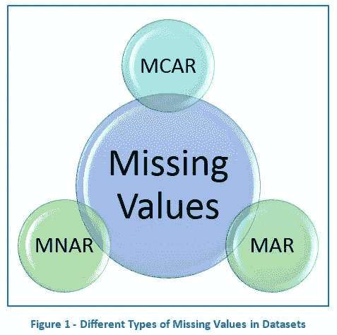
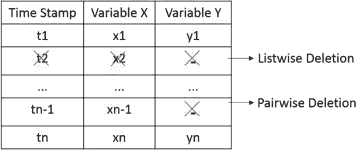

# 缺失数据处理:)数据预处理

> 原文：<https://medium.com/analytics-vidhya/handling-missing-data-data-pre-processing-8fbab02c8cb4?source=collection_archive---------15----------------------->


**什么是缺失数据？**

**缺失数据**或 M 个**缺失值**发生在数据中没有存储特定特征的值时。缺失数据是一种常见现象，会对从数据中得出的结论产生重大影响。

**原因是什么？**

1.  数据收集出错
2.  无反应

检查缺失数据的类型:

 [## 缺失数据

### 在统计学中，当没有为观测值中的变量存储数据值时，就会出现数据缺失或值缺失…

en.wikipedia.org](https://en.wikipedia.org/wiki/Missing_data#Types) 

**如何知道我们是否有缺失的数据？**

```
data.isnull().values.any()
```

如果有任何缺失数据，它将打印 True，如果没有缺失数据，它将打印 False。

```
data.isna().sum() Output:PassengerId 0
Pclass 0
Name 0
Sex 0
Age 86
SibSp 0
Parch 0
Ticket 0
Fare 1
Cabin 327
Embarked 0
dtype: int64
```

让我们看看输出的格式

我们发现年龄、票价和舱位分别有 86 个、1，327 个值缺失

> 如何处理这些缺失的数据？

1.  案例删除
2.  数据插补

**病例删除:**

**列表式**删除是指如果数据集中的任何个体在分析中丢失了*任何*变量的数据，则从分析中将其删除。

尽管它的简单性是一个主要优点，但在许多丢失数据的情况下，它会导致大问题。

列表式删除适用于以下情况

*   **数据完全随机缺失(MCAR)**
*   **无论如何你都有足够的能量，即使你丢失了部分数据集**



以下代码用于删除所有具有空值的行

`data.dropna()`

现在让我们来看看数据

```
data.isna().sum()Output:PassengerId 0
Pclass 0
Name 0
Sex 0
Age 0
SibSp 0
Parch 0
Ticket 0
Fare 0
Cabin 0
Embarked 0
dtype: int64
```

数据大小将会减小，因为包含空值的所有行都被删除。

*   删除缺少值的列

`data.dropna(axis =1)`

用 0 填充所有缺失的值

`data.fillna(0)`

> **数据插补:**

**插补是**用替代值替换缺失的**数据**的过程。当代入一个**数据点**时。

**少数插补方法:**

**均值/中值/众数替代:**

已知不为零的缺失值的选择是使用一些*中心值，如*平均值、中值或众数。

如果变量一般呈正态分布，我们可能会选择使用平均值。

如果数据呈现偏态，那么中位数可能是更好的选择。

对于类别变量，我们可以选择使用模式(最频繁的值)作为缺省值来填充缺失值和数值变量。

这是一种生硬的估算方法，会导致糟糕的绩效。

`data.fillna(data.mean())`

`data.fillna(data.median())`

`data.fillna(data.mode())`

下面提到的方法会更好。

**换人**:

填充数据之外的不同主题的值。

**热卡插补**

从样本中其他变量具有相似值的个体中随机选择一个值。

**回归插补**

填充通过对其他变量回归缺失变量而获得的预测值。

也很少使用其他技术。

如果我说错了，请指正，任何建议都很好！

来源:互联网