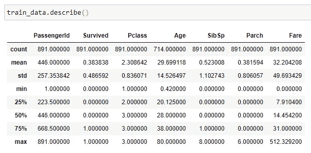

# 处理数据科学项目中的缺失数据

> 原文：<https://medium.com/analytics-vidhya/handling-missing-data-in-a-data-science-project-e5cdf04e03ca?source=collection_archive---------20----------------------->

本文是从 [***开始初始化一个数据科学项目***](/analytics-vidhya/initializing-a-data-science-project-d6a0891d750b) ***系列文章的第二部分。***

在这一系列文章中，我们将介绍 Kaggle 的一个简单的入门级数据科学项目；利用[泰坦尼克号](https://www.kaggle.com/c/titanic/overview)数据集。如果这是你第一次完成一个端到端的项目，或者如果它是一个热点分钟-不要担心！在下一篇文章中，我们将一步一步地介绍如何在工程特性之前替换丢失的值！

将数据导入 Jupyter 笔记本后，我现在将检查训练数据是否有缺失信息，并熟悉数据框。

# 处理缺失数据:

利用*。info()* 函数，我们可以识别每一列及其数据类型。这一点的重要性在于了解哪些函数可以用于哪些列。

例如，我现在知道哪些列是数字数据，哪些是浮点数据，哪些是整数数据。

我还可以推断出数据框中总共有 891 个条目，虽然大多数值都已填充，但也有一些字段缺少信息。这由上面的“非空计数”列表示。

然后使用*。isnull()。sum()* 函数结合使用，我可以检索每一列的空值的精确计数。这将帮助我决定处理这些价值的最佳方式是什么；我应该删除它们，用平均值替换它们，还是有其他方法来处理这些丢失的值？每一列和丢失的值都是一种独特的情况，我只需要在这些情况下运用我的最佳判断。

在这个特定的数据集中，我在“年龄”、“船舱”和“登船”列中缺少**值。**

一旦你理解它的机制，熊猫是非常简单的！在功能*中，train_data[train_data。apollowed . is null()]*我们可以很容易地准确识别出 apollowed 字段中哪些行的数据是缺失值！

通过简单地更改列名，我们可以为 Age 和 Cabin 列返回相同的信息。我们来分解一下！

## df name[df name . colname . function()]

*   **dfName[dfName…]** 表示我们将从数据帧中定位“…”；在这种情况下—*train _ data*[*train _ data*…]
*   **…[…columnName…]** 标识我们正在查看的具体列；在这种情况下— train_data[train_data。*上船*……]
*   **…[…function()]** 调用将应用于搜索到的列的函数；在这种情况下—train _ data[train _ data . oaked .*is null()*

因此，我们一起在 train_data 数据帧的已装载列中搜索任何为空的字段。

*。describe()* 函数允许我查看分类列的统计数据，这将有助于确定替换信息的最佳方式。

例如，通过快速浏览，我现在知道乘客的平均年龄是 29.7 岁！

如果我使用。unique()函数，我可以返回不同唯一值的数组；由此，我可以看出许多年龄也是用半年来表示的。所以我决定用 29.5 替换所有的空年龄值；如下面的代码片段所示:

由于客舱列的这么大一部分是缺失值，准确的说是 687/891；在查看了唯一的值之后，我决定删除整篇文章，因为我目前没有足够的有价值的信息。在对泰坦尼克号的船舱布局做了一些研究后，我可以决定回到这个功能，但我会把它留给未来的凯拉。

需要考虑的一件重要事情是，虽然我已经将 inplace 设置为 True，但这并不会覆盖原始数据，除非将其适当地保存到文件中！它只保存当前在内存中的数据帧。

**我希望这篇文章对你有用！**

*在网络上找到我:*[Medium](/@kailastone)|[Twitter](https://twitter.com/stone_kode)|[LinkedIn](https://www.linkedin.com/in/kaila-stone/)|[GitHub](https://github.com/kailastone)

谢谢大家！—凯拉