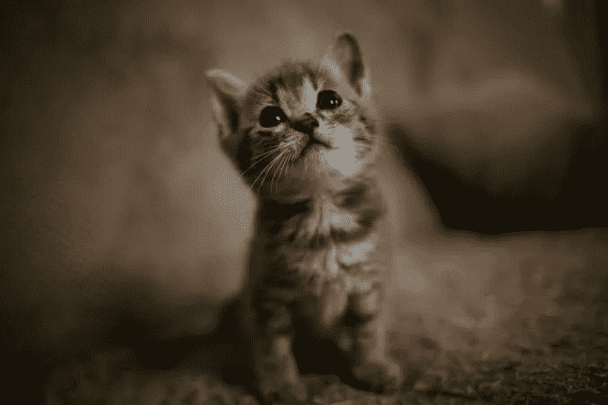
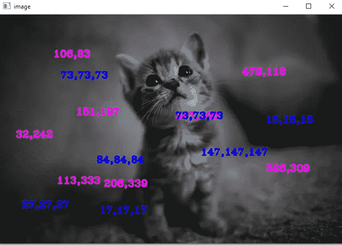
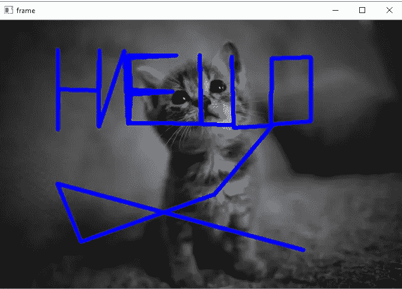
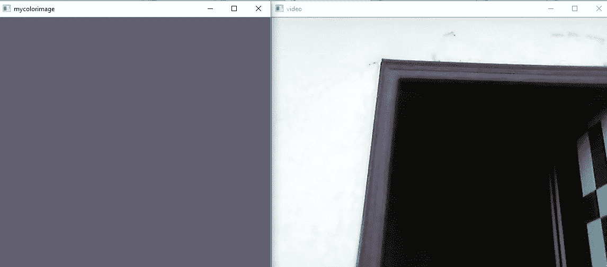

# 在打开的 CV 中处理鼠标事件—第 3 部分

> 原文：<https://medium.com/analytics-vidhya/handling-mouse-events-in-open-cv-part-3-3dfdd59ab2f6?source=collection_archive---------9----------------------->


打开简历(第三部分)

对于第二部分，点击[这里](/@vishwasu2001/interacting-with-webcam-and-video-file-and-some-drawing-with-open-cv-part-ii-a38b68196a19)，对于第一部分，点击[这里](/@vishwasu2001/some-basics-about-open-cv-part-1-e4392da256a8)。

在这一部分中，我将首先展示一些在图像和视频上处理鼠标事件的例子。

现在让我们从 OPEN CV 中的鼠标事件列表开始——

```
evt=[i **for** i **in** dir(cv2) **if 'EVENT' in** i]
print(evt)#output
['EVENT_FLAG_ALTKEY', 'EVENT_FLAG_CTRLKEY', 'EVENT_FLAG_LBUTTON', 'EVENT_FLAG_MBUTTON', 'EVENT_FLAG_RBUTTON', 'EVENT_FLAG_SHIFTKEY', 'EVENT_LBUTTONDBLCLK', 'EVENT_LBUTTONDOWN', 'EVENT_LBUTTONUP', 'EVENT_MBUTTONDBLCLK', 'EVENT_MBUTTONDOWN', 'EVENT_MBUTTONUP', 'EVENT_MOUSEHWHEEL', 'EVENT_MOUSEMOVE', 'EVENT_MOUSEWHEEL', 'EVENT_RBUTTONDBLCLK', 'EVENT_RBUTTONDOWN', 'EVENT_RBUTTONUP']
```

这里我们正在制作事件列表，您可以在输出中看到事件。

所以，像前两个部分一样，我们必须导入 cv2，这样我们才能对它进行处理。这里我们将处理一些图像或视频上的鼠标事件，例如在图像上点击右键等。



cat.png(我的形象)

首先，我们将创建一个函数，在这个函数中，我们将在鼠标事件之后写下我们想要做的事情。这是代码，我会逐行解释—

```
**def** handling_click_event(event, x, y, flags, param):
    **if** event == cv2.EVENT_LBUTTONDOWN:
        print(x,**','**,y)
        font=cv2.FONT_HERSHEY_COMPLEX_SMALL
        string=str(x)+**','**+str(y)
        cv2.putText(img,string,(x,y),font,1,(255,0,255),2)
        cv2.imshow(**'image'**,img)
```

在上面的函数(handling_click_event)中，我们传递了五个参数——event——图像上发生了什么事件，x——事件发生时鼠标所在位置的 x 坐标，y——事件发生时鼠标所在位置的 y 坐标，flags——鼠标事件发生时的特定条件，例如键盘的任何键和 param——这是我们在回调该函数时将传递的用户数据。
在函数中，我们必须检查参数中的事件是否与我们想要的相同，然后我们将编写在事件中要做什么，因此我们用 if 条件检查事件(在上面的代码中，我们检查用户是否单击鼠标左键),然后在 if 条件中打印坐标。
好的，停止……首先让我们知道点击左键后我们要做什么，所以我们想显示该点的坐标，但是在哪里呢？鼠标被点击的地方。
让我们再次跳到代码上，这样我们就在打印坐标上，之后我们必须将该点的坐标放在图像上，为此我们将使用 **putText()** 方法。我已经在前面的部分解释了这个方法。在这个方法中，我们从参数中给出坐标 x 和 y，因为…我想你明白。

之后，我们必须回调(在这里我们将方法作为参数传递给方法)函数。让我给你看代码——

```
img=cv2.imread(**'catt.png'**)
cv2.imshow(**'image'**,img)
cv2.setMouseCallback(**'image'**,handling_click_event)

cv2.waitKey(0)
cv2.destroyAllWindows()
```

这里我将特别解释一下 **setMouseCallback()** 函数，因为其他的东西你都很了解。我们正在读取图像，并将其显示在名为 image 的窗口中，因此这是您将要执行操作并获得结果的图像。我们将使用 **setMouseCallback()** 函数，其中将传递窗口名称(请记住，您将给出相同的窗口名称，在该窗口中，您的图像将不起作用)和我们制作的函数。

所以运行你的代码，我相信你会得到结果。

你也可以按右键。唯一要做的就是再做一个 if 条件，并把它放到你的函数中。看这个例子—

```
# put it in your function. **if** event == cv2.EVENT_RBUTTONDOWN:
    blue=img[y,x,0]
    green=img[y,x,1]
    red=img[y,x,2]
    font=cv2.FONT_HERSHEY_COMPLEX_SMALL
    string1=str(blue)+**','**+str(green)+**','**+str(red)
    cv2.putText(img,string1,(x,y),font,1,(255,0,0),2)
    cv2.imshow(**'image'**,img)
```

之后的结果图像—



结果图像

之后，我希望当我们单击图像的任何部分时，它会在该点上画一个圆，当我们第二次单击图像的任何部分时，它会用第一个和第二个点画一条线。你明白我在说什么吗？让我们看看代码，然后我们会理解它—

```
**def** event_handling_for(event,x,y,flags,param):
    **if** event == cv2.EVENT_LBUTTONDOWN:
        cv2.circle(image,(x,y),3,(0,0,244),-1)
        points.append((x,y))
        **if** len(points) >=2:
            cv2.line(image,points[-1],points[-2],(255,0,0),5)
        cv2.imshow(**'image'**,image) 
```

在上面函数的 if 条件中，我们在那个点(鼠标点击的地方)画了一个圆( **circle()方法**)，并将那个点添加到一个列表中(命名点)。因此，为了制作线，我们应该有两个点，为此我们正在检查列表点长度是否等于 2 或大于 2，如果条件匹配，那么我们将使用列表中的最后两个点制作线( **line()方法**)，因为 append 方法在最后添加元素。

然后我们会像第一次调用一样调用 **cv2.setMouseCallback()** 函数。

结果是—



结果图像

所以现在是处理事件的时候了。这里我们将使用视频进行事件处理。

这次我想在另一个窗口中显示(视频的)特定区域的颜色。

```
**def** click_event_for_color(event,x,y,flags,param):
    **if** event == cv2.EVENT_LBUTTONDOWN:blue=frame[y,x,0]
        green=frame[y,x,1]
        red=frame[y,x,2]
        mycolorimage=np.zeros((512,512,3), np.uint8)
        mycolorimage[:]=[blue,green,red]
        cv2.imshow(**'mycolorimage'**,mycolorimage)
```

在上面的例子中，我们制作了蓝色、绿色、红色变量，我们在其中存储了每一个变量的通道(请注意，当我们只制作 frame[y，x]时，我们将获得该 x，y 坐标的一些颜色(x，x，x)的 BGR 格式，所以当我们制作 frame[x，y，0]时，它将只给出蓝色的 0 索引值，以此类推)。然后我们做一个零数组(这是黑色窗口)，然后我们改变整个窗口的颜色(蓝色，绿色，红色)。之后，我们将显示名为 mycolorimage 的图像窗口。我们正在制作这个视频，所以我必须解释呼叫部分。这是代码-

```
image_capture=cv2.VideoCapture(0)**while True**:
    ret, frame=image_capture.read()
    cv2.imshow(**'video'**,frame)
    **if** cv2.waitKey(1) & 0xFF == ord(**'m'**):
        cv2.destroyAllWindows()
        **break** cv2.setMouseCallback(**'video'**,click_event)
```

你非常了解所有的代码，因为我已经在前两部分解释过了。
这里唯一的变化是我在 while 循环中调用了函数，因为视频是图像的集合，所以当你点击视频中的任何地方时，你就点击了图像，所以 **cv2.setMouseCallback()** 函数将运行，你知道这个过程。



另一扇窗的门的颜色

所以，我希望你喜欢它。

在第 4 部分中，我们将介绍更多内容。

谢了。