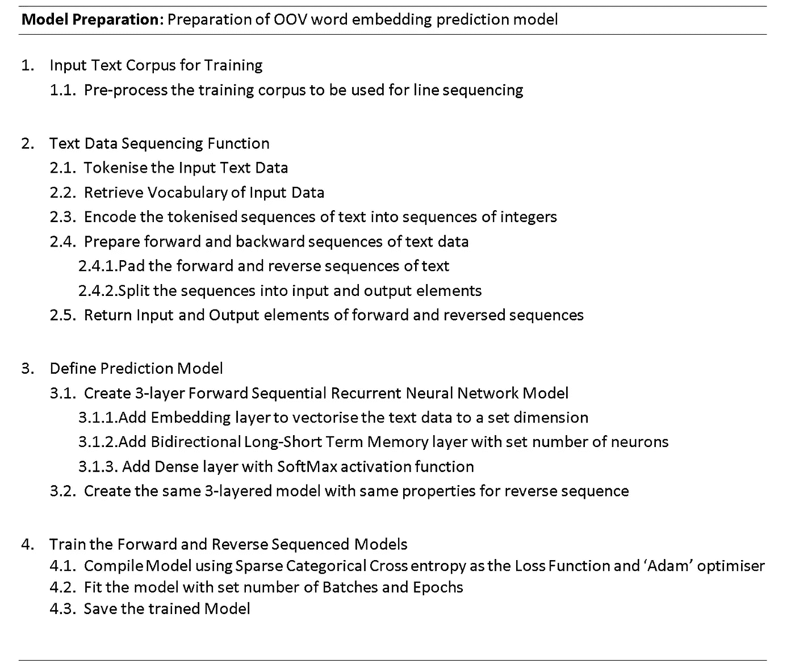
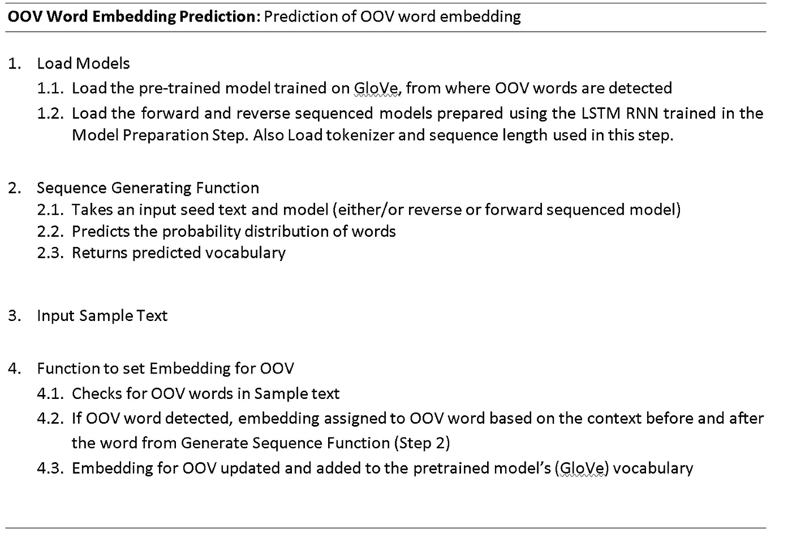
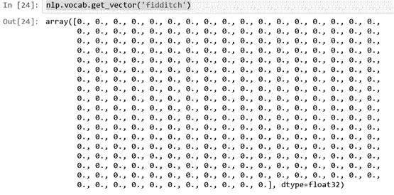
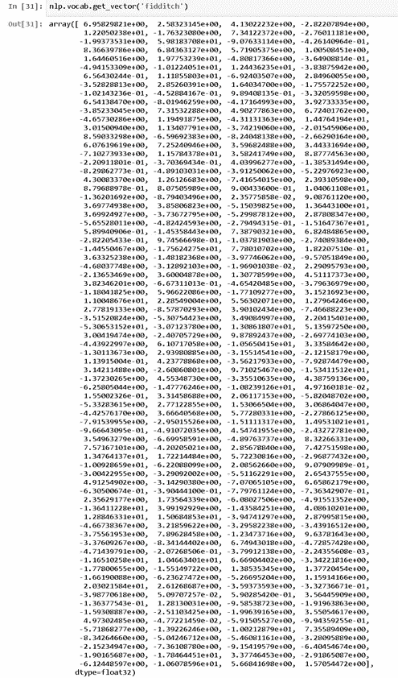
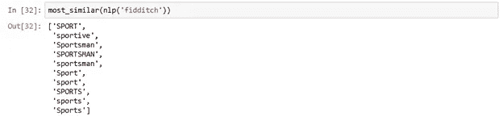

# 基于上下文的自然语言处理中未登录词的处理

> 原文：<https://medium.com/analytics-vidhya/handling-out-of-vocabulary-words-in-natural-language-processing-based-on-context-4bbba16214d5?source=collection_archive---------0----------------------->

单词嵌入通过单词的向量表示来编码单词之间的关系。这些单词向量类似于单词的意思。单词嵌入的局限性在于，它们是通过自然语言模型(word2vec、GloVe 等)来学习的，因此，为了进行嵌入，单词必须之前在训练数据中出现过。

本文提供了一种方法，可用于处理自然语言处理中的词汇外(OOV)单词。给定一个 OOV 单词及其所在的句子，语言建模用于对句子中的单词进行排序，并通过与类似句子进行比较来预测该单词的含义。这是一种快速学习词义的优雅方式。

# **模型概述**

该模型被构建为根据 OOV 单词的上下文来产生词汇表外(OOV)单词的嵌入。这是通过使用具有长短期记忆单元的双向递归神经网络建立的语言模型来完成的。通过预测代替 OOV 单词的单词，然后取它们的映射单词嵌入的加权平均值，该语言模型用于基于其上下文预测 OOV 单词的最可能的单词嵌入。这给出了 OOV 单词的单词嵌入，其在实体识别任务的可用性方面是可靠的，并且其在向量空间中是有意义的表示。

用于预测 OOV 单词嵌入的模型包括两个部分:第一步是通过基于训练语料库对模型进行表征、训练和保存来准备模型，第二步是将准备好的模型用于预测嵌入。第一步称为准备步骤，第二步称为嵌入预测步骤。

# **模型的伪代码**

## **模型准备**

模型准备步骤

如上所示，在模型准备的步骤 1 中，对大型语料库进行预处理以用于步骤 2，在步骤 2 中，对该语料库进行标记化，并将文本编码为整数。

步骤 2 中的记号赋予器用于适应源文本，以开发从单词到唯一整数的映射。然后这些整数可以用来对文本行进行排序。在步骤 3.1.1 中，使用记号赋予器来检索文本语料库的词汇大小，以定义模型的单词嵌入层。在步骤 2.4 中，我们准备文本数据的前向和后向序列，其中序列的两个方向都用于基于来自 OOV 单词的前一个和后一个单词来预测嵌入。然后，序列被分成每个正向和反向序列的输入(X)和输出元素(y ),用于在 RNN LSTM 模型预测模型上训练它们。正向和反向序列被填充以使所有序列具有相同的长度。

在步骤 3 中，我们为每个正向和反向序列定义一个具有 3 层的模型。第一嵌入层为每个序列创建一个实值向量。第二层是具有设定数量的单元的双向 LSTM 层，其可以被修剪以最适合训练语料库。输出层是一个密集层，由词汇表中每个单词的一个神经元组成。该层使用 SoftMax 函数来确保输出被归一化以返回概率。

在步骤 4 中，前向和后向序列的编码文本被编译成适合各自的 rnn。由于网络在技术上用于基于所提供的序列来预测词汇的概率分布，所以我们使用稀疏分类交叉熵损失函数来更新网络上的权重。Adam 优化器是梯度下降算法的有效实现，用于跟踪训练的每个时期的准确性。然后保存模型以用于根据正向或反向排序模型返回词汇的概率分布。

## OOV 嵌入预测步骤

预测单词嵌入步骤

OOV 字嵌入预测步骤比模型准备步骤短。步骤 1 包括加载运行嵌入预测函数所需的所有模型和参数。在步骤 2 中，生成序列函数被用作由步骤 4 的 Set 嵌入函数调用的函数，以便能够预测在样本文本中代替 OOV 单词出现的最可能的单词。这些预测用于映射到预测单词的手套向量，并且步骤 4 函数定义了预测单词嵌入的加权平均值。这种嵌入被分配给我们的预训练模型的词汇。使用这种分配嵌入的方法，使得 OOV 词将基于其上下文在向量空间中具有合理的位置，即使它最初没有被分配嵌入。

# 结果和分析

我们可以根据模型处理前后单词的单词嵌入的余弦相似性来分析我们的结果。

例如，给定一个输入句子:

*‘我在学校玩菲迪奇’*

现在，只看这句话我们就能看出 *fidditch* 很可能是一个游戏。让我们看看模型的表现。

OOV 词的原始嵌入——FID ditch

通过快速查找来检查这个单词是否存在于词汇表中，我们看到这个单词没有表示形式(很明显，因为这个单词是我刚刚创造的)。在通过 OOV 模型后，我们得到下面的单词嵌入:

OOV 词 fidditch 的 300 维单词嵌入

我们基于由我们的模型产生的新嵌入获得与*FID dich*最相似的单词(使用余弦相似度),并且获得以下结果:

与 OOV 单词“fidditch”嵌入最相似的单词

哇！模型认识到这个词可能是一种运动。因此，该模型检测到未知单词，然后将该序列与其训练集中的相似句子进行比较，然后为该单词指定一个含义。相当可观！

# **进一步阅读和编码**

我已经在上面的文章中给出了这个模型的简要概述。完整的代码和完整的文档可以在下面我的 GitHub 页面上找到:

[https://github . com/shabeelkandi/Handling-Out-of-Vocabulary-Words in-Natural-Language-Processing-using-Language-modeling](https://github.com/shabeelkandi/Handling-Out-of-Vocabulary-Words-in-Natural-Language-Processing-using-Language-Modelling.git)

或在 ResearchGate 上:

[https://www . researchgate . net/publication/335757797 _ Language _ modeling _ for _ Handling _ Out-of-Vocabulary _ Words _ in _ Natural _ Language _ Processing？show full text = 1&linkId = 5d 7a 26 a 04585151 E4 AFB 0 c 5](https://www.researchgate.net/publication/335757797_Language_Modelling_for_Handling_Out-of-Vocabulary_Words_in_Natural_Language_Processing?showFulltext=1&linkId=5d7a26a04585151ee4afb0c5)