# 动手进行数据预处理

> 原文：<https://medium.com/analytics-vidhya/hands-on-data-pre-processing-55c9f72df968?source=collection_archive---------15----------------------->


图片由 [ThoughtCo](https://www.google.com/search?q=mountain++imags&tbm=isch&ved=2ahUKEwjU29yL3sXsAhX-zHMBHW0HDLIQ2-cCegQIABAA&oq=mountain++imags&gs_lcp=CgNpbWcQAzIGCAAQChAYOgQIIxAnOgQIABBDOgcIABCxAxBDOgIIADoFCAAQsQNQ0x1Ylk9ggFJoAnAAeACAAbIBiAGKEJIBBDAuMTWYAQCgAQGqAQtnd3Mtd2l6LWltZ8ABAQ&sclient=img&ei=ETCQX5SPH_6Zz7sP7Y6wkAs&bih=657&biw=1366#imgrc=5YrD9vkMctSspM) 提供

> **什么是数据预处理？**

原始数据集不会以机器可读的格式提供。通过**清理**、**操作、标准化、编码、组织**等操作来转换原始数据集以使其可被机器读取的过程称为数据预处理。

在这篇博客中，我们将对**黑色星期五数据集进行数据预处理。**

## **第一步:导入有用的库**

```
import numpy as np
import pandas as pd
from sklearn.preprocessing import StandardScaler
from sklearn.model_selection import train_test_split
```

## **步骤 2:采集数据集**

现在我们将从这里获取 csv 格式的 [**黑色星期五数据集**](https://www.kaggle.com/sdolezel/black-friday) 进行进一步操作。

```
df_train=pd.read_csv("blackFriday_train.csv")
df_test=pd.read_csv("blackFriday_test.csv")
df_train.head()   #Viewing 1st five rows of train dataset
df_test.head()    ##Viewing 1st five rows of test dataset
```

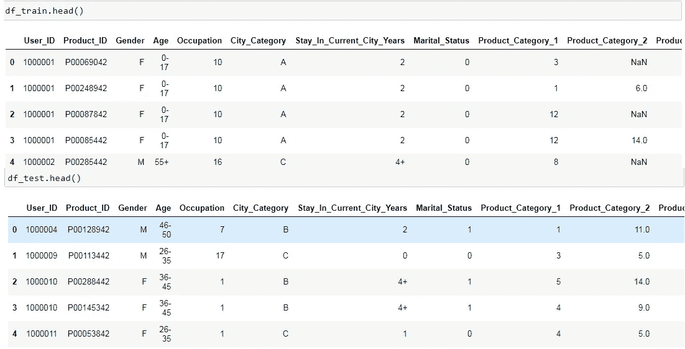

```
# Checking shape of df_train and df_test
>> df_train.shape
[out]>> (550068, 12)>> df_test.shape
[out]>>(233599, 11)
```

我们将组合**训练**和**测试**数据集，因为我们不喜欢两次进行相同的**数据操作、清理、编码等**操作。

```
#Combining df_train and df_test
df=df_train.append(df_test)
df.shape
[out]>> (783667, 12)
```

## **第三步:了解数据集**

```
 **>> df.columns** # print all the column present in dataset[out]>> Index(['Product_ID', 'Gender', 'Age', 'Occupation', 'City_Category','Stay_In_Current_City_Years', 'Marital_Status', 'Product_Category_1','Product_Category_2', 'Product_Category_3', 'Purchase'],dtype='object')
```

我们将检查每列包含哪种数据类型。

```
**>> df.dtypes**[out]>> User_ID                         int64
        Product_ID                     object
        Gender                         object
        Age                            object
        Occupation                      int64
        City_Category                  object
        Stay_In_Current_City_Years     object
        Marital_Status                  int64
        Product_Category_1              int64
        Product_Category_2            float64
        Product_Category_3            float64
        Purchase                      float64
        dtype: object
```

在这里，我们将检查数据集中是否存在任何**空值**，如果是，那么我们将对**空值**进行计数。

```
**>> df.isnull().sum()**[out]>> User_ID                            0
        Product_ID                         0
        Gender                             0
        Age                                0
        Occupation                         0
        City_Category                      0
        Stay_In_Current_City_Years         0
        Marital_Status                     0
        Product_Category_1                 0
        Product_Category_2            245982
        Product_Category_3            545809
        Purchase                      233599
        dtype: int64
```

## 步骤 4:删除空值

如果给定的数据集中有空值，那么我们的下一个任务应该是用机器可读的适当数据填充这些空值。这里我将通过该列的**平均值**对空值进行**填充。**

```
>>**df["Product_Category_2"]=df["Product_Category_2"].fillna(value=df["Product_Category_2"].mean())**>**>df["Product_Category_3"]=df["Product_Category_3"].fillna(value=df["Product_Category_3"].mean())****>> df["Purchase"]=df["Purchase"].fillna(value=df["Purchase"].mean())**
```

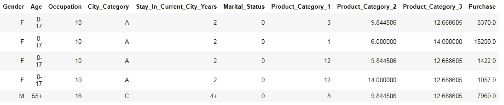

**检查是否有空值的列**

```
**>> df.isnull().sum()

[out] >>** User_ID                       0
         Product_ID                    0
         Gender                        0
         Age                           0
         Occupation                    0
         City_Category                 0
         Stay_In_Current_City_Years    0
         Marital_Status                0
         Cat1                          0
         Cat2                          0
         Cat3                          0
         Purchase                      0
         dtype: int64#Now we can conclude  that there is no any null value is present
```

## 步骤 5:重命名特征

如果我们看到数据集有很多列空间被“产品 _ 类别 _1”、“产品 _ 类别 _2”、“产品 _ 类别 _3”占用。所以我想把给定的列重命名为。

```
>> df.rename(columns={"Product_Category_1":"Cat1",   "Product_Category_2":"Cat2 ,"Product_Category_3":"Cat3"})
>> df.tail()  # It will print last 5 rows of given dataset
```

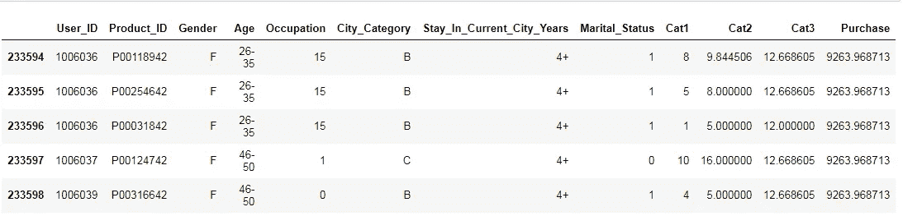

## 步骤 6:数据集的统计描述

```
>> df.describe() #It will give statistical description of dataset
```

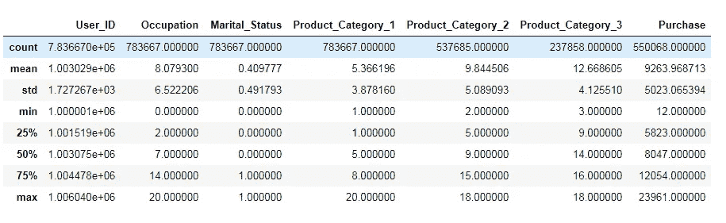

如果我们将看到描述，描述“User_Id”是不可理解的，所以我们的下一个任务将是删除这些不需要的列。

```
 >> df.drop("User_ID",axis=1,inplace=True) 
```

## 步骤 7:将分类变量映射成数值变量

```
df.head()   #printing first five rows
```

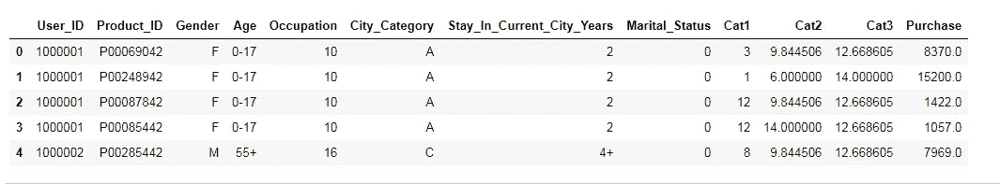

1.  现在我们的任务是将性别(最初是一个**分类**变量)映射成**数字**变量。

```
df["Gender"]=df["Gender"].map({"F":0,"M":1})
df["Gender"].head()
```

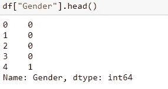

2.在“年龄”栏中，我们得到了**年龄范围**，我们还需要将这些值映射成数字变量。

```
df["Age"]=df["Age"].map({'0-17':0, '55+':1, '26-35':2, '46-50':3, '51-55':4, '36-45':5, '18-25':6})
df["Age"].head()
```

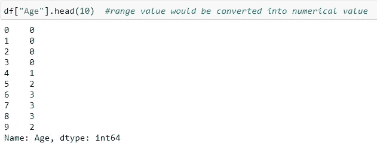

3.在“停留在当前城市年份”一栏中有各种城市名称，即:- **A、B** 和 **C** 我们的主要目的是将这些分类城市转换成数字城市。为此，我们将使用 **get_dummies。**

**get_dummies** 将数据转换成**虚拟变量**。取值 **0 或 1** 表示给定分类数据的存在和不存在。如果你想了解更多关于虚拟变量的信息，点击 [**这里**](https://www.geeksforgeeks.org/python-pandas-series-str-get_dummies/) 。

```
city=pd.get_dummies(df["City_Category"],drop_first=True)
#Converting categorical dataset into numerical dataset by dropping #first column(or converting dataset into (k-1) dimension from k dim)
```

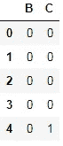

**“City _ Category”**已被修改为列 **A 和 B(带有机器可读数据点)**现在它将是一个无效列，因此在本节中，我们将删除**“City _ Category”**并将 **city** 数据帧与原始数据帧 **df 连接起来。**

```
df.drop("City_Category",axis=1,inplace=True)
df=df.append(city)
```

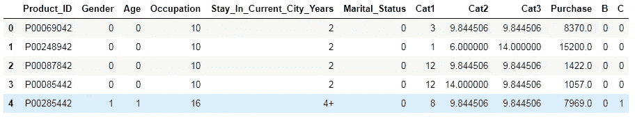

4.如果我们看到**“停留当前城市年数”**，一些数据点 **4+** 无法被机器读取，因此我们需要更换 **+** 符号。

```
df[“Stay_In _Current_City_Years”]=df[“Stay_In _Current_City_Years”] .str.replace("+"," ")     
#replacing plus sign with space
```

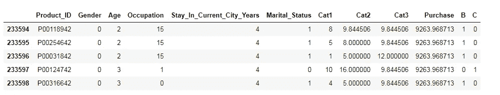

我们可以看到 **4+** 已经被 **4 取代。**

我们已经完成了将数据转换为机器可读格式的所有操作，但在继续之前，我们将确认所有数据是否都是数字(机器可读)的。

```
>> df.dtypes[out]>> Product_ID               object
        Gender                          int64
        Age                             int64
        Occupation                      int64
        Stay_In_Current_City_Years     object
        Marital_Status                  int64
        Cat1                            int64
        Cat2                          float64
        Cat3                          float64
        Purchase                      float64
        B                               uint8
        C                               uint8
        dtype: object
```

这里我们将删除不必要的列**“Product _ ID”**，并将所有剩余的列转换为 **int** 数据类型。

```
>> df.drop("Product_ID",axis=1,inplace=True)>>df["Stay_In_Current_City_Years"]=df["Stay_In_Current_City_Years"]. astype(int)>>df["B"]=df["B"].astype(int)>>df["C"]=df["C"].astype(int)
```

现在所有的列都被转换成机器可读的数字数据。

```
>> df.dtypes[out]>>Product_ID                     object
Gender                          int64
Age                             int64
Occupation                      int64
Stay_In_Current_City_Years      int32
Marital_Status                  int64
Cat1                            int64
Cat2                          float64
Cat3                          float64
Purchase                      float64
B                               int32
C                               int32
dtype: object
```

## 步骤 8:预建模步骤


图片来自[lifehack.org](https://www.google.com/search?q=task+quickly+done&sxsrf=ALeKk03CBKscFcJWcUiwnjqP6yzlD0U1dA:1603305521584&source=lnms&tbm=isch&sa=X&ved=2ahUKEwjo99HAqsbsAhWDyDgGHTM-DlsQ_AUoAXoECB8QAw&biw=1366&bih=657#imgrc=e6nQU79EMXYkyM)

```
target=df.Purchase   #Making it label for modeling
features=df.drop("Purchase",axis=1) # Making feature for modeling 
#which won't have target variable
```

现在我们将制作训练和测试数据集；

```
X_train,X_test,Y_train,Y_test=train_test_split(feature,target,test_size=0.25,random_state=12) 
```

这里的`test_size=0.25`表示我们已经将 75%的数据用于训练，25%的数据用于测试。`random_state=int`意味着我们每次运行代码都会得到相同的数据点，如果`random_state!=int`意味着我们每次运行相同的代码都会得到不同的数据点。

```
#now we will standardize the data so that all the column will be at same scale
sc=StandardScaler()
X_train=sc.fit_tranform(X_train)
X_test=sc.transform(X_test)
```

打印 X_train 和 X _ test

```
>> X_train
```

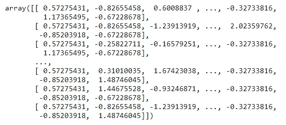

```
>> X_test
```

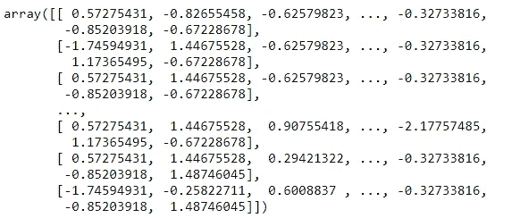

训练和测试数据集的特征都已被转换成数据帧，并可用于机器学习建模。

## 结论:

这些都是我的观点，如果你认为这个博客应该进一步改进，请提出你的宝贵意见