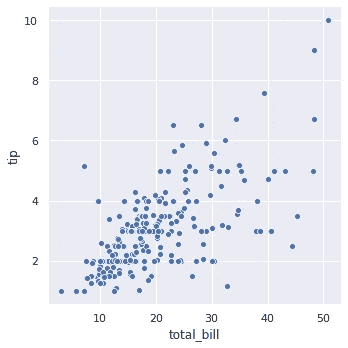

# Seaborn 数据可视化实践

> 原文：<https://medium.com/analytics-vidhya/hands-on-data-visualization-with-seaborn-1aefc20569e9?source=collection_archive---------3----------------------->


图片 src : [freepik](https://www.freepik.com/free-vector/business-people-working-control-center-with-big-screens-flat-illustration_11235252.htm#page=1&query=data&position=7)

Seaborn 用于在 python 中制作统计图形。它构建在 [matplotLib](https://en.wikipedia.org/wiki/Matplotlib) 之上。为了理解你的数据，你需要将它们可视化。所以让我们用一些代码来弄脏我们的手。

先决条件:`[Numpy](https://numpy.org/doc/stable/user/quickstart.html)` `[Pandas — just to read CSV](https://pandas.pydata.org/pandas-docs/stable/user_guide/10min.html)`

我们需要的必要库是:-

*   `seaborn`
*   `numpy` 和`pandas`
*   `pyplot` 从`matplotLib`

```
import numpy as np
import pandas as pd
from matplotlib import pyplot as plt
%matplotlib inline
```

`%matplotlib inline`将 matplotlib 的后端设置为`inline`这样，绘图命令的输出在前端内联显示，就像您正在使用的 Jupyter 笔记本一样，绘图将显示在您编写的代码下方。

Seaborn 有内置数据。所以让我们利用它们。

```
# setting dark grid (whitegrid is other option), it makes visualisation easysns.set(style = 'darkgrid')# for any other data you can see 
# [https://github.com/mwaskom/seaborn-data](https://github.com/mwaskom/seaborn-data)
# But we will be using them for further plots# loading tips data
tips = sns.load_dataset('tips')
tips.head(5) # To see how data looks
```


1.  关系图:为了找到数据中两个数字特征之间的关系，我们使用这个图。这里的`total_bill`和`tip`是我们可以使用的数字特征。

```
sns.relplot(x = ‘total_bill’, y = ‘tip’, data = tips)
```



我们实际上可以包括`hue`用于分等级，这里我们可以设置为吸烟者或非吸烟者。

```
sns.relplot(x = ‘total_bill’, y = ‘tip’, data = tips, hue = ‘smoker’)
```


`size`将产生不同大小元素的变量分组

```
sns.relplot(x = ‘total_bill’, y = ‘tip’, data = tips, size = 'size')
# including sizes you can set the plot size
```


2.线图:这也是一种数值数据的绘制方式。你已经在股票市场价格、比特币价格等方面看到了这些情节

通过使用`kind`，我们可以改变绘制的图形类型。默认设置为`scatter`。现在我们把它改成`line`。

```
sns.relplot(x = 'time', y = 'value', kind = 'line', data = df_random, sort = True)
# sort true -> Just to make sure graph X - axis "time" is sorted 
# if it is not sorted it can arbitrary data <we cannot understand anything from them>
```


这里，我们在`numpy.random`的帮助下生成了随机数据，并在 pandas 的帮助下将它们转换成数据帧

像散点图一样，我们可以在线图的参数中添加`hue`。

**我们可以从`sns.lineplot()`开始绘制线图

```
sns.lineplot(x = 'total_bill', y = 'tip', data = tips)
```


**我们可以通过`sns.scatterplot()`制作散点图

```
sns.scatterplot(x = 'total_bill', y = 'tip', data = tips)
```


3.Catplot:数据中分类特征的绘图。在提示数据中`day`有`categorical data`，`total_bill`有`numerical data`。

```
sns.catplot(x = 'day', y = 'total_bill', data = tips)
```


我们甚至可以交换`x`和`y`轴上的变量，得到一个水平的 catplot 图。


在`catplot()`中，我们可以将`kind`参数设置为`swarm`以避免点重叠。


4.箱线图:为了了解数据的详细分布(数据点的位置),使用箱线图

我们可以将 catplot 中的种类更改为`'box'`或者使用 sns.boxplot()

```
sns.boxplot(x = 'day', y = 'total_bill', data = tips)
```


我们可以在此图中添加`hue`,如下所示

```
sns.boxplot(x = 'day', y = 'total_bill', data = tips, hue = 'sex')
```


[http://web.pdx.edu/~stipakb/download/PA551/boxplot.html](http://web.pdx.edu/~stipakb/download/PA551/boxplot.html)

[更多关于 boxplot](http://web.pdx.edu/~stipakb/download/PA551/boxplot.html)

**箱线图的厚度告诉我们什么，它只是覆盖了数据

5.Violin Plot:它是箱线图和基础分布的特征核密度估计的组合。

```
sns.violinplot(x="day", y="total_bill", data=tips)
```


侧面的曲线表示样品的密度分布，中心线起到箱线图的作用。

这可能是一种有效且有吸引力的方式来一次显示数据的多种分布，但请记住，估计过程受样本大小的影响，相对较小样本的小提琴可能看起来平滑得令人误解。

6.KDEplot:核密度估计(KDE)图是一种可视化数据集中观察值分布的方法，类似于直方图。KDE 使用一维或多维的连续概率密度曲线来表示数据。

```
sns.kdeplot(x, shade=True, cbar = True, bw = 1, cut = 0)
# x is random 100 points
```


`shade = True`KDE 曲线下区域的阴影。我们可以使用`bw`来控制`bandwidth`。参数`cut`从极端数据点得出切割* bw 的估计值，即切割并缩放图形。

7.Jointplot:它可以一次处理两个特性分布。它显示了两个变量(双变量)之间的关系以及页边空白中的 1D 剖面(单变量)。

```
sns.jointplot(x = tips['total_bill'], y = tips['tip'])
```


通过使用`kind`，我们可以选择要绘制的图形类型。在这里我们选择了`kind = 'hex'`，这里的记录被分成六边形。

```
sns.jointplot(x = tips['total_bill'], y = tips['tip'], kind = 'hex')
```


当种类变为`kde`时:


8.Pairplot:绘制数据集中的成对关系。让我们使用经典的数据虹膜。

[关于虹膜数据的更多信息](https://en.wikipedia.org/wiki/Iris_flower_data_set)

```
iris = sns.load_dataset('iris')
sns.pairplot(iris)
```


通过添加`hue`我们可以更清楚地理解数据

```
sns.pairplot(iris, hue='species')
```


当 n 很大(n 是要素的数量)时，不能使用 Pair plot，因为您可以看到输出是 n*n。如果 n 很大，计算时间会更长。

9.regplot:我们可以在`sns.regplot()`的帮助下绘制`regression plots`，这将有助于找到两个变量之间的关系。

```
sns.regplot(x = 'total_bill', y = 'tip', data = tips)
```


10.我们可以用`sns.lmplot()`画一个`linear model plot`。如果散点图包含多个颜色编码组，此命令对于绘制多条回归线非常有用。

```
sns.lmplot(x = 'total_bill', y= 'tip', data = tips)
```


如果我们设置`x_estimator = np.mean`，上图中的点将被平均值和置信线代替。

```
sns.lmplot(x = 'size', y = 'tip', data = tips, x_estimator = np.mean)
```


**我们可以使用`order`参数。如果阶数大于 1，则估计多项式回归。

**要在 lmplot 中处理`outliers`,我们可以从数据集中手动移除异常值，或者我们可以设置`robust = True`在绘图时消除其影响。

让我们做一些预先策划。真的说他们不先进，他们只是 2 个或更多阴谋的混合物，并在一个盘子里提供一些装饰。

11.覆盖图:如果几条线共享 x 和 y 变量，那么在一个图中绘制它们。

```
# Taken random data X having class from 0 to 3 with corresponding y point

fig, ax = plt.subplots(figsize=(7,7))
sns.lineplot(x=['Class0','Class1','Class2','Class3'], 
             y=[4,3,6,4],
             color='r', #color red
             ax=ax)
sns.lineplot(x=['Class0','Class1','Class2','Class3'],
             y=[1,6,5,5], 
             color='b', #color blue
             ax=ax)    
ax.legend(['iteration1', 'iteration2'], facecolor='w')
plt.show()
```


用不同的比例绘图

x 轴是相同的，而 y 轴的刻度是不同的

```
sns.set_style("darkgrid", {'axes.grid' : False})
fig, ax1 = plt.subplots(figsize=(6,6))
ax2 = ax1.twinx() # necessary for different scales on same plot
sns.barplot(x=['Class A','Class B','Class C','Class D',
                'Class E','Class F','Class G'],
            y=[100,200,135,98,100,120,198], 
            color='#004488',
            ax=ax1)
sns.lineplot(x=['Class A','Class B','Class C','Class D',
                'Class E','Class F','Class G'],
             y=[1,2,4,8,16,32,64], #in place you can keep other func
             color='r',
             marker="o",
             ax=ax2)
plt.show()
sns.set()
```


这两个图具有不同的 y 轴，我们需要创建另一个具有相同 x 轴的“轴”对象(使用。twinx())然后绘制在不同的“轴”上。sns.set(样式和轴网格)是为当前情节设置特定的美学，我们最后运行 sns.set()将一切设置回默认设置。

将不同的柱状图组合成一个分组柱状图

```
# Synthetic Data
# Different stock price per unit @ month[JAN, FEB, MAR, APR]company = ['Company 1', 'Company 2', 'Company 3', 'Company 4']
category = ['JAN', 'FEB', 'MAR', 'APR']
colors        = ['orange', 'red', 'blue', 'green']
numerical = [[160, 90, 120, 70], #company 1
             [66, 74, 130, 80],  #company 2
             [98, 110, 163, 125], #company 3
             [130, 115, 97, 65]]  #company 4
number_groups = len(category) 
bin_width = 1.0/(number_groups+1)
fig, ax = plt.subplots(figsize=(8,8))
for i in range(number_groups):
    ax.bar(x=np.arange(len(category)) + i*bin_width, 
           height=numerical[i],
           width=bin_width,
           color=colors[i],
           align='center')
ax.set_xticks(np.arange(len(category)) + number_groups/(2*(number_groups+1)))
# number_groups/(2*(number_groups+1)): offset of xticklabel
ax.set_xticklabels(category)
ax.legend(company, facecolor='w')
plt.show()
```


用 GridSpec 划分图形

[教程](https://www.python-course.eu/matplotlib_gridspec.php)

```
from matplotlib.gridspec import GridSpec #Lib which is needed
```

试图用 HTML 制作表格的人可以很容易理解这一点，但没有做过的人不用担心。

```
fig = plt.figure(constrained_layout=True)
gs = GridSpec(3, 3, figure=fig) # number of rows = 3 & columns = 3
''' this will make a table of 3,3 units in which we can partition as we like ''' 
```

它看起来像一个 3 * 3 的矩阵


3 x 3 矩阵

在这里，我们将有支线剧情，而不是元素

```
ax1 = fig.add_subplot(gs[0, 0])
ax2 = fig.add_subplot(gs[0, 1])
ax3 = fig.add_subplot(gs[0, 2])
ax4 = fig.add_subplot(gs[1, 0])
ax5 = fig.add_subplot(gs[1, 1])
ax6 = fig.add_subplot(gs[1, 2])
ax7 = fig.add_subplot(gs[2, 0])
ax8 = fig.add_subplot(gs[2, 1])
ax9 = fig.add_subplot(gs[2, 2])# for format in axes we can make a function like
def format_axes(fig):
    for i, ax in enumerate(fig.axes):
        ax.text(0.5, 0.5, "ax%d" % (i+1), va="center", ha="center")
        ax.tick_params(labelbottom=False, labelleft=False)fig.suptitle("GridSpec")
format_axes(fig)plt.show()
```


让我们玩玩它，做些有趣的东西

```
# making some random data points
x = np.linspace(0., 3*np.pi, 100) # 0 to 3*Pi in 100 steps
y_1 = np.sin(x) 
y_2 = np.cos(x)
time = np.linspace(0, 10, 1000)
height = np.sin(time)
weight = time*0.3 + 2
score = time**2 + height
# now use gridspecsfig = plt.figure(constrained_layout=True, figsize=(10, 10))
spec = fig.add_gridspec(3, 3)ax1 = fig.add_subplot(spec[0, :-1])
ax1.plot(x,y_1)
ax1.set_title('ax1')ax2 = fig.add_subplot(spec[:, -1])
ax2.plot(time,score)
ax2.set_title('ax2')ax3 = fig.add_subplot(spec[1:, 0])
ax3.plot(x,y_2)
ax3.plot(time,height)
ax3.set_title('ax3')ax4 = fig.add_subplot(spec[1, 1])
ax4.set_title('ax4')
ax4.plot(time,weight)ax5 = fig.add_subplot(spec[-1, 1])
ax5.set_title('ax5')
ax5.scatter(x,y_2)
```


其他资源和积分:

*   [FacetGrid](https://seaborn.pydata.org/generated/seaborn.FacetGrid.html)
*   [海风文件](https://seaborn.pydata.org/tutorial.html)
*   [kaggle 数据可视化课程](https://www.kaggle.com/learn/data-visualization)