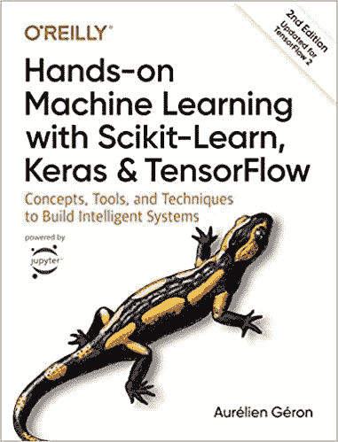
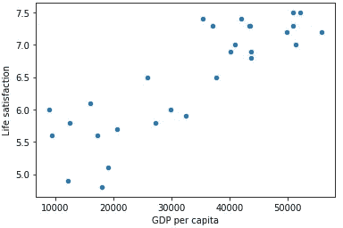

# 动手机器学习—简单线性回归

> 原文：<https://medium.com/analytics-vidhya/hands-on-machine-learning-simple-linear-regres-c9bdf0b58549?source=collection_archive---------15----------------------->



也许关于 python 和数据科学的最好的书籍之一是 Géron 的*用 Scikit-Learn、Keras & TensorFlow* 进行机器学习的实践。在我看来，这本书特别适合初学者。对于自学成才的数据科学家来说，这本书是绝对必须的。有几个包含代码的指导性项目，为有抱负的数据科学家提供指导。

了解 Scikit-Learn、Keras 和 TensorFlow 对于数据科学家来说也是绝对必须的，因为雇主热衷于这些库及其模块。简要总结:

Scikit-Learn 是一个 Python 的机器学习库，具有统计分析、监督和非监督学习的各种算法。

Keras 是一个人工神经网络库。

TensorFlow 是另一个用于机器学习的库，但专注于训练深度神经网络。

这本书用代码指导读者，并对代码做什么以及如何工作做了很好的解释。它还解释了各种算法和神经网络如何与图表和视觉效果一起工作。在我看来，这是理论和实践之间的巨大平衡。

# 第 1 章简单线性回归

第一章涵盖 scikit-learn 线性模型和一个非常简单的线性回归问题。数据集是经合组织 2015 年美好生活指数。下面是人均 GDP 和生活满意度之间的线性模型的代码。

在[1]中:

```
**import** **matplotlib.pyplot** **as** **plt**
**import** **numpy** **as** **np**
**import** **pandas** **as** **pd**
**import** **sklearn.linear_model**
```

在[2]中:

```
oecd_bli = pd.read_csv("oecd_bli_2015.csv",thousands = ',')
gdp_per_capita = pd.read_csv('gdp_per_capita.csv',thousands=',',delimiter='**\t**',encoding='latin1',na_values = 'n/a')
```

在[7]中:

```
**def** prepare_country_stats(oecd_bli,gdp_per_capita):
    oecd_bli = oecd_bli[oecd_bli['INEQUALITY']=='TOT']
    oecd_bli = oecd_bli.pivot(index='Country',columns='Indicator',values='Value')
    gdp_per_capita.rename(columns={'2015':'GDP per capita'},inplace=**True**)
    gdp_per_capita.set_index('Country',inplace=**True**)
    full_country_stats = pd.merge(left=oecd_bli,right=gdp_per_capita,left_index=**True**,right_index=**True**)
    full_country_stats.sort_values(by='GDP per capita',inplace=**True**)
    remove_indices = [0,1,6,8,33,34,35]
    keep_indices = list(set(range(36))-set(remove_indices))
    **return** full_country_stats[['GDP per capita', 'Life satisfaction']].iloc[keep_indices]
```

在[8]中:

```
country_stats = prepare_country_stats(oecd_bli,gdp_per_capita)
```

在[10]中:

```
X = np.c_[country_stats['GDP per capita']]
y = np.c_[country_stats['Life satisfaction']]
```

在[11]中:

```
country_stats.plot(kind = 'scatter',x='GDP per capita', y='Life satisfaction')
plt.show()
```



在[12]中:

```
model = sklearn.linear_model.LinearRegression()
```

在[13]中:

```
model.fit(X,y)
```

Out[13]:

```
LinearRegression(copy_X=True, fit_intercept=True, n_jobs=None, normalize=False)
```

在[14]中:

```
X_new = [[22587]] *# GDP per capita for Cyprus*
```

在[15]中:

```
print(model.predict(X_new))[[5.96242338]]
```

塞浦路斯的数据不详，但根据线性模型，该国的生活满意度应为 5.96。斯洛文尼亚为 5.7，人均国内生产总值为 20，732 美元。这是一个非常简单的(x，y)模型，只有两个变量。该数据集具有许多其他变量和特征，其他 scikit-learn 模型可能更适合这些变量和特征。