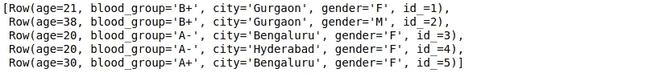

# 使用 Spark SQL 分析数据的实践教程

> 原文：<https://medium.com/analytics-vidhya/hands-on-tutorial-to-analyze-data-using-spark-sql-b5b7e7a9e605?source=collection_archive---------23----------------------->

几乎所有组织都使用关系数据库来完成各种任务，从管理和跟踪大量信息到组织和处理事务。这是我们在编码学校学到的第一个概念。

让我们对此心存感激，因为这是数据科学家技能组合中至关重要的一环！如果不知道数据库是如何工作的，你就无法生存。这是任何机器学习项目的一个关键方面。

[结构化查询语言(SQL)](https://courses.analyticsvidhya.com/courses/structured-query-language-sql-for-data-science) 很容易成为数据库中最流行的语言。不像其他编程语言，它很容易学习，并帮助我们开始我们的数据提取过程。对于大多数数据科学工作来说，对 SQL 的熟练程度高于大多数其他编程语言。


但是 SQL 有一个重大的挑战——当您处理海量数据集时，您将很难让它工作。这就是 Spark SQL 占据首要位置并弥合差距的地方。我将在下一节中详细介绍这一点。

本实践教程将向您介绍 Spark SQL 的世界，它是如何工作的，它提供了哪些不同的特性，以及如何使用 Python 实现它。我们还将讨论一个你在面试中经常会遇到的重要概念——catalyst optimizer。

我们开始吧！

# 扩展关系数据库的挑战

问题是你为什么要学习 Spark SQL？我之前简单地提到了这一点，但是现在让我们更详细地看一下。

一个大型(机器学习)项目的关系数据库包含数百或数千个表，并且一个表中的大多数特征被映射到一些其他表中的一些其他特征。这些数据库被设计成只在一台机器上运行，以便维护表映射的规则并避免分布式计算的问题。

当组织希望使用这种设计进行扩展时，这通常会成为一个问题。它需要更复杂、更昂贵的硬件，以及更高的处理能力和存储能力。你可以想象，**从简单的硬件升级到复杂的硬件是极具挑战性的。**

> 一个组织可能需要将其网站离线一段时间，以进行任何必要的更改。在此期间，他们可能会失去潜在的新客户。

此外，随着数据量的增加，组织很难使用传统的关系数据库来处理如此大量的数据。这就是 Spark SQL 的用武之地。

# Spark SQL 概述

> *“没有大数据分析，公司就像瞎子和聋子一样，在网络上游荡，就像高速公路上的小鹿。”*
> 
> *~杰弗里·摩尔*

Hadoop 和 Map Reduce 框架在大数据分析领域已经存在了很长时间。但是这些框架需要在硬盘上进行大量的读写操作，这使得它在时间和速度上非常昂贵。

[Apache Spark](https://www.analyticsvidhya.com/blog/2016/09/comprehensive-introduction-to-apache-spark-rdds-dataframes-using-pyspark/) 是当今企业中最有效的数据处理框架。诚然，Spark 的成本很高，因为它需要大量 RAM 来进行内存计算，但它仍然是数据科学家和大数据工程师的最爱。

在 Spark 生态系统中，我们有以下组件:

1.  **MLlib:** 这是 Spark 的可扩展机器学习库，为回归、聚类、分类等提供高质量的算法。您可以使用本文开始使用 Spark 的 MLlib 构建机器学习管道:[如何使用 PySpark 构建机器学习管道？](https://www.analyticsvidhya.com/blog/2019/11/build-machine-learning-pipelines-pyspark/)
2.  **Spark Streaming:** 我们现在正在以前所未有的速度和规模生成数据。我们如何确保我们的机器学习管道在数据生成和收集后立即继续产生结果？[了解如何使用机器学习模型对使用 PySpark 的流数据进行预测？](https://www.analyticsvidhya.com/blog/2019/12/streaming-data-pyspark-machine-learning-model/)
3.  GraphX: 它是一个用于图形的 Spark API，一个支持并行图形计算的网络图形引擎
4.  **Spark SQL:** 这是 Spark 提供的用于结构化数据处理的分布式框架

我们知道，在关系数据库中，不同变量之间的关系以及不同的表也被存储和设计成能够处理复杂查询的方式。

Spark SQL 是关系处理和 Spark 函数式编程的完美结合。它提供了对各种数据源的支持，并使 SQL 查询成为可能，从而为大规模分析结构化数据提供了一个非常强大的工具。


# Spark SQL 的特性

Spark SQL 拥有大量出色的特性，但我想重点介绍几个您在工作中会经常用到的关键特性:

1.  **在 Spark 程序中查询结构化数据:**大多数人可能已经熟悉 SQL 了。因此，使用 Spark 不需要学习如何在 Python 或 Scala 中定义复杂函数。您可以使用完全相同的查询来获得更大数据集的结果！
2.  **兼容 Hive:** 不仅是 SQL，还可以使用 Spark SQL 引擎运行相同的 Hive 查询。它允许与当前的配置单元查询完全兼容
3.  **访问数据的一种方式:**在典型的企业级项目中，您没有公共的数据源。相反，您需要处理多种类型的文件和数据库。Spark SQL 支持几乎所有类型的文件，并为您提供了一种访问各种数据源的通用方法，如 Hive、Avro、Parquet、JSON 和 JDBC
4.  **性能和可伸缩性:**在处理大型数据集时，在查询运行期间可能会出现错误。Spark SQL 支持完整的中间查询容错，因此我们甚至可以同时处理一千个节点
5.  **用户定义的函数:** UDF 是 Spark SQL 的一个特性，它定义了新的基于列的函数，扩展了 Spark SQL 的词汇表，用于转换数据集

# Spark SQL 如何执行查询？

Spark SQL 本质上是如何工作的？我们先来了解这一节的流程。

*   **分析:**首先，当你查询某个东西时，Spark SQL 会找到需要计算的关系。它是使用抽象语法树(AST)计算的，它检查用于定义查询的元素的正确用法，然后创建一个逻辑计划来执行查询


[图像来源](https://www.waitingforcode.com/apache-spark-sql/writing-custom-optimization-apache-spark-sql-parser/read)

*   **逻辑优化:**在下一步中，基于规则的优化将应用于逻辑计划。它使用的技术包括:如果查询包含一个 **where** 子句，则尽早过滤数据，利用表中可用的索引，因为这可以提高性能，甚至确保不同的数据源以最有效的顺序连接
*   **物理规划:**在该步骤中，使用逻辑规划形成一个或多个物理规划。Spark SQL 然后选择能够以最有效的方式执行查询的计划，即使用较少的计算资源
*   **代码生成:**在最后一步，Spark SQL 生成代码。它包括生成在每台机器上运行的 Java 字节代码。Catalyst 使用一种叫做“准引号”的 Scala 语言特性来简化代码生成


# 什么是催化剂优化器？

优化意味着升级现有系统或工作流程，使其以更高效的方式工作，同时使用更少的资源。Spark SQL 中实现了一个称为 **Catalyst Optimizer** 的优化器，它支持**基于规则和基于成本的优化技术**。

在基于规则的优化中，我们定义了一组规则，这些规则将决定如何执行查询。它将以更好的方式重写现有的查询以提高性能。

例如，假设表上有一个索引。然后，索引将用于根据规则执行查询，如果可能，过滤器将首先应用于初始数据(而不是在最后应用)。

此外，在某些情况下，索引的使用会降低查询速度。我们知道，一套明确的规则并不总是能够做出伟大的决策，对吗？

> *问题来了——基于规则的优化没有考虑数据分布。这就是我们求助于基于成本的优化器的地方。它使用关于表、其索引和数据分布的统计信息来做出更好的决策。*

# 使用 Spark 执行 SQL 命令

该编码了！

我创建了一个 2500 万行的随机数据集。你可以点击下载[整个数据集。我们有一个用逗号分隔值的文本文件。因此，首先，我们将导入所需的库，读取数据集，并查看 Spark 如何将数据划分为分区:](https://drive.google.com/open?id=1sy5G4Y1RnlndLK86jzcV3CZJcTeo8Foj)

```
# importing required libraries
from pyspark.sql import SQLContext
from pyspark.sql import Row# read the text data
raw_data = sc.textFile('sample_data_final_wh.txt').cache()# get number of partitions
raw_data.getNumPartitions()
## >> 19# view top 2 rows
raw_data.take(2)
```


这里，

*   每行的第一个值是人的年龄(需要是整数)
*   第二个值是人的血型(需要是字符串)
*   第三和第四个值是城市和性别(都是字符串)，以及
*   最后一个值是一个 id(整数类型)

我们将使用 Spark 行将每一行的数据映射到特定的数据类型和名称:

```
# create spark sql context
sql_context = SQLContext(sc)# split the data
csv_rdd = raw_data.map(lambda row: row.split(','))# top 2 rows
csv_rdd.take(2)# map the datatypes of each column
parsed = csv_rdd.map(lambda r : Row( age = int(r[0]),
                                     blood_group = r[1],
                                     city = r[2],
                                     gender = r[3],
                                     id_ = int(r[4])))
# top 5 rows
parsed.take(5)
```



接下来，我们将使用解析后的行创建一个 dataframe。我们的目标是通过在数据帧上使用简单的 *groupby* 函数找到性别变量的值计数:

```
# create dataframe 
data_frame = sql_context.createDataFrame(parsed)# view the dataframe
data_frame.show(5)# value counts of gender
data_frame.groupby('gender').count().show()
```


在 dataframe 上使用 groupby 函数计算 2500 万行的值计数大约需要 26 毫秒。您可以在 Jupyter 笔记本的特定单元格中使用 *%%time* 来计算时间。

现在，我们将使用 Spark SQL 执行相同的查询，看看它是否能提高性能。

首先，您需要使用函数 **registerTempTable 将 dataframe 注册为一个临时表。**这将创建一个内存中的表，该表的范围仅限于创建它的集群。该临时表的生存期仅限于一个会话。它是使用 [Hive 的内存列格式](https://forums.databricks.com/questions/400/what-is-the-difference-between-registertemptable-a.html)存储的，这种格式针对关系数据进行了高度优化。

此外，如果您熟悉 SQL，您甚至不需要编写复杂的函数来获得结果！在这里，您只需要传递相同的 SQL 查询，就可以在更大的数据上获得想要的结果:

```
# register temporary table
data_frame.registerTempTable('sample')# get the value count using the sql query
gender = sql_context.sql(" SELECT gender, count(*) as freq from sample GROUP BY gender ")# view the results
gender.show()
```


计算值计数仅用了大约 18 ms。这甚至比火花数据帧快得多。

接下来，我们将执行另一个 SQL 查询来计算一个城市的平均年龄:

查看[要点](https://gist.github.com/lakshay-arora/c2daf526af67398023234c51934b5693)上的代码。


# Apache Spark 大规模使用案例

我们知道脸书每月有超过 20 亿活跃用户，随着数据的增多，他们面临着同样复杂的挑战。对于单个查询，他们需要在单个查询中分析数十 TB 的数据。脸书认为，Spark 已经成熟到我们可以在许多批处理用例中将其与 Hive 进行比较的程度。

让我用脸书的一个案例来说明这一点。他们的任务之一是为脸书在各种在线服务中使用的实体排名准备功能。早期，他们使用基于 Hive 的基础设施，这是资源密集型的，维护起来很困难，因为流水线被分割成数百个 Hive 作业。然后，他们用 Spark 构建了一个更快、更易管理的管道。你可以在这里阅读他们的完整旅程[。](https://engineering.fb.com/core-data/apache-spark-scale-a-60-tb-production-use-case/)

他们比较了 Spark 和 Hive Pipeline 的结果。这是一个关于延迟(作业的端到端运行时间)的比较图，它清楚地表明 Spark 比 Hive 快得多。


# 结束注释

在本文中，我们已经介绍了 Spark SQL 背后的核心思想，并学习了如何利用它。我们还使用了一个大型数据集，并在 Python 中应用了我们的知识。

Spark SQL 对于许多数据科学爱好者来说是一个相对陌生的领域，但它会在你的行业角色甚至面试中派上用场。在招聘经理看来，这是一个相当重要的附加条件。

*原载于 2020 年 2 月 6 日*[*【https://www.analyticsvidhya.com】*](https://www.analyticsvidhya.com/blog/2020/02/hands-on-tutorial-spark-sql-analyze-data/)*。*