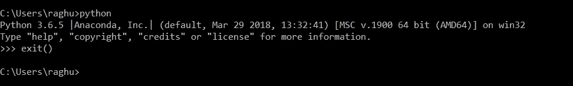
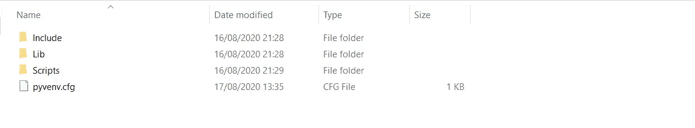
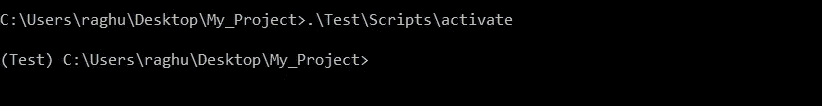
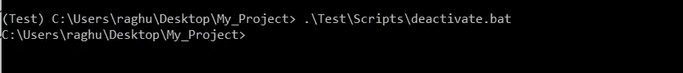
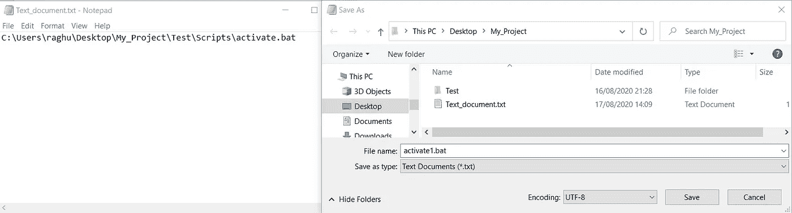
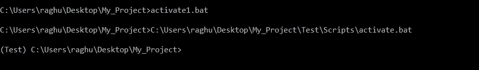
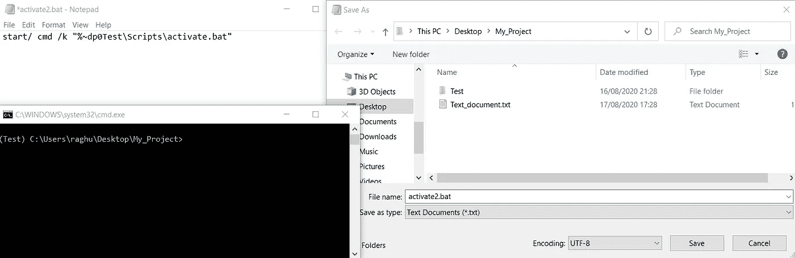

# 为什么我不再使用命令行来激活我的虚拟环境？

> 原文：<https://medium.com/analytics-vidhya/hands-on-virtual-environment-in-python-bb0d5a0b8699?source=collection_archive---------9----------------------->

## 了解如何使用 venv 创建虚拟环境并使用可执行文件激活。


凯文·Ku 在 [Unsplash](https://unsplash.com/s/photos/coding?utm_source=unsplash&utm_medium=referral&utm_content=creditCopyText) 上的照片

> 什么是虚拟环境？
> 
> 虚拟环境有助于为项目创建、管理和隔离环境，每个环境都使用相同或不同版本的可执行文件。

## 为什么我们需要一个？

考虑以下场景，其中您有两个项目:*项目 A* 和*项目 B* ，这两个项目都依赖于同一个库，*项目 C* 。当我们需要不同版本的*项目 C* 时，问题就变得很明显了。也许*项目 A* 需要 v1.0.0，而*项目 B* 需要更新的 v2.0.0。这对 Python 来说是一个真正的问题，因为它无法区分同一目录中的版本。

## 我们哪里需要？

随着 Django、Flask 等与 Python 兼容的 web 框架的增长，以及 AWS、Google Cloud、Heroku、linode 等云服务的增加。随着许多公司将他们的业务放到网上，每个项目都需要自己的库和版本，隔离每个项目变得很重要。

在本指南中，我们期望在项目文件夹中创建一个虚拟环境。

考虑一个文件夹/目录 ***My_Project*** ，我们要在其中创建一个名为 ***Test*** 的虚拟环境

1.检查 Python 是否安装正确。

运行 ***命令提示符(CMD)或 Windows PowerShell*** 窗口，导航到 ***My_Project*** 目录，执行`python`，然后执行`exit()`。如果您得到的输出与图像中的输出相同，那么一切正常。



如果它说【python.exe】那么你必须把*所在的目录添加到环境变量中。*

*2.执行`pip install virtualenv`安装虚拟环境。*

*3.执行`python -m venv Test`其中 ***测试*** 是你想要创建的虚拟环境的名称。*

**

*如果到目前为止命令执行成功，应该在 ***My_Project*** 目录下创建一个名为 ***Test*** 的文件夹。*

*在 ***测试目录内，*** 你应该会看到一个类似的文件结构。*

**

*4.要激活环境，执行`.\Test\Scripts\activate`或`.\Test\Scripts\activate.bat`*

**

> ****注意:目录路径前的“(测试)”字样表示您已经成功激活了您的虚拟环境。****

*5.要停用环境，执行 `.\Test\Scripts\deactivate.bat`*

**

# *提示和技巧*

*考虑您正在进行的一个项目:如果是一个小项目，您不会介意执行命令来激活环境，如果是一个跨月的大项目，每次在项目中执行每个命令没有多大意义。所以，你可以这样做:*

> *创建一个 ***批次(。***bat)文件包含激活环境的命令。*

*创建一个新的**文本文档(。txt )** 在 ***My_Project*** 目录下，在文件中写入 ***activate.bat*** 的绝对路径，并将文件另存为项目目录下的***activate 1 . bat***。*

**

*现在，在按下 ***Shift*** 键的同时，右键单击项目目录上的*，启动项目目录中的 ***命令提示符/PowerShell*** 窗口。 ***或*** 在任意位置启动一个 ***命令提示符/PowerShell*** 窗口并将其导航到项目文件夹。现在执行***activate 1 . bat***瞧！您的虚拟环境已激活。**

**这里`C:\Users\raghu\Desktop\My_Project\Test\Scripts\activate.bat`是我的文件的绝对路径。**

****

**但是对于一些懒人(包括我)来说——还是两步走。还能再缩短吗，当然！**

> **创建一个 ***批处理(。bat)*** 文件，该文件同时执行任务— ***启动命令提示符/PowerShell*** 窗口和 ***激活虚拟环境*** 。**

**现在编辑**文本(。txt)** 在前面步骤中创建的文档**

```
**start cmd /k “%~dp0Test\Scripts\activate.bat”**
```

**对于一些读者来说，这个命令可能看起来很模糊。我从以前的项目中复制了它，并将单词' ***Test'*** 改为虚拟环境的名称，这就足够了。但是让我们一部分一部分地理解它所说的。**

**1.`start cmd`是启动一个命令提示窗口。**

**2.`/k`是在命令执行后保持 ***命令提示*** 窗口运行。**

**3.现在引号中的所有内容都是激活虚拟环境的实际命令`%~dp0Test\Scripts\activate.bat`**

**4.`%~dp0`指您执行可执行文件的目录路径。该路径将被替换在这个地方，即`C:\Users\raghu\Desktop\My_Project\` ，这是项目目录。**

**5.`Test`是虚拟环境的名称。**

**替换后将执行的最后一条命令是:`*C:\Users\raghu\Desktop\My_Project\Test\Scripts\activate.bat*`，这是 ***activate.bat*** 文件的绝对路径，与第一种方法中使用的相同。**

**在项目目录下将文本文件保存为***activate 2 . bat***并执行。**

> ****注意:您可以从任何目录使用“activate1.bat”激活“测试”虚拟环境，但是要使用“activate2.bat ”,它必须在您的项目目录中。****

****

**我只是一个使用批处理文件的初学者，这只是一个我随着时间和使用而学会的技巧。所以，我期待着听到有经验的人。读者也可以通过 LinkedIn 联系我。**