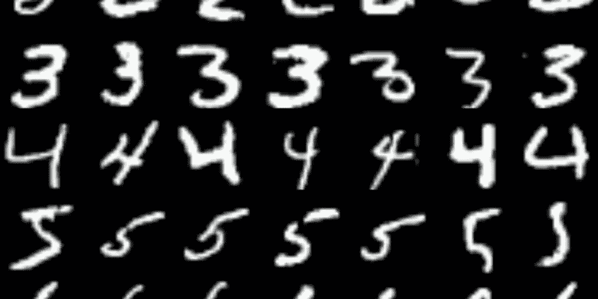
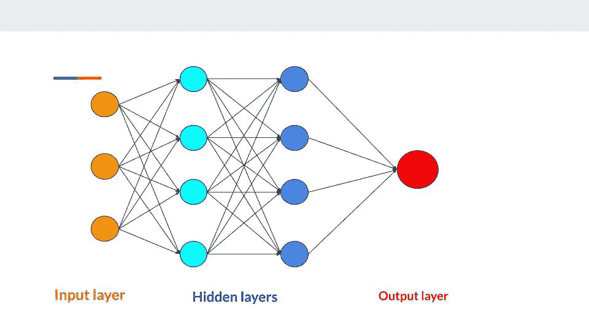

# 手写数字识别

> 原文：<https://medium.com/analytics-vidhya/handwritten-digit-recognition-974dff4991f9?source=collection_archive---------22----------------------->

神经网络模仿我们大脑的工作方式，是不是很有趣？

神经网络试图处理神经元，并建立这些可以训练的复杂大脑网络。机器学习的专门子集，使用分层神经网络来模拟人类决策，称为深度学习。

数字识别系统识别来自不同来源数字，如邮件、银行支票、文件以及车辆牌照。本文使用卷积神经网络对 MNIST 数据集中的手写数字进行分类。



MNIST 数据库

# 卷积神经网络

卷积神经网络是深度神经网络的一部分，广泛用于分析图像，但它们也可用于其他应用，如视频识别、推荐系统和自然语言处理等。

与其他图像分类算法相比，卷积神经网络使用相对较少预处理。CNN 能够检测图像的模式。

卷积神经网络由输入层、输出层和多个隐含层组成。CNN 的这些隐藏层被称为卷积层。形成多个隐含层的深度神经网络称为深度神经网络。

卷积神经网络是具有一定复杂度的深度神经网络。在神经网络中，随着我们在层中越来越深，复杂性和准确性继续增加，但不幸的是，时间消耗也增加了。

> CNN 能以更好的结果完成更好的任务。



深度神经网络

# MNIST 数据库

MNIST 数据库是可从 NIST 获得的较大集合的子集。

这是由高中生和美国人口普查局员工手写的 70，000 幅数字小图像组成的集合。SD-3 在员工中收集，而 SD-1 在高中生中收集。

有 70，000 个图像，其中 60，000 个在训练集中，10，000 个在测试集中，并且每个图像具有 784 个特征。图像以 28×28 像素为中心，每个特征简单地表示像素强度，从 0(白色)到 255(黑色)。

数据像 C 数组一样存储，即最后一个维度中的索引变化最快。

在数学中，张量是一个代数对象，它描述了与向量空间相关的代数对象集之间的关系。张量被用作张量流中的基本结构。Tensorflow 是 google 的开源机器学习框架，用于编程 arcoss 的一系列任务。

让我们从导入 tensorflow 和 numpy 开始编码。将 MNIST 数据集存储在 mnist 变量中。

```
import tensorflow as tf
import numpy as npmnist = tf.keras.datasets.mnist
```

通过使用 load_data()将数据集分成训练集和测试集。

```
(training_images, training_labels), (test_images, test_labels) = mnist.load_data()
```

规范化是消除冗余数据并确保数据相关性的过程。将 0 到 1 之间的所有值除以最大值 255。因此，我们归一化数据集。

```
training_images = training_images.reshape(60000, 28, 28, 1) / 255.0test_images = test_images.reshape(10000, 28, 28, 1) / 255.0
```

让我们通过在 CNN 上添加卷积层来创建神经网络模型。

## 模型设计的概念:

***顺序*** :定义神经网络中的一个层序列。

***【Conv2D】***:该层改变图像，使图像中的某些特征得到强调。

***Maxpooling2D*** :池化是通过取窗口上的最大值来压缩图像的一种方式。

***展平*** :展平将 2D 矩阵数据转换为一维向量。

*:这是一层神经元，每层神经元都有激活功能。如果你没有指定任何东西，就不会激活。*

****relu*** (校正线性单位):该功能防止像素值改变。*

****soft max***:soft max 功能将输出转化为概率，并从十类中选择一类。*

```
*model = tf.keras.models.Sequential()model.add(tf.keras.layers.Conv2D(16, (3,3), activation='relu', padding='same', input_shape = (28 ,28,1)))model.add(tf.keras.layers.MaxPool2D(padding='same'))model.add(tf.keras.layers.Conv2D(16, (3,3), activation='relu',     padding='same'))model.add(tf.keras.layers.MaxPool2D(padding='same'))model.add(tf.keras.layers.Flatten())model.add(tf.keras.layers.Dense(128, activation=tf.nn.relu))model.add(tf.keras.layers.Dense(128, activation=tf.nn.relu))model.add(tf.keras.layers.Dense(10, activation=tf.nn.softmax))*
```

*现在，用优化器和损失函数编译模型。通过调用 model.fit()用 training_images 及其标签对其进行训练。最后，我们得到我们的精度值。*

```
*model.compile(optimizer='adam', loss='sparse_categorical_crossentropy', metrics=['accuracy'])history = model.fit(training_images , training_labels , epochs = 20 )
print(history.epoch, history.history['accuracy'][-1])*
```

*使用模型从未见过的测试数据评估分类器的准确性。利用预测方法得到训练模型的预测值。*

```
*val_loss, val_acc = model.evaluate(test_images, test_labels)prediction = model.predict(test_images)*
```

*最后，打印预测值。*

```
*print("The number on the picture is {}   ".format(np.argmax(prediction[666])))*
```

# *结论:*

*我们成功地用卷积神经网络对 MNIST 数据库中的手写数字进行了分类，准确率达到 99.8%。您可以使用 gui 界面在画布上绘制数字。*

*github 链接:[https://github . com/suya sh-jam Dade/手写数字识别](https://github.com/suyash-jamdade/Handwritten-Digit-Recognition)*