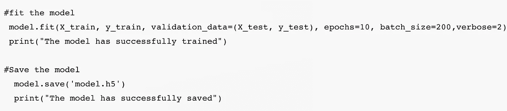
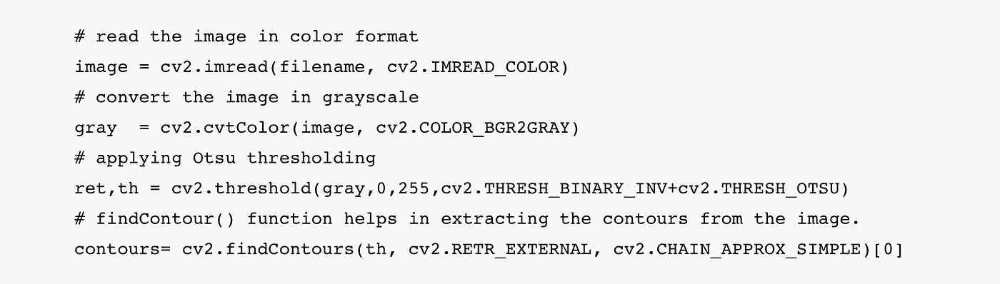

# 手写数字识别 GUI 应用程序

> 原文：<https://medium.com/analytics-vidhya/handwritten-digit-recognition-gui-app-46e3d7b37287?source=collection_archive---------0----------------------->

# **简介**

每天，开发人员都在努力研究机器，通过使用机器学习和深度学习技术使它们更加聪明和智能，以便它们可以执行类似于人类的任务。在这些技术的帮助下，人类在识别、学习、预测和许多其他领域的努力可以减少。

> 计算机从纸质文件、图像、触摸屏等来源识别人类手写数字的能力被称为**手写数字识别**。

在这篇文章中，你将发现如何开发一个深度学习模型，以使用 **MNIST** 数据集实现手写数字识别任务的高性能，并基于 **Tkinter** 构建一个 **GUI 应用**，其中，你可以绘制数字(单个以及多个)，并通过绘制每个数字周围的边界框来直接识别它。

# **问题陈述**

对于人类来说，通过反复练习并为下一次记忆来准确地执行任务是很容易的。人脑可以很容易地处理和分析图像。此外，识别图像中存在的不同元素。

> 手写数字识别中的挑战主要是由每个个体的书写风格变化引起的。因此，让机器像人类一样准确地识别手写数字并不容易。因此，稳健的特征提取对于提高机器的性能非常重要。

# MNIST 数据集

MNIST 数据集(Modified National Institute of Standards and Technology)是一个庞大的手写数字数据集，广泛用于机器学习和深度学习领域的训练和测试。

> MNIST 数据集包含从 0 到 9(0 到 9)的手写数字的 60，000 幅训练图像和 10，000 幅测试图像。因此，MNIST 数据集有 10 个不同的类。每个图像被表示为 28×28 矩阵，其中每个单元包含灰度像素值。

# 为什么要深度学习？

深度学习是一种机器学习，它使用多层从输入中逐步提取更高级别的特征。因此，深度学习减少了为每个问题开发新的特征提取器的任务。深度学习的这一特点是比传统机器学习领先了一大步。

> 大多数现代深度学习模型都基于人工神经网络，具体来说，就是我们将在本文中使用的卷积神经网络(CNN)。

# 实现 CNN 手写数字识别 GUI 应用程序的步骤:

1.  导入库并加载 MNIST 数据集
2.  数据预处理和归一化
3.  创建模型
4.  训练模型
5.  评估模型
6.  创建 GUI 来预测数字

> 该项目要求你有 Python 编程的基础知识，OpenCV，深度学习与 Keras 库和 Tkinter 库构建 GUI。

# **1。导入库并加载 MNIST 数据集**

首先，我们将导入训练模型所需的库。

为了加载数据集，Keras 深度学习库提供了一种加载 MNIST 数据集的便捷方法。所以我们可以通过调用 **mnist.load_data** ()函数轻松导入数据集。

最好在使用数据集之前将其可视化。在这里，我们绘制了 MNIST 训练数据集的六个样本用于可视化。

# **2。数据预处理和归一化**

我们知道，所有图像(数据集)都表示为包含灰度像素值的 28×28 矩阵。据此，训练数据的维数是(60000，28，28)，但是 CNN 模型将需要多一个维数，因此我们需要通过将矩阵整形为(60000，28，28，1)来处理数据。

使用神经网络模型时，最好对输入值进行一些缩放，通过将每个值除以最大值将像素值归一化到范围 0 和 1(注意:像素值是 0 到 255 之间的灰度)。

# 3.创建模型

现在，我们将创建一个 CNN 模型，它具有同样大小的 3×3 的双卷积层、最大池层和全连接层。脱落层用于去激活一些神经元以减少过度拟合。最后，输出层有 10 个神经元用于 10 个类。然后，我们将使用 ADAM 优化器编译该模型。

# 4.训练模型

Keras 的 **model.fit** ()函数采用训练数据、验证数据、时期和批量大小来训练模型。根据您的工作环境(CPU 或 GPU)，训练模型需要一些时间。完成后，我们将模型保存在名为“model.h5”的文件中，以备后用。

# 5.评估模型

为了评估我们的模型的性能，我们有 10，000 个手写数字的测试图像。MNIST 数据集得到了很好的平衡，因此我们可以获得大约 99%的准确性(即 CNN error < 1%).

# 6\. Create GUI to predict digits

Finally it’s time to build GUI App using Tkinter. We will create a new file to build a GUI.

> The tkinter package is the standard Python interface to the Tk GUI toolkit. It is the fastest and easiest way to create the GUI applications. It provides a variety of common GUI elements – such as buttons, menus and various kinds of entry fields and display areas.

There are two main methods:

*   Tk()
*   mainloop()

**Tk** ()是我们用来创建应用程序主窗口的方法，而 **mainloop** ()是我们想要运行应用程序时在主窗口上执行的方法。

让我们从导入应用程序所需的模块开始。

这里，我们通过提供模型路径来加载保存的模型以识别手写数字。

在代码块中，我们创建了根窗口，这是我们的应用程序的主窗口，标题为“**手写数字识别 GUI App** ”。

tkinter 内置了不同的小部件类，但我们将使用其中的几个来创建我们的应用程序:

*   **Canvas** 是一个绘制图形的小工具。它可以用来创建自定义部件，所以我们可以在里面画任何我们喜欢的东西。在我们的应用程序中，我们将使用小部件来绘制数字(单个和多个)。
*   一个**按钮**通常直接映射到一个用户动作上。在我们的应用程序中，我们使用了两个按钮，分别名为“**识别数字**和“**清除部件**”。当用户点击一个按钮时，它触发指定的功能。

> Tkinter 提供了一个强大的机制，可以让你处理事件并将处理程序绑定到它们，使用 bind 方法，我们可以在每个小部件类中找到它。事件由字符串格式的序列名称唯一标识。

在我们的应用程序中，我们将使用“<button-1>”和“<b1-motion>”事件。</b1-motion></button-1>

> "<button-1>"事件表示当鼠标光标位于小部件上时，鼠标左键被按下。</button-1>
> 
> <b1-motion>表示按下左键的同时移动了鼠标。</b1-motion>

现在我们在主窗口上执行**主循环**()方法来运行我们的应用程序。这个方法将永远循环，等待来自用户的事件，直到用户退出程序。

在这段代码中，我们使用了三个函数:

*   清除 _ 小部件()
*   激活事件()
*   绘制线条()

**clear_widget** ()函数用于清除画布。请注意，添加到画布的项目会一直保留，直到您移除它们。在我们的应用程序中，我们将使用 **delete** ()方法来清除画布上以前绘制的数字，以便我们可以绘制新的数字。

事件可以来自各种来源，包括用户的按键和鼠标操作。对于每个小部件，您可以将 Python 函数和方法绑定到事件。

在我们的应用程序中，我们使用 Canvas 小部件的 bind 方法将一个 **activate_event** ()函数绑定到一个名为< Button-1 >的事件，并且在这个回调函数中我们将另一个函数 **draw_lines** ()绑定到一个名为< B1-Motion >的事件。

> 注意:移动鼠标，按住鼠标键 1，鼠标指针的当前位置在传递给回调的事件对象的 x 和 y 成员中提供。

**draw_lines** ()函数用来在画布上画一条线。

下一个块包含一个名为 **Recognize_Digit** ()的函数。这个函数很大，所以为了更好的理解，我将它分成几部分。

在本节中，我们将使用 **ImageGrab** 模块将屏幕或剪贴板的内容复制到 **PIL** (Python 图像库)图像内存中。基本上，它拍摄屏幕快照。

拍摄完屏幕快照后，我们将使用一个**裁剪**方法，该方法将四个坐标作为输入，并从图像中返回一个矩形区域(在本例中是快照)，然后我们将**以 png 格式在给定文件名下保存**图像。

在我们的应用中，我们将使用 **OpenCV** (开源计算机视觉)。

> OpenCV-Python 是一个 Python 绑定库，旨在解决计算机视觉问题。

在这一节中，我们将使用 OpenCV 来查找之前保存的图像的轮廓。轮廓可以简单地解释为连接所有连续点(沿边界)的曲线，具有相同的颜色或强度。它是物体检测和识别的有用工具。

最好使用二进制图像以获得更好的准确性，因此在找到轮廓之前，应用一个**阈值**。

这是函数 **Recognize_Digit** ()的最后一部分。在本节中，我们将为轮廓创建**边界框**并提取 **ROI** 。在提取出感兴趣的区域后，我们将对图像进行预处理(调整大小、整形和归一化)以支持我们的模型输入。现在，是时候执行 **model.predict** ()方法来识别手写数字，并使用预测值和百分比绘制图像中出现的每个数字周围的边界框。

# 项目截图

# 摘要

在这篇文章中，我们基于 CNN 深度学习，用 Python 成功构建了一个手写数字识别 GUI App。

我们已经训练了非常有效的卷积神经网络(CNN 误差< 1%)。最后，我们构建了一个应用程序，在这个应用程序中，我们可以在画布上绘制一个数字(单个和多个)，并在包围图像中每个数字的边界框顶部显示预测结果(值和百分比)。

# 资源

*   https://www.wikipedia.org/
*   https://keras.io
*   https://docs.python.org/3/library/tkinter.html
*   https://opencv.org
*   https://pillow.readthedocs.io/
*   https://machinelearningmastery.com/
*   https://data-flair.training/blogs