# 10 分钟内手写数字识别

> 原文：<https://medium.com/analytics-vidhya/handwritten-digit-recognition-in-10-minutes-6a1588be2eee?source=collection_archive---------22----------------------->

使用 s [cikit-learn](https://scikit-learn.org/) 构建手写数字识别[模型](https://www.kaggle.com/anmolarora013/recognizinghandwrittendigits-svm)。

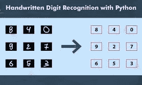

数字识别

**什么是手写识别？**

识别手写文本是一个问题，它可以追溯到需要识别手写文档中的单个字符的第一台自动机器。例如，想想邮局信件上的邮政编码以及识别这五个数字所需的自动化。为了自动有效地分拣邮件，对这些代码的准确识别是必要的。可能想到的其他应用包括 OCR(光学字符识别)软件。OCR 软件必须读取手写文本或印刷书籍的页面，用于每个字符都有明确定义的普通电子文档。

但是手写识别的问题可以追溯到更早的时候，更准确地说是 20 世纪初(1920 年代)，当时 Emanuel Goldberg(1881-1970)开始了他对这个问题的研究，并提出统计方法将是最佳选择。

为了解决 Python 中的这个问题，scikit-learn 库提供了一个很好的例子来更好地理解这种技术、所涉及的问题以及进行预测的可能性。

# **模型构建**

1.  **导入库并加载数据集。**

在这个模型中，我们将从 scikit_learn 导入数据集，该数据集由 1797 个不同的图像及其相应的目标变量组成。

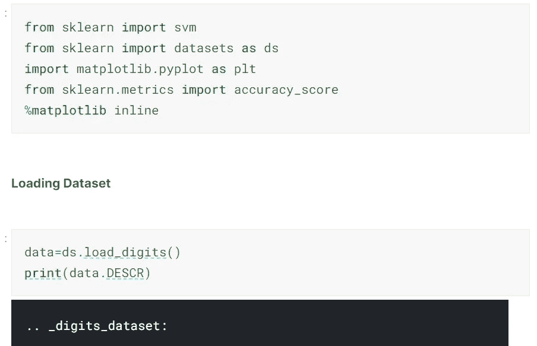

**库和数据集**

2.**数据可视化。**

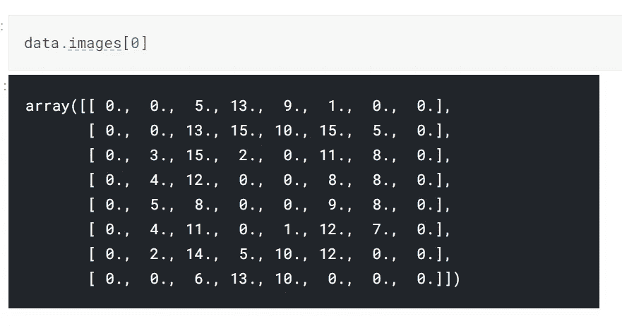

查看第一幅图像

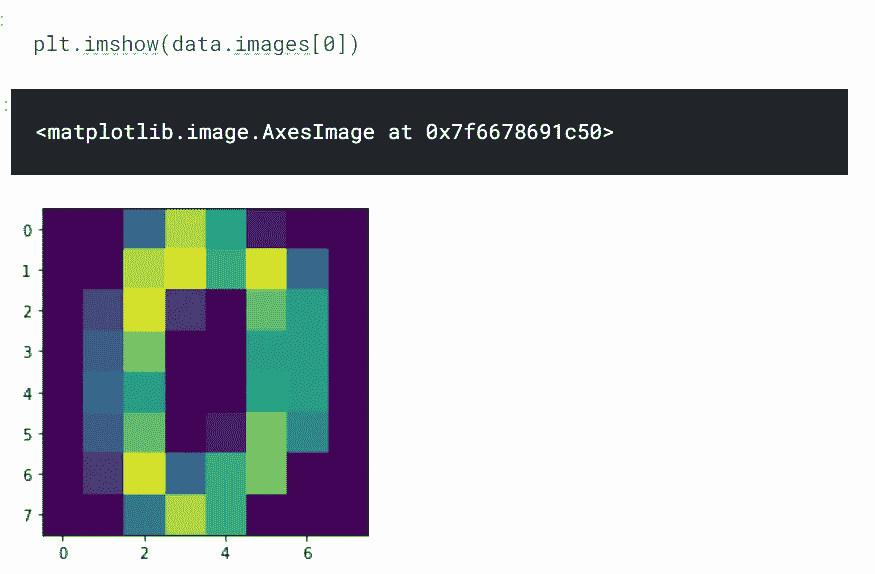

**绘制第一幅图像**

**3。模型设计。**

我们将使用**支持** **矢量分类器**用于该模型。

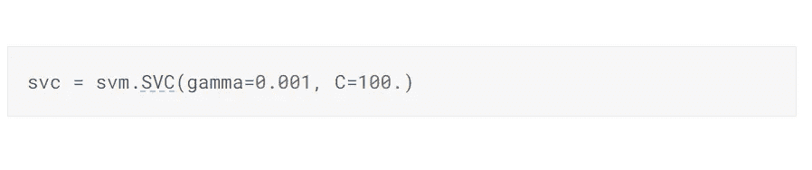

支持向量分类器

**4。培训和测试**

由于我们的数据集不是很大，所以我们将对数据集的不同分割进行 3 次训练和预测，以获得平均准确度分数。

> T **训练数据=前 1791 张图像，测试数据=后 6 张图像。**

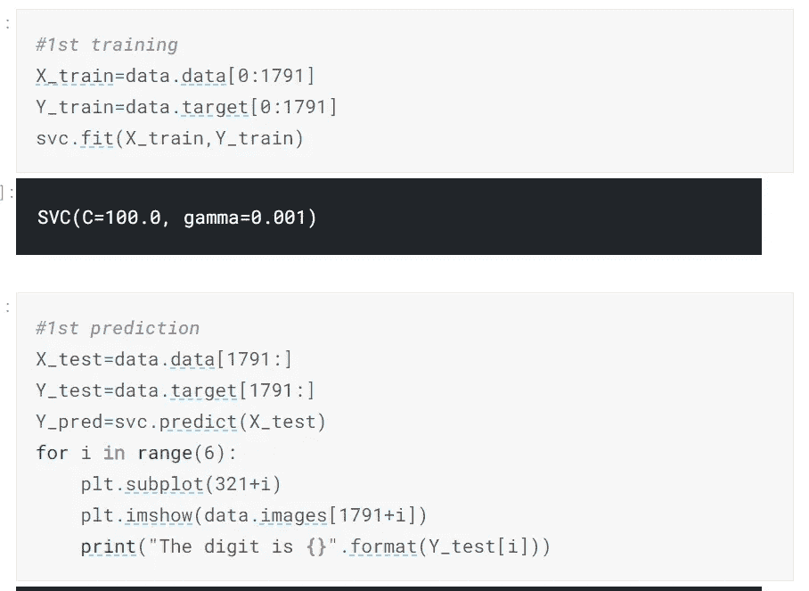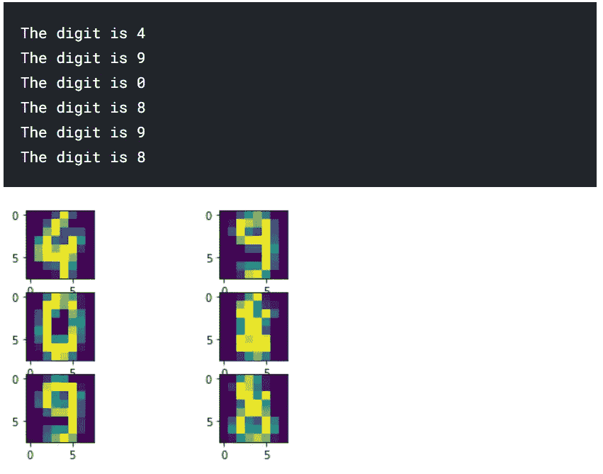

**第一次培训和测试**

***准确度得分***

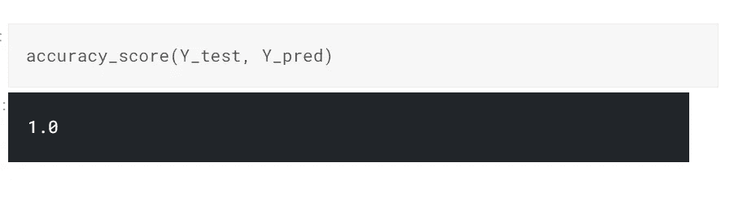

**第一次预测得分**

**>训练数据=第 6 张到最后一张，测试数据=前 6 张。**

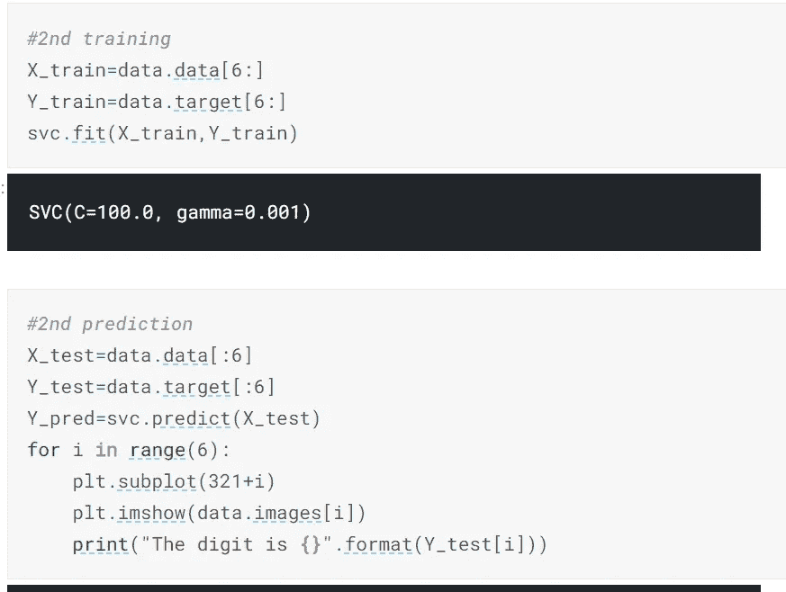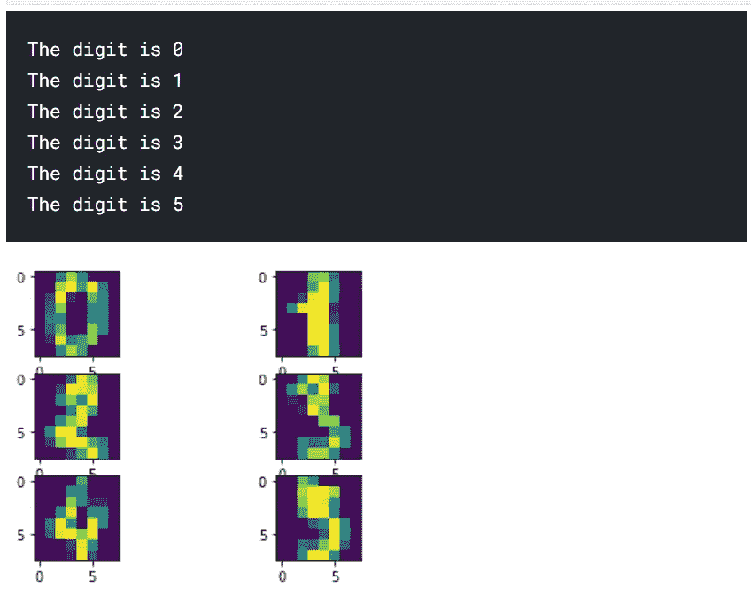

**第二次培训和测试**

***准确度得分***

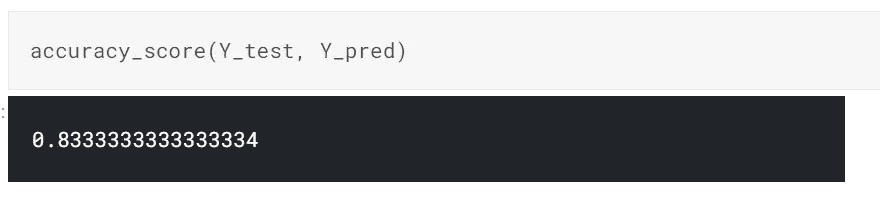

**第二次预测得分**

**>训练数据=第 1785 张图片，测试数据=第 1785 至 1790 张图片。**

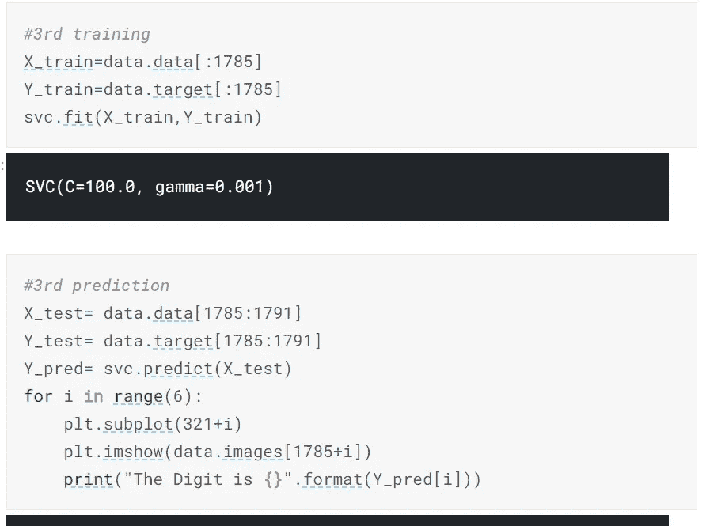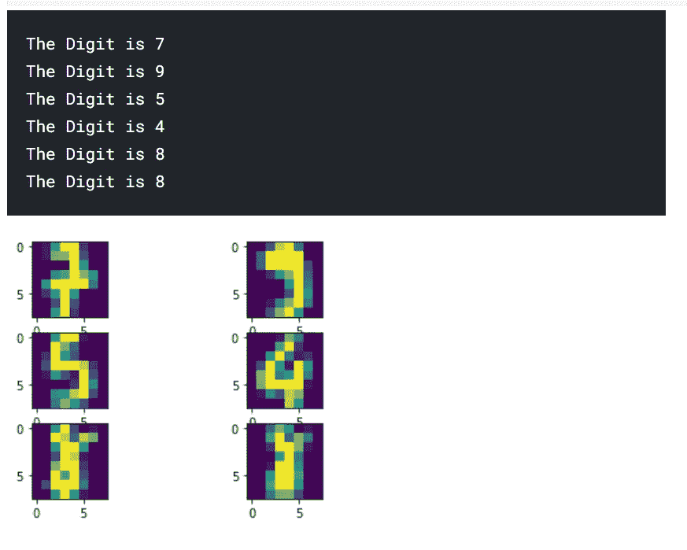

**第三次培训和测试**

***准确度得分***

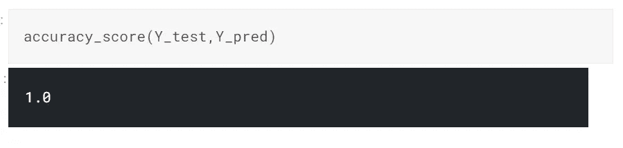

**第三次预测得分**

平均准确率=(100 + 83.33 +100)/3 = 94.44 %

**结论:**在 18 个数字中，我们的模型为它们各自的图像预测了 17 个正确的数字。

完整代码:[https://www . ka ggle . com/anmolarora 013/recognizenghandwrittendigits-SVM](https://www.kaggle.com/anmolarora013/recognizinghandwrittendigits-svm)