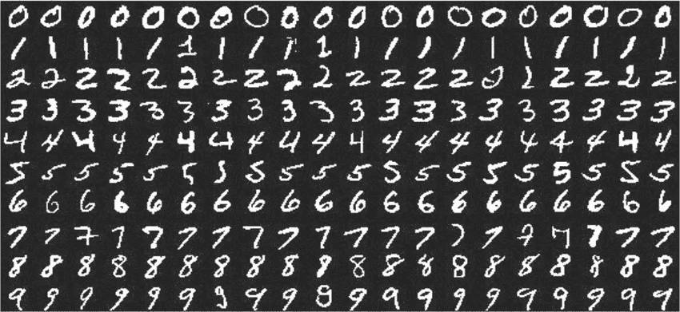
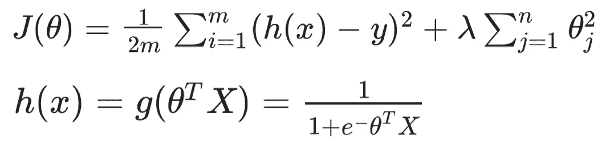

# 基于逻辑回归的手写数字识别

> 原文：<https://medium.com/analytics-vidhya/handwritten-digit-recognition-using-logistic-regression-8d3b3f7e31c0?source=collection_archive---------8----------------------->



逻辑回归是一种监督学习算法，用于解决分类问题，如将电子邮件分类为垃圾邮件或非垃圾邮件。这可以用来识别从 0 到 9 的手写数字。手写数字的给定图像属于十个数字(0 到 9)中的一个。这就是所谓的一个对所有的分类。


让我们使用 MNIST 手写数字图像的子集作为我们的数据。有 10 个标签/类别(0 到 9)。正则化参数是对拟合参数的控制。高阶多项式表达式会产生过拟合问题，因此我们可以添加正则项来惩罚高阶多项式的参数，以获得更好的拟合。

```
# Read the data from mat file
datafile = 'example_data.mat'
mat = scipy.io.loadmat(datafile)
X = mat['X']
y = mat['y']

num_labels = 10 # There are 10 labels/classes (0 to 9)

reg_param = 0.1 # Regularization parameter
```

有 5000 个大小为(20，20)的图像，并且有 5000 个相应的标签。为了考虑截距项，我们将在 X(偏差项)上增加一个额外的第一列，并将其全部设置为 1。

```
# Size of training set
[m, n] = numpy.shape(X) # 5000, 400

X = numpy.insert(X, 0, 1, axis = 1) # Adding the bias term
```

让我们实现计算成本函数和梯度下降的函数。逻辑回归的成本函数如下所示，其中，m -样本数，λ-正则化参数，h(x) -假设函数，θ-拟合参数。



我们将使用 Python 内置的优化求解函数 fmin_cg 来查找最小化成本函数的最佳参数。所有 10 个标签的参数都进行了优化，所以我们将为每个类创建 y_boolean。比如说 y = [0，0，0，1，1，1，2，2，2，3，3，3，4，4，5，5，6，6，6，7，7，8，8，9，9]。对于 label = 4，y_boolean = [0，0，0，0，0，0，0，0，0，0，1，1，1，0，0，0，0，0，0，0，0，0，0，0，0，0，0，0，0，0，0，0，0，0]。

```
for i in range(num_labels):
  print("Optimizing parameters for digit" ,i)

  y_bool = np.matrix([1 if label == i else 0 for label in y])

  updated_theta = scipy.optimize.fmin_cg(costFunction, fprime = gradientDescent, x0 = initial_theta, args = (X, y, reg_param), maxiter = 50)
```

我们来预测一下。我们会用 X 和更新后的θ找到假设函数。对于每个例子，我们会得到 10 个不同的概率，分别属于这 10 个类别。我们将预测概率最高的类。

```
h_max = sigmoid(X.dot(updated_theta.T))

for i in range(1, m):
  max_prob = numpy.argmax(h_max[i-1, :])
  p[i-1] = max_prob
```

然后将预测与给定的标签进行比较，以计算模型的准确性。

```
for j in range(m):
  if(p[i] == y[i]):
    num_correct = num_correct + 1

accuracy = (num_correct / m) * 100
```

请在下面的 GitHub 链接中找到完整的项目。

[](https://github.com/rgeetha2010/LogisticRegression) [## 2010 年目标/物流回归

### 监督学习算法的 Python 库，逻辑回归。-rgeetha 2010/logistic regression

github.com](https://github.com/rgeetha2010/LogisticRegression) 

参考:[https://www.coursera.org/learn/machine-learning](https://www.coursera.org/learn/machine-learning)？