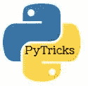

# 便捷的 Python 特性

> 原文：<https://medium.com/analytics-vidhya/handy-python-features-e733894546f2?source=collection_archive---------23----------------------->



**Lambda** :在 Python 中‘Lambda’关键字用于创建匿名函数。Lambda 是一种用于在一行中编写一次性函数的方法。
*语法:lambda 参数:表达式* Lambda 定义可以有“n”个参数，但只有一个表达式。
它没有“return”关键字，因为它总是包含一个返回的表达式。
举例:
`square = lambda x: x**2`
`cube = lambda x : x** 3`

我们有两个 lambda 表达式来计算一个数的平方和立方。

```
import numpy as np
a = np.array([2, 5, 7, 9])
for n, s,c in zip(a, square(a), cube(a)):
 print(f”{n}: its square is {s:2} and cube is {c:3}”)
```

输出:
……………………
2:其平方为 4，立方为 8
5:其平方为 25，立方为 125
7:其平方为 49，立方为 343
9:其平方为 81，立方为 729

**Map** : map 对列表中的所有元素应用一个函数。例如，求一个数的 n 次方 n
`list(map(lambda x : x **x, [2,3,4,5]))`
输出:[4，27，256，3125]

**过滤器**:获取满足用户定义条件
的元素子集，例如，从数字列表
`list(filter(lambda x : x > 0, [-1, 2, 3, -4, 5, 7]))`
中仅提取正数输出:[2，3，5，7]

**Reduce** :对列表中的配对进行重复操作。例如，求前 10 个自然数的和

```
# we need to import reduce func from functools package
from functools import reduce
reduce(lambda x,y : x + y, np.arange(1, 11))
```

产量:55

理解:这是一种简短的&构造新序列(如列表、集合、字典等)的方法。)使用现有序列。

```
# we create a lambda expression to grade marks
 grade = lambda x : ‘A+’ if x >=75 else(‘A’ if x >=60 else(‘B’ if x >=45 else ‘C’))
```

****注意:注意不同理解使用的括号类型**

**列表理解:**对于一个给定的分数列表，我们可以利用列表理解生成一个成绩列表，与分数相对应。
如
`**[**grade(marks) for marks in [60, 85, 55, 40, 65, -10] if marks >= 0**]**`

Output: ['A '，' A+'，' B '，' C '，' A']
注意:我们放一个条件，只有在标记非负的情况下才生成成绩。

**字典理解:**我们可以使用理解生成一个分数/等级字典，如下:
例如`**{**marks:grade(marks) for marks in [60, 85, 55, 40, 65, -10] if marks >=0**}**`

输出:{60: 'A '，85: 'A+'，55: 'B '，40: 'C '，65: 'A'}

**集合理解:**假设我们要抽取一组唯一的非负数，我们可以用集合理解
例如


输出:{17，20，30，15}

**生成器理解:**生成器不会立刻分配内存，而是逐个生成每个值，因此内存效率高。
例如。

```
even_gen = **(**n for n in np.arange(1,21) if n %2 ==0**)**
[e for e in even_gen ]
```

输出:[2，4，6，8，10，12，14，16，18，20]