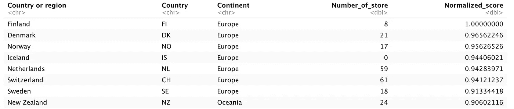
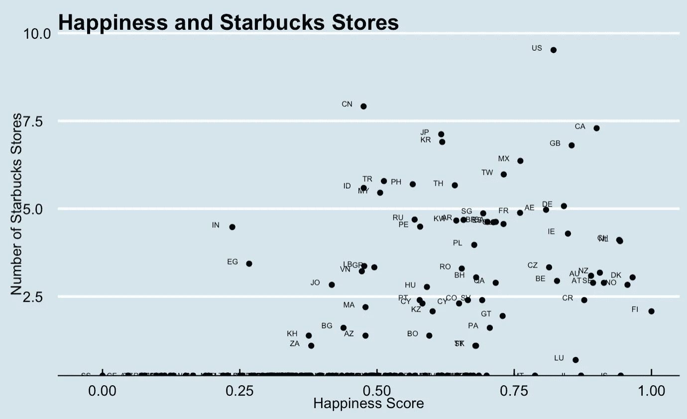
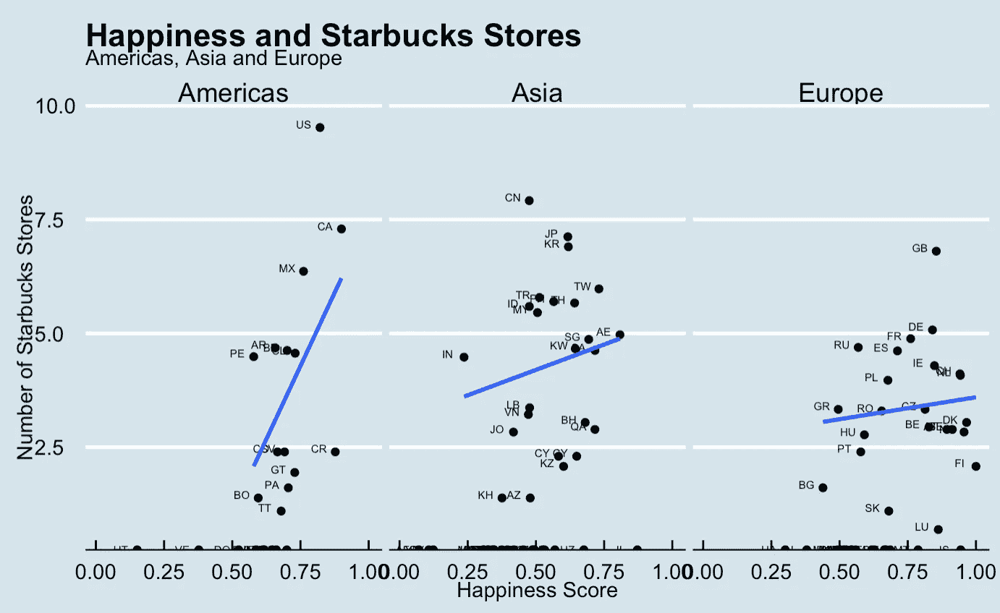

# 快乐城市有更多的星巴克:或者他们有吗？—带 R 的回归分析

> 原文：<https://medium.com/analytics-vidhya/happiness-has-something-to-do-with-starbucks-by-regression-in-r-6e7ea08d01c3?source=collection_archive---------20----------------------->

有一次，我接触到一个朋友评判的目光，因为我知道这个城市所有的星巴克店。我远不是星巴克的粉丝，我有充分的理由去了解包括星巴克在内的许多咖啡店——比如在家工作时效率极低。当然，这些不足以说服我的欧洲朋友和他对大公司的厌恶。

除此之外，我记得曾经有一段时间，星巴克是一种显示地位的方式——至少在我的家乡是这样。人们试图通过*拿着星巴克杯子*或者*批评拿着星巴克杯子的人*来展示他们有多酷。我不知道新的星巴克是什么，但这不是这里的主题。

我摆弄了一些看起来如此不相关的数据集，以至于说服我以某种方式将它们结合起来。我综合了那些数据，画了一些花哨的图表和令人信服的回归线，最后欣赏了**最常见的统计错误之一。**一步一步来。

1.  数据集来自 Kaggle:

*   [星巴克门店位置](https://www.kaggle.com/starbucks/store-locations):全球星巴克门店
*   [世界幸福报告— 2019](https://www.kaggle.com/unsdsn/world-happiness) :根据公共政策、腐败等多个因素计算出的每个国家的幸福排名和得分。

2.库和导入数据

```
library(ggthemes)
library(countrycode)
library(readr)
library(ggplot2)
library(dplyr)
library(tidyverse)#Importing the data
starbucks <- read_csv("Medium/starbucks_locations.csv")
happiness <- read_csv("Medium/happiness_2019.csv")
```

3.预处理

```
#Transforming country names to country codes and creating a continent column. 
happiness<-happiness %>%
  mutate(Country=countrycode(happiness$`Country or region`,origin="country.name", destination="iso2c" )) %>%
  mutate(Continent=countrycode(happiness$`Country or region`, origin="country.name", destination="continent"))#Aggregating the starbucks stores and summarizing each country by the number of starbucks stores
starbucks_total<-starbucks %>%
  group_by(Country) %>%
  summarize(Number_of_store=n())#Normalization function for happiness score
normalize <- function(x) {
return ((x - min(x)) / (max(x) - min(x)))
}#Combining starbucks and happiness dataset, 
df<-happiness %>% 
  left_join(starbucks_total, by=c("Country"), suffix=c("_happiness","_data")) %>%
  mutate(Number_of_store=replace_na(Number_of_store,0)) %>%
  mutate(Normalized_score=normalize(Score))#Selecting the relevant columns: Country, Country code, Continent, Number of store, Normalized score
starbucks_vs_happiness<-df[,c(2,10,11,12,13)]
starbucks_vs_happiness
```



4.星巴克门店数量与幸福指数

```
ggplot(starbucks_vs_happiness, aes(x=Normalized_score, y=log(Number_of_store), label=Country)) +
      geom_point() +
      geom_text(size=2,nudge_x=-0.03,nudge_y = 0.07) +
      theme_economist() +
      xlab("Happiness Score") +
      ylab("Number of Starbucks Stores") + 
      ggtitle("Happiness and Starbucks Stores")
```



看看我是如何使用一个奇特的主题——经济学家主题——来看起来更有说服力…

5.星巴克和快乐大陆

```
#Including only Americas, Asia and Europe since there were too few observations in other continents
svh_modified<-starbucks_vs_happiness %>%
  filter(Continent %in% c("Americas","Asia","Europe"))#Happiness and Starbucks Stores by Continent
ggplot(svh_modified, aes(x=Normalized_score, y=log(Number_of_store),  label=Country)) + 
      geom_point() + 
      facet_wrap(~Continent) +  
      geom_text(size=2,nudge_x=-0.06,nudge_y = 0.07) + 
      geom_smooth(method="lm", se=FALSE) + 
      theme_economist() +
      xlab("Happiness Score") +
      ylab("Number of Starbucks Stores") + 
      ggtitle("Happiness and Starbucks Stores", subtitle="Americas, Asia and Europe")
```



6.结论

嗯，嗯…我喜欢这些曲线的陡峭程度，即使是在欧洲。星巴克店的数量似乎与国家的幸福程度有关。我们可能倾向于这么说……但是让我们不要急于分享一个著名陷阱的喜悦:[混淆](https://en.wikipedia.org/wiki/Confounding)。

阻止我们得出关联结论的是另一个变量****，它既影响依赖型幸福分数，也影响独立型星巴克变量的数量。对于这样一个变量，我的第一个天真的建议是国家的财富。富裕国家可能会更幸福，可能会有更多的星巴克。下一步应该是进一步分析回归结果。****

**在此之前，享受黑咖啡是这一分析的主要结果——无论你来自一个快乐的地方。干杯！**